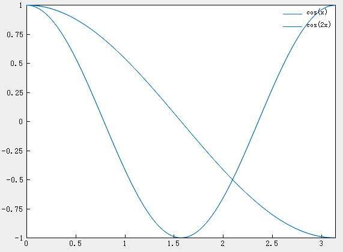

# legend

## Description

Add a legend to the axes

## Syntax

```atks
legend()
legend(labels)
```

## Additional Notes

- `legend()`: Creates a legend with descriptive labels for each plotted data series. By default, the legend uses labels of the form `"dataN"`.
- `legend(labels)`: Sets the labels using strings, for example `legend("cos(x)", "cos(2x)")`.

## Example

::: details open **Add a legend to the current axes**

Plot two lines and add a legend to the current axes, specifying the legend labels as input arguments of the `legend` function.

```atks
    x = linspace(0, pi, 100);
    y1 = cos(x);
    plot(x, y1)

    hold("on")
    y2 = cos(2 * x);
    plot(x, y2)
    legend()
    show()
```



:::
