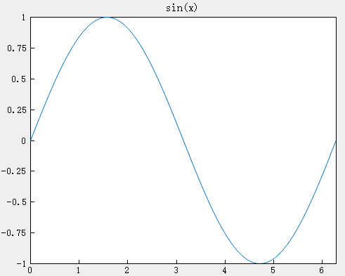
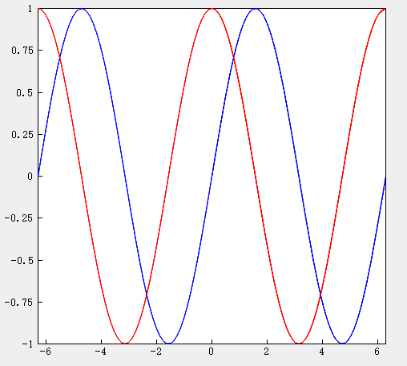
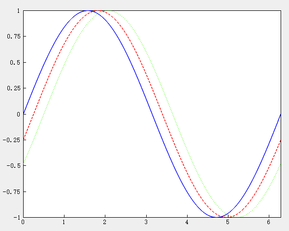

# plot

## Description

2-D line plot

## Syntax

```atks
plot(X,Y)
plot(X,Y,fmt)
plot3(X1,Y1,fmt1,...,Xn,Yn,fmtn)
```

## Additional Notes

- `plot(X,Y)`: Creates a 2-D line plot of the data in Y versus the corresponding values in X.
- `plot(X,Y,fmt)`: Creates a 2-D line plot while setting the line style, marker symbol, and color.
- `plot(X1,Y1,fmt1,...,Xn,Yn,fmtn)`: Creates multiple 2-D line plots while setting the line style, marker symbol, and color for each line.

## Example

::: details open **Create a line plot**

```atks
    x = linspace(0, 2*pi, 100);
    y = sin(x);
    plot(x, y)
    title("sin(x)")
```



:::

::: details open **Plot multiple lines**

Define x as 100 linearly spaced values between −2π and 2π, and define y1 and y2 as the sine and cosine values of x in blue and red, respectively. Create line plots of the two data sets.

```atks
    x = linspace(-2 * pi, 2 * pi, 100);
    y1 = sin(x);
    y2 = cos(x);
    plot(x , y1, "-b" , x , y2 , "-r")
```



:::

::: details open **Specify line styles**

Plot three sine curves with a small phase shift between each curve. The first curve is a blue solid line, the second a red dashed line, and the third a green dotted line.

```atks
x = linspace(0, 2*pi, 200);
y1 = sin(x);
y2 = sin(x-0.25);
y3 = sin(x-0.5);
plot(x , y1, "-b" , x , y2 , "--r", x, y3, "g:")
```



:::
