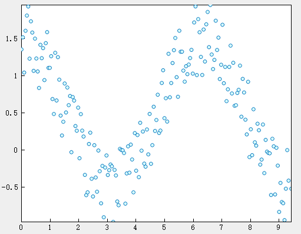
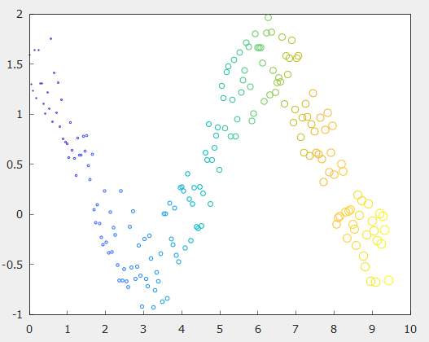

# scatter

## 作用

散点图

## 语法

```atks
scatter(x,y)
scatter(x,y,sz)
scatter(x,y,sz,c)
```

## 补充说明

- `scatter(x,y)` ：在向量 x 和 y 指定的位置创建一个包含圆形的散点图。该类型的图形也称为气泡图。
- `scatter(x,y,sz)` ：创建散点图的同时指定圆的大小。要绘制大小相等的圆圈，请将 sz 指定为标量。要绘制大小不等的圆，请将 sz 指定为长度等于 x 和 y 的长度的向量。

## 示例

::: details open **创建散点图**

```atks
    x = linspace(0, 3*pi, 200);
    y = cos(x) + rand(1,200);
    scatter(x, y)
```



:::

::: details open **改变圆圈大小和颜色**

```atks
    x = linspace(0, 3 * pi, 200);
    y = cos(x) + rand(1,200);
    s = linspace(1, 10, 200);
    c = linspace(1, 10, length(x));
    scatter(x, y, s, c)
```



:::
