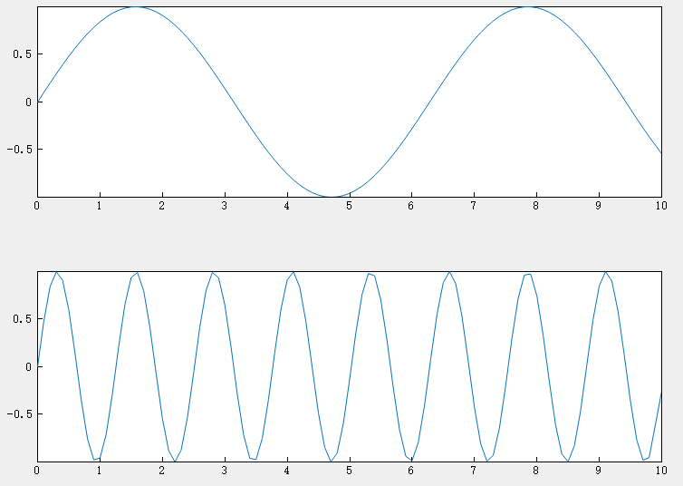

# subplot

## 作用

在平铺位置创建坐标区

## 语法

```atks
subplot(m,n,p)
```

## 补充说明

- `subplot(m,n,p)` ：将当前图窗划分为 m×n 网格，并在 p 指定的位置创建坐标区。
- Syslab ：按行号对子图位置进行编号，第一个子图是第一行的第一列，第二个子图是第一行的第二列，依此类推。

## 示例

::: details open **创建带有两个堆叠子图的图窗**

在每个子图上绘制一条正弦波。

```atks
subplot(2, 1, 1);
x = linspace(0,10,100);
y1 = sin(x);
plot(x,y1)
subplot(2, 1, 2);
y2 = sin(5 * x);
plot(x, y2)
show();
```



:::
