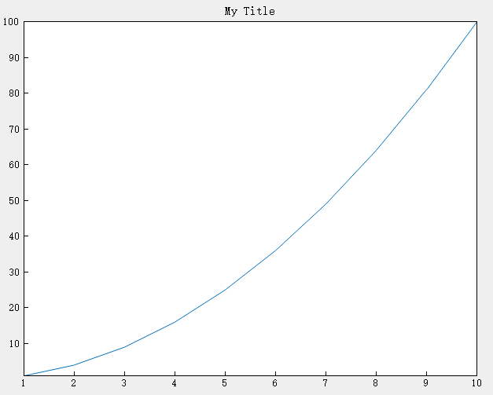

# title

## Description

Add a title

## Syntax

```atks
title(txt)
```

## Additional Notes

- Adds the specified title to the returned axes.

## Example

::: details open **Add a title to the current axes**

```atks
    x=[1,2,3,4,5,6,7,8,9,10];
    y=[1,2*2,3*3,4*4,5*5,6*6,7*7,8*8,9*9,10*10];
    title("My Title")
    plot(x,y)
    show();
```



:::
