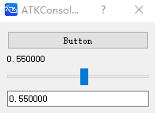

# CreateDialog

## 作用

创建一个对话框，并显示它

## 语法

```atks
CreateDialog()
```

## 示例

::: details open **创建一个具有多个控件的对话框**

```atks
value = 0.55
valueRef =& @Reactive(value)

CreateDialog(
    Button("Button", print("hi")),
    Text(valueRef),
    Slider(valueRef),
    InputField(valueRef)
)
```



:::
