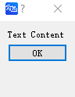

# DefaultButton

## Description

Creates a primary button. Clicking it closes the dialog box that contains it.

## Syntax

```atks
DefaultButton()
```

## Example

::: details open **Placing a primary button in a dialog box; clicking it closes the dialog box**

```atks
CreateDialog(
    Text("Text Content"),
    DefaultButton()
)
```



:::
