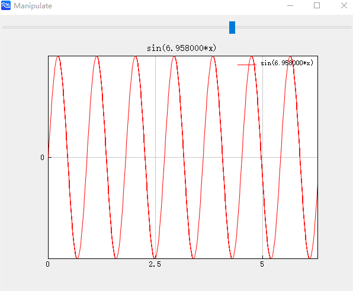

# Manipulate

## Description

Creates a manipulator.

## Syntax

```atks
Manipulate(func, [a, b])
```

## Additional Notes

- Accepts a callback function and a range
- `func`: the callback function
- `[a, b]`: the range

## Example

::: details open **Dynamically controlling the parameters of a curve plot**

```atks
function func(n)
    x = linspace(0, 2*pi, 1000);
    y = sin(n*x);
    grid("on")
    name = "sin(" + num2str(n) + "*x)"
    title(name)
    legend(name)
    return plot(x, y, "r-")
end

Manipulate(func, [1, 10])
```



:::
