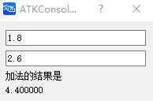

# reactive

## Description

Declares a reactive variable.

## Syntax

```atks
reactive valueRef = 0
```

## Additional Notes

- A reactive variable can be bound to UI controls, such as [`InputField`](InputField.md), [`Slider`](Slider.md), [`Test`](Text.md), etc.
- When the value of a reactive variable changes, the displayed content of these UI controls is updated accordingly
- If these UI controls support input, the value of the reactive variable is also updated when their input value changes

## Example

::: details open **Implementing an addition calculation**

```atks
reactive a_ref = 0
reactive b_ref = 0


CreateDialog(
    InputField(a_ref),
    InputField(b_ref),
    Text("The addition result is"),
    Text(str2double(a_ref) + str2double(b_ref))
)
```



:::
