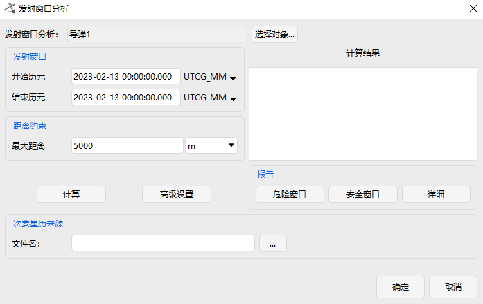
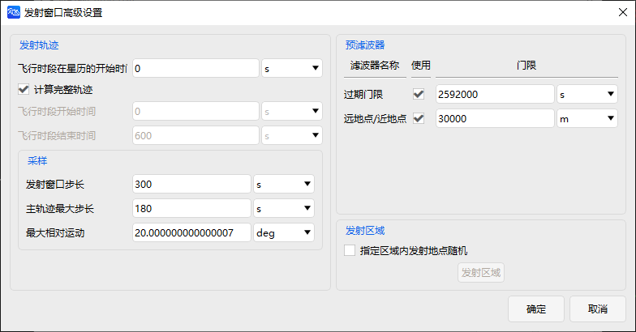

# Launch Window Close Approach Analysis Tool

## Functional Description

The Launch Window Close Approach Analysis tool can assess the collision risk of a rocket or missile prior to launch. By computing hazardous intervals, the closest approach time, and the corresponding relative position information between the launch vehicle and other space objects during the launch window, it obtains the safe launch windows.

### Function Location

This function is located in the ATK menu under the Rocket or Missile section (it is only visible when a rocket or missile is selected in the Object Browser). The specific location is shown in the figures below.

## Interface Introduction

### Main Interface

The main interface includes analysis object selection, launch window settings, distance constraint settings, secondary ephemeris source selection, and provides advanced settings, compute, and report display buttons, as shown below.

Click **Select Object** to choose a rocket or satellite in the scenario as the analysis object.

In the **Launch Window** section, set the start and stop epochs, i.e., the start and end times of the analysis. The default time format is UTC.

In the **Range Constraint** section, set the maximum distance. When the relative distance between the analysis object and another space object is less than this value, it will be recorded as a close approach event, and the corresponding launch time of the analysis object will be considered a hazardous launch time. The default value is 5000 m.

In the **Secondary Ephemeris Source** section, click the **…** button to select the corresponding space object catalog, typically a TLE file, to generate secondary targets for analysis.

Click **Compute** to perform the launch window close approach analysis.

### Advanced Settings Interface

The Advanced Settings interface includes launch trajectory settings, sampling settings, pre‑filter settings, and launch area selection, as shown below.

The purpose of the launch trajectory settings is to reduce unnecessary computation. For example, the very initial segment of ascent is unlikely to collide with space objects and can therefore be excluded from computation. The trajectory time is specified as seconds after launch, also referred to as Mission Elapsed Time (MET). There are two ways to set the launch trajectory:

1) Check **Consider entire trajectory** and enter a value in the **MET at Ephemeris start** box. The computed trajectory will then range from the input time to the end of the trajectory.

2) Set **MET at Ephemeris start** to 0, uncheck **Consider entire trajectory**, and enter the start and end times of the flight segment. The computed trajectory will then be limited to that segment.

**Sampling Settings:**

- **Launch Window Step** – the step size for sampling launch times within the launch window.

- **Primary Trajectory Max Step** – the maximum step size for sampling along the launch trajectory (i.e., Mission Elapsed Time).

- **Max Rel Motion** – the maximum angular motion allowed when sampling secondary targets. This angle is formed at the current launch trajectory sample point, with the secondary target's current and previous positions defining the two sides. A smaller angle yields denser sampling points.

**Pre‑Filters:**

- The **Out of Date** filter excludes secondary targets whose epoch differs from the analysis period by more than the specified threshold.

- The **Apogee/Perigee** filter excludes secondary targets whose altitude range does not overlap with that of the launch vehicle (or missile).

| Functional Module | Setting Item | Description |
| :--- | :--- | :--- |
| **Launch Trajectory Settings** | Consider entire trajectory | When checked, computes the trajectory from "MET at Ephemeris start" to the end of the trajectory. |
| | MET at Ephemeris start | Specifies the starting point of the Mission Elapsed Time (in seconds). When "Consider entire trajectory" is checked, this serves as the computation start. When unchecked and set to 0, the two MET input boxes below are used. |
| | Segment start MET | Available only when "Consider entire trajectory" is unchecked and "MET at Ephemeris start" is 0; sets the start time (seconds) of the trajectory segment to compute. |
| | Segment end MET | Same as above; sets the end time (seconds) of the trajectory segment to compute. |
| **Sampling Settings** | Launch Window Step | The step size for sampling launch times within the launch window. |
| | Primary Trajectory Max Step | The maximum step size for sampling along the launch trajectory (Mission Elapsed Time). |
| | Max Rel Motion | The maximum angular motion allowed when sampling secondary targets. This angle is formed at the current launch trajectory sample point, with the secondary target's current and previous positions defining the sides; a smaller angle yields denser sampling. |
| **Pre‑Filters** | Out of Date | Excludes secondary targets whose epoch differs from the analysis period by more than the specified threshold. |
| | Apogee/Perigee | Excludes secondary targets whose altitude range does not overlap with that of the launch vehicle (or missile). |
| **Launch Area Selection** | Launch may occur anywhere within a defined area | Selects the launch area; detailed options are described in the next section. |

### Launch Area Settings Interface

The Launch Area Settings interface includes area orientation, launch trajectory settings, distance constraint settings, secondary ephemeris source selection, and provides advanced settings, compute, and report display buttons, as shown below. Access this interface by checking **Launch may occur anywhere within a defined area** in the Advanced Settings interface and clicking **Launch Area**. The launch area setting allows the launch position to be extended from a single launch point to a rectangular region.

**Area Orientation** – specifies the direction of the launch area's X‑axis. When "Velocity" is selected, it refers to the launch aiming direction. You can enter a value in the **Azimuth** field to rotate the launch area counterclockwise by that angle.

**Launch Trajectory Settings** – by default, the trajectory shape is preserved. When **Target same endpoint** is checked, all trajectories generated within the launch area will aim for the same endpoint as the reference trajectory. **Alt Ref** refers to the altitude reference.

**Area Extents** – here you can set the boundaries of the rectangular launch area centered on the reference launch point. Total sample points = interior samples + 2, including the edge points of the rectangle. Total trajectories = X‑axis sample points × Y‑axis total sample points. Sampling within the launch area uses equal spacing.

**Sampling** – these sampling parameters have the same meaning as those in the Advanced Settings interface. However, for launch areas, the Primary Trajectory Max Step and Max Rel Motion typically need to be smaller than for a fixed launch point to ensure computational accuracy.

### Reports

There are three types of reports: **Blackout Windows**, **Clear Windows**, and **Details**.

- **Blackout Windows**: Contains the close approach target, hazardous launch window intervals, blackout window duration, time of closest approach, and minimum range information.

- **Clear Windows**: Contains the clear window intervals and their durations, i.e., the remaining intervals within the launch window after removing all blackout windows.

- **Details**: Contains detailed close approach event information and blackout window information, as described below:

**SSC Number** – the international ID of the close approach target.

**Start Time** – analysis start time + **Start Time Past Launch**.

**End Time** – analysis start time + **End Time Past Launch**.

**Min Range** – the distance at the time of closest approach.

**Time of Min Range** – the time of closest approach (TCA).

**Window Blackout Start** – the start time of the blackout window. If the rocket launches within this interval, it will experience a close approach event with some space object.

**Window Blackout Stop** – the end time of the blackout window. If the rocket launches within this interval, it will experience a close approach event with some space object.

**Window Blackout Duration** – the duration of the blackout window, i.e., Window Blackout Stop – Window Blackout Start, in seconds.

**Min Range Launch Time** – the time of closest approach within the blackout window.

**Start Time Past Launch** – the time from launch to the start of the close approach event, i.e., Start Time – Launch Time, in seconds.

**End Time Past Launch** – the time from launch to the end of the close approach event, i.e., End Time – Launch Time, in seconds.

**Duration** – the duration of the close approach event relative to the launch time, i.e., End Time – Start Time, in seconds.

**Time of Min Range Past Launch** – the time from launch to the time of closest approach, i.e., Time of Min Range – Launch Time, in seconds.

[Launch Window Close Approach Analysis Case Study](../02-案例教程/16-发射窗口接近分析案例.md)