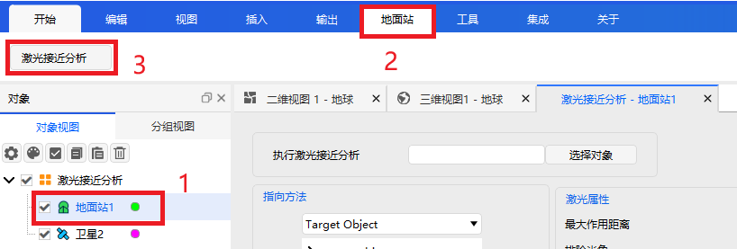
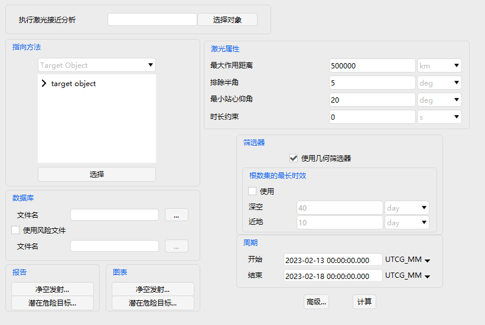
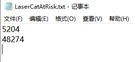
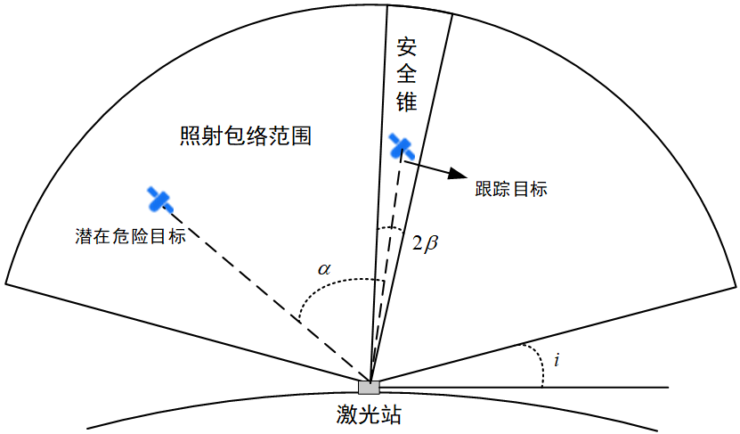

# Laser Close Approach Analysis Tool

## Functional Description

The Laser Close Approach Analysis tool is used to analyze the tracking process of laser detection or laser communication, assessing the probability that a space object may be accidentally illuminated during a given laser operation period or within a specified laser illumination window.

### Function Location

This function is located in the ATK menu under the dynamic toolbar for Ground Station (or Aircraft, Vehicle, Ship) categories (it is only visible when the corresponding object is selected in the Object Browser). The specific location is shown in the figure below.

## Interface Introduction

### Main Interface

The main interface includes object selection, target selection, target database selection, laser property configuration, filter settings, analysis time period settings, compute button, and report/chart display buttons, as shown below.

**Select Object**

Click **Select Object** to choose one object from the scenario as the laser‑emitting platform for the laser close approach analysis.

**Pointing Method**

Click the **>** symbol before the tracking target to expand the satellite, rocket, and missile objects in the scenario, and select one as the laser tracking target.

**Database**

The space object catalog database, typically a TLE file. Click **…** to select the file, which can be in `.txt`, `.tce`, or other formats.

When **Use At Risk File** is checked, click the corresponding **…** to select a risk file. Its format is shown in the figure. When this file is used, only the SSC numbers listed in the file are analyzed against the space object catalog database.

**Laser Properties**

**Maximum Laser Range**: The maximum distance the laser can illuminate. This corresponds to the radius of the laser illumination envelope sector in the figure, indicating that beyond this distance, the laser would no longer pose a hazard to other satellites. Default is 500000 km.

**Exclusion Half‑Angle**: The laser divergence half‑angle, corresponding to the safety cone half‑angle $\beta$ in the figure. Default is 5 deg.

**Min. Topocentric Elevation Angle**: The minimum elevation angle of the station, corresponding to angle $i$ in the figure. Default is 20 deg.

**Duration Constraint**: Excludes safety windows shorter than this duration. Default is 0 s.

**Filters**

Check whether to use geometric filters. The geometric filters mainly assess whether a candidate target will enter the laser illumination envelope by considering the orbital inclination, apogee, and perigee geometry of the candidate target. For details, refer to *Alfano 2000. Predictive avoidance for ground‑based laser illumination*.

**Maximum Element Set Age**: Sets the maximum allowed time interval between the epoch of the space object catalog and the analysis period. Candidate objects exceeding this threshold are excluded, primarily because excessively long propagation times lead to unreliable orbital predictions. Users can set different time thresholds for Near‑Earth and Deep Space objects, with the dividing line being a period of 225 minutes.

**Analysis Period**

Analysis start and end times.

**Advanced**

Secondary input allows adding potential risk targets to the scenario, with a configurable maximum number.

**Compute**

Click the **Compute** button to perform the laser close approach analysis.

**Reports and Charts**

After clicking **Compute**, reports and charts can be viewed.

The **Potential Victims Report** lists, for each visibility interval between the laser station and the tracking target during the user‑specified analysis period, which potential targets entered the exclusion cone, along with the entry and exit times and the dwell duration. Correspondingly, the **Clear Firing Report** shows the time intervals during which no potential target was within the exclusion cone. If a longer **Duration Constraint** is set, some clear firing intervals may not be shown in this report.

Laser close approach analysis results can also be displayed as charts. Click the **Potential Victims…** button to generate a chart corresponding to the **Potential Victims Report**. The **Clear Firing Chart** works similarly.

[Laser Close Approach Analysis Case Study](../02-案例教程/19-激光接近分析案例.md)