# Orbit Wizard

## Functional Description

The Orbit Wizard module can generate different satellite orbits by selecting different orbit types and setting relevant parameters.

Satellite orbit types are listed in the following table.

| No. | Orbit Type | Description |
|:----:|:-----:|:-----------------------------------------------------------------------------------------------------------------------------------------------------------------------------------------------------|
| 1 | Circular | The orbital radius remains constant. |
| 2 | Critically Inclined | A critically inclined orbit keeps the argument of perigee at a fixed latitude. The line of apsides does not rotate. A satellite in a fixed orbit will remain at a fixed latitude in the sky over a specified fixed longitude. |
| 3 | Critically Inclined, Sun‑Synchronous | This orbit combines the characteristics of both types. It uses a retrograde inclination of 116.565 degrees. The satellite passes overhead at the same local mean solar time each revolution, and its perigee remains at a fixed latitude. |
| 4 | Geosynchronous | A satellite in a geosynchronous orbit remains fixed in the sky over a specified fixed longitude. |
| 5 | Molniya | The Molniya orbit is a high‑eccentricity orbit with a significant difference between apogee and perigee altitudes. It is also a critically inclined orbit, which keeps the perigee in the southern hemisphere and provides a long dwell time over high‑latitude regions in the northern hemisphere. |
| 6 | Repeating Ground Track | Orbits with repeating ground tracks are useful when consistent observation conditions are needed at different times to detect changes. The ground track can repeat daily, or day‑by‑day interlacing before repeating. |
| 7 | Repeating Sun‑Synchronous | The repeating Sun‑synchronous orbit is suitable for scenarios where consistent observation and lighting conditions are required over different periods to monitor changes. The ground track can repeat daily or interlace day‑by‑day before repetition. The orbit completes its ground coverage cycle, and each revolution passes over the same ground point at approximately the same local mean solar time. |
| 8 | Sun‑Synchronous | These orbits are designed to exploit the effects of Earth's oblateness, causing the orbital plane to precess at the same rate as Earth's average orbital rate around the Sun. Sun‑synchronous orbits have the property that their nodes maintain a constant local mean solar time. |
| 9 | Custom | For user‑created custom orbits. |
| 10 | Subsatellite Point Defined | Defines orbital parameters based on the subsatellite point trajectory. |
| 11 | Subsatellite Point Defined Repeating | Defines repeating orbit parameters based on the subsatellite point trajectory. |

### Function Location

This function has two entry points. One is in the "Insert Object" window under "Satellite – Orbit Wizard", as shown below.

The other entry point is in "Satellite – Properties – Orbit Wizard", as shown below.

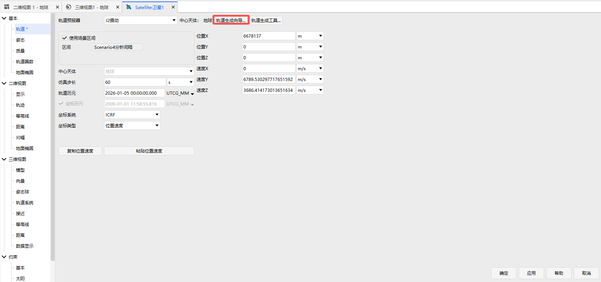

### Interface Introduction

The interface consists of five areas: Orbit Type Selection, Orbit Parameter Settings, Analysis Time Settings, Satellite Visualization Settings, and Orbit Generation Preview, as shown below.

## How to Use

After creating a scenario, click **Insert** on the **Home** page. The "Insert Object" window appears. Select **Satellite**, choose **Orbit Wizard** in the "Select Insert Method" section, and click **Insert**. Alternatively, call the "Orbit Wizard" function from the satellite properties window. The "Orbit Wizard" window appears, as shown below. Select an orbit type from the "Orbit Type" list to proceed with orbit generation. All orbit epochs use the scenario default settings.

### Circular Orbit

A circular orbit requires setting three parameters: Inclination, Altitude, and RAAN. Click **OK** to generate the satellite in the scenario, as shown below.

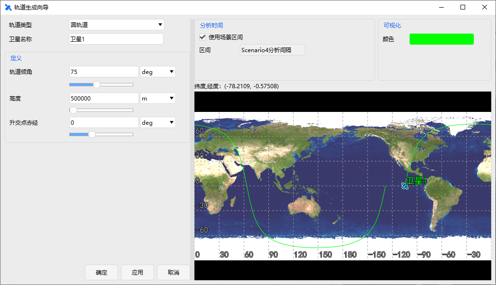

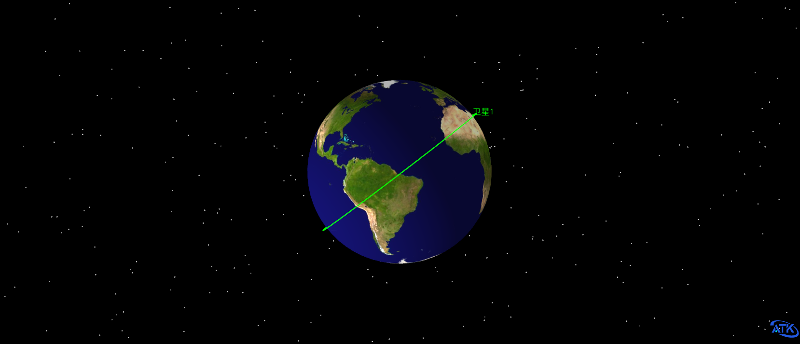

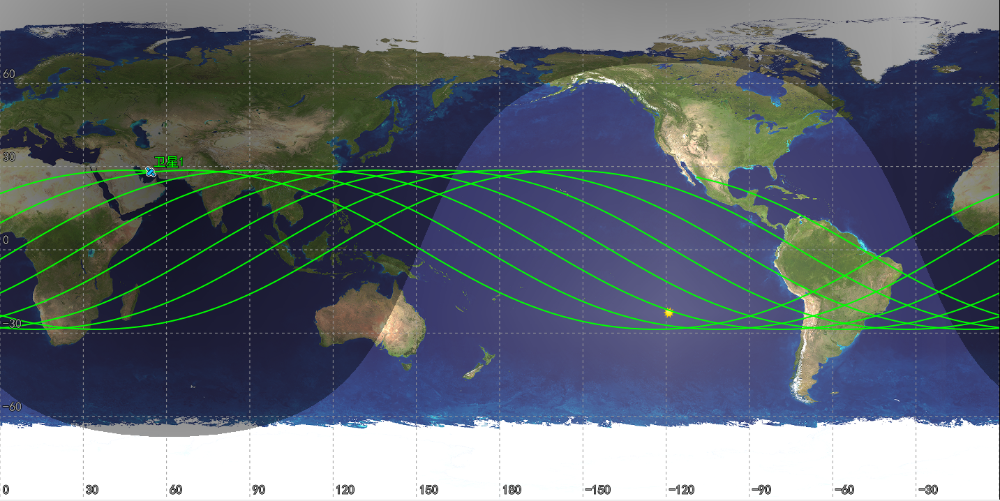

### Critically Inclined Orbit

A critically inclined orbit requires setting four parameters: Direction (Posigrade/Retrograde), Apogee Altitude, Perigee Altitude, and Longitude of Ascending Node. Click **OK** to generate the satellite, as shown below.

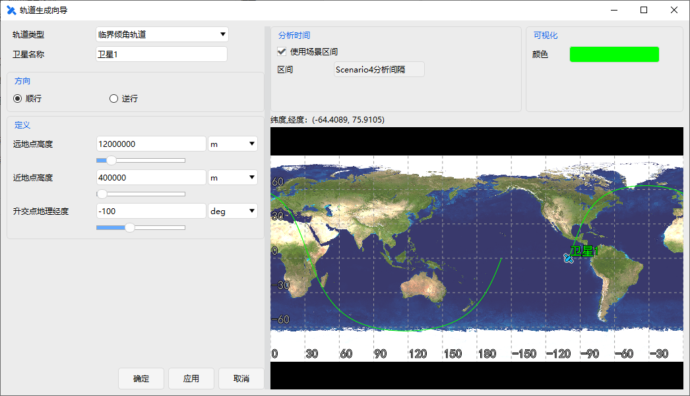

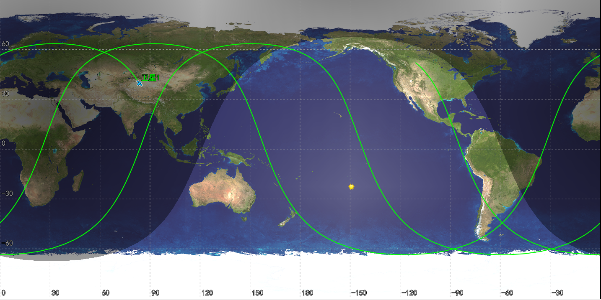

### Critically Inclined, Sun‑Synchronous Orbit

A critically inclined Sun‑synchronous orbit requires setting two parameters: Perigee Altitude and Longitude of Ascending Node. Click **OK** to generate the satellite, as shown below.

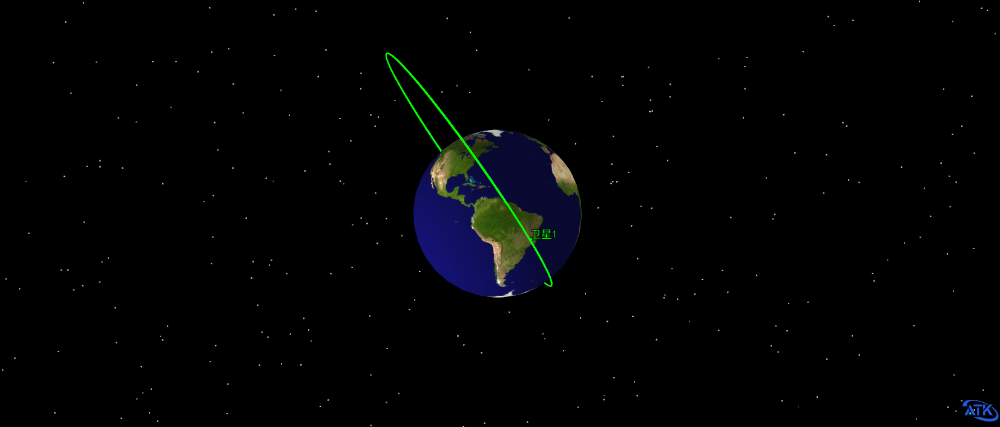

### Geosynchronous Orbit

A geosynchronous orbit requires setting two parameters: Subsatellite Point Longitude and Inclination. Click **OK** to generate the satellite, as shown below.

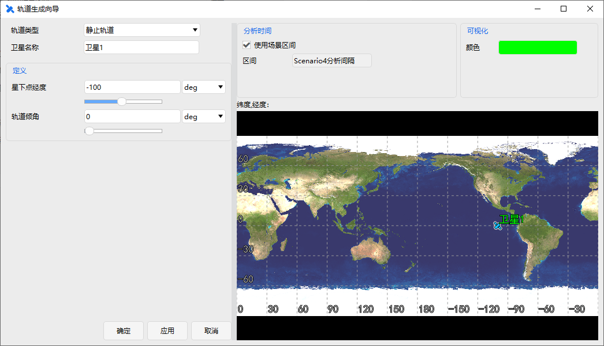

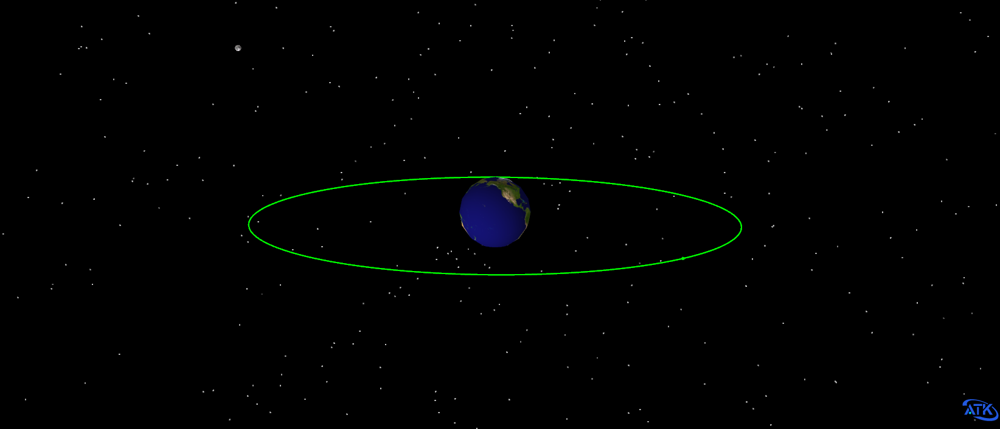

### Molniya Orbit

A Molniya orbit requires setting three parameters: Apogee Longitude, Perigee Altitude, and Argument of Perigee. Click **OK** to generate the satellite, as shown below.

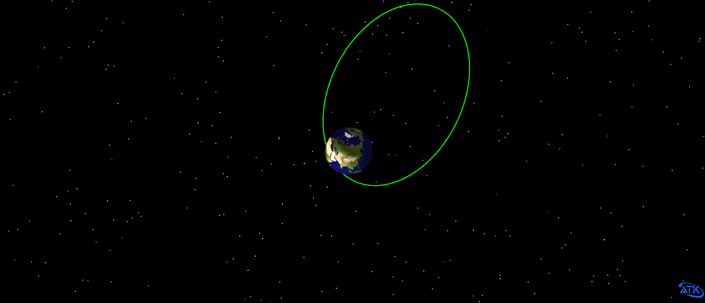

### Repeating Ground Track Orbit

A repeating ground track orbit requires setting four parameters: Position (Approx. Altitude / Approx. Revs Per Day), Inclination, Number of Revs to Repeat, and Longitude of First Ascending Node. Click **OK** to generate the satellite, as shown below.

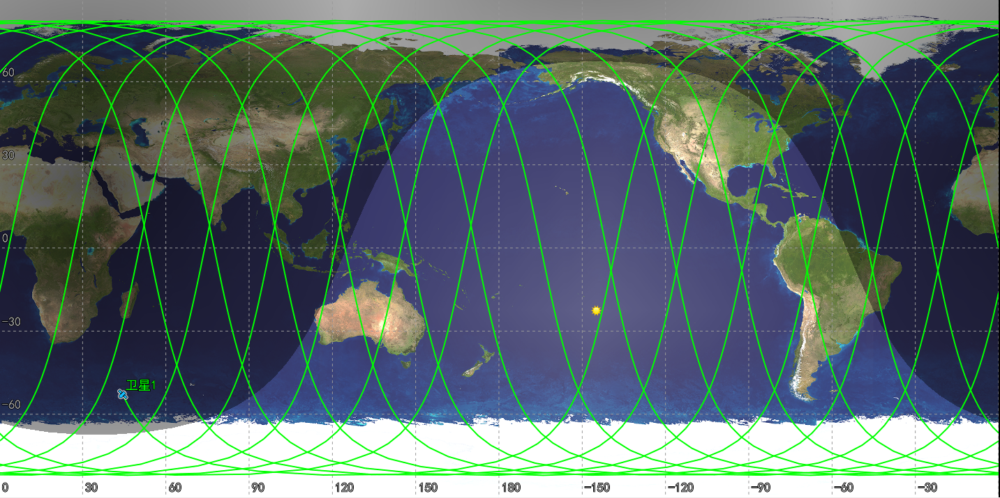

### Repeating Sun‑Synchronous Orbit

A repeating Sun‑synchronous orbit requires setting four parameters: Position (Approx. Altitude / Approx. Revs Per Day), Number of Revs to Repeat, Longitude of First Ascending Node, and Local Time of Ascending Node (or Descending Node). Click **OK** to generate the satellite, as shown below.

### Sun‑Synchronous Orbit

A Sun‑synchronous orbit requires setting two parameters: Position (Inclination / Altitude) and Local Time of Ascending Node (or Descending Node). Click **OK** to generate the satellite, as shown below.

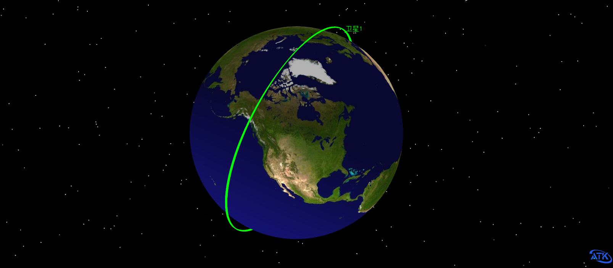

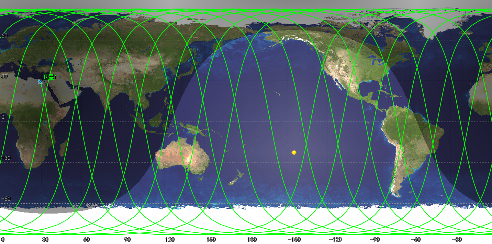

### Custom Orbit

A custom orbit requires setting the six classical orbital elements: Semimajor Axis, Eccentricity, Inclination, Argument of Perigee, RAAN, and True Anomaly. Click **OK** to generate the satellite, as shown below.

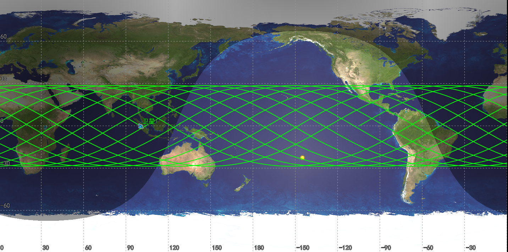

### Subsatellite Point Defined Orbit

A subsatellite point defined orbit requires setting six parameters: Latitude, Longitude, "Clicking on Map Changes Current Point", Direction (Ascending/Descending), Orbit Altitude, and Inclination. Click **OK** to generate the satellite, as shown below.

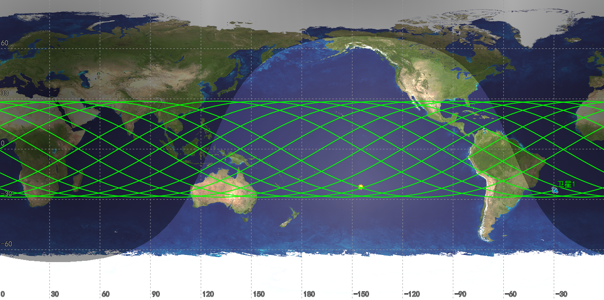

### Subsatellite Point Defined Repeating Orbit

A subsatellite point defined repeating orbit requires setting seven parameters: Position (Approx. Altitude / Approx. Revs Per Day), Latitude, Longitude, "Clicking on Map Changes Current Point", Direction (Ascending/Descending), Inclination, and Number of Revs to Repeat. Click **OK** to generate the satellite, as shown below.

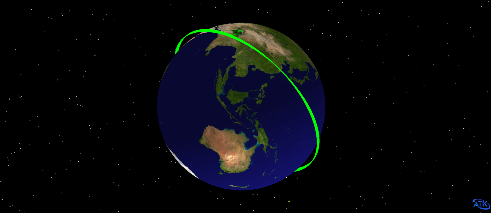

