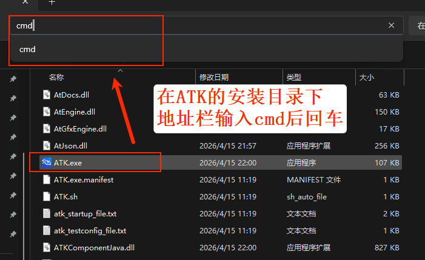

# Windows

## Starting on a Specified Port

ATK communicates with external programs through TCP ports, and must listen on a port when it starts. The **default port is 6655**; simply double-clicking `ATK.exe` starts it on this port, and `atkOpen` also connects to this port by default when no argument is passed.

In practice, you may need to run multiple ATK instances at the same time, in which case you need to specify different ports.

### Opening the Command Prompt

Open the ATK installation directory (right-click the ATK shortcut on the desktop → **Open file location**), type `cmd` in the address bar and press Enter to open the command prompt:



### Startup Command

The `-p` parameter lets you specify any port number when starting ATK (replace `<port>` with the actual port):

```bash
ATK -p <port>
```


::: details open **Example: Starting on port 6666**

```bash
ATK -p 6666
```

When connecting, pass the corresponding port to `atkOpen`:

::: code-tabs
@tab Python
```python
conID = atkOpen('127.0.0.1', 6666)
```

@tab C++
```cpp
conID = atkOpen("127.0.0.1", 6666);
```

@tab MATLAB
```matlab
conID = atkOpen('127.0.0.1', 6666);
```
:::

## Checking the Current Port

If you are not sure which port ATK is currently using (for example, if you cannot connect or connected to the wrong one), open PowerShell (<kbd>Win</kbd> + <kbd>R</kbd>, type `powershell`, and press Enter), then run:

```powershell
Get-Process ATK | ForEach-Object { netstat -ano | findstr $_.Id }
```


In the output, each line corresponds to the port occupied by an ATK process. The last column is the PID, and the second column is the local address and port:

- PID **22668** → occupies port **6655** (default port)
- PID **17428** → occupies port **6666**

Compare the query results to confirm the port ATK is currently using and check whether you filled in the correct port number when connecting.
