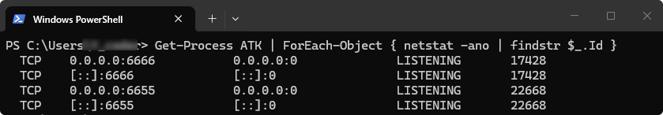

# Windows

## 指定端口启动

ATK 通过 TCP 端口与外部程序通信，启动时必须监听一个端口。**默认端口为 6655**，直接双击 `ATK.exe` 即在此端口启动，`atkOpen` 不传参时也默认连接此端口。

实际使用中可能会遇到需要同时运行多个 ATK 实例的情况，此时需要指定不同端口。

### 打开命令行

打开 ATK 安装目录（右键桌面 ATK 快捷方式 → **打开文件所在位置**），在地址栏输入 `cmd` 回车，打开命令提示符：


### 启动命令

通过 `-p` 参数可以在启动 ATK 时指定任意端口号（`<端口号>` 替换为实际端口）：

```bash
ATK -p <端口号>
```


::: details open **示例：在 6666 端口启动**

```bash
ATK -p 6666
```

连接时在 `atkOpen` 中传入对应端口：

::: code-tabs
@tab Python
```python
conID = atkOpen('127.0.0.1', 6666)
```

@tab C++
```cpp
conID = atkOpen("127.0.0.1", 6666);
```

@tab MATLAB
```matlab
conID = atkOpen('127.0.0.1', 6666);
```
:::

## 查看当前端口

如果不确定当前 ATK 在哪个端口（比如连不上或连错了），打开 PowerShell（<kbd>Win</kbd> + <kbd>R</kbd>，输入 `powershell`，回车），执行：

```powershell
Get-Process ATK | ForEach-Object { netstat -ano | findstr $_.Id }
```



输出中每行对应一个 ATK 进程占用的端口，最后一列为 PID，第二列为本地地址和端口：

- PID **22668** → 占用 **6655** 端口（默认端口）
- PID **17428** → 占用 **6666** 端口

对照查询结果即可确认 ATK 当前占用的端口，判断连接时是否填对了端口号。
