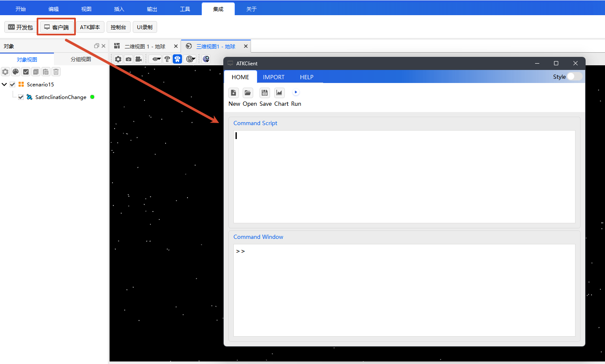
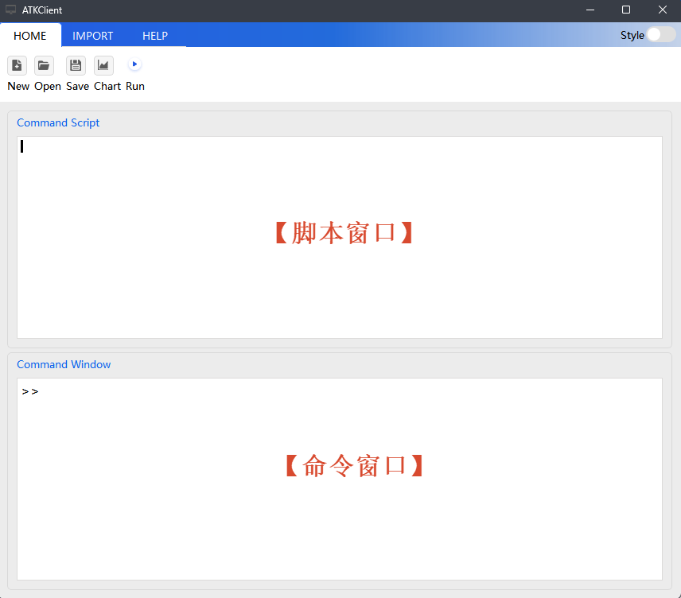

# Introduction and Configuration

## Introduction

The Python Client tool is a Python scripting tool built into ATK. You can write scripts to control ATK as soon as it is opened, with no additional environment configuration required.

As one of the core development methods in Connect mode, the Python Client tool interacts with ATK over TCP network communication and sends Connect commands through the three core APIs `atkOpen` / `atkConnect` / `atkClose`. If you do not want to set up an external Python development environment and prefer to write and run scripts directly in ATK, the Python Client tool is the most convenient choice.

::: danger Scenario Limitation
ATK Connect mode supports loading only one scenario at a time. To create a new scenario, close any scenario that is already open.
:::

::: tip Choosing a Development Method
For a detailed comparison of the development methods, refer to the [Connect Mode Overview](../../README.md#development-method-comparison).
:::

## Usage

### Entry Point

In the ATK menu bar, choose **Integration** → **Client** to open the Python Client tool.

### Interface Layout

The client window mainly contains the following areas:

- **Script window**: write Python scripts in batches and run them with one click; suitable for batch operations and script reuse.
- **Command window**: enter Python commands one by one to interact with ATK in real time; suitable for debugging and step-by-step operations.
- **Toolbar**: provides common functions such as **New** (new script), **Open** (open script), **Save** (save script) and **Run** (run script).

### Operation Modes

The Client tool provides three operation modes; choose the one that fits your needs:

1. **Script window (recommended)**: paste the code into the script window and click <kbd>Run</kbd> to run it in one click; suitable for batch operations and script reuse.
2. **Command window**: enter code line by line in the command window and press <kbd>Enter</kbd> to execute it; suitable for debugging and step-by-step operations.
3. **Open a script file**: click the <kbd>Open</kbd> button to open an existing script file (`.atks` or `.py`), then click <kbd>Run</kbd> to run it.

## Environment and Configuration

The Python Client tool is built into ATK; **no additional Python environment installation or library path configuration is required**. ATK includes a built-in Python interpreter and the common standard libraries, so you can write and execute Python scripts immediately after the client starts.

The differences from the [Python SDK](../4-语言SDK/1-Python/1-简介与配置.md) are as follows:

| Comparison | Python Client Tool | Python SDK |
| :--- | :--- | :--- |
| Python environment | Built into ATK, no installation required | Must be installed and configured yourself |
| Library files | Built into ATK, no configuration required | Must be copied manually to the working directory |
| Third-party libraries | Only the standard libraries built into ATK | Can use numpy, matplotlib, etc. |
| Running mode | Client window built into ATK | External IDE or command line |
| Suitable for | Getting started quickly and lightweight scripts | Integration into your own projects and complex development |

Next, refer to [Core API](./2-核心API.md) to learn how to use the interfaces, or jump straight to the [Complete Example](./3-完整示例.md) to follow along.
