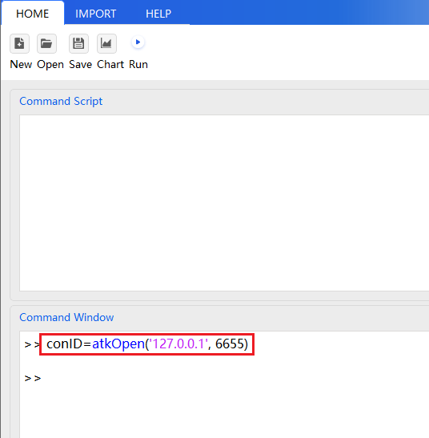
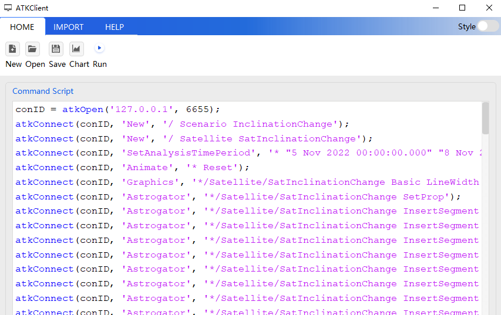
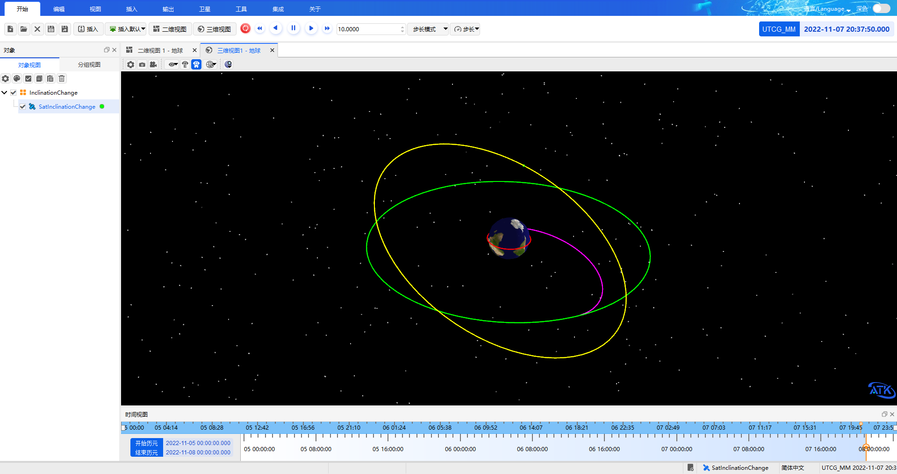

# Complete Example

## Description

The following uses the **orbit inclination change scenario** as an example to demonstrate the complete workflow of controlling ATK with the Python Client tool: the satellite is transferred from its initial low Earth orbit to a geostationary orbit through three maneuvers, while the orbital inclination is reduced from 28° to 0°.

::: tip Example Walkthrough
This example focuses on demonstrating the usage workflow of the Python Client tool. For more on the case principles, parameter meanings and step-by-step screenshots, refer to the [Secondary Development Case Tutorial](../../../../02-案例教程/8-二次开发案例/).
:::

## Complete Code

The complete code is organized around the main flow of **connect → create a scenario → set the initial orbit → build the three maneuver/target sequences → final propagation → run**. Each step is separated by comments so you can understand and reuse the code section by section.

::: details **Complete code** (shared by all three operation modes — click to expand and copy with one click)

```py
# ============================================================
# 1. Establish the connection
# ============================================================
conID = atkOpen('127.0.0.1', 6655)

# ============================================================
# 2. Create a new scenario and a satellite
# ============================================================
atkConnect(conID, 'New', '/ Scenario InclinationChange')
atkConnect(conID, 'New', '/ Satellite SatInclinationChange')

# ============================================================
# 3. Basic scenario settings
# ============================================================
# Set the analysis time period (from 00:00 on 2022-11-05 to 00:00 on 2022-11-08)
atkConnect(conID, 'SetAnalysisTimePeriod', '* "5 Nov 2022 00:00:00.000" "8 Nov 2022 00:00:00.000"')

# Reset the simulation
atkConnect(conID, 'Animate', '* Reset')

# Set the satellite trajectory line width
atkConnect(conID, 'Graphics', '*/Satellite/SatInclinationChange Basic LineWidth 2')

# Set the satellite orbit propagator type to maneuver planning (an initial segment and a propagate segment exist by default in the first-level list)
atkConnect(conID, 'Astrogator', '*/Satellite/SatInclinationChange SetProp')

# ============================================================
# 4. Build the maneuver-planning sequence (4 propagate segments + 3 target sequences)
# ============================================================

# --- Group 1: Propagate + Target_Sequence(Maneuver) ---
atkConnect(conID, 'Astrogator', '*/Satellite/SatInclinationChange InsertSegment MainSequence.SegmentList.- Propagate')
atkConnect(conID, 'Astrogator', '*/Satellite/SatInclinationChange InsertSegment MainSequence.SegmentList.- Target_Sequence')
atkConnect(conID, 'Astrogator', '*/Satellite/SatInclinationChange InsertSegment MainSequence.SegmentList.Target_Sequence.SegmentList.- Maneuver')

# --- Group 2: Propagate1 + Target_Sequence1(Maneuver) ---
atkConnect(conID, 'Astrogator', '*/Satellite/SatInclinationChange InsertSegment MainSequence.SegmentList.- Propagate')
atkConnect(conID, 'Astrogator', '*/Satellite/SatInclinationChange InsertSegment MainSequence.SegmentList.- Target_Sequence')
atkConnect(conID, 'Astrogator', '*/Satellite/SatInclinationChange InsertSegment MainSequence.SegmentList.Target_Sequence1.SegmentList.- Maneuver')

# --- Group 3: Propagate2 + Target_Sequence2(Maneuver) ---
atkConnect(conID, 'Astrogator', '*/Satellite/SatInclinationChange InsertSegment MainSequence.SegmentList.- Propagate')
atkConnect(conID, 'Astrogator', '*/Satellite/SatInclinationChange InsertSegment MainSequence.SegmentList.- Target_Sequence')
atkConnect(conID, 'Astrogator', '*/Satellite/SatInclinationChange InsertSegment MainSequence.SegmentList.Target_Sequence2.SegmentList.- Maneuver')

# --- Group 4: Propagate3 (final propagate segment) ---
atkConnect(conID, 'Astrogator', '*/Satellite/SatInclinationChange InsertSegment MainSequence.SegmentList.- Propagate')

# ============================================================
# 5. Set the initial segment parameters (orbit epoch, coordinate type, orbital elements)
# ============================================================
atkConnect(conID, 'Astrogator', '*/Satellite/SatInclinationChange SetValue MainSequence.SegmentList.Initial_State.InitialState.Epoch 5 Nov 2022 00:00:00.000 UTCG')
atkConnect(conID, 'Astrogator', '*/Satellite/SatInclinationChange SetValue MainSequence.SegmentList.Initial_State.CoordinateType "Modified Keplerian"')
atkConnect(conID, 'Astrogator', '*/Satellite/SatInclinationChange SetValue MainSequence.SegmentList.Initial_State.InitialState.Keplerian.sma 6570000 m')
atkConnect(conID, 'Astrogator', '*/Satellite/SatInclinationChange SetValue MainSequence.SegmentList.Initial_State.InitialState.Keplerian.ecc 0')
atkConnect(conID, 'Astrogator', '*/Satellite/SatInclinationChange SetValue MainSequence.SegmentList.Initial_State.InitialState.Keplerian.inc 28 deg')
atkConnect(conID, 'Astrogator', '*/Satellite/SatInclinationChange SetValue MainSequence.SegmentList.Initial_State.InitialState.Keplerian.RAAN 0')
atkConnect(conID, 'Astrogator', '*/Satellite/SatInclinationChange SetValue MainSequence.SegmentList.Initial_State.InitialState.Keplerian.w 0')
atkConnect(conID, 'Astrogator', '*/Satellite/SatInclinationChange SetValue MainSequence.SegmentList.Initial_State.InitialState.Keplerian.ta 0')

# ============================================================
# 6. Group 1: propagate segment + target sequence (raise the apoapsis to GEO altitude)
# ============================================================
# 6.1 Propagate segment Propagate — stopping condition: flight time of 7200 seconds
atkConnect(conID, 'Astrogator', '*/Satellite/SatInclinationChange SetValue MainSequence.SegmentList.Propagate.SegmentColor 4278190335')
atkConnect(conID, 'Astrogator', '*/Satellite/SatInclinationChange SetValue MainSequence.SegmentList.Propagate.StoppingConditions Duration')
atkConnect(conID, 'Astrogator', '*/Satellite/SatInclinationChange SetValue MainSequence.SegmentList.Propagate.StoppingConditions.Duration.TripValue 7200 sec')
atkConnect(conID, 'Astrogator', '*/Satellite/SatInclinationChange SetValue MainSequence.SegmentList.Propagate.StoppingConditions.Duration.Tolerance 0.0001 sec')

# 6.2 Target sequence Target_Sequence — control variable X, constraint: apoapsis radius = 42160000 m
atkConnect(conID, 'Astrogator', '*/Satellite/SatInclinationChange SetValue MainSequence.SegmentList.Target_Sequence.SegmentList.Maneuver.SegmentColor 4278212095')
atkConnect(conID, 'Astrogator', '*/Satellite/SatInclinationChange SetValue MainSequence.SegmentList.Target_Sequence.SegmentList.Maneuver.ImpulsiveMnvr.ThrustAxes "Satellite/SatInclinationChange VNC(Earth)"')
atkConnect(conID, 'Astrogator', '*/Satellite/SatInclinationChange AddMCSSegmentControl MainSequence.SegmentList.Target_Sequence.SegmentList.Maneuver ImpulsiveMnvr.Cartesian.X')
atkConnect(conID, 'Astrogator', '*/Satellite/SatInclinationChange SetValue MainSequence.SegmentList.Target_Sequence.Profiles Differential_Corrector')
atkConnect(conID, 'Astrogator', '*/Satellite/SatInclinationChange SetMCSControlValue MainSequence.SegmentList.Target_Sequence.Profiles.Differential_Corrector Maneuver ImpulsiveMnvr.Cartesian.X Active true')
atkConnect(conID, 'Astrogator', '*/Satellite/SatInclinationChange SetMCSControlValue MainSequence.SegmentList.Target_Sequence.Profiles.Differential_Corrector Maneuver ImpulsiveMnvr.Cartesian.X MaxStep 100')
atkConnect(conID, 'Astrogator', '*/Satellite/SatInclinationChange SetMCSControlValue MainSequence.SegmentList.Target_Sequence.Profiles.Differential_Corrector Maneuver ImpulsiveMnvr.Cartesian.X Correction 2456.42862556706')
atkConnect(conID, 'Astrogator', '*/Satellite/SatInclinationChange SetMCSControlValue MainSequence.SegmentList.Target_Sequence.Profiles.Differential_Corrector Maneuver ImpulsiveMnvr.Cartesian.X Pert 0.1')
atkConnect(conID, 'Astrogator', '*/Satellite/SatInclinationChange SetMCSControlValue MainSequence.SegmentList.Target_Sequence.Profiles.Differential_Corrector Maneuver ImpulsiveMnvr.Cartesian.X Scale 1')

# Constraint: apoapsis radius = 42160000 m
atkConnect(conID, 'Astrogator', '*/Satellite/SatInclinationChange SetValue MainSequence.SegmentList.Target_Sequence.SegmentList.Maneuver.Results "Radius Of Apoapsis"')
atkConnect(conID, 'Astrogator', '*/Satellite/SatInclinationChange SetMCSConstraintValue MainSequence.SegmentList.Target_Sequence.Profiles.Differential_Corrector Maneuver "StateCalcRadiusOfApoapsis" Active true')
atkConnect(conID, 'Astrogator', '*/Satellite/SatInclinationChange SetMCSConstraintValue MainSequence.SegmentList.Target_Sequence.Profiles.Differential_Corrector Maneuver "StateCalcRadiusOfApoapsis" Tolerance 0.1 m')
atkConnect(conID, 'Astrogator', '*/Satellite/SatInclinationChange SetMCSConstraintValue MainSequence.SegmentList.Target_Sequence.Profiles.Differential_Corrector Maneuver "StateCalcRadiusOfApoapsis" Scale 1 m')
atkConnect(conID, 'Astrogator', '*/Satellite/SatInclinationChange SetMCSConstraintValue MainSequence.SegmentList.Target_Sequence.Profiles.Differential_Corrector Maneuver "StateCalcRadiusOfApoapsis" Weight 1')
atkConnect(conID, 'Astrogator', '*/Satellite/SatInclinationChange SetMCSConstraintValue MainSequence.SegmentList.Target_Sequence.Profiles.Differential_Corrector Maneuver "StateCalcRadiusOfApoapsis" Desired 42160000 m')

# ============================================================
# 7. Group 2: propagate segment + target sequence (circularize the orbit at apoapsis, eccentricity → 0)
# ============================================================
# 7.1 Propagate segment Propagate1 — stopping condition: apoapsis
atkConnect(conID, 'Astrogator', '*/Satellite/SatInclinationChange SetValue MainSequence.SegmentList.Propagate1.SegmentColor 4294902015')
atkConnect(conID, 'Astrogator', '*/Satellite/SatInclinationChange SetValue MainSequence.SegmentList.Propagate1.StoppingConditions Apoapsis')
atkConnect(conID, 'Astrogator', '*/Satellite/SatInclinationChange SetValue MainSequence.SegmentList.Propagate1.StoppingConditions.Apoapsis.RepeatCount 1')
atkConnect(conID, 'Astrogator', '*/Satellite/SatInclinationChange SetValue MainSequence.SegmentList.Propagate1.StoppingConditions.Apoapsis.Tolerance 0.0001')

# 7.2 Target sequence Target_Sequence1 — control variable X, constraint: eccentricity = 0
atkConnect(conID, 'Astrogator', '*/Satellite/SatInclinationChange SetValue MainSequence.SegmentList.Target_Sequence1.SegmentList.Maneuver.SegmentColor -256')
atkConnect(conID, 'Astrogator', '*/Satellite/SatInclinationChange SetValue MainSequence.SegmentList.Target_Sequence1.SegmentList.Maneuver.ImpulsiveMnvr.ThrustAxes "Satellite/SatInclinationChange VNC(Earth)"')
atkConnect(conID, 'Astrogator', '*/Satellite/SatInclinationChange AddMCSSegmentControl MainSequence.SegmentList.Target_Sequence1.SegmentList.Maneuver ImpulsiveMnvr.Cartesian.X')
atkConnect(conID, 'Astrogator', '*/Satellite/SatInclinationChange SetValue MainSequence.SegmentList.Target_Sequence1.Profiles Differential_Corrector')
atkConnect(conID, 'Astrogator', '*/Satellite/SatInclinationChange SetMCSControlValue MainSequence.SegmentList.Target_Sequence1.Profiles.Differential_Corrector Maneuver ImpulsiveMnvr.Cartesian.X Active true')
atkConnect(conID, 'Astrogator', '*/Satellite/SatInclinationChange SetMCSControlValue MainSequence.SegmentList.Target_Sequence1.Profiles.Differential_Corrector Maneuver ImpulsiveMnvr.Cartesian.X MaxStep 100')
atkConnect(conID, 'Astrogator', '*/Satellite/SatInclinationChange SetMCSControlValue MainSequence.SegmentList.Target_Sequence1.Profiles.Differential_Corrector Maneuver ImpulsiveMnvr.Cartesian.X Correction 1480.06329844802')
atkConnect(conID, 'Astrogator', '*/Satellite/SatInclinationChange SetMCSControlValue MainSequence.SegmentList.Target_Sequence1.Profiles.Differential_Corrector Maneuver ImpulsiveMnvr.Cartesian.X Pert 0.1')
atkConnect(conID, 'Astrogator', '*/Satellite/SatInclinationChange SetMCSControlValue MainSequence.SegmentList.Target_Sequence1.Profiles.Differential_Corrector Maneuver ImpulsiveMnvr.Cartesian.X Scale 1')

# Constraint: eccentricity = 0
atkConnect(conID, 'Astrogator', '*/Satellite/SatInclinationChange SetValue MainSequence.SegmentList.Target_Sequence1.SegmentList.Maneuver.Results "Eccentricity"')
atkConnect(conID, 'Astrogator', '*/Satellite/SatInclinationChange SetMCSConstraintValue MainSequence.SegmentList.Target_Sequence1.Profiles.Differential_Corrector Maneuver "StateCalcEccentricity" Active true')
atkConnect(conID, 'Astrogator', '*/Satellite/SatInclinationChange SetMCSConstraintValue MainSequence.SegmentList.Target_Sequence1.Profiles.Differential_Corrector Maneuver "StateCalcEccentricity" Tolerance 0.001')
atkConnect(conID, 'Astrogator', '*/Satellite/SatInclinationChange SetMCSConstraintValue MainSequence.SegmentList.Target_Sequence1.Profiles.Differential_Corrector Maneuver "StateCalcEccentricity" Scale 1')
atkConnect(conID, 'Astrogator', '*/Satellite/SatInclinationChange SetMCSConstraintValue MainSequence.SegmentList.Target_Sequence1.Profiles.Differential_Corrector Maneuver "StateCalcEccentricity" Weight 1')
atkConnect(conID, 'Astrogator', '*/Satellite/SatInclinationChange SetMCSConstraintValue MainSequence.SegmentList.Target_Sequence1.Profiles.Differential_Corrector Maneuver "StateCalcEccentricity" Desired 0')

# ============================================================
# 8. Group 3: propagate segment + target sequence (change the inclination at the ascending node, inclination → 0°)
# ============================================================
# 8.1 Propagate segment Propagate2 — stopping condition: ascending node, repeat 2 times
atkConnect(conID, 'Astrogator', '*/Satellite/SatInclinationChange SetValue MainSequence.SegmentList.Propagate2.SegmentColor 4278255360')
atkConnect(conID, 'Astrogator', '*/Satellite/SatInclinationChange SetValue MainSequence.SegmentList.Propagate2.StoppingConditions AscendingNode')
atkConnect(conID, 'Astrogator', '*/Satellite/SatInclinationChange SetValue MainSequence.SegmentList.Propagate2.StoppingConditions.AscendingNode.RepeatCount 2')
atkConnect(conID, 'Astrogator', '*/Satellite/SatInclinationChange SetValue MainSequence.SegmentList.Propagate2.StoppingConditions.AscendingNode.Tolerance 0.000001')

# 8.2 Target sequence Target_Sequence2 — control variables X and Y, constraints: inclination = 0° and eccentricity = 0
atkConnect(conID, 'Astrogator', '*/Satellite/SatInclinationChange SetValue MainSequence.SegmentList.Target_Sequence2.SegmentList.Maneuver.SegmentColor -65536')
atkConnect(conID, 'Astrogator', '*/Satellite/SatInclinationChange SetValue MainSequence.SegmentList.Target_Sequence2.SegmentList.Maneuver.ImpulsiveMnvr.ThrustAxes "Satellite/SatInclinationChange VNC(Earth)"')
atkConnect(conID, 'Astrogator', '*/Satellite/SatInclinationChange AddMCSSegmentControl MainSequence.SegmentList.Target_Sequence2.SegmentList.Maneuver ImpulsiveMnvr.Cartesian.X')
atkConnect(conID, 'Astrogator', '*/Satellite/SatInclinationChange SetValue MainSequence.SegmentList.Target_Sequence2.Profiles Differential_Corrector')

# Control variable X
atkConnect(conID, 'Astrogator', '*/Satellite/SatInclinationChange SetMCSControlValue MainSequence.SegmentList.Target_Sequence2.Profiles.Differential_Corrector Maneuver ImpulsiveMnvr.Cartesian.X Active true')
atkConnect(conID, 'Astrogator', '*/Satellite/SatInclinationChange SetMCSControlValue MainSequence.SegmentList.Target_Sequence2.Profiles.Differential_Corrector Maneuver ImpulsiveMnvr.Cartesian.X MaxStep 100')
atkConnect(conID, 'Astrogator', '*/Satellite/SatInclinationChange SetMCSControlValue MainSequence.SegmentList.Target_Sequence2.Profiles.Differential_Corrector Maneuver ImpulsiveMnvr.Cartesian.X Correction -359.983751789857')
atkConnect(conID, 'Astrogator', '*/Satellite/SatInclinationChange SetMCSControlValue MainSequence.SegmentList.Target_Sequence2.Profiles.Differential_Corrector Maneuver ImpulsiveMnvr.Cartesian.X Pert 0.1')
atkConnect(conID, 'Astrogator', '*/Satellite/SatInclinationChange SetMCSControlValue MainSequence.SegmentList.Target_Sequence2.Profiles.Differential_Corrector Maneuver ImpulsiveMnvr.Cartesian.X Scale 1')

# Control variable Y
atkConnect(conID, 'Astrogator', '*/Satellite/SatInclinationChange AddMCSSegmentControl MainSequence.SegmentList.Target_Sequence2.SegmentList.Maneuver ImpulsiveMnvr.Cartesian.Y')
atkConnect(conID, 'Astrogator', '*/Satellite/SatInclinationChange SetMCSControlValue MainSequence.SegmentList.Target_Sequence2.Profiles.Differential_Corrector Maneuver ImpulsiveMnvr.Cartesian.Y Active true')
atkConnect(conID, 'Astrogator', '*/Satellite/SatInclinationChange SetMCSControlValue MainSequence.SegmentList.Target_Sequence2.Profiles.Differential_Corrector Maneuver ImpulsiveMnvr.Cartesian.Y MaxStep 100')
atkConnect(conID, 'Astrogator', '*/Satellite/SatInclinationChange SetMCSControlValue MainSequence.SegmentList.Target_Sequence2.Profiles.Differential_Corrector Maneuver ImpulsiveMnvr.Cartesian.Y Correction -1444.72488992759')
atkConnect(conID, 'Astrogator', '*/Satellite/SatInclinationChange SetMCSControlValue MainSequence.SegmentList.Target_Sequence2.Profiles.Differential_Corrector Maneuver ImpulsiveMnvr.Cartesian.Y Pert 0.1')
atkConnect(conID, 'Astrogator', '*/Satellite/SatInclinationChange SetMCSControlValue MainSequence.SegmentList.Target_Sequence2.Profiles.Differential_Corrector Maneuver ImpulsiveMnvr.Cartesian.Y Scale 1')

# Constraints: orbital inclination = 0° and eccentricity = 0
atkConnect(conID, 'Astrogator', '*/Satellite/SatInclinationChange SetValue MainSequence.SegmentList.Target_Sequence2.SegmentList.Maneuver.Results "Inclination" "Eccentricity"')

# Constraint: Inclination
atkConnect(conID, 'Astrogator', '*/Satellite/SatInclinationChange SetMCSConstraintValue MainSequence.SegmentList.Target_Sequence2.Profiles.Differential_Corrector Maneuver "StateCalcInclination" Active true')
atkConnect(conID, 'Astrogator', '*/Satellite/SatInclinationChange SetMCSConstraintValue MainSequence.SegmentList.Target_Sequence2.Profiles.Differential_Corrector Maneuver "StateCalcInclination" Tolerance 0 deg')
atkConnect(conID, 'Astrogator', '*/Satellite/SatInclinationChange SetMCSConstraintValue MainSequence.SegmentList.Target_Sequence2.Profiles.Differential_Corrector Maneuver "StateCalcInclination" Scale 1 rad')
atkConnect(conID, 'Astrogator', '*/Satellite/SatInclinationChange SetMCSConstraintValue MainSequence.SegmentList.Target_Sequence2.Profiles.Differential_Corrector Maneuver "StateCalcInclination" Weight 1')
atkConnect(conID, 'Astrogator', '*/Satellite/SatInclinationChange SetMCSConstraintValue MainSequence.SegmentList.Target_Sequence2.Profiles.Differential_Corrector Maneuver "StateCalcInclination" Desired 0 deg')

# Constraint: Eccentricity
atkConnect(conID, 'Astrogator', '*/Satellite/SatInclinationChange SetMCSConstraintValue MainSequence.SegmentList.Target_Sequence2.Profiles.Differential_Corrector Maneuver "StateCalcEccentricity" Active true')
atkConnect(conID, 'Astrogator', '*/Satellite/SatInclinationChange SetMCSConstraintValue MainSequence.SegmentList.Target_Sequence2.Profiles.Differential_Corrector Maneuver "StateCalcEccentricity" Tolerance 0.001')
atkConnect(conID, 'Astrogator', '*/Satellite/SatInclinationChange SetMCSConstraintValue MainSequence.SegmentList.Target_Sequence2.Profiles.Differential_Corrector Maneuver "StateCalcEccentricity" Scale 1')
atkConnect(conID, 'Astrogator', '*/Satellite/SatInclinationChange SetMCSConstraintValue MainSequence.SegmentList.Target_Sequence2.Profiles.Differential_Corrector Maneuver "StateCalcEccentricity" Weight 1')
atkConnect(conID, 'Astrogator', '*/Satellite/SatInclinationChange SetMCSConstraintValue MainSequence.SegmentList.Target_Sequence2.Profiles.Differential_Corrector Maneuver "StateCalcEccentricity" Desired 0')

# ============================================================
# 9. Final propagate segment — stopping condition: flight time of 129600 seconds
# ============================================================
atkConnect(conID, 'Astrogator', '*/Satellite/SatInclinationChange SetValue MainSequence.SegmentList.Propagate3.SegmentColor 4278255615')
atkConnect(conID, 'Astrogator', '*/Satellite/SatInclinationChange SetValue MainSequence.SegmentList.Propagate3.StoppingConditions Duration')
atkConnect(conID, 'Astrogator', '*/Satellite/SatInclinationChange SetValue MainSequence.SegmentList.Propagate3.StoppingConditions.Duration.TripValue 129600 sec')
atkConnect(conID, 'Astrogator', '*/Satellite/SatInclinationChange SetValue MainSequence.SegmentList.Propagate3.StoppingConditions.Duration.Tolerance 0.00001 sec')

# ============================================================
# 10. Run and close the connection
# ============================================================
atkConnect(conID, 'Astrogator', '*/Satellite/SatInclinationChange RunMCS')
atkClose(conID)
```

:::

## How to Run

The complete code below can be run in any of the following three ways:

::: warning Prerequisites
- Open the ATK software before running
- This example creates a new scenario with the `New` command, and ATK Connect mode supports loading only one scenario, so **do not open any existing scenario**; close it first if one is already open
:::

1. **Script window (recommended)**: expand the code block above, copy everything, paste it into the script window, and click <kbd>Run</kbd> to run it in one click.

   

2. **Command window**: expand the code block above and copy it section by section from top to bottom into the command window, pressing <kbd>Enter</kbd> to execute each line.

   

3. **Open a script file**: expand the code block above, copy everything, save it as a `.atks` file, then click <kbd>Open</kbd> to open it and <kbd>Run</kbd> to run it.

   

## Run Results

After a successful run, the ATK 3D window shows the satellite's maneuver-planning trajectory. Starting from its initial low Earth orbit, the satellite reaches a geostationary orbit after three orbital maneuvers, and the orbital inclination drops from 28° to 0°.


