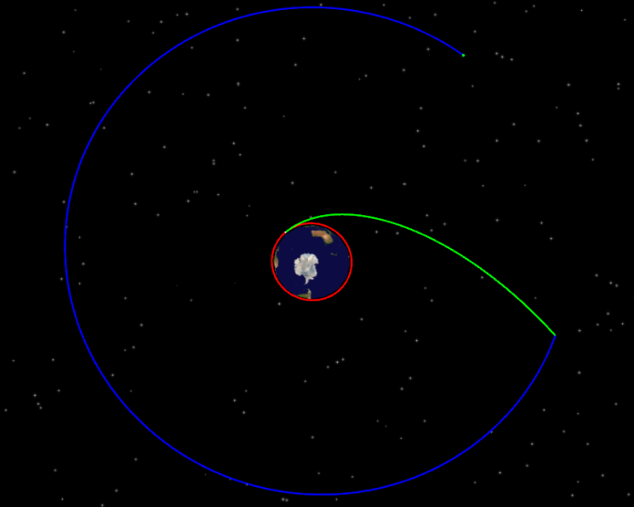

# Complete Example

## Description

The following uses the **fast orbit transfer scenario** as an example to demonstrate the complete workflow of controlling ATK with the Python SDK: the satellite is quickly transferred from a low Earth parking orbit (LEO) with a radius of 6700 km to a geostationary orbit (GEO) with a radius of 42164.197 km.

::: tip Example Walkthrough
This example focuses on demonstrating the usage workflow of the Python SDK. For more on the case principles, parameter meanings and step-by-step screenshots, refer to the [Secondary Development Case Tutorial](../../../../../02-案例教程/8-二次开发案例/).
:::

## Complete Code

The complete code is organized around the main flow of **connect → create a scenario → set the initial orbit → build the maneuver-planning sequence → run the simulation → save and disconnect**. Each step is separated by comments so you can understand and reuse the code section by section.

::: details **Complete code** (click to expand and copy in one go)

```python
# ============================================================
# 0. Import the ATK communication interface module
# ============================================================
from ATKConnectModule import atkOpen, atkConnect, atkClose

# ============================================================
# 1. Establish the connection
# ============================================================
conID = atkOpen()

# ============================================================
# 2. Create a new scenario and a satellite
# ============================================================
atkConnect(conID, 'New', '/ Scenario FastTransfer')
atkConnect(conID, 'New', '/ Satellite FastTransfer')

# ============================================================
# 3. Basic scenario settings
# ============================================================
# Set the analysis time period (from 00:00 on 2022-11-05 to 00:00 on 2022-11-07)
atkConnect(conID, 'SetAnalysisTimePeriod', '* "5 Nov 2022 00:00:00.000" "7 Nov 2022 00:00:00.000"')

# Reset the simulation
atkConnect(conID, 'Animate', '* Reset')

# Set the satellite orbit propagator type to maneuver planning (an initial segment and a propagate segment exist by default in the first-level list)
atkConnect(conID, 'Astrogator', '*/Satellite/FastTransfer SetProp')

# ============================================================
# 4. Build the maneuver-planning sequence (3 propagate segments + 2 target sequences)
# ============================================================

# --- Group 1: Propagate + Target_Sequence(Maneuver) ---
atkConnect(conID, 'Astrogator', '*/Satellite/FastTransfer InsertSegment MainSequence.SegmentList.- Propagate')
atkConnect(conID, 'Astrogator', '*/Satellite/FastTransfer InsertSegment MainSequence.SegmentList.- Target_Sequence')
atkConnect(conID, 'Astrogator', '*/Satellite/FastTransfer InsertSegment MainSequence.SegmentList.Target_Sequence.SegmentList.- Maneuver')

# --- Group 2: Propagate1 + Target_Sequence1(Maneuver) ---
atkConnect(conID, 'Astrogator', '*/Satellite/FastTransfer InsertSegment MainSequence.SegmentList.- Propagate')
atkConnect(conID, 'Astrogator', '*/Satellite/FastTransfer InsertSegment MainSequence.SegmentList.- Target_Sequence')
atkConnect(conID, 'Astrogator', '*/Satellite/FastTransfer InsertSegment MainSequence.SegmentList.Target_Sequence1.SegmentList.- Maneuver')

# --- Group 3: Propagate2 (final propagate segment) ---
atkConnect(conID, 'Astrogator', '*/Satellite/FastTransfer InsertSegment MainSequence.SegmentList.- Propagate')

# ============================================================
# 5. Set the initial segment parameters (orbit epoch, coordinate type, orbital elements)
# ============================================================
atkConnect(conID, 'Astrogator', '*/Satellite/FastTransfer SetValue MainSequence.SegmentList.Initial_State.InitialState.Epoch 5 Nov 2022 00:00:00.000 UTCG')
atkConnect(conID, 'Astrogator', '*/Satellite/FastTransfer SetValue MainSequence.SegmentList.Initial_State.CoordinateType "Modified Keplerian"')
atkConnect(conID, 'Astrogator', '*/Satellite/FastTransfer SetValue MainSequence.SegmentList.Initial_State.InitialState.Keplerian.sma 6700000 m')
atkConnect(conID, 'Astrogator', '*/Satellite/FastTransfer SetValue MainSequence.SegmentList.Initial_State.InitialState.Keplerian.ecc 0')
atkConnect(conID, 'Astrogator', '*/Satellite/FastTransfer SetValue MainSequence.SegmentList.Initial_State.InitialState.Keplerian.inc 0')
atkConnect(conID, 'Astrogator', '*/Satellite/FastTransfer SetValue MainSequence.SegmentList.Initial_State.InitialState.Keplerian.RAAN 0')
atkConnect(conID, 'Astrogator', '*/Satellite/FastTransfer SetValue MainSequence.SegmentList.Initial_State.InitialState.Keplerian.w 0')
atkConnect(conID, 'Astrogator', '*/Satellite/FastTransfer SetValue MainSequence.SegmentList.Initial_State.InitialState.Keplerian.ta 0')

# ============================================================
# 6. Group 1: propagate segment + target sequence (raise the apoapsis to GEO altitude)
# ============================================================
atkConnect(conID, 'Astrogator', '*/Satellite/FastTransfer SetValue MainSequence.SegmentList.Propagate.StoppingConditions Duration')
atkConnect(conID, 'Astrogator', '*/Satellite/FastTransfer SetValue MainSequence.SegmentList.Propagate.StoppingConditions.Duration.TripValue 7200 sec')

atkConnect(conID, 'Astrogator', '*/Satellite/FastTransfer SetValue MainSequence.SegmentList.Target_Sequence.SegmentList.Maneuver.ImpulsiveMnvr.ThrustAxes "Satellite/FastTransfer VNC(Earth)"')
atkConnect(conID, 'Astrogator', '*/Satellite/FastTransfer AddMCSSegmentControl MainSequence.SegmentList.Target_Sequence.SegmentList.Maneuver ImpulsiveMnvr.Cartesian.X')
atkConnect(conID, 'Astrogator', '*/Satellite/FastTransfer SetValue MainSequence.SegmentList.Target_Sequence.Profiles Differential_Corrector')

# ============================================================
# 7. Group 2: propagate segment + target sequence (circularize the orbit at apoapsis)
# ============================================================
atkConnect(conID, 'Astrogator', '*/Satellite/FastTransfer SetValue MainSequence.SegmentList.Propagate1.StoppingConditions Apoapsis')

atkConnect(conID, 'Astrogator', '*/Satellite/FastTransfer SetValue MainSequence.SegmentList.Target_Sequence1.SegmentList.Maneuver.ImpulsiveMnvr.ThrustAxes "Satellite/FastTransfer VNC(Earth)"')
atkConnect(conID, 'Astrogator', '*/Satellite/FastTransfer AddMCSSegmentControl MainSequence.SegmentList.Target_Sequence1.SegmentList.Maneuver ImpulsiveMnvr.Cartesian.X')
atkConnect(conID, 'Astrogator', '*/Satellite/FastTransfer SetValue MainSequence.SegmentList.Target_Sequence1.Profiles Differential_Corrector')

# ============================================================
# 8. Final propagate segment — stopping condition: flight time of 86400 seconds
# ============================================================
atkConnect(conID, 'Astrogator', '*/Satellite/FastTransfer SetValue MainSequence.SegmentList.Propagate2.StoppingConditions Duration')
atkConnect(conID, 'Astrogator', '*/Satellite/FastTransfer SetValue MainSequence.SegmentList.Propagate2.StoppingConditions.Duration.TripValue 86400 sec')

# ============================================================
# 9. Run the maneuver planning
# ============================================================
atkConnect(conID, 'Astrogator', '*/Satellite/FastTransfer RunMCS')
atkConnect(conID, 'Animate', '* Reset')

# ============================================================
# 10. Save the scenario and close the connection
# ============================================================
atkConnect(conID, 'Save', '/ *')
atkClose(conID)
```

:::

## How to Run

::: warning Prerequisites
- Before you start, make sure you have completed [Environment Configuration](./1-简介与配置.md#configuration-steps): copy `ATKConnectModule.py` and `_ATKConnectModule.pyd` to the working directory
- Open the ATK software before running
- This example creates a new scenario with the `New` command, and ATK Connect mode supports loading only one scenario, so **do not open any existing scenario**; close it first if one is already open
:::

Copy the complete code above and save it as a `.py` file (for example, `fast_transfer.py`), then run it in the command line or an IDE:

```bash
python fast_transfer.py
```

During the run, the ATK interface will progressively execute operations such as creating the scenario, creating the satellite, setting the orbit parameters and running the maneuver planning.

## Run Results

After a successful run, the ATK 3D window shows the complete trajectory of the satellite starting from its initial low Earth orbit and reaching the geostationary orbit after orbital maneuvers:



You can right-click the satellite object in ATK and select **Properties** to check whether the parameters set by the code take effect correctly:


