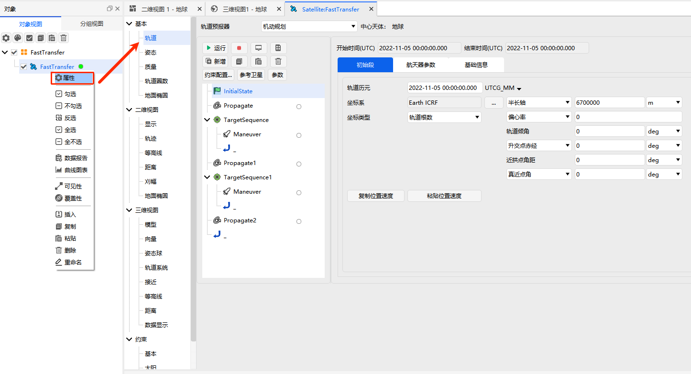

# 完整示例

## 说明

以下以**轨道快速转移场景**为例，演示 Python SDK 操控 ATK 的完整流程：将卫星从半径为 6700 km 的近地停泊轨道（LEO）快速转移到半径为 42164.197 km 的地球同步轨道（GEO）。

::: tip 案例详解
本示例侧重展示 Python SDK 的使用流程。更多的案例原理、参数含义及分步截图请参考 [二次开发案例教程](/02-案例教程/8-二次开发案例/)。
:::

## 完整代码

完整代码按照 **连接 → 创建场景 → 设置初始轨道 → 构建机动规划序列 → 运行仿真 → 保存并断开** 的主线编排，各步骤通过注释分隔，便于逐段理解和复用。

::: details **完整代码**（点击展开可一键复制）

```python
# ============================================================
# 0. 导入 ATK 通信接口模块
# ============================================================
from ATKConnectModule import atkOpen, atkConnect, atkClose

# ============================================================
# 1. 建立连接
# ============================================================
conID = atkOpen()

# ============================================================
# 2. 新建场景与卫星
# ============================================================
atkConnect(conID, 'New', '/ Scenario FastTransfer')
atkConnect(conID, 'New', '/ Satellite FastTransfer')

# ============================================================
# 3. 场景基础设置
# ============================================================
# 设置分析时间段（开始时间 2022-11-05 零点，结束时间 2022-11-07 零点）
atkConnect(conID, 'SetAnalysisTimePeriod', '* "5 Nov 2022 00:00:00.000" "7 Nov 2022 00:00:00.000"')

# 仿真重置
atkConnect(conID, 'Animate', '* Reset')

# 设置卫星轨道预报器类型为机动规划（第一级目录默认存在一个初始段和一个预报段）
atkConnect(conID, 'Astrogator', '*/Satellite/FastTransfer SetProp')

# ============================================================
# 4. 构建机动规划序列（3 段预报 + 2 组瞄准序列）
# ============================================================

# --- 第一组：Propagate + Target_Sequence(Maneuver) ---
atkConnect(conID, 'Astrogator', '*/Satellite/FastTransfer InsertSegment MainSequence.SegmentList.- Propagate')
atkConnect(conID, 'Astrogator', '*/Satellite/FastTransfer InsertSegment MainSequence.SegmentList.- Target_Sequence')
atkConnect(conID, 'Astrogator', '*/Satellite/FastTransfer InsertSegment MainSequence.SegmentList.Target_Sequence.SegmentList.- Maneuver')

# --- 第二组：Propagate1 + Target_Sequence1(Maneuver) ---
atkConnect(conID, 'Astrogator', '*/Satellite/FastTransfer InsertSegment MainSequence.SegmentList.- Propagate')
atkConnect(conID, 'Astrogator', '*/Satellite/FastTransfer InsertSegment MainSequence.SegmentList.- Target_Sequence')
atkConnect(conID, 'Astrogator', '*/Satellite/FastTransfer InsertSegment MainSequence.SegmentList.Target_Sequence1.SegmentList.- Maneuver')

# --- 第三组：Propagate2（最终预报段）---
atkConnect(conID, 'Astrogator', '*/Satellite/FastTransfer InsertSegment MainSequence.SegmentList.- Propagate')

# ============================================================
# 5. 设置初始段参数（轨道历元、坐标类型、轨道根数）
# ============================================================
atkConnect(conID, 'Astrogator', '*/Satellite/FastTransfer SetValue MainSequence.SegmentList.Initial_State.InitialState.Epoch 5 Nov 2022 00:00:00.000 UTCG')
atkConnect(conID, 'Astrogator', '*/Satellite/FastTransfer SetValue MainSequence.SegmentList.Initial_State.CoordinateType "Modified Keplerian"')
atkConnect(conID, 'Astrogator', '*/Satellite/FastTransfer SetValue MainSequence.SegmentList.Initial_State.InitialState.Keplerian.sma 6700000 m')
atkConnect(conID, 'Astrogator', '*/Satellite/FastTransfer SetValue MainSequence.SegmentList.Initial_State.InitialState.Keplerian.ecc 0')
atkConnect(conID, 'Astrogator', '*/Satellite/FastTransfer SetValue MainSequence.SegmentList.Initial_State.InitialState.Keplerian.inc 0')
atkConnect(conID, 'Astrogator', '*/Satellite/FastTransfer SetValue MainSequence.SegmentList.Initial_State.InitialState.Keplerian.RAAN 0')
atkConnect(conID, 'Astrogator', '*/Satellite/FastTransfer SetValue MainSequence.SegmentList.Initial_State.InitialState.Keplerian.w 0')
atkConnect(conID, 'Astrogator', '*/Satellite/FastTransfer SetValue MainSequence.SegmentList.Initial_State.InitialState.Keplerian.ta 0')

# ============================================================
# 6. 第一组：预报段 + 瞄准序列（抬升远地点至 GEO 高度）
# ============================================================
atkConnect(conID, 'Astrogator', '*/Satellite/FastTransfer SetValue MainSequence.SegmentList.Propagate.StoppingConditions Duration')
atkConnect(conID, 'Astrogator', '*/Satellite/FastTransfer SetValue MainSequence.SegmentList.Propagate.StoppingConditions.Duration.TripValue 7200 sec')

atkConnect(conID, 'Astrogator', '*/Satellite/FastTransfer SetValue MainSequence.SegmentList.Target_Sequence.SegmentList.Maneuver.ImpulsiveMnvr.ThrustAxes "Satellite/FastTransfer VNC(Earth)"')
atkConnect(conID, 'Astrogator', '*/Satellite/FastTransfer AddMCSSegmentControl MainSequence.SegmentList.Target_Sequence.SegmentList.Maneuver ImpulsiveMnvr.Cartesian.X')
atkConnect(conID, 'Astrogator', '*/Satellite/FastTransfer SetValue MainSequence.SegmentList.Target_Sequence.Profiles Differential_Corrector')

# ============================================================
# 7. 第二组：预报段 + 瞄准序列（在远地点圆化轨道）
# ============================================================
atkConnect(conID, 'Astrogator', '*/Satellite/FastTransfer SetValue MainSequence.SegmentList.Propagate1.StoppingConditions Apoapsis')

atkConnect(conID, 'Astrogator', '*/Satellite/FastTransfer SetValue MainSequence.SegmentList.Target_Sequence1.SegmentList.Maneuver.ImpulsiveMnvr.ThrustAxes "Satellite/FastTransfer VNC(Earth)"')
atkConnect(conID, 'Astrogator', '*/Satellite/FastTransfer AddMCSSegmentControl MainSequence.SegmentList.Target_Sequence1.SegmentList.Maneuver ImpulsiveMnvr.Cartesian.X')
atkConnect(conID, 'Astrogator', '*/Satellite/FastTransfer SetValue MainSequence.SegmentList.Target_Sequence1.Profiles Differential_Corrector')

# ============================================================
# 8. 最终预报段——停止条件为飞行时间 86400 秒
# ============================================================
atkConnect(conID, 'Astrogator', '*/Satellite/FastTransfer SetValue MainSequence.SegmentList.Propagate2.StoppingConditions Duration')
atkConnect(conID, 'Astrogator', '*/Satellite/FastTransfer SetValue MainSequence.SegmentList.Propagate2.StoppingConditions.Duration.TripValue 86400 sec')

# ============================================================
# 9. 运行机动规划
# ============================================================
atkConnect(conID, 'Astrogator', '*/Satellite/FastTransfer RunMCS')
atkConnect(conID, 'Animate', '* Reset')

# ============================================================
# 10. 保存场景并断开连接
# ============================================================
atkConnect(conID, 'Save', '/ *')
atkClose(conID)
```

:::

## 如何使用

::: warning 前置准备
- 使用前请确保已完成 [环境配置](./1-简介与配置.md#配置步骤)：将 `ATKConnectModule.py` 和 `_ATKConnectModule.pyd` 复制到工作目录
- 运行前需先打开 ATK 软件
- 本示例代码中有 `New` 命令新建场景，而 ATK CONNECT 模式仅支持加载一个场景，因此**不要打开任何已有场景**；若已打开请先关闭
:::

将上方完整代码复制保存为 `.py` 文件（如 `fast_transfer.py`），在命令行或 IDE 中运行：

```bash
python fast_transfer.py
```

运行过程中，ATK 界面将逐步执行场景新建、卫星创建、轨道参数设置和机动规划运行等操作。

## 运行结果

运行成功后，ATK 三维窗口将显示卫星从初始近地轨道出发、经轨道机动到达地球同步轨道的完整轨迹：


可在 ATK 中右键点击卫星对象，选择**属性**查看代码设置的各项参数是否正确生效：


