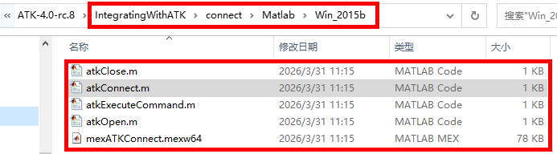

# 简介与配置

## 简介

Matlab SDK 是 ATK 提供的 Matlab 通信库，允许用户在自己的 Matlab 开发环境中编写脚本，通过 TCP 网络连接与 ATK 交互，实现场景搭建、参数设置、仿真运行等自动化操作。

作为 CONNECT 模式的核心开发方式之一，Matlab SDK 与 ATK 内置的 [Python 客户端工具](../../2-Python客户端工具/1-简介与配置.md) 共享相同的通信协议和命令格式，区别在于 Matlab SDK 运行在用户自建的 Matlab 环境中，适合需要将 ATK 功能集成到 Matlab 项目、或需要利用 Matlab 矩阵计算与可视化能力的场景。

::: tip 开发方式选择
各开发方式的详细对比请参考 [CONNECT 模式概述](../../../README.md#开发方式对比)。
:::

## 环境与配置

### Matlab 环境

Matlab 需用户自行下载安装。ATK 通信库基于 Matlab R2015b 开发测试，建议使用 R2015b 及以上版本以确保兼容性。

::: warning 注意
使用 Matlab SDK 发送命令前，必须打开 ATK 软件（不需要打开场景）。若需新建场景，需将已打开的场景关闭。
:::

### 通信库文件

ATK 的 Matlab 通信库随安装包一同提供，位于安装包目录下的 `IntegratingWithATK\connect\Matlab` 中：

- **Windows**：<PathCopy :entry="matlabDir" /> 文件夹，基于 Matlab R2015b

以下以 Windows 版本为例说明文件构成：

- <PathCopy :entry="mexFile" />：MEX 可执行文件，作为 Matlab 与 `ATKConnectorDll64.dll` 之间的桥接层，负责底层数据传递。
- <PathCopy :entry="atkOpenFile" /> / <PathCopy :entry="atkConnectFile" /> / <PathCopy :entry="atkCloseFile" />：Matlab 函数式 M 文件，封装了 MEX 函数的调用，分别用于建立连接、发送命令和断开连接。

<PathViewer :relative-paths="sdkFiles" />



### 配置步骤

将文件夹路径添加到 Matlab 搜索路径：

```matlab
addpath('<ATK安装目录>\IntegratingWithATK\connect\Matlab\Win_2015b')
```

配置完成后，即可在脚本或命令行中直接调用通信接口函数，例如：

```matlab
conID = atkOpen();
% ... 发送命令 ...
atkClose(conID);
```

## 使用方式

完成上述配置后，即可在代码中调用核心 API 操控 ATK。基本流程如下：

```matlab
% 1. 将库文件路径加入 Matlab 搜索路径
addpath('<ATK安装目录>\IntegratingWithATK\connect\Matlab\Win_2015b')

% 2. 建立与 ATK 的连接
conID = atkOpen();

% 3. 发送命令（示例：新建一个场景）
atkConnect(conID, 'New', '/ Scenario MyScenario');

% 4. 断开连接
atkClose(conID);
```

下一步请参考 [核心 API](./2-核心API.md) 了解接口用法，或直接查看 [完整示例](./3-完整示例.md) 跟随实操。

<script setup>
import PathViewer from "@components/PathViewer/PathViewer.vue";
import PathCopy from "@components/PathCopy/PathCopy.vue";

const matlabDir = { path: 'IntegratingWithATK\\connect\\Matlab\\Win_2015b', name: 'Win_2015b' };
const mexFile = { path: 'IntegratingWithATK\\connect\\Matlab\\Win_2015b\\mexATKConnect.mexw64', name: 'mexATKConnect.mexw64' };
const atkOpenFile = { path: 'IntegratingWithATK\\connect\\Matlab\\Win_2015b\\atkOpen.m', name: 'atkOpen.m' };
const atkConnectFile = { path: 'IntegratingWithATK\\connect\\Matlab\\Win_2015b\\atkConnect.m', name: 'atkConnect.m' };
const atkCloseFile = { path: 'IntegratingWithATK\\connect\\Matlab\\Win_2015b\\atkClose.m', name: 'atkClose.m' };

const sdkFiles = [
  matlabDir,
  { path: 'IntegratingWithATK\\connect\\Matlab\\Win_2015b\\mexATKConnect.mexw64', name: 'mexATKConnect.mexw64', description: 'MEX 可执行文件，Matlab 与 ATKConnectorDll64.dll 之间的桥接层' },
  { path: 'IntegratingWithATK\\connect\\Matlab\\Win_2015b\\atkOpen.m', name: 'atkOpen.m', description: '建立与 ATK 服务的网络连接' },
  { path: 'IntegratingWithATK\\connect\\Matlab\\Win_2015b\\atkConnect.m', name: 'atkConnect.m', description: '向 ATK 发送命令并获取返回值' },
  { path: 'IntegratingWithATK\\connect\\Matlab\\Win_2015b\\atkClose.m', name: 'atkClose.m', description: '关闭连接并释放资源' },
];
</script>
