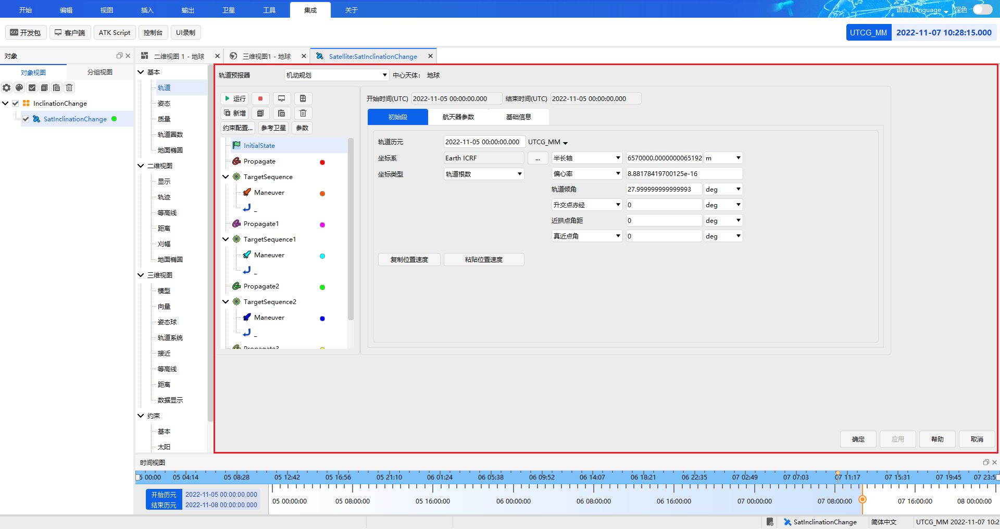

# Complete Example

## Description

The following uses the **orbit inclination change scenario** as an example to demonstrate the complete workflow of controlling ATK with the C++ SDK: the satellite is transferred from its initial low Earth orbit (sma = 6570 km, inc = 28°) to a geostationary orbit through three orbital maneuvers, while the orbital inclination is reduced from 28° to 0°.

::: tip Example Walkthrough
This example focuses on demonstrating the usage workflow of the C++ SDK. For more on the case principles, parameter meanings and step-by-step screenshots, refer to the [Secondary Development Case Tutorial](../../../../../02-案例教程/8-二次开发案例/).
:::

## Complete Code

The complete code is organized around the main flow of **connect → create a scenario → set the initial orbit → build the three maneuver/target sequences → final propagation → run and save**. Each step is separated by comments so you can understand and reuse the code section by section.

::: details **Complete code** (click to expand and copy in one go)

```cpp
// ============================================================
// 0. Include the C++ communication library header
// ============================================================
#include "ATKConnectorlib.h"

// ============================================================
// 1. Establish the connection
// ============================================================
int main()
{
    int conID = atkOpen("127.0.0.1", 6655);

// ============================================================
// 2. Create a new scenario and a satellite
// ============================================================
    atkConnect(conID, "New", "/ Scenario InclinationChange");
    atkConnect(conID, "New", "/ Satellite SatInclinationChange");

// ============================================================
// 3. Basic scenario settings
// ============================================================
    // Set the analysis time period (from 00:00 on 2022-11-05 to 00:00 on 2022-11-08)
    atkConnect(conID, "SetAnalysisTimePeriod", "* \"5 Nov 2022 00:00:00.000\" \"8 Nov 2022 00:00:00.000\"");

    // Reset the simulation
    atkConnect(conID, "Animate", "* Reset");

    // Set the satellite trajectory line width
    atkConnect(conID, "Graphics", "*/Satellite/SatInclinationChange Basic LineWidth 3");

    // Set the satellite orbit propagator type to maneuver planning (an initial segment and a propagate segment exist by default in the first-level list)
    atkConnect(conID, "Astrogator", "*/Satellite/SatInclinationChange SetProp");

// ============================================================
// 4. Build the maneuver-planning sequence (4 propagate segments + 3 target sequences)
// ============================================================

    // --- Group 1: Propagate + Target_Sequence(Maneuver) ---
    atkConnect(conID, "Astrogator", "*/Satellite/SatInclinationChange InsertSegment MainSequence.SegmentList.- Propagate");
    atkConnect(conID, "Astrogator", "*/Satellite/SatInclinationChange InsertSegment MainSequence.SegmentList.- Target_Sequence");
    atkConnect(conID, "Astrogator", "*/Satellite/SatInclinationChange InsertSegment MainSequence.SegmentList.Target_Sequence.SegmentList.- Maneuver");

    // --- Group 2: Propagate1 + Target_Sequence1(Maneuver) ---
    atkConnect(conID, "Astrogator", "*/Satellite/SatInclinationChange InsertSegment MainSequence.SegmentList.- Propagate");
    atkConnect(conID, "Astrogator", "*/Satellite/SatInclinationChange InsertSegment MainSequence.SegmentList.- Target_Sequence");
    atkConnect(conID, "Astrogator", "*/Satellite/SatInclinationChange InsertSegment MainSequence.SegmentList.Target_Sequence1.SegmentList.- Maneuver");

    // --- Group 3: Propagate2 + Target_Sequence2(Maneuver) ---
    atkConnect(conID, "Astrogator", "*/Satellite/SatInclinationChange InsertSegment MainSequence.SegmentList.- Propagate");
    atkConnect(conID, "Astrogator", "*/Satellite/SatInclinationChange InsertSegment MainSequence.SegmentList.- Target_Sequence");
    atkConnect(conID, "Astrogator", "*/Satellite/SatInclinationChange InsertSegment MainSequence.SegmentList.Target_Sequence2.SegmentList.- Maneuver");

    // --- Group 4: Propagate3 (final propagate segment) ---
    atkConnect(conID, "Astrogator", "*/Satellite/SatInclinationChange InsertSegment MainSequence.SegmentList.- Propagate");

// ============================================================
// 5. Set the initial segment parameters (orbit epoch, coordinate type, orbital elements)
// ============================================================
    atkConnect(conID, "Astrogator", "*/Satellite/SatInclinationChange SetValue MainSequence.SegmentList.Initial_State.InitialState.Epoch 5 Nov 2022 00:00:00.000 UtCG");
    atkConnect(conID, "Astrogator", "*/Satellite/SatInclinationChange SetValue MainSequence.SegmentList.Initial_State.CoordinateType \"Modified Keplerian\"");
    atkConnect(conID, "Astrogator", "*/Satellite/SatInclinationChange SetValue MainSequence.SegmentList.Initial_State.InitialState.Keplerian.sma 6570000 m");
    atkConnect(conID, "Astrogator", "*/Satellite/SatInclinationChange SetValue MainSequence.SegmentList.Initial_State.InitialState.Keplerian.ecc 0");
    atkConnect(conID, "Astrogator", "*/Satellite/SatInclinationChange SetValue MainSequence.SegmentList.Initial_State.InitialState.Keplerian.inc 28 deg");
    atkConnect(conID, "Astrogator", "*/Satellite/SatInclinationChange SetValue MainSequence.SegmentList.Initial_State.InitialState.Keplerian.RAAN 0");
    atkConnect(conID, "Astrogator", "*/Satellite/SatInclinationChange SetValue MainSequence.SegmentList.Initial_State.InitialState.Keplerian.w 0");
    atkConnect(conID, "Astrogator", "*/Satellite/SatInclinationChange SetValue MainSequence.SegmentList.Initial_State.InitialState.Keplerian.ta 0");

// ============================================================
// 6. Group 1: propagate segment + target sequence (raise the apoapsis to GEO altitude)
// ============================================================
    // 6.1 Propagate segment Propagate — stopping condition: flight time of 7200 seconds
    atkConnect(conID, "Astrogator", "*/Satellite/SatInclinationChange SetValue MainSequence.SegmentList.Propagate.SegmentColor 4278190335");
    atkConnect(conID, "Astrogator", "*/Satellite/SatInclinationChange SetValue MainSequence.SegmentList.Propagate.StoppingConditions Duration");
    atkConnect(conID, "Astrogator", "*/Satellite/SatInclinationChange SetValue MainSequence.SegmentList.Propagate.StoppingConditions.Duration.TripValue 7200 sec");
    atkConnect(conID, "Astrogator", "*/Satellite/SatInclinationChange SetValue MainSequence.SegmentList.Propagate.StoppingConditions.Duration.Tolerance 0.0001 sec");

    // 6.2 Target sequence Target_Sequence — control variable X, constraint: apoapsis radius = 42160000 m
    atkConnect(conID, "Astrogator", "*/Satellite/SatInclinationChange SetValue MainSequence.SegmentList.Target_Sequence.SegmentList.Maneuver.SegmentColor 4278212095");
    atkConnect(conID, "Astrogator", "*/Satellite/SatInclinationChange SetValue MainSequence.SegmentList.Target_Sequence.SegmentList.Maneuver.ImpulsiveMnvr.ThrustAxes \"Satellite VNC(Earth)\"");
    atkConnect(conID, "Astrogator", "*/Satellite/SatInclinationChange AddMCSSegmentControl MainSequence.SegmentList.Target_Sequence.SegmentList.Maneuver ImpulsiveMnvr.Cartesian.X");
    atkConnect(conID, "Astrogator", "*/Satellite/SatInclinationChange SetValue MainSequence.SegmentList.Target_Sequence.Profiles Differential_Corrector");

    // Control variable X parameters
    atkConnect(conID, "Astrogator", "*/Satellite/SatInclinationChange SetMCSControlValue MainSequence.SegmentList.Target_Sequence.Profiles.Differential_Corrector Maneuver ImpulsiveMnvr.Cartesian.X Active true");
    atkConnect(conID, "Astrogator", "*/Satellite/SatInclinationChange SetMCSControlValue MainSequence.SegmentList.Target_Sequence.Profiles.Differential_Corrector Maneuver ImpulsiveMnvr.Cartesian.X MaxStep 100");
    atkConnect(conID, "Astrogator", "*/Satellite/SatInclinationChange SetMCSControlValue MainSequence.SegmentList.Target_Sequence.Profiles.Differential_Corrector Maneuver ImpulsiveMnvr.Cartesian.X Correction 2456.42862556706");
    atkConnect(conID, "Astrogator", "*/Satellite/SatInclinationChange SetMCSControlValue MainSequence.SegmentList.Target_Sequence.Profiles.Differential_Corrector Maneuver ImpulsiveMnvr.Cartesian.X Pert 0.1");
    atkConnect(conID, "Astrogator", "*/Satellite/SatInclinationChange SetMCSControlValue MainSequence.SegmentList.Target_Sequence.Profiles.Differential_Corrector Maneuver ImpulsiveMnvr.Cartesian.X Scale 1");

    // Constraint: apoapsis radius = 42160000 m
    atkConnect(conID, "Astrogator", "*/Satellite/SatInclinationChange SetValue MainSequence.SegmentList.Target_Sequence.SegmentList.Maneuver.Results \"Radius Of Apoapsis\"");
    atkConnect(conID, "Astrogator", "*/Satellite/SatInclinationChange SetMCSConstraintValue MainSequence.SegmentList.Target_Sequence.Profiles.Differential_Corrector Maneuver \"Radius Of Apoapsis\" Active true");
    atkConnect(conID, "Astrogator", "*/Satellite/SatInclinationChange SetMCSConstraintValue MainSequence.SegmentList.Target_Sequence.Profiles.Differential_Corrector Maneuver \"Radius Of Apoapsis\" Tolerance 0.1 m");
    atkConnect(conID, "Astrogator", "*/Satellite/SatInclinationChange SetMCSConstraintValue MainSequence.SegmentList.Target_Sequence.Profiles.Differential_Corrector Maneuver \"Radius Of Apoapsis\" Scale 1 m");
    atkConnect(conID, "Astrogator", "*/Satellite/SatInclinationChange SetMCSConstraintValue MainSequence.SegmentList.Target_Sequence.Profiles.Differential_Corrector Maneuver \"Radius Of Apoapsis\" Weight 1");
    atkConnect(conID, "Astrogator", "*/Satellite/SatInclinationChange SetMCSConstraintValue MainSequence.SegmentList.Target_Sequence.Profiles.Differential_Corrector Maneuver \"Radius Of Apoapsis\" Desired 42160000 m");

// ============================================================
// 7. Group 2: propagate segment + target sequence (circularize the orbit at apoapsis, eccentricity → 0)
// ============================================================
    // 7.1 Propagate segment Propagate1 — stopping condition: apoapsis
    atkConnect(conID, "Astrogator", "*/Satellite/SatInclinationChange SetValue MainSequence.SegmentList.Propagate1.SegmentColor 4294902015");
    atkConnect(conID, "Astrogator", "*/Satellite/SatInclinationChange SetValue MainSequence.SegmentList.Propagate1.StoppingConditions Apoapsis");
    atkConnect(conID, "Astrogator", "*/Satellite/SatInclinationChange SetValue MainSequence.SegmentList.Propagate1.StoppingConditions.Apoapsis.RepeatCount 1");
    atkConnect(conID, "Astrogator", "*/Satellite/SatInclinationChange SetValue MainSequence.SegmentList.Propagate1.StoppingConditions.Apoapsis.Tolerance 0.0001");

    // 7.2 Target sequence Target_Sequence1 — control variable X, constraint: eccentricity = 0
    atkConnect(conID, "Astrogator", "*/Satellite/SatInclinationChange SetValue MainSequence.SegmentList.Target_Sequence1.SegmentList.Maneuver.SegmentColor -256");
    atkConnect(conID, "Astrogator", "*/Satellite/SatInclinationChange SetValue MainSequence.SegmentList.Target_Sequence1.SegmentList.Maneuver.ImpulsiveMnvr.ThrustAxes \"Satellite VNC(Earth)\"");
    atkConnect(conID, "Astrogator", "*/Satellite/SatInclinationChange AddMCSSegmentControl MainSequence.SegmentList.Target_Sequence1.SegmentList.Maneuver ImpulsiveMnvr.Cartesian.X");
    atkConnect(conID, "Astrogator", "*/Satellite/SatInclinationChange SetValue MainSequence.SegmentList.Target_Sequence1.Profiles Differential_Corrector");

    // Control variable X parameters
    atkConnect(conID, "Astrogator", "*/Satellite/SatInclinationChange SetMCSControlValue MainSequence.SegmentList.Target_Sequence1.Profiles.Differential_Corrector Maneuver ImpulsiveMnvr.Cartesian.X Active true");
    atkConnect(conID, "Astrogator", "*/Satellite/SatInclinationChange SetMCSControlValue MainSequence.SegmentList.Target_Sequence1.Profiles.Differential_Corrector Maneuver ImpulsiveMnvr.Cartesian.X MaxStep 100");
    atkConnect(conID, "Astrogator", "*/Satellite/SatInclinationChange SetMCSControlValue MainSequence.SegmentList.Target_Sequence1.Profiles.Differential_Corrector Maneuver ImpulsiveMnvr.Cartesian.X Correction 1480.06329844802");
    atkConnect(conID, "Astrogator", "*/Satellite/SatInclinationChange SetMCSControlValue MainSequence.SegmentList.Target_Sequence1.Profiles.Differential_Corrector Maneuver ImpulsiveMnvr.Cartesian.X Pert 0.1");
    atkConnect(conID, "Astrogator", "*/Satellite/SatInclinationChange SetMCSControlValue MainSequence.SegmentList.Target_Sequence1.Profiles.Differential_Corrector Maneuver ImpulsiveMnvr.Cartesian.X Scale 1");

    // Constraint: eccentricity = 0
    atkConnect(conID, "Astrogator", "*/Satellite/SatInclinationChange SetValue MainSequence.SegmentList.Target_Sequence1.SegmentList.Maneuver.Results \"Eccentricity\"");
    atkConnect(conID, "Astrogator", "*/Satellite/SatInclinationChange SetMCSConstraintValue MainSequence.SegmentList.Target_Sequence1.Profiles.Differential_Corrector Maneuver \"Eccentricity\" Active true");
    atkConnect(conID, "Astrogator", "*/Satellite/SatInclinationChange SetMCSConstraintValue MainSequence.SegmentList.Target_Sequence1.Profiles.Differential_Corrector Maneuver \"Eccentricity\" Tolerance 0.001");
    atkConnect(conID, "Astrogator", "*/Satellite/SatInclinationChange SetMCSConstraintValue MainSequence.SegmentList.Target_Sequence1.Profiles.Differential_Corrector Maneuver \"Eccentricity\" Scale 1");
    atkConnect(conID, "Astrogator", "*/Satellite/SatInclinationChange SetMCSConstraintValue MainSequence.SegmentList.Target_Sequence1.Profiles.Differential_Corrector Maneuver \"Eccentricity\" Weight 1");
    atkConnect(conID, "Astrogator", "*/Satellite/SatInclinationChange SetMCSConstraintValue MainSequence.SegmentList.Target_Sequence1.Profiles.Differential_Corrector Maneuver \"Eccentricity\" Desired 0");

// ============================================================
// 8. Group 3: propagate segment + target sequence (change the inclination at the ascending node, inclination → 0°)
// ============================================================
    // 8.1 Propagate segment Propagate2 — stopping condition: ascending node, repeat 2 times
    atkConnect(conID, "Astrogator", "*/Satellite/SatInclinationChange SetValue MainSequence.SegmentList.Propagate2.SegmentColor 4278255360");
    atkConnect(conID, "Astrogator", "*/Satellite/SatInclinationChange SetValue MainSequence.SegmentList.Propagate2.StoppingConditions AscendingNode");
    atkConnect(conID, "Astrogator", "*/Satellite/SatInclinationChange SetValue MainSequence.SegmentList.Propagate2.StoppingConditions.AscendingNode.RepeatCount 2");
    atkConnect(conID, "Astrogator", "*/Satellite/SatInclinationChange SetValue MainSequence.SegmentList.Propagate2.StoppingConditions.AscendingNode.Tolerance 0.000001");

    // 8.2 Target sequence Target_Sequence2 — control variables X and Y, constraints: inclination = 0° and eccentricity = 0
    atkConnect(conID, "Astrogator", "*/Satellite/SatInclinationChange SetValue MainSequence.SegmentList.Target_Sequence2.SegmentList.Maneuver.SegmentColor -65536");
    atkConnect(conID, "Astrogator", "*/Satellite/SatInclinationChange SetValue MainSequence.SegmentList.Target_Sequence2.SegmentList.Maneuver.ImpulsiveMnvr.ThrustAxes \"Satellite VNC(Earth)\"");
    atkConnect(conID, "Astrogator", "*/Satellite/SatInclinationChange AddMCSSegmentControl MainSequence.SegmentList.Target_Sequence2.SegmentList.Maneuver ImpulsiveMnvr.Cartesian.X");
    atkConnect(conID, "Astrogator", "*/Satellite/SatInclinationChange SetValue MainSequence.SegmentList.Target_Sequence2.Profiles Differential_Corrector");

    // Control variable X parameters
    atkConnect(conID, "Astrogator", "*/Satellite/SatInclinationChange SetMCSControlValue MainSequence.SegmentList.Target_Sequence2.Profiles.Differential_Corrector Maneuver ImpulsiveMnvr.Cartesian.X Active true");
    atkConnect(conID, "Astrogator", "*/Satellite/SatInclinationChange SetMCSControlValue MainSequence.SegmentList.Target_Sequence2.Profiles.Differential_Corrector Maneuver ImpulsiveMnvr.Cartesian.X MaxStep 100");
    atkConnect(conID, "Astrogator", "*/Satellite/SatInclinationChange SetMCSControlValue MainSequence.SegmentList.Target_Sequence2.Profiles.Differential_Corrector Maneuver ImpulsiveMnvr.Cartesian.X Correction -359.983751789857");
    atkConnect(conID, "Astrogator", "*/Satellite/SatInclinationChange SetMCSControlValue MainSequence.SegmentList.Target_Sequence2.Profiles.Differential_Corrector Maneuver ImpulsiveMnvr.Cartesian.X Pert 0.1");
    atkConnect(conID, "Astrogator", "*/Satellite/SatInclinationChange SetMCSControlValue MainSequence.SegmentList.Target_Sequence2.Profiles.Differential_Corrector Maneuver ImpulsiveMnvr.Cartesian.X Scale 1");

    // Control variable Y parameters
    atkConnect(conID, "Astrogator", "*/Satellite/SatInclinationChange AddMCSSegmentControl MainSequence.SegmentList.Target_Sequence2.SegmentList.Maneuver ImpulsiveMnvr.Cartesian.Y");
    atkConnect(conID, "Astrogator", "*/Satellite/SatInclinationChange SetMCSControlValue MainSequence.SegmentList.Target_Sequence2.Profiles.Differential_Corrector Maneuver ImpulsiveMnvr.Cartesian.Y Active true");
    atkConnect(conID, "Astrogator", "*/Satellite/SatInclinationChange SetMCSControlValue MainSequence.SegmentList.Target_Sequence2.Profiles.Differential_Corrector Maneuver ImpulsiveMnvr.Cartesian.Y MaxStep 100");
    atkConnect(conID, "Astrogator", "*/Satellite/SatInclinationChange SetMCSControlValue MainSequence.SegmentList.Target_Sequence2.Profiles.Differential_Corrector Maneuver ImpulsiveMnvr.Cartesian.Y Correction -1444.72488992759");
    atkConnect(conID, "Astrogator", "*/Satellite/SatInclinationChange SetMCSControlValue MainSequence.SegmentList.Target_Sequence2.Profiles.Differential_Corrector Maneuver ImpulsiveMnvr.Cartesian.Y Pert 0.1");
    atkConnect(conID, "Astrogator", "*/Satellite/SatInclinationChange SetMCSControlValue MainSequence.SegmentList.Target_Sequence2.Profiles.Differential_Corrector Maneuver ImpulsiveMnvr.Cartesian.Y Scale 1");

    // Constraints: orbital inclination = 0° and eccentricity = 0
    atkConnect(conID, "Astrogator", "*/Satellite/SatInclinationChange SetValue MainSequence.SegmentList.Target_Sequence2.SegmentList.Maneuver.Results \"Inclination\" \"Eccentricity\"");

    // Constraint: Inclination
    atkConnect(conID, "Astrogator", "*/Satellite/SatInclinationChange SetMCSConstraintValue MainSequence.SegmentList.Target_Sequence2.Profiles.Differential_Corrector Maneuver \"Inclination\" Active true");
    atkConnect(conID, "Astrogator", "*/Satellite/SatInclinationChange SetMCSConstraintValue MainSequence.SegmentList.Target_Sequence2.Profiles.Differential_Corrector Maneuver \"Inclination\" Tolerance 0 deg");
    atkConnect(conID, "Astrogator", "*/Satellite/SatInclinationChange SetMCSConstraintValue MainSequence.SegmentList.Target_Sequence2.Profiles.Differential_Corrector Maneuver \"Inclination\" Scale 1 rad");
    atkConnect(conID, "Astrogator", "*/Satellite/SatInclinationChange SetMCSConstraintValue MainSequence.SegmentList.Target_Sequence2.Profiles.Differential_Corrector Maneuver \"Inclination\" Weight 1");
    atkConnect(conID, "Astrogator", "*/Satellite/SatInclinationChange SetMCSConstraintValue MainSequence.SegmentList.Target_Sequence2.Profiles.Differential_Corrector Maneuver \"Inclination\" Desired 0 deg");

    // Constraint: Eccentricity
    atkConnect(conID, "Astrogator", "*/Satellite/SatInclinationChange SetMCSConstraintValue MainSequence.SegmentList.Target_Sequence2.Profiles.Differential_Corrector Maneuver \"Eccentricity\" Active true");
    atkConnect(conID, "Astrogator", "*/Satellite/SatInclinationChange SetMCSConstraintValue MainSequence.SegmentList.Target_Sequence2.Profiles.Differential_Corrector Maneuver \"Eccentricity\" Tolerance 0.001");
    atkConnect(conID, "Astrogator", "*/Satellite/SatInclinationChange SetMCSConstraintValue MainSequence.SegmentList.Target_Sequence2.Profiles.Differential_Corrector Maneuver \"Eccentricity\" Scale 1");
    atkConnect(conID, "Astrogator", "*/Satellite/SatInclinationChange SetMCSConstraintValue MainSequence.SegmentList.Target_Sequence2.Profiles.Differential_Corrector Maneuver \"Eccentricity\" Weight 1");
    atkConnect(conID, "Astrogator", "*/Satellite/SatInclinationChange SetMCSConstraintValue MainSequence.SegmentList.Target_Sequence2.Profiles.Differential_Corrector Maneuver \"Eccentricity\" Desired 0");

// ============================================================
// 9. Final propagate segment — stopping condition: flight time of 129600 seconds
// ============================================================
    atkConnect(conID, "Astrogator", "*/Satellite/SatInclinationChange SetValue MainSequence.SegmentList.Propagate3.SegmentColor 4278255615");
    atkConnect(conID, "Astrogator", "*/Satellite/SatInclinationChange SetValue MainSequence.SegmentList.Propagate3.StoppingConditions Duration");
    atkConnect(conID, "Astrogator", "*/Satellite/SatInclinationChange SetValue MainSequence.SegmentList.Propagate3.StoppingConditions.Duration.TripValue 129600 sec");
    atkConnect(conID, "Astrogator", "*/Satellite/SatInclinationChange SetValue MainSequence.SegmentList.Propagate3.StoppingConditions.Duration.Tolerance 0.00001 sec");

// ============================================================
// 10. Run, save, and close the connection
// ============================================================
    atkConnect(conID, "Save", "/ *");
    atkConnect(conID, "Astrogator", "*/Satellite/SatInclinationChange RunMCS");
    atkClose(conID);

    return 0;
}
```

:::

## How to Run

::: warning Prerequisites
- Before you start, make sure you have completed [Environment Configuration](./1-简介与配置.md#configuration-steps): open the solution that matches your VS version and retarget the project
- Open the ATK software before running
- This example creates a new scenario with the `New` command, and ATK Connect mode supports loading only one scenario, so **do not open any existing scenario**; close it first if one is already open
:::

### Method 1: Visual Studio (recommended)

1. Open the `ATKConnectorExample.sln` solution in the directory of the corresponding VS version
2. In Solution Explorer, find the `ex-InclinationChange` project (`src/ex-InclinationChange.cpp`)
3. Replace the original file content with the complete code above
4. Select the **Release x64** configuration and press <kbd>F5</kbd> to build and run

### Method 2: xmake Command Line

```bash
xmake f -m release
xmake build
xmake run ex-InclinationChange
```

During the run, the ATK interface will progressively execute operations such as creating the scenario, creating the satellite, setting the orbit parameters and running the maneuver planning.

## Run Results

After a successful run, the ATK 3D window shows the satellite's maneuver-planning trajectory. Starting from its initial low Earth orbit, the satellite reaches a geostationary orbit after three orbital maneuvers, and the orbital inclination drops from 28° to 0°:


You can right-click the satellite object in ATK and select **Properties** to check whether the parameters set by the code take effect correctly:


