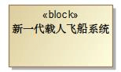
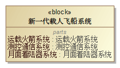
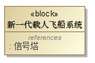
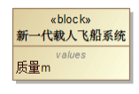
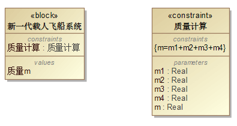
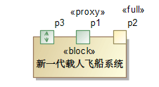
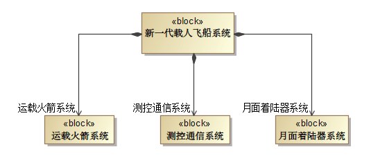
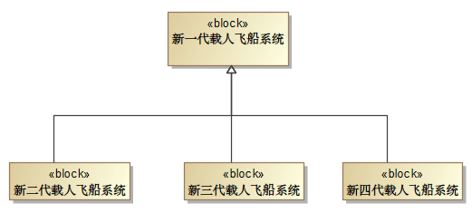

# 模块定义图

模块定义图的图类型缩写为 BDD，是 SysML 中最常见的一种图，用于定义模块的特征和模块之间的关系。

## 主要元素

模块是 SysML 结构中的基本单元，可以使用模块为系统中或者系统外部环境中任意一种感兴趣的实体类型创建模型。模块代表的是类型或者类别，而不是一个具体的实例。如下图所示：

模块的总体分为两大类：结构属性和行为属性。结构属性包括组成部分属性、引用属性、值属性、约束属性、流属性、端口；行为属性包括操作、信号接收。它们表示系统的状态和系统可能表现出的行为，在模块定义图中模块的属性分类放置在分隔间内。

## 模块的属性

- 结构属性：组成部分属性/部件属性代表模块内部的结构，换句话讲就是模块是由部件构成的，表示的是一种所属关系，它表示模块的内部结构。如下图所示：

    

- 引用属性：代表模块外部的一种结构，它可能位于另一个模块的内部，不是所属关系，而是“需要”的关系，为当前模块提供功能、数据或是信息。如下图所示：

    

- 值属性：可以代表一个数字（某种类型）、一个布尔值或者一个字符串。较为常见的是被赋予一个数字。如下图所示：

    

- 约束属性：一般代表一种数学关系，等式或是不等式，约束属性的类型是一个约束模块，约束模块中包含了可以重复使用的约束关系。如下图所示：

    

- 端口：一个特殊的部件，代表交换信息，它是专门用来和外界交换信息的。端口有三种：完整端口、代理端口和流端口。如下图所示：

    完整端口可以把它当作一个独立的部件来看待，完整端口是自己直接处理输入的信息、输出处理后的信息。

    代理端口自己并没有处理信息的功能，而是通过绑定连接器绑定到一个内部的模块。

    流端口是具有方向的，流属性的方向有“进”“出”或“进出”。

    

- 行为属性：

    操作：代表客户端调用模块的时候它所执行的行为，是由调用事件触发的，操作代表的是一种同步行动，但是它的实现需要通过对应方法的行为图来描述。

    接收：表示模块接收信号并进行处理的一个方法。接收一定对应在模型中某个地方定义的信号它的参数和信号的属性对应。接收是异步行为，发送信号的客户端不会等待回复。

## 模块定义图间的关系

模块之间存在三种主要类型关系：关联、泛化和依赖。关联是表达模块、引用属性、部件属性这些系统结构之间关系的一种记号，关联默认为引用关联。关联关系中需要区分组合关联和聚合关联。

- 组合关联：表示结构上的分解，组合端的模块实例由一些组成部分端模块实例结合而成，可以理解为“包含”的关系，一个组成部分只能属于一个组合体。组合关联标识中有箭头是单向访问，无箭头则是双向访问。如下图所示：

    

- 泛化关系：表示两种元素之间的继承关系，一个一般化的元素（超类型），以及一个更为具体的元素（子类型），这种从子类型向超类型读作“……是一种……”。泛化关系是可传递的，通过泛化关系传递到最终层级。除此之外，泛化表示子类型会继承超类型的所有特性，还可能会拥有超类型所不具备的其他特性。如下图所示：

    

- 依赖关系：意味着模型中的一种元素、客户端，依赖于模型中的另一种元素、提供者。当提供者元素发生改变时，客户端元素可能也需要改变。建立依赖关系确定二者之间的可追踪性。

