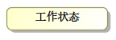
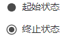
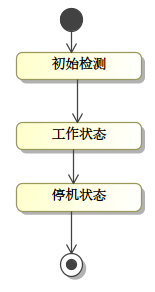
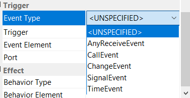
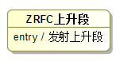
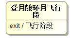
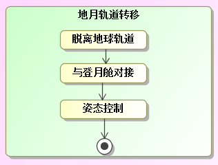

# 状态机图

状态机图是能够用于说明系统动态行为信息的三种 SysML 图中的一种。可以在状态机图上显示各种各样的状态，并且可以指定四种类型的事件，从而在运行的系统中触发哪些状态之间的转换。SysML 还可以使用正交区域对基于状态的并发行为建模。主要包含元素如下：

- 状态：是指对象的生命周期中的某个条件或者状况，在此期间对象将满足某些条件、执行某些活动或者等待某些事件。如下图所示：

    

    初始和最终状态：状态机图的初始状态，称为初始伪状态，用实心圆圈表示，此状态将转换到第一个真实状态。状态机图的最终状态显示为同心圆。如下图所示：

    

- 转换：代表的是从一种状态到另一种状态的改变。如下图所示：

    

- 事件是在系统模型中定义的一种元素，它定义了能够在实际系统中触发行为的事件类型。SysML 定义了如下四种类型的事件，如下图所示：

    - 信号事件：可以理解为发送和接收信号
    - 调用事件：对应于对操作的过程调用
    - 时间事件：在指定时间过去后发生的定时事件，相对时间（after）与绝对时间（at）
    - 改变事件：每当满足指定条件时就会发生更改事件

    

- 动作：是一个可执行的原子计算，是不可中断的，包括操作调用、对象的创建或销毁，或者向对象发送信号。动作可能会导致模型状态的改变或者一个值的返回。

    - 入口动作：是进入那个状态执行的第一个行为。如下图所示：

    

    - 出口动作：是离开那种状态之前执行的最后一个行为。如下图所示：

    

- 复合状态：拥有子状态，如下图所示：

    

- 历史状态：是一个伪状态，其目的是记住从组合状态中退出时所处的子状态，当再次进入组合状态，可直接进入这个子状态，而不是从初态开始。

状态机图通常用于描述对象的状态相关的行为。一个对象根据它所处的状态对事件做出相应的响应。状态机图非常适合作为详细设计的产出物（即开发的输入），因此，它通常用于系统设计和仿真/代码生成。
