# 活动图

活动图是 UML 活动图的扩展。它是一个强大的工具，用于表示描述块或其他结构元素行为的动作序列；该序列是使用控制流定义的。动作可以包含输入和输出引脚，这些输入和输出引脚充当从一个动作流到另一个动作的项的缓冲区，因为该动作执行的任务会消耗或产生它们。活动图是一种行为图；它是系统的一种动态视图，随着时间的推移行为和时间的发生序列。与结构图（BDD、IBD 和参数图）相对，结构图都是静态视图，不会表达任何动态的时间，或者系统及其环境的变化。

活动图图头命名为 act，活动本身是一种模型元素，是一种行为。在活动图中，“令牌流”是贯穿活动图的概念，“令牌流”分为对象令牌和控制令牌，要知道令牌并不是一种模型元素，不需要在系统模型中创建。对象令牌代表的是在活动中流动的事件、能量或者数据的实例。它可以从总体上代表一个活动的输入或者输出，并目可以代表活动中一个动作的输入或输出。正式的说法是，一个对象令牌代表模型层级关系中某处创建的模块、值类型或者信号的实例(以定义事件、能量或者数据的类型)。正如你可能期望的，会有多个对象令牌流动通过活动的单次执行。控制令牌只表示活动的哪个动作在活动执行的特定时刻处于启用状态。可能会有多个控制令牌流过活动的单次执行。那样意味着活动中的多个动作同时处于启用状态。

接下来详细介绍活动基本动作、对象节点、边、再次阐述动作和控制节点等几个方面。

## 基本动作

动作是一种可以存在于活动之中的节点，它是为活动基本的功能单元建模的节点。一个动作代表某种类型的处理或者转换，它会在系统操作过程中活动被执行的时候发生。如下图所示：

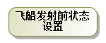

## 对象节点

对象节点是另一种能够存在于活动之中的节点，它会对对象令牌通过活动的流建模(其中对象令牌代表的是事件、能量或者数据的实例)。对象节点最常出现在两个动作之间，以表示第一个动作会产出对象令牌作为输出，第二个动作会将这些对象令牌作为输入。

1. 栓是特殊的对象节点，是附加在动作上的，表示动作输入和输出。如下图所示：    

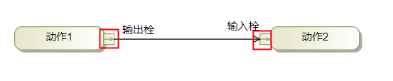

2. 活动参数是另一种特殊类型的对象节点。你会把它附加到活动图的外框上，从总体上表示活动的一种输入或者输出。活动参数的标识法是横跨在活动图外框上的矩形，如下图所示：

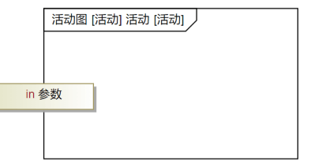

3. 流与非流行为：非流行为意味着在动作完成后才可以进行下一步输入输出，而流行为则是在执行动作过程中同时允许其他输入和输出。

## 边

对象流和控制流是两种类型的边，对象流是用来传输对象令牌的，标识方法是带箭头的实线；控制流是传递控制令牌的边，控制令牌启动下一个动作，标识为带箭头的虚线。如下图所示：

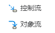

## 再次阐述动作

再次阐述动作是特别类型的动作，含有调用行为动作、发送信号动作、接收事件动作以及等待时间动作四种动作。

1. 调用行为动作是一种特定的动作，它会在启用的时候触发另一种行为。调用行为动作可以把一个高层次的行为分解成系列低层次的行为。如下图所示：

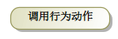

2. 发送信号动作是异步，不会等待回应就启动发送。如下图所示：

3. 接收事件动作不仅接收发送信号的动作，而是接收异步的时间事件。如下图所示：

4. 等待时间动作可以指绝对时间（at）或者相对时间（after）。如下图所示：

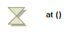

## 控制节点

控制节点有 7 种类型：初始节点、流最终节点、活动最终节点、决定节点、合并节点、分支节点和集合节点。

初始节点标记活动的起点。正式的说法是，它标记了活动中的一个位置，控制令牌的流会从那里开始。初始节点的标识法是一个小的实心圆形，它一般只有一个输出控制流。如下图所示：

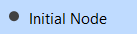

流最终节点和活动最终节点是标记控制令牌流结束的控制节点。然而，二者之间有明显的区别:当控制令牌到达流最终节点的时候，那个令牌会被销毁，以此标记单独一个控制流的结束。而当控制令牌到达活动最终节点的时候，整个活动都会结束，以此标记所有控制流的结束(不管它们当前是否还在执行中)。如下图所示：

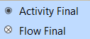

决定节点标记在活动中可替换序列的开始。决定节点必须拥有单一的输入边，一般拥有两个或多个输出边。每个输出边会带有布尔表达式的标签，那叫做监听，显示为方括号中间的字符串。如下图所示：

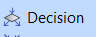

合并节点标记活动中可选序列的结尾。其标识法和决定节点相同:空心菱形。可以通过输入边和输出边的数量来区分它们。合并节点拥有两条或多条输入边，而只拥有一个输出边。当一个令牌一一可能是对象令牌，也可能是控制令牌——通过任意一条输入边到达合并节点，令牌马上就会提供给输出边。如下图所示：

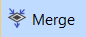

分支节点标记活动中并发序列的起点。分支节点的标识法是一条线段(方向 随意),它必须拥有一条输入边和两条或多条输出边。当一个令牌一一可能是对 象令牌，也可能是控制令牌一一到达分支节点的时候，它会被复制到所有输出 边上。原始令牌的每个副本都代表独立、并发、沿着各自路径前进的控制流。 如下图所示：

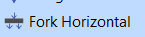

集合节点标记活动中并发序列的结束。集合节点的标识法和分支节点一样： 一条线。你可以通过输入、输出边的数量来区分它们。集合节点一般拥有两条或多条输入边，而只有一条输出边。如下图所示：

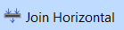

## 活动分区

活动图不仅可以传达动作的顺序，还可以传达执行每一个动作的结构，可以用活动分区来表示。如下图所示：

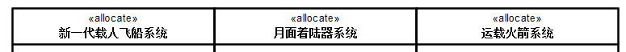

活动图是强大的信息沟通媒介，它的优势在于它的可读性而且可以显示行为拥有复杂的控制逻辑。当你需要显示持续的行为，并且需要关注事件、能量与数据的流在一系列动作之间的流动时，可选择活动图。

