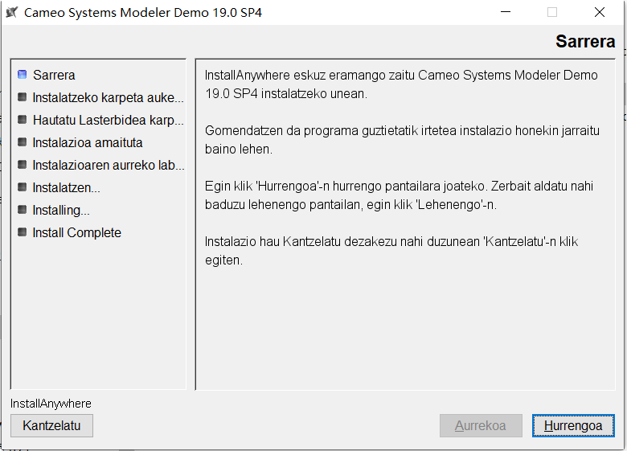
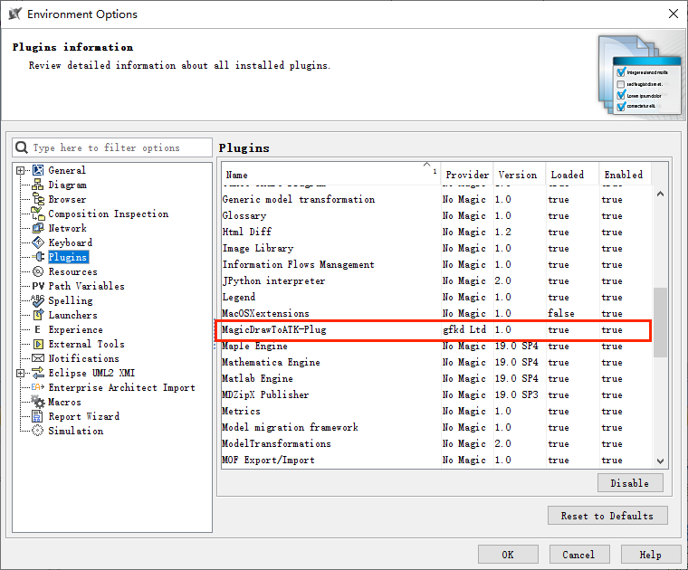

# 相关软件部署过程

## MagicDraw 安装

运行 MagicDraw 安装包，按照安装向导提示完成安装。 

安装界面示例如下：

## MagicDraw 与 ATK 联合仿真插件安装

1. 解压 `IntegratingWithATK\connect\win\MBSE\MagicDrawToATK-Plug` 文件夹。
2. 将解压后的 `MagicDrawToATK-Plug` 文件夹复制到 MagicDraw 安装目录下的 `\plugins` 文件夹中。

操作示例如下：

3. 启动 MagicDraw，在菜单栏中选择 `Options` -> `Environment` -> `Plugins`，确认插件已成功加载。

验证界面示例如下：

## MagicDraw 与 ATK 联合仿真插件升级

1. 进入 MagicDraw 安装目录下的 `\plugins` 文件夹。
2. 删除旧版本的 `MagicDrawToATK-Plug` 文件夹。
3. 将最新版的 `MagicDrawToATK-Plug` 文件夹复制到 `\plugins` 目录下。

操作示例如下：

