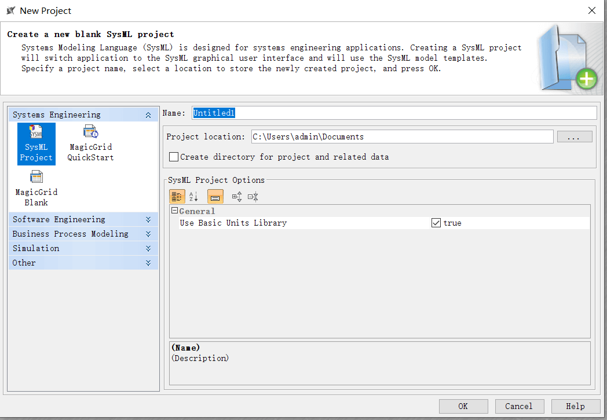
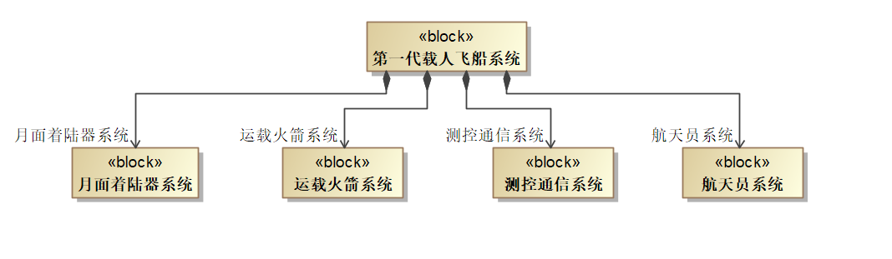
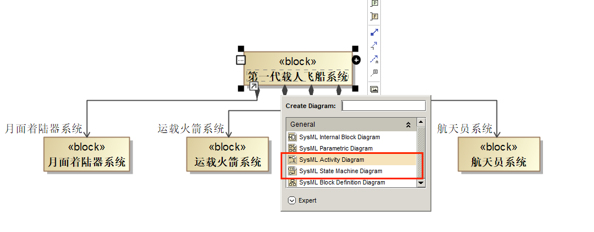
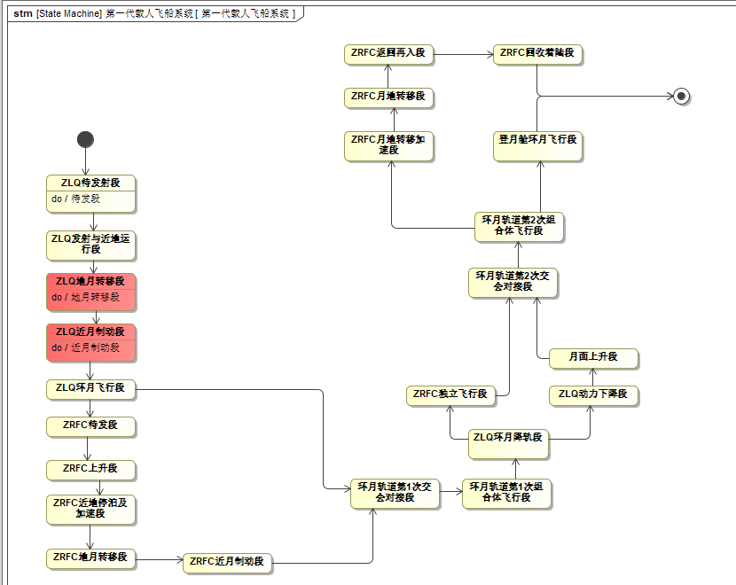
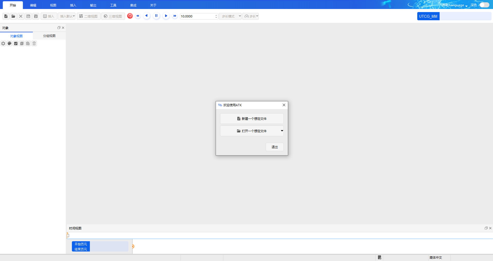

# 载人航天任务建模过程

## 新建项目

打开 MagicDraw 软件，选择 `File` -> `New Project` 新建项目，如下图所示：

## 构建系统架构

创建 BDD（块定义图）图，构建系统架构，如下图所示：

## 新建行为图

右键点击“新一代载人飞船系统”Block，选择 `Create Diagram`，根据需要新建状态机图或活动图，如下图所示：

### 状态机图示例

以状态机图为例，创建如下图所示的状态机模型：

## 启动仿真验证

模型构建完成后，打开 ATK 工具进行仿真验证，如下图所示：

