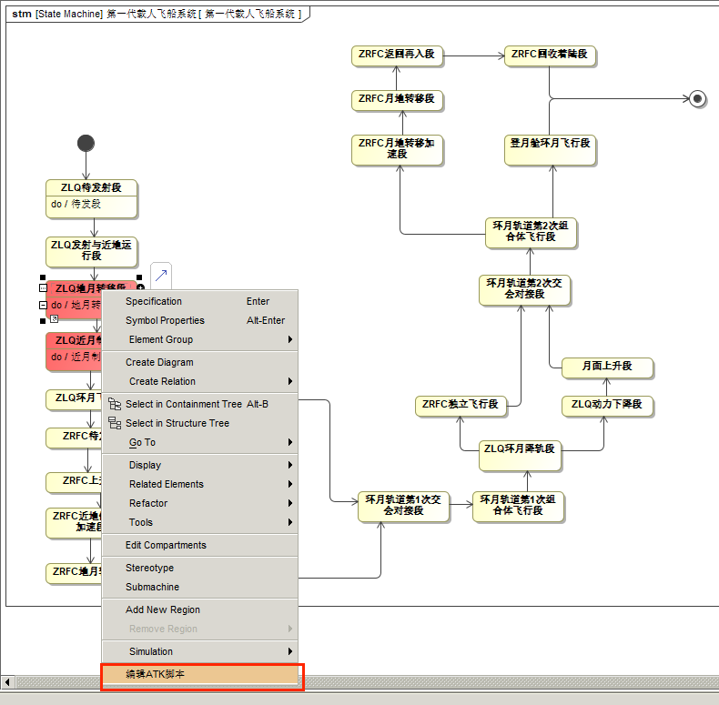
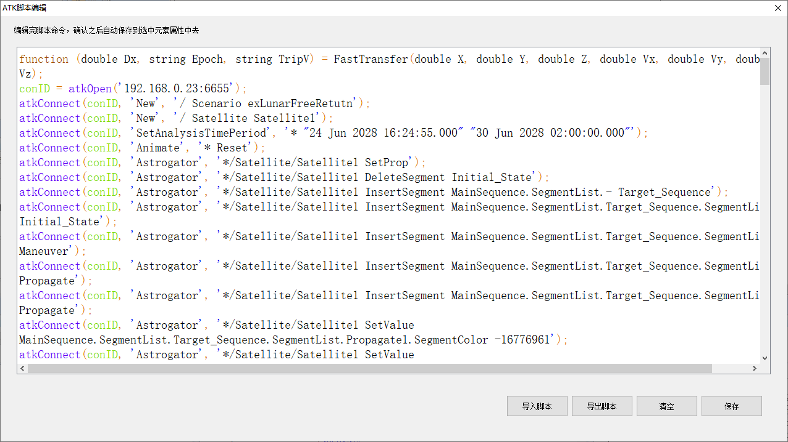
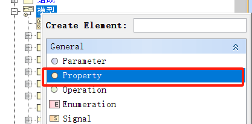
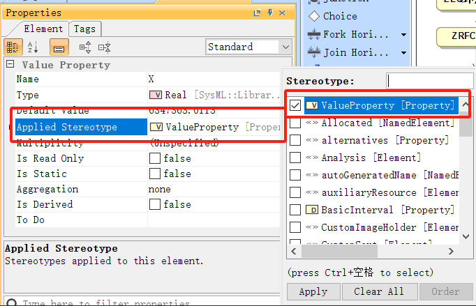
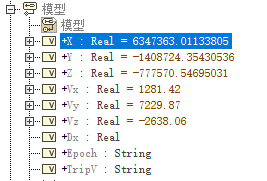

# 脚本编辑过程

## 打开脚本编辑器

完成 MagicDraw 端系统建模并启动 ATK 软件后，右键点击 State模型元素，选择 **编辑 ATK 脚本**，打开脚本编辑器，如下图所示：



## 编写 ATK 脚本

在 **ATK 脚本编辑器** 中填写 ATK 脚本，实现联合仿真，如下图所示：



### 脚本编写注意事项

> **注意**：`atkOpen` 函数中的 IP 端口写法与 MATLAB 不同：
>
> - MATLAB 方式：分开的两个参数
> - ATK 方式：使用冒号拼接的完整字符串参数，如 `'127.0.0.1:6655'`（本机可用）

### 示例脚本

```atks
function (double Dx, string Epoch, string TripV) = FastTransfer(double X, double Y, double Z, double Vx, double Vy, double Vz);
conID = atkOpen('192.168.0.23:6655');
atkConnect(conID, 'New', '/ Scenario exLunarFreeRetutn');
atkConnect(conID, 'New', '/ Satellite Satellite1');
atkConnect(conID, 'SetAnalysisTimePeriod', '* "24 Jun 2028 16:24:55.000" "30 Jun 2028 02:00:00.000"');
atkConnect(conID, 'Animate', '* Reset');
atkConnect(conID, 'Astrogator', '*/Satellite/Satellite1 SetProp');
atkConnect(conID, 'Astrogator', '*/Satellite/Satellite1 DeleteSegment Initial_State');
atkConnect(conID, 'Astrogator', '*/Satellite/Satellite1 InsertSegment MainSequence.SegmentList.- Target_Sequence');
atkConnect(conID, 'Astrogator', '*/Satellite/Satellite1 InsertSegment MainSequence.SegmentList.Target_Sequence.SegmentList.- Initial_State');
atkConnect(conID, 'Astrogator', '*/Satellite/Satellite1 InsertSegment MainSequence.SegmentList.Target_Sequence.SegmentList.- Maneuver');
atkConnect(conID, 'Astrogator', '*/Satellite/Satellite1 InsertSegment MainSequence.SegmentList.Target_Sequence.SegmentList.- Propagate');
atkConnect(conID, 'Astrogator', '*/Satellite/Satellite1 InsertSegment MainSequence.SegmentList.Target_Sequence.SegmentList.- Propagate');
atkConnect(conID, 'Astrogator', '*/Satellite/Satellite1 SetValue MainSequence.SegmentList.Target_Sequence.SegmentList.Propagate1.SegmentColor -16776961');
atkConnect(conID, 'Astrogator', '*/Satellite/Satellite1 SetValue MainSequence.SegmentList.Target_Sequence.SegmentList.Initial_State.InitialState.Epoch 24 Jun 2028 16:25:59.184 UTCG');
atkConnect(conID, 'Astrogator', '*/Satellite/Satellite1 SetValue MainSequence.SegmentList.Target_Sequence.SegmentList.Initial_State.CoordinateSystem "CentralBody/Earth J2000"');
atkConnect(conID, 'Astrogator', '*/Satellite/Satellite1 SetValue MainSequence.SegmentList.Target_Sequence.SegmentList.Initial_State.CoordinateType Cartesian');
atkConnect(conID, 'Astrogator', '*/Satellite/Satellite1 SetValue MainSequence.SegmentList.Target_Sequence.SegmentList.Initial_State.InitialState.Cartesian.X @X m');
atkConnect(conID, 'Astrogator', '*/Satellite/Satellite1 SetValue MainSequence.SegmentList.Target_Sequence.SegmentList.Initial_State.InitialState.Cartesian.Y @Y m');
atkConnect(conID, 'Astrogator', '*/Satellite/Satellite1 SetValue MainSequence.SegmentList.Target_Sequence.SegmentList.Initial_State.InitialState.Cartesian.Z @Z m');
atkConnect(conID, 'Astrogator', '*/Satellite/Satellite1 SetValue MainSequence.SegmentList.Target_Sequence.SegmentList.Initial_State.InitialState.Cartesian.Vx @Vx');
atkConnect(conID, 'Astrogator', '*/Satellite/Satellite1 SetValue MainSequence.SegmentList.Target_Sequence.SegmentList.Initial_State.InitialState.Cartesian.Vy @Vy');
atkConnect(conID, 'Astrogator', '*/Satellite/Satellite1 SetValue MainSequence.SegmentList.Target_Sequence.SegmentList.Initial_State.InitialState.Cartesian.Vz @Vz');
atkConnect(conID, 'Astrogator', '*/Satellite/Satellite1 SetValue MainSequence.SegmentList.Target_Sequence.SegmentList.Initial_State.InitialState.drymass 100');
atkConnect(conID, 'Astrogator', '*/Satellite/Satellite1 SetValue MainSequence.SegmentList.Target_Sequence.SegmentList.Initial_State.InitialState.fuelmass 100');
atkConnect(conID, 'Astrogator', '*/Satellite/Satellite1 SetValue MainSequence.SegmentList.Target_Sequence.SegmentList.Initial_State.InitialState.Cd 1');
atkConnect(conID, 'Astrogator', '*/Satellite/Satellite1 SetValue MainSequence.SegmentList.Target_Sequence.SegmentList.Initial_State.InitialState.dragarea 1');
atkConnect(conID, 'Astrogator', '*/Satellite/Satellite1 SetValue MainSequence.SegmentList.Target_Sequence.SegmentList.Initial_State.InitialState.Cr 1');
atkConnect(conID, 'Astrogator', '*/Satellite/Satellite1 SetValue MainSequence.SegmentList.Target_Sequence.SegmentList.Initial_State.InitialState.srparea 2.2');
atkConnect(conID, 'Astrogator', '*/Satellite/Satellite1 SetValue MainSequence.SegmentList.Target_Sequence.SegmentList.Maneuver.ImpulsiveMnvr.ThrustAxes "Satellite/Satellite1 VNC(Earth)"');
atkConnect(conID, 'Astrogator', '*/Satellite/Satellite1 SetValue MainSequence.SegmentList.Target_Sequence.SegmentList.Maneuver.ImpulsiveMnvr.coordtype Cartesian');
atkConnect(conID, 'Astrogator', '*/Satellite/Satellite1 SetValue MainSequence.SegmentList.Target_Sequence.SegmentList.Maneuver.ImpulsiveMnvr.Cartesian.X 3160');
atkConnect(conID, 'Astrogator', '*/Satellite/Satellite1 SetValue MainSequence.SegmentList.Target_Sequence.SegmentList.Maneuver.ImpulsiveMnvr.DecrementMass false');
atkConnect(conID, 'Astrogator', '*/Satellite/Satellite1 SetValue MainSequence.SegmentList.Target_Sequence.SegmentList.Propagate.ForceModel.Gravity.GravModel JGM3');
atkConnect(conID, 'Astrogator', '*/Satellite/Satellite1 SetValue MainSequence.SegmentList.Target_Sequence.SegmentList.Propagate.ForceModel.Gravity.MaxDegree 20');
atkConnect(conID, 'Astrogator', '*/Satellite/Satellite1 SetValue MainSequence.SegmentList.Target_Sequence.SegmentList.Propagate.ForceModel.Gravity.MaxOrder 20');
atkConnect(conID, 'Astrogator', '*/Satellite/Satellite1 SetValue MainSequence.SegmentList.Target_Sequence.SegmentList.Propagate.ForceModel.Drag.UseDrag false');
atkConnect(conID, 'Astrogator', '*/Satellite/Satellite1 SetValue MainSequence.SegmentList.Target_Sequence.SegmentList.Propagate.ForceModel.Drag.UseFluxGeoFile false');
atkConnect(conID, 'Astrogator', '*/Satellite/Satellite1 SetValue MainSequence.SegmentList.Target_Sequence.SegmentList.Propagate.ForceModel.Drag.F10p7 150');
atkConnect(conID, 'Astrogator', '*/Satellite/Satellite1 SetValue MainSequence.SegmentList.Target_Sequence.SegmentList.Propagate.ForceModel.Drag.DailyF10p7 150');
atkConnect(conID, 'Astrogator', '*/Satellite/Satellite1 SetValue MainSequence.SegmentList.Target_Sequence.SegmentList.Propagate.ForceModel.Drag.Ap 14.9186');
atkConnect(conID, 'Astrogator', '*/Satellite/Satellite1 SetValue MainSequence.SegmentList.Target_Sequence.SegmentList.Propagate.ForceModel.SRP.UseSRP true');
atkConnect(conID, 'Astrogator', '*/Satellite/Satellite1 SetValue MainSequence.SegmentList.Target_Sequence.SegmentList.Propagate.ForceModel.ThirdBodies.Moon.UseGravity true');
atkConnect(conID, 'Astrogator', '*/Satellite/Satellite1 SetValue MainSequence.SegmentList.Target_Sequence.SegmentList.Propagate.ForceModel.ThirdBodies.Sun.UseGravity true');
atkConnect(conID, 'Astrogator', '*/Satellite/Satellite1 SetValue MainSequence.SegmentList.Target_Sequence.SegmentList.Propagate.MaxPropTime 10 day');
atkConnect(conID, 'Astrogator', '*/Satellite/Satellite1 SetValue MainSequence.SegmentList.Target_Sequence.SegmentList.Propagate.StoppingConditions Periapsis');
atkConnect(conID, 'Astrogator', '*/Satellite/Satellite1 SetValue MainSequence.SegmentList.Target_Sequence.SegmentList.Propagate.StoppingConditions.Periapsis.Tolerance 0.0001');
atkConnect(conID, 'Astrogator', '*/Satellite/Satellite1 SetValue MainSequence.SegmentList.Target_Sequence.SegmentList.Propagate.StoppingConditions.Periapsis.RepeatCount 1');
atkConnect(conID, 'Astrogator', '*/Satellite/Satellite1 SetValue MainSequence.SegmentList.Target_Sequence.SegmentList.Propagate.StoppingConditions.Periapsis.CalcObjectAttributes.CentralBody Moon');
atkConnect(conID, 'Astrogator', '*/Satellite/Satellite1 SetValue MainSequence.SegmentList.Target_Sequence.SegmentList.Propagate.CentralBodyCode 2');
atkConnect(conID, 'Astrogator', '*/Satellite/Satellite1 SetValue MainSequence.SegmentList.Target_Sequence.SegmentList.Propagate1.ForceModel.Gravity.GravModel JGM3');
atkConnect(conID, 'Astrogator', '*/Satellite/Satellite1 SetValue MainSequence.SegmentList.Target_Sequence.SegmentList.Propagate1.ForceModel.Gravity.MaxDegree 20');
atkConnect(conID, 'Astrogator', '*/Satellite/Satellite1 SetValue MainSequence.SegmentList.Target_Sequence.SegmentList.Propagate1.ForceModel.Gravity.MaxOrder 20');
atkConnect(conID, 'Astrogator', '*/Satellite/Satellite1 SetValue MainSequence.SegmentList.Target_Sequence.SegmentList.Propagate1.ForceModel.Drag.UseDrag false');
atkConnect(conID, 'Astrogator', '*/Satellite/Satellite1 SetValue MainSequence.SegmentList.Target_Sequence.SegmentList.Propagate1.ForceModel.Drag.UseFluxGeoFile false');
atkConnect(conID, 'Astrogator', '*/Satellite/Satellite1 SetValue MainSequence.SegmentList.Target_Sequence.SegmentList.Propagate1.ForceModel.Drag.F10p7 0');
atkConnect(conID, 'Astrogator', '*/Satellite/Satellite1 SetValue MainSequence.SegmentList.Target_Sequence.SegmentList.Propagate1.ForceModel.Drag.DailyF10p7 0');
atkConnect(conID, 'Astrogator', '*/Satellite/Satellite1 SetValue MainSequence.SegmentList.Target_Sequence.SegmentList.Propagate1.ForceModel.Drag.Ap 0');
atkConnect(conID, 'Astrogator', '*/Satellite/Satellite1 SetValue MainSequence.SegmentList.Target_Sequence.SegmentList.Propagate1.ForceModel.SRP.UseSRP false');
atkConnect(conID, 'Astrogator', '*/Satellite/Satellite1 SetValue MainSequence.SegmentList.Target_Sequence.SegmentList.Propagate1.ForceModel.ThirdBodies.Moon.UseGravity true');
atkConnect(conID, 'Astrogator', '*/Satellite/Satellite1 SetValue MainSequence.SegmentList.Target_Sequence.SegmentList.Propagate1.ForceModel.ThirdBodies.Sun.UseGravity true');
atkConnect(conID, 'Astrogator', '*/Satellite/Satellite1 SetValue MainSequence.SegmentList.Target_Sequence.SegmentList.Propagate1.MaxPropTime 10 day');
atkConnect(conID, 'Astrogator', '*/Satellite/Satellite1 SetValue MainSequence.SegmentList.Target_Sequence.SegmentList.Propagate1.StoppingConditions Periapsis');
atkConnect(conID, 'Astrogator', '*/Satellite/Satellite1 SetValue MainSequence.SegmentList.Target_Sequence.SegmentList.Propagate1.StoppingConditions.Periapsis.Tolerance 0.0001');
atkConnect(conID, 'Astrogator', '*/Satellite/Satellite1 SetValue MainSequence.SegmentList.Target_Sequence.SegmentList.Propagate1.StoppingConditions.Periapsis.RepeatCount 1');
atkConnect(conID, 'Astrogator', '*/Satellite/Satellite1 SetValue MainSequence.SegmentList.Target_Sequence.SegmentList.Propagate1.StoppingConditions.Periapsis.CalcObjectAttributes.CentralBody Earth');
atkConnect(conID, 'Astrogator', '*/Satellite/Satellite1 SetValue MainSequence.SegmentList.Target_Sequence.Profiles Differential_Corrector');
atkConnect(conID, 'Astrogator', '*/Satellite/Satellite1 SetValue MainSequence.SegmentList.Target_Sequence.Profiles.Differential_Corrector.Mode "Iterate"');
atkConnect(conID, 'Astrogator', '*/Satellite/Satellite1 SetValue MainSequence.SegmentList.TargetSequence.Profiles.Differential_Corrector.MaxIterations 200');
atkConnect(conID, 'Astrogator', '*/Satellite/Satellite1 AddMCSSegmentControl MainSequence.SegmentList.Target_Sequence.SegmentList.Initial_State InitialState.Epoch');
atkConnect(conID, 'Astrogator', '*/Satellite/Satellite1 SetMCSControlValue MainSequence.SegmentList.Target_Sequence.Profiles.Differential_Corrector Initial_State InitialState.Epoch Active true');
atkConnect(conID, 'Astrogator', '*/Satellite/Satellite1 SetMCSControlValue MainSequence.SegmentList.Target_Sequence.Profiles.Differential_Corrector Initial_State InitialState.Epoch MaxStep 600 sec');
atkConnect(conID, 'Astrogator', '*/Satellite/Satellite1 SetMCSControlValue MainSequence.SegmentList.Target_Sequence.Profiles.Differential_Corrector Initial_State InitialState.Epoch Pert 0.1 sec');
atkConnect(conID, 'Astrogator', '*/Satellite/Satellite1 SetMCSControlValue MainSequence.SegmentList.Target_Sequence.Profiles.Differential_Corrector Initial_State InitialState.Epoch Scale 1 sec');
atkConnect(conID, 'Astrogator', '*/Satellite/Satellite1 AddMCSSegmentControl MainSequence.SegmentList.Target_Sequence.SegmentList.Initial_State InitialState.Keplerian.RAAN');
atkConnect(conID, 'Astrogator', '*/Satellite/Satellite1 SetMCSControlValue MainSequence.SegmentList.Target_Sequence.Profiles.Differential_Corrector Initial_State InitialState.Keplerian.RAAN Active true');
atkConnect(conID, 'Astrogator', '*/Satellite/Satellite1 SetMCSControlValue MainSequence.SegmentList.Target_Sequence.Profiles.Differential_Corrector Initial_State InitialState.Keplerian.RAAN MaxStep 2 deg');
atkConnect(conID, 'Astrogator', '*/Satellite/Satellite1 SetMCSControlValue MainSequence.SegmentList.Target_Sequence.Profiles.Differential_Corrector Initial_State InitialState.Keplerian.RAAN Pert 1 deg');
atkConnect(conID, 'Astrogator', '*/Satellite/Satellite1 SetMCSControlValue MainSequence.SegmentList.Target_Sequence.Profiles.Differential_Corrector Initial_State InitialState.Keplerian.RAAN Scale 1 rad');
atkConnect(conID, 'Astrogator', '*/Satellite/Satellite1 AddMCSSegmentControl MainSequence.SegmentList.Target_Sequence.SegmentList.Maneuver ImpulsiveMnvr.Cartesian.X');
atkConnect(conID, 'Astrogator', '*/Satellite/Satellite1 SetMCSControlValue MainSequence.SegmentList.Target_Sequence.Profiles.Differential_Corrector Maneuver ImpulsiveMnvr.Cartesian.X Active true');
atkConnect(conID, 'Astrogator', '*/Satellite/Satellite1 SetMCSControlValue MainSequence.SegmentList.Target_Sequence.Profiles.Differential_Corrector Maneuver ImpulsiveMnvr.Cartesian.X MaxStep 100 m/s');
atkConnect(conID, 'Astrogator', '*/Satellite/Satellite1 SetMCSControlValue MainSequence.SegmentList.Target_Sequence.Profiles.Differential_Corrector Maneuver ImpulsiveMnvr.Cartesian.X Pert 0.1 m/s');
atkConnect(conID, 'Astrogator', '*/Satellite/Satellite1 SetMCSControlValue MainSequence.SegmentList.Target_Sequence.Profiles.Differential_Corrector Maneuver ImpulsiveMnvr.Cartesian.X Scale 1 m/s');
atkConnect(conID, 'Astrogator', '*/Satellite/Satellite1 SetValue MainSequence.SegmentList.Target_Sequence.SegmentList.Propagate.Results AltitudeOfPeriapsis');
atkConnect(conID, 'Astrogator', '*/Satellite/Satellite1 SetValue MainSequence.SegmentList.Target_Sequence.SegmentList.Propagate.Results.StateCalcAltitudeOfPeriapsis.CentralBody Moon');
atkConnect(conID, 'Astrogator', '*/Satellite/Satellite1 SetMCSConstraintValue MainSequence.SegmentList.Target_Sequence.Profiles.Differential_Corrector Propagate  StateCalcAltitudeOfPeriapsis Active true');
atkConnect(conID, 'Astrogator', '*/Satellite/Satellite1 SetMCSConstraintValue MainSequence.SegmentList.Target_Sequence.Profiles.Differential_Corrector Propagate  StateCalcAltitudeOfPeriapsis Desired 100000 m');
atkConnect(conID, 'Astrogator', '*/Satellite/Satellite1 SetMCSConstraintValue MainSequence.SegmentList.Target_Sequence.Profiles.Differential_Corrector Propagate  StateCalcAltitudeOfPeriapsis Scale 1 m');
atkConnect(conID, 'Astrogator', '*/Satellite/Satellite1 SetMCSConstraintValue MainSequence.SegmentList.Target_Sequence.Profiles.Differential_Corrector Propagate  StateCalcAltitudeOfPeriapsis tolerance 100 m');
atkConnect(conID, 'Astrogator', '*/Satellite/Satellite1 SetMCSConstraintValue MainSequence.SegmentList.Target_Sequence.Profiles.Differential_Corrector Propagate  StateCalcAltitudeOfPeriapsis Weight 1');
atkConnect(conID, 'Astrogator', '*/Satellite/Satellite1 SetValue MainSequence.SegmentList.Target_Sequence.SegmentList.Propagate1.Results Inclination AltitudeOfPeriapsis');
atkConnect(conID, 'Astrogator', '*/Satellite/Satellite1 SetValue MainSequence.SegmentList.Target_Sequence.SegmentList.Propagate1.Results.StateCalcAltitudeOfPeriapsis.CentralBody Earth');
atkConnect(conID, 'Astrogator', '*/Satellite/Satellite1 SetValue MainSequence.SegmentList.Target_Sequence.SegmentList.Propagate1.Results.StateCalcInclination.CoordSystem "CentralBody/Earth Inertial"');
atkConnect(conID, 'Astrogator', '*/Satellite/Satellite1 SetMCSConstraintValue MainSequence.SegmentList.Target_Sequence.Profiles.Differential_Corrector Propagate1  StateCalcInclination Active true');
atkConnect(conID, 'Astrogator', '*/Satellite/Satellite1 SetMCSConstraintValue MainSequence.SegmentList.Target_Sequence.Profiles.Differential_Corrector Propagate1  StateCalcInclination Desired 43 deg');
atkConnect(conID, 'Astrogator', '*/Satellite/Satellite1 SetMCSConstraintValue MainSequence.SegmentList.Target_Sequence.Profiles.Differential_Corrector Propagate1  StateCalcInclination Scale 1 rad');
atkConnect(conID, 'Astrogator', '*/Satellite/Satellite1 SetMCSConstraintValue MainSequence.SegmentList.Target_Sequence.Profiles.Differential_Corrector Propagate1  StateCalcInclination tolerance 0.1 deg');
atkConnect(conID, 'Astrogator', '*/Satellite/Satellite1 SetMCSConstraintValue MainSequence.SegmentList.Target_Sequence.Profiles.Differential_Corrector Propagate1  StateCalcInclination Weight 1');
atkConnect(conID, 'Astrogator', '*/Satellite/Satellite1 SetMCSConstraintValue MainSequence.SegmentList.Target_Sequence.Profiles.Differential_Corrector Propagate1  StateCalcAltitudeOfPeriapsis Active true');
atkConnect(conID, 'Astrogator', '*/Satellite/Satellite1 SetMCSConstraintValue MainSequence.SegmentList.Target_Sequence.Profiles.Differential_Corrector Propagate1  StateCalcAltitudeOfPeriapsis Desired 50000 m');
atkConnect(conID, 'Astrogator', '*/Satellite/Satellite1 SetMCSConstraintValue MainSequence.SegmentList.Target_Sequence.Profiles.Differential_Corrector Propagate1  StateCalcAltitudeOfPeriapsis Scale 1 m');
atkConnect(conID, 'Astrogator', '*/Satellite/Satellite1 SetMCSConstraintValue MainSequence.SegmentList.Target_Sequence.Profiles.Differential_Corrector Propagate1  StateCalcAltitudeOfPeriapsis tolerance 0.01 m');
atkConnect(conID, 'Astrogator', '*/Satellite/Satellite1 SetMCSConstraintValue MainSequence.SegmentList.Target_Sequence.Profiles.Differential_Corrector Propagate1  StateCalcAltitudeOfPeriapsis Weight 1');
atkConnect(conID, 'Astrogator', '*/Satellite/Satellite1 SetValue MainSequence.SegmentList.Target_Sequence.Profiles.Differential_Corrector.RootFindingAlgorithm "Secant Method"');
atkConnect(conID, 'Astrogator', '*/Satellite/Satellite1 SetValue MainSequence.SegmentList.Target_Sequence.Profiles.Differential_Corrector.FiniteDifferenceMethod "Forward Difference"');
atkConnect(conID, 'Astrogator', '*/Satellite/Satellite1 SetValue MainSequence.SegmentList.Target_Sequence.Profiles.Differential_Corrector.UseLineSearch False');
atkConnect(conID, 'Astrogator', '*/Satellite/Satellite1 SetValue MainSequence.SegmentList.Target_Sequence.Profiles.Differential_Corrector.NumHomotopySteps 1');
atkConnect(conID, 'Save', '/ *');
atkConnect(conID, 'Astrogator', '*/Satellite/Satellite1 RunMCS');
@Dx = atkConnect(conID, 'Astrogator_RM', '*/Satellite/Satellite1 GetMCSControlValue MainSequence.SegmentList.Target_Sequence.Profiles.Differential_Corrector Maneuver ImpulsiveMnvr.Cartesian.X finalvalue');
@Epoch = atkConnect(conID, 'Astrogator_RM', '*/Satellite/Satellite1 GetMCSControlValue MainSequence.SegmentList.Target_Sequence.Profiles.Differential_Corrector Initial_State InitialState.Epoch finalvalue');
@TripV = atkConnect(conID, 'Astrogator_RM', '*/Satellite/Satellite1 GetMCSControlValue MainSequence.SegmentList.TargetSequence.Profiles.Differential_Corrector Initial_State Initial_State.InitialState.Epoch Correction');
```

## 模型属性配置

> **重要说明**：脚本中定义了输入输出参数，在 MagicDraw 模型中也需要同步定义这些输入输出。

### 步骤一：新建属性

右键点击状态机，选择 `Create Element` -> `Property`，新建属性，如下图所示：



### 步骤二：修改构造型

将属性的 **Stereotype**（构造型）修改为 `ValueProperty`，如下图所示：



### 步骤三：创建输入输出属性

依据脚本中的输入输出创建属性：

| 类型 | 属性名称            | 数据类型 |
| ---- | ------------------- | -------- |
| 输入 | X, Y, Z, Vx, Vy, Vz | Real     |
| 输出 | Dx                  | Real     |
| 输出 | Epoch               | String   |
| 输出 | TripV               | String   |

将属性的 **Type** 修改为对应的 `Real` 或 `String`，如下图所示：



### 步骤四：给输入属性赋初值

为输入属性设置初始值，如下图所示：


