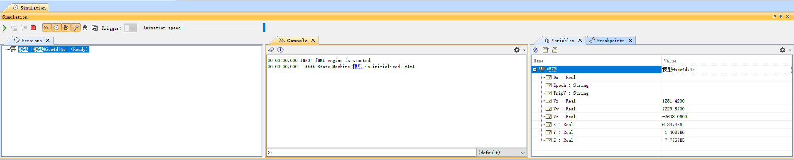
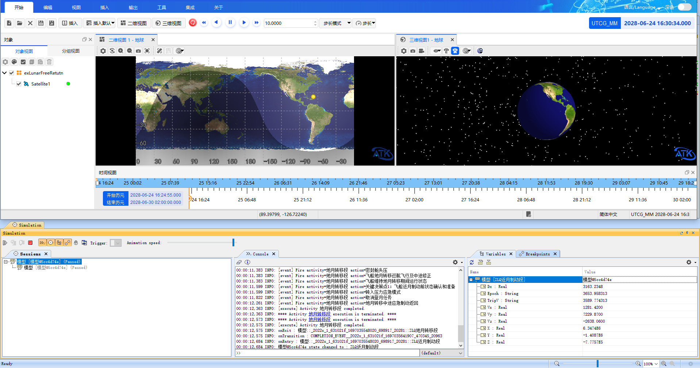
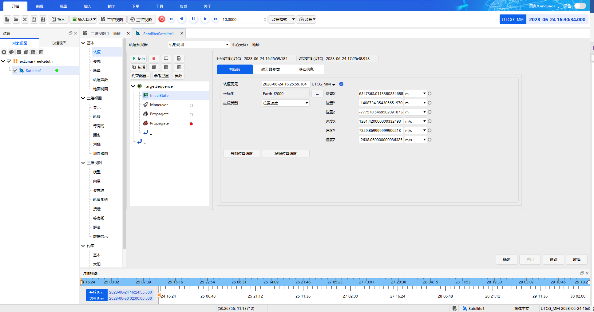
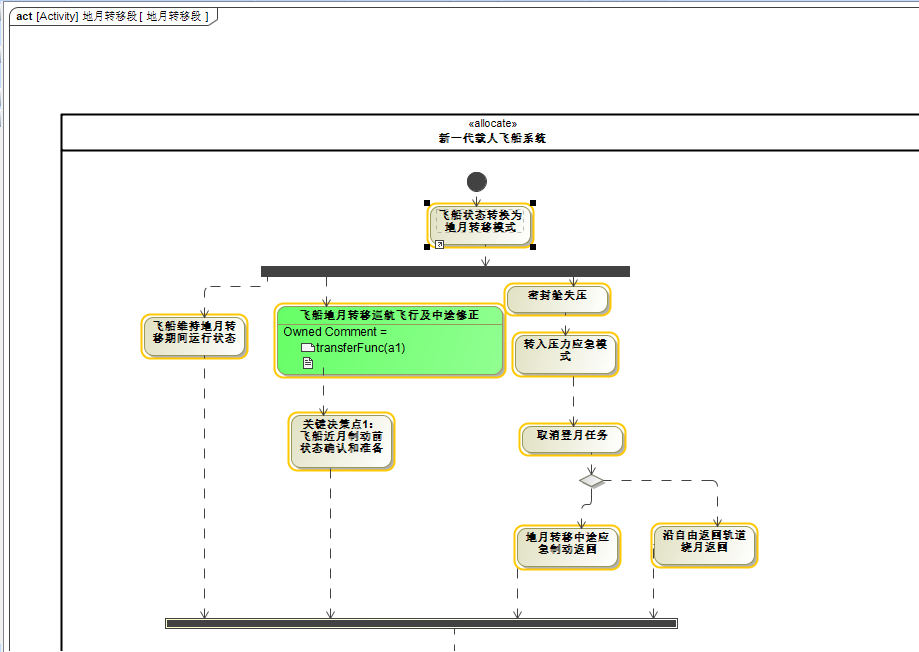
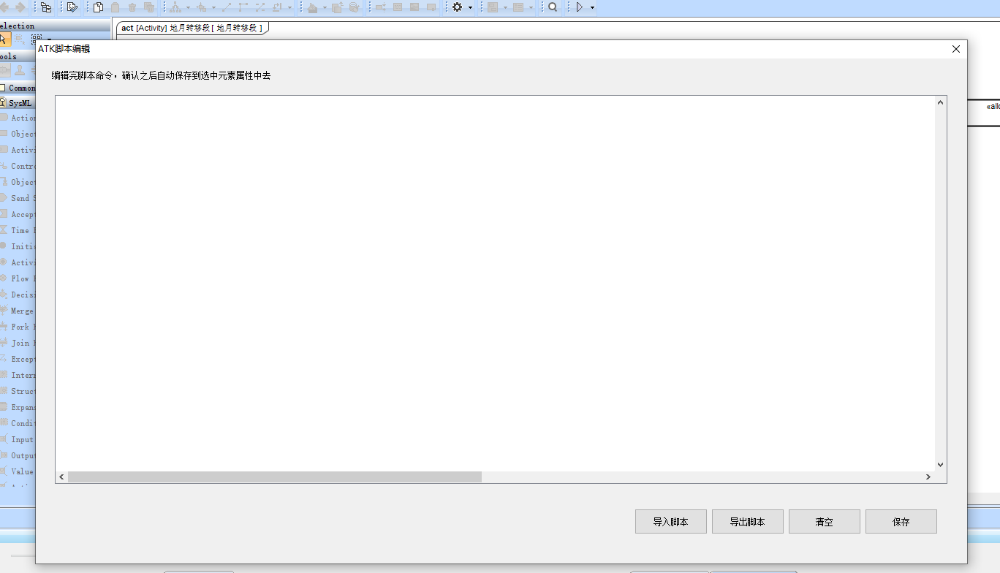

# 载人航天任务仿真过程

## 状态机联合仿真

完成模型构建、脚本编写及值属性配置后，开始进行联合仿真。

### 启动仿真

1. 在状态机图（State Machine Diagram）空白处右键点击，选择 `Simulation` -> `Run`，打开仿真界面，如下图所示：

2. 点击 **开始仿真** 按钮，MagicDraw 与 ATK 开始联合仿真，如下图所示：

### 参数传输

开始仿真后，MagicDraw 将输入参数发送至 ATK 中，如下图所示：

## 活动图联合仿真

使用活动图与 ATK 联合仿真的方式与状态机图类似，主要步骤如下：

### 步骤一：构建活动图

首先构建活动图，如下图所示：

### 步骤二：编辑 ATK 脚本

右键点击 Action（动作）模型元素，选择 **编辑 ATK 脚本**，打开 ATK 脚本编辑器，如下图所示：

### 步骤三：配置模型属性

脚本编辑完成后，参照 [脚本编辑过程](./3-脚本编辑过程.md) 中的方法，为活动图模型配置相应的输入输出属性。

### 步骤四：启动仿真

完成上述配置后，按照状态机仿真的方式启动联合仿真。