# 在Windows下使用

## 运行示例项目

进入文件目录`<ATK根目录>/IntegratingWithATK/component`，根据所安装的Visual Studio版本打开相关的项目配置文件

例如，如果安装是Vistual Studio 2022，则打开`vs2022`文件夹下的解决方案(.sln文件)

打开解决方案后，**需要重定向工程**，在工程配置中选择电脑所安装的Windows SDK版本

配置修改完成后即可编译

## 从零开始创建新项目

### 新建项目

打开 VS2015，点击新建项目，新建空项目，并设置项目名称与位置，设置完成后点击确定。

### 文件配置

在 ATK 安装包目录中，点击IntegratingWithATK文件夹，点开Component文件夹。

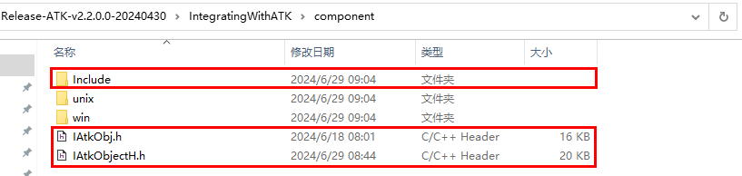

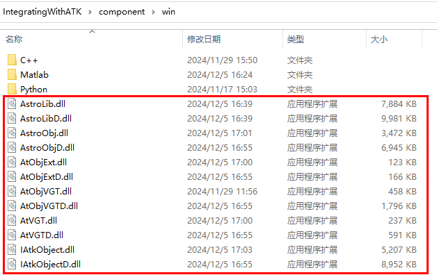

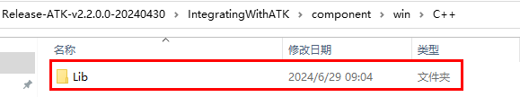

将所有文件添加至工程Test根目录中。

将需要的配置文件添加至此文件夹。（AstroData文件夹在ATK安装目录下）。

### 项目新建项

项目添加文件，项目右键->添加->新建项。

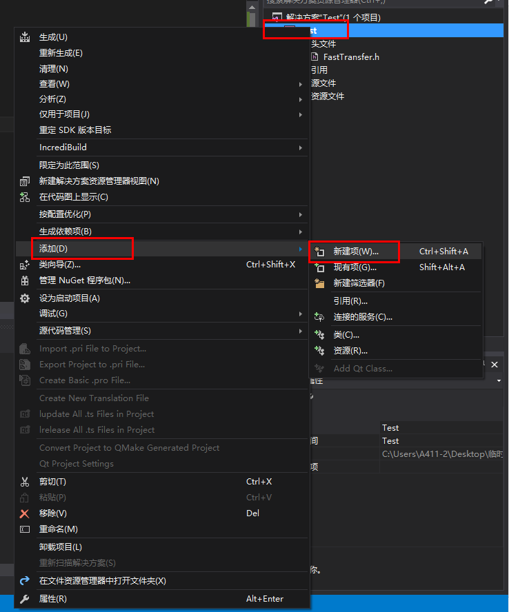

### 设置添加项的名称与位置

设置文件名称及位置，点击添加，完成后点击生成。

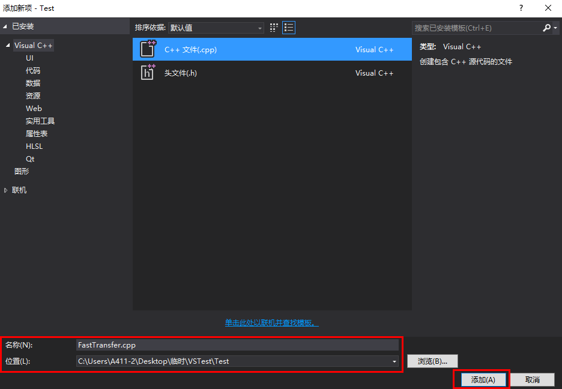

### 项目环境配置

打开项目右键->属性。

配置平台改为所有配置，所有平台模式，点击常规->输出目录，将输出目录修改为项目目录。

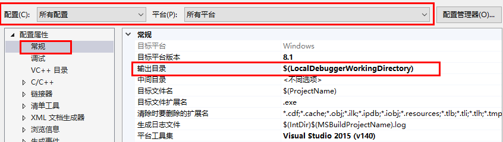

点击C/C++->常规->附加包含目录，将头文件目录添加至附加包含目录。点击应用按钮将环境配置应用到项目，点击确定按钮。

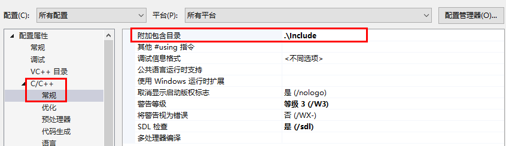

### 添加包含文件，编写代码

### 设置编译平台为X64

在菜单栏选择生成->配置管理器，选择X64平台，点击关闭按钮。

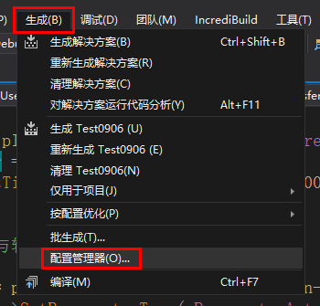

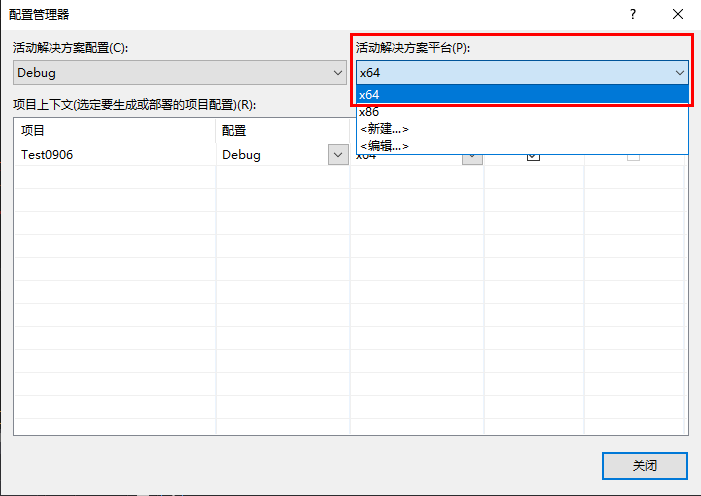

在菜单栏选择生成->生成解决方案进行编译。

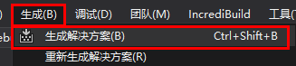

点击本地Windows调试器按钮，项目执行。

### 查看生成文件

生成文件在项目目录下的Output目录中。

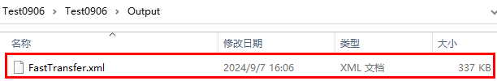

### 仿真轨迹

使用ATK打开生成文件，可以查看仿真轨迹。

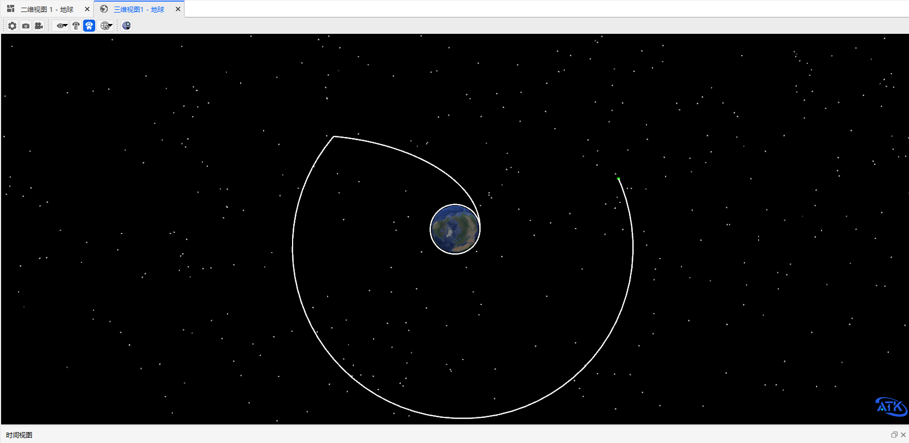

