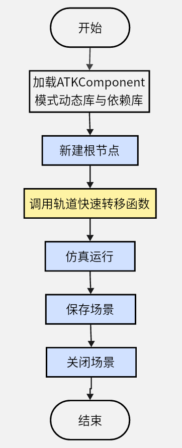

# Java案例实现

## Java案例流程图



## Java案例源码

```java
//ATKComponentJavaTest.java
package com.atk.test;

import com.atk.component.*;

public class ATKComponentJavaTest{
  //加载ATKComponent模式动态库与依赖库
  static {
    try {
	  //windows
	  System.loadLibrary("./ATKComponentJava");
	  //linux
	  //System.load("/root/git/IAtkObject/IAtkObjectDll/build/libIAtkObjectDll.so");
    } catch (UnsatisfiedLinkError e) {
      System.err.println("load dll failed\n" + e);
      System.exit(1);
    }
  }
  
  public static void main(String []argv) {
	//设置保存路径
	String curPath = System.getProperty("user.dir");
	ATKComponentJavaModule.SetSaveFileBasePath(curPath);
	//新建根结点
	IAtkObjectRoot pIAtkObjectRoot = new IAtkObjectRoot();
	//调用轨道快速转移函数
	TestFastTransfer(pIAtkObjectRoot);
	//仿真运行
	pIAtkObjectRoot.GetAnimation().PlayForward();
	//保存场景
	pIAtkObjectRoot.SaveScenario();
	//关闭场景
	pIAtkObjectRoot.CloseScenario();
  }
  
  //轨道快速转移函数
  public static void TestFastTransfer(IAtkObjectRoot pIAtkObjectRoot){
	//场景新建与属性设置
	IScenario pIScenario = (IScenario)pIAtkObjectRoot.GetChildren().New(EATKObjectType.eScenario,"FastTransfer");
	pIScenario.SetTimePeriod("5 Nov 2022 00:00:00.000", "6 Nov 2022 00:00:00.000");
	//卫星新建与轨道预报设置为机动规划
	ISatellite pISatellite = (ISatellite)pIScenario.GetChildren().New(EATKObjectType.eSatellite,"Satellite1");
	//设置二维属性轨迹显示时长
	IVeGfxLeadTrailData pIVeGfxLeadTrailData = pISatellite.GetGraphics().GetPassData().GetGroundTrack();
	pIVeGfxLeadTrailData.SetTrailDataType(ELeadTrailData.eDataTime);
	IVeLeadTrailData pIVeLeadTrailData = pIVeGfxLeadTrailData.GetTrailData();
	IVeLeadTrailDataTime pIVeLeadTrailDataTime = (IVeLeadTrailDataTime)(pIVeGfxLeadTrailData.GetTrailData());
	pIVeLeadTrailDataTime.SetTime(24*60*60);
	pISatellite.SetPropagatorType(EVePropagatorType.ePropagatorAstromaster);
	IVADriverMCS pIVADriverMCS = (IVADriverMCS)(pISatellite.GetPropagator());
	IVAMCSSegmentCollection pIVAMCSSegmentCollection = pIVADriverMCS.GetMainSequence();
	//机动规划添加段，新添加卫星会有默认初始段
	if (EVASegmentType.eVASegmentTypeInitialState != pIVAMCSSegmentCollection.Item(0).GetType()){
		return;
	}
	IVAMCSInitialState pIVAMCSInitialState = (IVAMCSInitialState)(pIVAMCSSegmentCollection.Item(0));
	IVAMCSPropagate pIVAMCSPropagate = (IVAMCSPropagate)(pIVAMCSSegmentCollection.Insert(EVASegmentType.eVASegmentTypePropagate, "Propagate", "-"));
	IVAMCSTargetSequence pIVAMCSTargetSequence = (IVAMCSTargetSequence)(pIVAMCSSegmentCollection.Insert(EVASegmentType.eVASegmentTypeTargetSequence, "TargetSequence", "-"));
	IVAMCSManeuver pIVAMCSManeuver = (IVAMCSManeuver)(pIVAMCSTargetSequence.GetSegments().Insert(EVASegmentType.eVASegmentTypeManeuver, "Maneuver", "-"));
	IVAMCSPropagate pIVAMCSPropagate1 = (IVAMCSPropagate)(pIVAMCSSegmentCollection.Insert(EVASegmentType.eVASegmentTypePropagate, "Propagate", "-"));
	IVAMCSTargetSequence pIVAMCSTargetSequence1	= (IVAMCSTargetSequence)(pIVAMCSSegmentCollection.Insert(EVASegmentType.eVASegmentTypeTargetSequence, "TargetSequence1", "-"));
	IVAMCSManeuver pIVAMCSManeuver1 = (IVAMCSManeuver)(pIVAMCSTargetSequence1.GetSegments().Insert(EVASegmentType.eVASegmentTypeManeuver, "Maneuver", "-"));
	IVAMCSPropagate pIVAMCSPropagate2 = (IVAMCSPropagate)(pIVAMCSSegmentCollection.Insert(EVASegmentType.eVASegmentTypePropagate, "Propagate", "-"));
	//初始段属性设置
	pIVAMCSInitialState.SetOrbitEpoch("5 Nov 2022 00:00:00.000");
	pIVAMCSInitialState.SetElementType(EVAElementType.eVAElementTypeKeplerian);
	IVAElementKeplerian pIVAElementKeplerian = (IVAElementKeplerian)(pIVAMCSInitialState.GetElement());
	pIVAElementKeplerian.SetSemiMajorAxis(6700000);
	pIVAElementKeplerian.SetEccentricity(0);
	pIVAElementKeplerian.SetInclination(0);
	pIVAElementKeplerian.SetRAAN(0);
	pIVAElementKeplerian.SetArgOfPeriapsis(0);
	pIVAElementKeplerian.SetTrueAnomaly(0);
    //第一个预报段属性设置
	IVAStoppingConditionElement pIVAStoppingConditionElement = pIVAMCSPropagate.GetStoppingConditions().Add("Duration");
	IVAStoppingCondition pIVAStoppingCondition = (IVAStoppingCondition)(pIVAStoppingConditionElement.GetProperties());
	pIVAStoppingCondition.SetTrip(7200);
	pIVAStoppingCondition.SetTolerance(0.0001);
	//第一个瞄准段中机动段属性设置
	pIVAMCSManeuver.SetManeuverType(EVAManeuverType.eVAManeuverTypeImpulsive);
	IVAManeuverImpulsive pIVAManeuverImpulsive = (IVAManeuverImpulsive)(pIVAMCSManeuver.GetManeuver());
	IVAAttitudeControlImpulsiveThrustVector pIVAAttitudeControlImpulsiveThrustVector = (IVAAttitudeControlImpulsiveThrustVector)(pIVAManeuverImpulsive.GetAttitudeControl());
	pIVAAttitudeControlImpulsiveThrustVector.SetThrustAxesName("Satellite VNC(Earth)");
	pIVAMCSManeuver.EnableControlParameter(EVAControlManeuver.eVAControlManeuverImpulsiveCartesianX);
	pIVAMCSManeuver.GetResults().Add("Radius_Of_Apoapsis");
	//第一个瞄准段添加属性页
	IVAProfileDifferentialCorrector pIVAProfileDifferentialCorrector = (IVAProfileDifferentialCorrector)(pIVAMCSTargetSequence.GetProfiles().Add("Differential Corrector"));
	IVADCControl pIVADCControl = pIVAProfileDifferentialCorrector.GetControlParameters().GetControlByPaths("Maneuver", "ImpulseX");
	IVADCResult pIVADCResult = pIVAProfileDifferentialCorrector.GetResults().GetResultByPaths("Maneuver", "StateCalc"+"RadiusOfApoapsis");
	//属性页中控制变量属性设置
	pIVADCControl.SetEnable(true);
	pIVADCControl.SetMaxStep(100);
	pIVADCControl.SetCorrection(2781.50365947627);
	pIVADCControl.SetPerturbation(0.1);
	pIVADCControl.SetScalingValue(1);
	//属性页中约束条件属性设置
	pIVADCResult.SetEnable(true);
	pIVADCResult.SetDesiredValue(84328394);
	pIVADCResult.SetScalingValue(1);
	pIVADCResult.SetTolerance(0.1);
	pIVADCResult.SetWeight(1);
	//第二个预报段属性设置
	IVAStoppingConditionElement pIVAStoppingConditionElement1 = pIVAMCSPropagate1.GetStoppingConditions().Add("RMagnitude");
	IVAStoppingCondition pIVAStoppingCondition1 = (IVAStoppingCondition)(pIVAStoppingConditionElement1.GetProperties());
	pIVAStoppingCondition1.SetTrip(42164197);
	pIVAStoppingCondition1.SetTolerance(1e-6);
	pIVAStoppingCondition1.SetRepeatCount(1);
	pIVAStoppingCondition1.SetCriterion(EVACriterion.eVACriterionCrossEither);
	//第二个瞄准段中机动段属性设置
	pIVAMCSManeuver1.SetManeuverType(EVAManeuverType.eVAManeuverTypeImpulsive);
	IVAManeuverImpulsive pIVAManeuverImpulsive1 = (IVAManeuverImpulsive)(pIVAMCSManeuver1.GetManeuver());
	IVAAttitudeControlImpulsive pIVAAttitudeControlImpulsive1 = (IVAAttitudeControlImpulsive)(pIVAManeuverImpulsive1.GetAttitudeControl());
	IVAAttitudeControlImpulsiveThrustVector pIVAAttitudeControlImpulsiveThrustVector1 = (IVAAttitudeControlImpulsiveThrustVector)(pIVAAttitudeControlImpulsive1);
	pIVAAttitudeControlImpulsiveThrustVector1.SetThrustAxesName("Satellite VNC(Earth)");
	pIVAMCSManeuver1.EnableControlParameter(EVAControlManeuver.eVAControlManeuverImpulsiveCartesianX);
	pIVAMCSManeuver1.EnableControlParameter(EVAControlManeuver.eVAControlManeuverImpulsiveCartesianZ);
	pIVAMCSManeuver1.GetResults().Add("Eccentricity");
	pIVAMCSManeuver1.GetResults().Add("Cosine_of_Vertical_FPA");
    //第二个瞄准段添加属性页
	IVAProfileDifferentialCorrector pIVAProfileDifferentialCorrector1 = (IVAProfileDifferentialCorrector)(pIVAMCSTargetSequence1.GetProfiles().Add("Differential Corrector"));
	//属性页中控制变量属性设置
	IVADCControl pIVADCControl1 = pIVAProfileDifferentialCorrector1.GetControlParameters().Item(0);
	pIVADCControl1.SetEnable(true);
	pIVADCControl1.SetMaxStep(300);
	pIVADCControl1.SetCorrection(-1581.97670664023);
	pIVADCControl1.SetPerturbation(0.1);
	pIVADCControl1.SetScalingValue(1);
	IVADCControl pIVADCControl2 = pIVAProfileDifferentialCorrector1.GetControlParameters().Item(1);
	pIVADCControl2.SetEnable(true);
	pIVADCControl2.SetMaxStep(300);
	pIVADCControl2.SetCorrection(-2771.82057041661);
	pIVADCControl2.SetPerturbation(0.1);
	pIVADCControl2.SetScalingValue(1);
	//属性页中约束条件属性设置
	IVADCResult pIVADCResult1 = pIVAProfileDifferentialCorrector1.GetResults().Item(0);
	pIVADCResult1.SetEnable(true);
	pIVADCResult1.SetDesiredValue(0);
	pIVADCResult1.SetScalingValue(1);
	pIVADCResult1.SetTolerance(0.1);
	pIVADCResult1.SetWeight(1);
	IVADCResult pIVADCResult2 = pIVAProfileDifferentialCorrector1.GetResults().Item(1);
	pIVADCResult2.SetEnable(true);
	pIVADCResult2.SetDesiredValue(0);
	pIVADCResult2.SetScalingValue(1);
	pIVADCResult2.SetTolerance(0.1);
	pIVADCResult2.SetWeight(1);
	//第三个预报段属性设置
	IVAStoppingConditionElement pIVAStoppingConditionElement2 = pIVAMCSPropagate2.GetStoppingConditions().Add("Duration");
	IVAStoppingCondition pIVAStoppingCondition2 = (IVAStoppingCondition)(pIVAStoppingConditionElement2.GetProperties());
	pIVAStoppingCondition2.SetTrip(86400);
	pIVAStoppingCondition2.SetTolerance(0.0001);
	//机动规划运行
	pIVADriverMCS.RunMCS();
	pIVADriverMCS.ApplyAllProfileChanges();
	//生成数据到文件
	String strReportFilePath = pIAtkObjectRoot.OutputDataReport(pISatellite, "J2000 Position Velocity", "5 Nov 2022 00:00:00.000", "6 Nov 2022 00:00:00.000");
	//输出数据报告目录
	System.out.println("输出数据报告:"+strReportFilePath);
  }
}
```

## Java案例执行命令

1. 切换磁盘：E:
2. 切换路径：cd E:\cssx\ATK-4.0-rc.1
3. 编译命令：javac -cp ATKComponentJava.jar -encoding utf-8 com/atk/test/ATKComponentJavaTest.java
4. 执行命令：java -cp .;ATKComponentJava.jar com/atk/test/ATKComponentJavaTest
