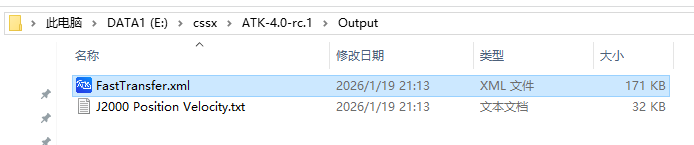

# 案例结果

1. 成功执行Java案例脚本ATKComponentJavaTest.java，会在cmd命令框中输出数据报告目录。

2. 同时生成的还有卫星数据报告J2000 Position Velocity.txt以及轨道快速转移想定文件FastTransfer.xml，以上文件均存放在输出目录Output。

3. 打开ATK检查生成的想定文件，选择轨道快速转移想定文件FastTransfer.xml，点击“开始”按钮运行动画，拉动下方时间轴查看二维视图下的轨迹效果。

4. 点击ATK“三维视图”按钮切换至三维视图，查看三维效果。

