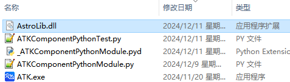
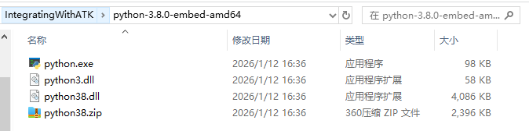

# 案例介绍

本案例实现半径为6700km的近地停泊轨道（LEO轨道）快速转移到半径为42164.197km的地球同步轨道（GEO轨道）的轨道机动规划设计。案例基于Component模式调用，通过嵌入式Python版本3.8.0测试运行。

## 本案例依赖以下文件（均包含在ATK安装包根目录）：

- IntegratingWithATK/python-3.8.0-embed-amd64，嵌入式Python解释器，电脑不用安装Python，也能解释运行Python脚本；

- `ATKComponentPythonModule.py`，ATKComponent模式接口文件，提供Component模式下所有公用类对象与函数的接口模块，在Python案例脚本中导入该模块后，就能调用这些公用的类对象与函数；

- `_ATKComponentPythonModule.pyd`，ATKComponent模式动态库，供接口模块调用，包含Component模式下所有公用类对象与函数的具体实现；

- `ATKComponentJava.dll`，ATK Component模式Java接口动态库，提供Component模式的Java调用，并链接加载同目录的其他依赖动态库；

- `ATKComponentPythonTest.py`，Python案例脚本，建议创建在ATK根目录， 具体内容参考下文案例实现里的代码。包含一个轨道快速转移案例的具体实现过程。该Python案例脚本通过嵌入式Python解释器解释运行，如果脚本包含中文或者目录包含中文，需要先设置文件为UTF-8无BOM编码格式，再编辑案例代码。

