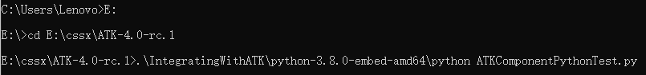

# 案例实现

本案例使用Python脚本实现，通过在案例脚本中导入ATKComponent模式接口模块ATKComponentPythonModule，调用接口模块中公用的类接口与函数接口，完成场景与卫星类对象的新建与设置，动画的仿真运行，数据报告与想定文件的输出保存。最后通过嵌入式Python解释器解释运行该Python案例脚本，完成案例实现。具体流程如下所示。

## Python案例流程图


## Python案例源码

```Python
#ATKComponentPythonTest.py
# -*- coding: utf-8 -*-

#1，使用内嵌式python解释器时，需要将当前路径加入Python系统环境路径
import sys
import os
curPath = os.path.dirname(os.path.abspath(__file__))
sys.path.insert(0,curPath)

#2，导入ATKComponent模式接口模块，并取个简短的别名
import ATKComponentPythonModule as ATKModule
	
#3，设置保存文件的基础路径和调用语言，用来兼容处理不同系统/模式/语言情况下，输出位置不统一的问题
ATKModule.SetSaveFileBasePath(curPath);
ATKModule.SetCallCodeType("python");

#倾角转换实现函数
def TestInclinationChange(pIAtkObjectRoot):
	#新建场景
	pIScenario = pIAtkObjectRoot.GetChildren().New(ATKModule.eScenario, "InclinationChange");
	pIScenario.SetTimePeriod("5 Nov 2022 00:00:00.000", "8 Nov 2022 00:00:00.000");
	#新建卫星
	pISatellite = pIScenario.GetChildren().New(ATKModule.eSatellite, "SatInclinationChange");

	#设置二维属性轨迹显示时长
	pIVeGfxLeadTrailData = pISatellite.GetGraphics().GetPassData().GetGroundTrack();
	pIVeGfxLeadTrailData.SetTrailDataType(ATKModule.eDataTime);
	pIVeLeadTrailDataTime = pIVeGfxLeadTrailData.GetTrailData();
	pIVeLeadTrailDataTime.SetTime(24*60*60);
	
	pISatellite.SetPropagatorType(ATKModule.ePropagatorAstromaster);
	pIVADriverMCS = pISatellite.GetPropagator();
	pIVAMCSSegmentCollection = pIVADriverMCS.GetMainSequence();
	
	if (ATKModule.eVASegmentTypeInitialState != pIVAMCSSegmentCollection.Item(0).GetType()):
		return;
	pIVAMCSInitialState = pIVAMCSSegmentCollection.Item(0);
	
	pIVAMCSPropagate = pIVAMCSSegmentCollection.Insert(ATKModule.eVASegmentTypePropagate, "Propagate", "-");
	pIVAMCSTargetSequence = pIVAMCSSegmentCollection.Insert(ATKModule.eVASegmentTypeTargetSequence, "TargetSequence", "-");
	pIVAMCSSegmentCollection0 = pIVAMCSTargetSequence.GetSegments();
	pIVAMCSManeuver = pIVAMCSSegmentCollection0.Insert(ATKModule.eVASegmentTypeManeuver, "Maneuver", "-");
	
	pIVAMCSPropagate1 = pIVAMCSSegmentCollection.Insert(ATKModule.eVASegmentTypePropagate, "Propagate1", "-");
	pIVAMCSTargetSequence1 = pIVAMCSSegmentCollection.Insert(ATKModule.eVASegmentTypeTargetSequence, "TargetSequence1", "-");
	pIVAMCSSegmentCollection1 = pIVAMCSTargetSequence1.GetSegments();
	pIVAMCSManeuver1 = pIVAMCSSegmentCollection1.Insert(ATKModule.eVASegmentTypeManeuver, "Maneuver", "-");
	
	pIVAMCSPropagate2 = pIVAMCSSegmentCollection.Insert(ATKModule.eVASegmentTypePropagate, "Propagate2", "-");
	pIVAMCSTargetSequence2 = pIVAMCSSegmentCollection.Insert(ATKModule.eVASegmentTypeTargetSequence, "TargetSequence2", "-");
	pIVAMCSSegmentCollection2 = pIVAMCSTargetSequence2.GetSegments();
	pIVAMCSManeuver2 = pIVAMCSSegmentCollection2.Insert(ATKModule.eVASegmentTypeManeuver, "Maneuver", "-");
	
	pIVAMCSPropagate3 = pIVAMCSSegmentCollection.Insert(ATKModule.eVASegmentTypePropagate, "Propagate3", "-");
	
	pIVAMCSInitialState.SetOrbitEpoch("5 Nov 2022 00:00:00.000");
	pIVAMCSInitialState.SetElementType(ATKModule.eVAElementTypeKeplerian);
	pIVAElementKeplerian = pIVAMCSInitialState.GetElement();
	pIVAElementKeplerian.SetSemiMajorAxis(6570000);
	pIVAElementKeplerian.SetEccentricity(0);
	pIVAElementKeplerian.SetInclination(28);
	pIVAElementKeplerian.SetRAAN(0);
	pIVAElementKeplerian.SetArgOfPeriapsis(0);
	pIVAElementKeplerian.SetTrueAnomaly(0);
	
	pIVAStoppingConditionElement = pIVAMCSPropagate.GetStoppingConditions().Add("Duration");
	pIVAStoppingCondition = pIVAStoppingConditionElement.GetProperties();
	pIVAStoppingCondition.SetTrip(7200);
	pIVAStoppingCondition.SetTolerance(0.0001);

	pIVAMCSManeuver.SetManeuverType(ATKModule.eVAManeuverTypeImpulsive);
	pIVAManeuverImpulsive = pIVAMCSManeuver.GetManeuver();
	pIVAAttitudeControlImpulsiveThrustVector = pIVAManeuverImpulsive.GetAttitudeControl();
	pIVAAttitudeControlImpulsiveThrustVector.SetThrustAxesName("Satellite VNC(Earth)");
	pIVAMCSManeuver.EnableControlParameter(ATKModule.eVAControlManeuverImpulsiveCartesianX);
	pIVAMCSManeuver.GetResults().Add("Radius_Of_Apoapsis");
	
	pIVAProfileDifferentialCorrector = pIVAMCSTargetSequence.GetProfiles().Add("Differential Corrector");
	pIVADCControl = pIVAProfileDifferentialCorrector.GetControlParameters().GetControlByPaths("Maneuver", "ImpulseX");
	pIVADCResult = pIVAProfileDifferentialCorrector.GetResults().GetResultByPaths("Maneuver", "StateCalc"+"RadiusOfApoapsis");
	pIVADCControl = pIVAProfileDifferentialCorrector.GetControlParameters().Item(0);
	pIVADCControl.SetEnable(True);
	pIVADCControl.SetMaxStep(100);
	#pIVADCControl.SetCorrection(2456.42862556706);
	pIVADCControl.SetPerturbation(0.1);
	pIVADCControl.SetScalingValue(1);
	pIVADCResult = pIVAProfileDifferentialCorrector.GetResults().Item(0);
	pIVADCResult.SetEnable(True);
	pIVADCResult.SetDesiredValue(42160000);
	pIVADCResult.SetScalingValue(1);
	pIVADCResult.SetTolerance(0.1);
	pIVADCResult.SetWeight(1);

	pIVAStoppingConditionElement1 = pIVAMCSPropagate1.GetStoppingConditions().Add("Apoapsis");
	pIVAStoppingCondition1 = pIVAStoppingConditionElement1.GetProperties();
	pIVAStoppingCondition1.SetTolerance(0.0001);
	pIVAStoppingCondition1.SetRepeatCount(1);

	pIVAMCSManeuver1.SetManeuverType(ATKModule.eVAManeuverTypeImpulsive);
	pIVAManeuverImpulsive1 = pIVAMCSManeuver1.GetManeuver();
	pIVAAttitudeControlImpulsiveThrustVector1 = pIVAManeuverImpulsive1.GetAttitudeControl();
	pIVAAttitudeControlImpulsiveThrustVector1.SetThrustAxesName("Satellite VNC(Earth)");
	pIVAMCSManeuver1.EnableControlParameter(ATKModule.eVAControlManeuverImpulsiveCartesianX);
	pIVAMCSManeuver1.GetResults().Add("Eccentricity");

	pIVAProfileDifferentialCorrector1 = pIVAMCSTargetSequence1.GetProfiles().Add("Differential Corrector");
	pIVADCControl1 = pIVAProfileDifferentialCorrector1.GetControlParameters().Item(0);
	pIVADCControl1.SetEnable(True);
	pIVADCControl1.SetMaxStep(100);
	pIVADCControl1.SetCorrection(1480.06329844802);
	pIVADCControl1.SetPerturbation(0.1);
	pIVADCControl1.SetScalingValue(1);
	pIVADCResult1 = pIVAProfileDifferentialCorrector1.GetResults().Item(0);
	pIVADCResult1.SetEnable(True);
	pIVADCResult1.SetDesiredValue(0);
	pIVADCResult1.SetScalingValue(1);
	pIVADCResult1.SetTolerance(0.001);
	pIVADCResult1.SetWeight(1);

	pIVAStoppingConditionElement2 = pIVAMCSPropagate2.GetStoppingConditions().Add("AscendingNode");
	pIVAStoppingCondition2 = pIVAStoppingConditionElement2.GetProperties();
	pIVAStoppingCondition2.SetRepeatCount(2);
	pIVAStoppingCondition2.SetTolerance(1e-6);

	pIVAMCSManeuver2.SetManeuverType(ATKModule.eVAManeuverTypeImpulsive);
	pIVAManeuverImpulsive2 = pIVAMCSManeuver2.GetManeuver();
	pIVAAttitudeControlImpulsiveThrustVector2 = pIVAManeuverImpulsive2.GetAttitudeControl();
	pIVAAttitudeControlImpulsiveThrustVector2.SetThrustAxesName("Satellite VNC(Earth)");
	pIVAMCSManeuver2.EnableControlParameter(ATKModule.eVAControlManeuverImpulsiveCartesianX);
	pIVAMCSManeuver2.EnableControlParameter(ATKModule.eVAControlManeuverImpulsiveCartesianY);
	pIVAMCSManeuver2.GetResults().Add("Eccentricity");
	pIVAMCSManeuver2.GetResults().Add("Inclination");

	pIVAProfileDifferentialCorrector2 = pIVAMCSTargetSequence2.GetProfiles().Add("Differential Corrector");
	pIVADCControl2 = pIVAProfileDifferentialCorrector2.GetControlParameters().Item(0);
	pIVADCControl2.SetEnable(True);
	pIVADCControl2.SetMaxStep(100);
	pIVADCControl2.SetCorrection(-359.983751789857);
	pIVADCControl2.SetPerturbation(0.1);
	pIVADCControl2.SetScalingValue(1);
	pIVADCControl3 = pIVAProfileDifferentialCorrector2.GetControlParameters().Item(1);
	pIVADCControl3.SetEnable(True);
	pIVADCControl3.SetMaxStep(100);
	pIVADCControl3.SetCorrection(-1444.72488992759);
	pIVADCControl3.SetPerturbation(0.1);
	pIVADCControl3.SetScalingValue(1);
	pIVADCResult2 = pIVAProfileDifferentialCorrector2.GetResults().Item(0);
	pIVADCResult2.SetEnable(True);
	pIVADCResult2.SetDesiredValue(0);
	pIVADCResult2.SetScalingValue(1);
	pIVADCResult2.SetTolerance(0);
	pIVADCResult2.SetWeight(1);
	pIVADCResult3 = pIVAProfileDifferentialCorrector2.GetResults().Item(1);
	pIVADCResult3.SetEnable(True);
	pIVADCResult3.SetDesiredValue(0);
	pIVADCResult3.SetScalingValue(1);
	pIVADCResult3.SetTolerance(0.001);
	pIVADCResult3.SetWeight(1);
	
	pIVAStoppingConditionElement3 = pIVAMCSPropagate3.GetStoppingConditions().Add("Duration");
	pIVAStoppingCondition3 = pIVAStoppingConditionElement3.GetProperties();
	pIVAStoppingCondition3.SetTrip(129600);
	pIVAStoppingCondition3.SetTolerance(1e-5);

	pIVADriverMCS.RunMCS();
	pIVADriverMCS.ApplyAllProfileChanges();

#霍曼转移实现函数
def TestHohmannTransfer(pIAtkObjectRoot):
	#新建场景
	pIScenario = pIAtkObjectRoot.GetChildren().New(ATKModule.eScenario, "HohmannTransfer");
	pIScenario.SetTimePeriod("5 Nov 2022 00:00:00.000", "7 Nov 2022 00:00:00.000");
	#新建卫星
	pISatellite = pIScenario.GetChildren().New(ATKModule.eSatellite, "Sat_Hohmann");

	#设置二维属性轨迹显示时长
	pIVeGfxLeadTrailData = pISatellite.GetGraphics().GetPassData().GetGroundTrack();
	pIVeGfxLeadTrailData.SetTrailDataType(ATKModule.eDataTime);
	pIVeLeadTrailDataTime = pIVeGfxLeadTrailData.GetTrailData();
	pIVeLeadTrailDataTime.SetTime(24*60*60);
	
	pISatellite.SetPropagatorType(ATKModule.ePropagatorAstromaster);
	pIVADriverMCS = pISatellite.GetPropagator();
	pIVAMCSSegmentCollection = pIVADriverMCS.GetMainSequence();

	if (ATKModule.eVASegmentTypeInitialState != pIVAMCSSegmentCollection.Item(0).GetType()):
		return;
	pIVAMCSInitialState = pIVAMCSSegmentCollection.Item(0);
	pIVAMCSPropagate = pIVAMCSSegmentCollection.Insert(ATKModule.eVASegmentTypePropagate, "Propagate", "-");
	pIVAMCSTargetSequence = pIVAMCSSegmentCollection.Insert(ATKModule.eVASegmentTypeTargetSequence, "TargetSequence", "-");
	pIVAMCSManeuver = pIVAMCSTargetSequence.GetSegments().Insert(ATKModule.eVASegmentTypeManeuver, "Maneuver", "-");
	pIVAMCSPropagate1 = pIVAMCSSegmentCollection.Insert(ATKModule.eVASegmentTypePropagate, "Propagate1", "-");
	pIVAMCSTargetSequence1 = pIVAMCSSegmentCollection.Insert(ATKModule.eVASegmentTypeTargetSequence, "TargetSequence1", "-");
	pIVAMCSManeuver1 = pIVAMCSTargetSequence1.GetSegments().Insert(ATKModule.eVASegmentTypeManeuver, "Maneuver", "-");
	pIVAMCSPropagate2 = pIVAMCSSegmentCollection.Insert(ATKModule.eVASegmentTypePropagate, "Propagate2", "-");

	pIVAMCSInitialState.SetOrbitEpoch("5 Nov 2022 00:00:00.000");
	pIVAMCSInitialState.SetElementType(ATKModule.eVAElementTypeKeplerian);
	pIVAElementKeplerian = pIVAMCSInitialState.GetElement();
	pIVAElementKeplerian.SetSemiMajorAxis(6700000);
	pIVAElementKeplerian.SetEccentricity(0);
	pIVAElementKeplerian.SetInclination(28);
	pIVAElementKeplerian.SetRAAN(0);
	pIVAElementKeplerian.SetArgOfPeriapsis(0);
	pIVAElementKeplerian.SetTrueAnomaly(0);

	pIVAStoppingConditionElement = pIVAMCSPropagate.GetStoppingConditions().Add("Duration");
	pIVAStoppingCondition = pIVAStoppingConditionElement.GetProperties();
	pIVAStoppingCondition.SetTrip(7200);
	pIVAStoppingCondition.SetTolerance(0.0001);

	pIVAMCSManeuver.SetManeuverType(ATKModule.eVAManeuverTypeImpulsive);
	pIVAManeuverImpulsive = pIVAMCSManeuver.GetManeuver();
	pIVAAttitudeControlImpulsiveThrustVector = pIVAManeuverImpulsive.GetAttitudeControl();
	pIVAAttitudeControlImpulsiveThrustVector.SetThrustAxesName("Satellite VNC(Earth)");
	pIVAMCSManeuver.EnableControlParameter(ATKModule.eVAControlManeuverImpulsiveCartesianX);
	pIVAMCSManeuver.GetResults().Add("Radius_Of_Apoapsis");

	pIVAProfileDifferentialCorrector = pIVAMCSTargetSequence.GetProfiles().Add("Differential Corrector");
	pIVADCControl = pIVAProfileDifferentialCorrector.GetControlParameters().GetControlByPaths("Maneuver", "ImpulseX");
	pIVADCResult = pIVAProfileDifferentialCorrector.GetResults().GetResultByPaths("Maneuver", "StateCalc"+"RadiusOfApoapsis");
	pIVADCControl = pIVAProfileDifferentialCorrector.GetControlParameters().Item(0);
	pIVADCControl.SetEnable(True);
	pIVADCControl.SetMaxStep(100);
	pIVADCControl.SetPerturbation(0.1);
	pIVADCControl.SetScalingValue(1);
	pIVADCResult = pIVAProfileDifferentialCorrector.GetResults().Item(0);
	pIVADCResult.SetEnable(True);
	pIVADCResult.SetDesiredValue(42238000);
	pIVADCResult.SetScalingValue(1);
	pIVADCResult.SetTolerance(0.1);
	pIVADCResult.SetWeight(1);

	pIVAStoppingConditionElement1 = pIVAMCSPropagate1.GetStoppingConditions().Add("Apoapsis");
	pIVAStoppingCondition1 = pIVAStoppingConditionElement1.GetProperties();
	pIVAStoppingCondition1.SetTolerance(0.0001);
	pIVAStoppingCondition1.SetRepeatCount(1);
	pIVAStoppingCondition1.SetCentralBodyName("Earth");

	pIVAMCSManeuver1.SetManeuverType(ATKModule.eVAManeuverTypeImpulsive);
	pIVAManeuverImpulsive1 = pIVAMCSManeuver1.GetManeuver();
	pIVAAttitudeControlImpulsiveThrustVector1 = pIVAManeuverImpulsive1.GetAttitudeControl();
	pIVAAttitudeControlImpulsiveThrustVector1.SetThrustAxesName("Satellite VNC(Earth)");
	pIVAMCSManeuver1.EnableControlParameter(ATKModule.eVAControlManeuverImpulsiveCartesianX);
	pIVAMCSManeuver1.GetResults().Add("Eccentricity");

	pIVAProfileDifferentialCorrector1 = pIVAMCSTargetSequence1.GetProfiles().Add("Differential Corrector");
	pIVADCControl1 = pIVAProfileDifferentialCorrector1.GetControlParameters().Item(0);
	pIVADCControl1.SetEnable(True);
	pIVADCControl1.SetMaxStep(100);
	pIVADCControl1.SetPerturbation(0.1);
	pIVADCControl1.SetScalingValue(1);
	pIVADCResult1 = pIVAProfileDifferentialCorrector1.GetResults().Item(0);
	pIVADCResult1.SetEnable(True);
	pIVADCResult1.SetDesiredValue(0);
	pIVADCResult1.SetScalingValue(1);
	pIVADCResult1.SetTolerance(0.001);
	pIVADCResult1.SetWeight(1);

	pIVAStoppingConditionElement2 = pIVAMCSPropagate2.GetStoppingConditions().Add("Duration");
	pIVAStoppingCondition2 = pIVAStoppingConditionElement2.GetProperties();
	pIVAStoppingCondition2.SetTrip(86400);
	pIVAStoppingCondition2.SetTolerance(0.0001);

	pIVADriverMCS.RunMCS();
	pIVADriverMCS.ApplyAllProfileChanges();

#轨道快速转移实现函数
def TestFastTransfer(pIAtkObjectRoot):
	#1，场景新建与属性设置
	pIScenario = pIAtkObjectRoot.GetChildren().New(ATKModule.eScenario, "FastTransfer");
	pIScenario.SetTimePeriod("5 Nov 2022 00:00:00.000", "6 Nov 2022 00:00:00.000");
	#2，卫星新建与轨道预报设置为机动规划
	pISatellite = pIScenario.GetChildren().New(ATKModule.eSatellite, "Satellite1");
	#设置二维属性轨迹显示时长
	pIVeGfxLeadTrailData = pISatellite.GetGraphics().GetPassData().GetGroundTrack();
	pIVeGfxLeadTrailData.SetTrailDataType(ATKModule.eDataTime);
	pIVeLeadTrailDataTime = pIVeGfxLeadTrailData.GetTrailData();
	pIVeLeadTrailDataTime.SetTime(24*60*60);
	pISatellite.SetPropagatorType(ATKModule.ePropagatorAstromaster);
	pIVADriverMCS = pISatellite.GetPropagator();
	pIVAMCSSegmentCollection = pIVADriverMCS.GetMainSequence();
	#3，机动规划添加段，新添加卫星会有默认初始段
	if (ATKModule.eVASegmentTypeInitialState != pIVAMCSSegmentCollection.Item(0).GetType()):
		return;
	pIVAMCSInitialState = pIVAMCSSegmentCollection.Item(0);
	pIVAMCSPropagate = pIVAMCSSegmentCollection.Insert(ATKModule.eVASegmentTypePropagate, "Propagate", "-");
	pIVAMCSTargetSequence = pIVAMCSSegmentCollection.Insert(ATKModule.eVASegmentTypeTargetSequence, "TargetSequence", "-");
	pIVAMCSManeuver = pIVAMCSTargetSequence.GetSegments().Insert(ATKModule.eVASegmentTypeManeuver, "Maneuver", "-");
	pIVAMCSPropagate1 = pIVAMCSSegmentCollection.Insert(ATKModule.eVASegmentTypePropagate, "Propagate", "-");
	pIVAMCSTargetSequence1 = pIVAMCSSegmentCollection.Insert(ATKModule.eVASegmentTypeTargetSequence, "TargetSequence1", "-");
	pIVAMCSManeuver1 = pIVAMCSTargetSequence1.GetSegments().Insert(ATKModule.eVASegmentTypeManeuver, "Maneuver", "-");
	pIVAMCSPropagate2 = pIVAMCSSegmentCollection.Insert(ATKModule.eVASegmentTypePropagate, "Propagate", "-");
	#4，初始段属性设置
	pIVAMCSInitialState.SetOrbitEpoch("5 Nov 2022 00:00:00.000");
	pIVAMCSInitialState.SetElementType(ATKModule.eVAElementTypeKeplerian);
	pIVAElementKeplerian = pIVAMCSInitialState.GetElement();
	pIVAElementKeplerian.SetSemiMajorAxis(6700000);
	pIVAElementKeplerian.SetEccentricity(0);
	pIVAElementKeplerian.SetInclination(0);
	pIVAElementKeplerian.SetRAAN(0);
	pIVAElementKeplerian.SetArgOfPeriapsis(0);
	pIVAElementKeplerian.SetTrueAnomaly(0);
	#5，第一个预报段属性设置
	pIVAStoppingConditionElement = pIVAMCSPropagate.GetStoppingConditions().Add("Duration");
	pIVAStoppingCondition = pIVAStoppingConditionElement.GetProperties();
	pIVAStoppingCondition.SetTrip(7200);
	pIVAStoppingCondition.SetTolerance(0.0001);
	#6，第一个瞄准段中机动段属性设置
	pIVAMCSManeuver.SetManeuverType(ATKModule.eVAManeuverTypeImpulsive);
	pIVAManeuverImpulsive = pIVAMCSManeuver.GetManeuver();
	pIVAAttitudeControlImpulsiveThrustVector = pIVAManeuverImpulsive.GetAttitudeControl();
	pIVAAttitudeControlImpulsiveThrustVector.SetThrustAxesName("Satellite VNC(Earth)");
	pIVAMCSManeuver.EnableControlParameter(ATKModule.eVAControlManeuverImpulsiveCartesianX);
	pIVAMCSManeuver.GetResults().Add("Radius_Of_Apoapsis");
	#7，第一个瞄准段添加属性页
	pIVAProfileDifferentialCorrector = pIVAMCSTargetSequence.GetProfiles().Add("Differential Corrector");
	pIVADCControl = pIVAProfileDifferentialCorrector.GetControlParameters().GetControlByPaths("Maneuver", "ImpulseX");
	pIVADCResult = pIVAProfileDifferentialCorrector.GetResults().GetResultByPaths("Maneuver", "StateCalc"+"RadiusOfApoapsis");
	#8，属性页中控制变量属性设置
	pIVADCControl.SetEnable(True);
	pIVADCControl.SetMaxStep(100);
	#pIVADCControl.SetCorrection(2781.50365947627);
	pIVADCControl.SetPerturbation(0.1);
	pIVADCControl.SetScalingValue(1);
	#9，属性页中约束条件属性设置
	pIVADCResult.SetEnable(True);
	pIVADCResult.SetDesiredValue(84328394);
	pIVADCResult.SetScalingValue(1);
	pIVADCResult.SetTolerance(0.1);
	pIVADCResult.SetWeight(1);
	#10，第二个预报段属性设置
	pIVAStoppingConditionElement1 = pIVAMCSPropagate1.GetStoppingConditions().Add("RMagnitude");
	pIVAStoppingCondition1 = pIVAStoppingConditionElement1.GetProperties();
	pIVAStoppingCondition1.SetTrip(42164197);
	pIVAStoppingCondition1.SetTolerance(1e-6);
	pIVAStoppingCondition1.SetRepeatCount(1);
	pIVAStoppingCondition1.SetCriterion(ATKModule.eVACriterionCrossEither);
	#11，第二个瞄准段中机动段属性设置
	pIVAMCSManeuver1.SetManeuverType(ATKModule.eVAManeuverTypeImpulsive);
	pIVAManeuverImpulsive1 = pIVAMCSManeuver1.GetManeuver();
	pIVAAttitudeControlImpulsiveThrustVector1 = pIVAManeuverImpulsive1.GetAttitudeControl();
	pIVAAttitudeControlImpulsiveThrustVector1.SetThrustAxesName("Satellite VNC(Earth)");
	pIVAMCSManeuver1.EnableControlParameter(ATKModule.eVAControlManeuverImpulsiveCartesianX);
	pIVAMCSManeuver1.EnableControlParameter(ATKModule.eVAControlManeuverImpulsiveCartesianZ);
	pIVAMCSManeuver1.GetResults().Add("Eccentricity");
	pIVAMCSManeuver1.GetResults().Add("Cosine_of_Vertical_FPA");
	#12，第二个瞄准段添加属性页
	pIVAProfileDifferentialCorrector1 = pIVAMCSTargetSequence1.GetProfiles().Add("Differential Corrector");
	#13，属性页中控制变量属性设置
	pIVADCControl1 = pIVAProfileDifferentialCorrector1.GetControlParameters().Item(0);
	pIVADCControl1.SetEnable(True);
	pIVADCControl1.SetMaxStep(300);
	pIVADCControl1.SetCorrection(-1581.97670664023);
	pIVADCControl1.SetPerturbation(0.1);
	pIVADCControl1.SetScalingValue(1);
	pIVADCControl2 = pIVAProfileDifferentialCorrector1.GetControlParameters().Item(1);
	pIVADCControl2.SetEnable(True);
	pIVADCControl2.SetMaxStep(300);
	pIVADCControl2.SetCorrection(-2771.82057041661);
	pIVADCControl2.SetPerturbation(0.1);
	pIVADCControl2.SetScalingValue(1);
	#14，属性页中约束条件属性设置
	pIVADCResult1 = pIVAProfileDifferentialCorrector1.GetResults().Item(0);
	pIVADCResult1.SetEnable(True);
	pIVADCResult1.SetDesiredValue(0);
	pIVADCResult1.SetScalingValue(1);
	pIVADCResult1.SetTolerance(0.1);
	pIVADCResult1.SetWeight(1);
	pIVADCResult2 = pIVAProfileDifferentialCorrector1.GetResults().Item(1);
	pIVADCResult2.SetEnable(True);
	pIVADCResult2.SetDesiredValue(0);
	pIVADCResult2.SetScalingValue(1);
	pIVADCResult2.SetTolerance(0.1);
	pIVADCResult2.SetWeight(1);
	#15，第三个预报段属性设置
	pIVAStoppingConditionElement2 = pIVAMCSPropagate2.GetStoppingConditions().Add("Duration");
	pIVAStoppingCondition2 = pIVAStoppingConditionElement2.GetProperties();
	pIVAStoppingCondition2.SetTrip(86400);
	pIVAStoppingCondition2.SetTolerance(0.0001);
	#16，机动规划运行
	pIVADriverMCS.RunMCS();
	pIVADriverMCS.ApplyAllProfileChanges();
	#17，生成数据到文件
	strReportFilePath = pIAtkObjectRoot.OutputDataReport(pISatellite, "J2000 Position Velocity", "5 Nov 2022 00:00:00.000", "6 Nov 2022 00:00:00.000");
	#18，输出数据报告目录
	print("output data reports:"+strReportFilePath)

#4，新建根节点
pIAtkObjectRoot = ATKModule.IAtkObjectRoot();
#5，调用实现函数
TestFastTransfer(pIAtkObjectRoot);
#TestHohmannTransfer(pIAtkObjectRoot);
#TestInclinationChange(pIAtkObjectRoot);
#6，仿真运行
pIAtkObjectRoot.GetAnimation().PlayForward();
#7，保存场景
pIAtkObjectRoot.SaveScenario();
#8，关闭场景
pIAtkObjectRoot.CloseScenario();
```

## cmd执行命令
打开cmd命令行，切换到Python案例脚本目录，并通过嵌入式Python解释器解释运行。

    1. 切换磁盘：E:

    2. 切换路径：cd E:\cssx\ATK-4.0-rc.1
    
    3. 运行命令：.\IntegratingWithATK\python-3.8.0-embed-amd64\python ATKComponentPythonTest.py


