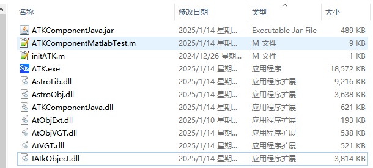

# 案例介绍

本案例实现半径为6700km的近地停泊轨道（LEO轨道）快速转移到半径为42164.197km的地球同步轨道（GEO轨道）的轨道机动规划设计。案例基于Component模式，通过Matlab软件(R2015b/R2021b/R2024b)运行.m脚本调Java封装包实现。
本案例依赖以下文件（均包含在ATK安装包根目录）：

- initATK.m，Matlab初始化脚本，初始化依赖路径，将java封装包添加到调用环境，并加载依赖动态库，如图所示；

- ATKComponentJava.jar，ATKComponent模式接口类封装包，提供Component模式下所有公用类对象与函数的接口封装；

- ATKComponentJava.dll，ATK Component模式Java接口动态库，提供Component模式的Java调用，并链接加载同目录的其他依赖动态库；

- ATKComponentMatlabTest.m，Matlab案例脚本，建议创建在ATK安装包根目录， 具体内容参考下文案例实现里的代码。包含一个轨道快速转移案例的具体实现过程，该Matlab案例脚本通过Matlab软件解释运行。注意，Matlab要求脚本默认编码格式GBK，先设置脚本编码格式，再编辑案例代码。

 

