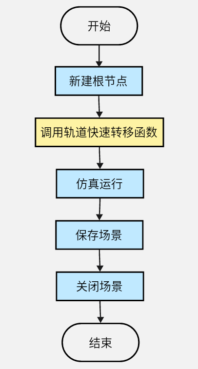
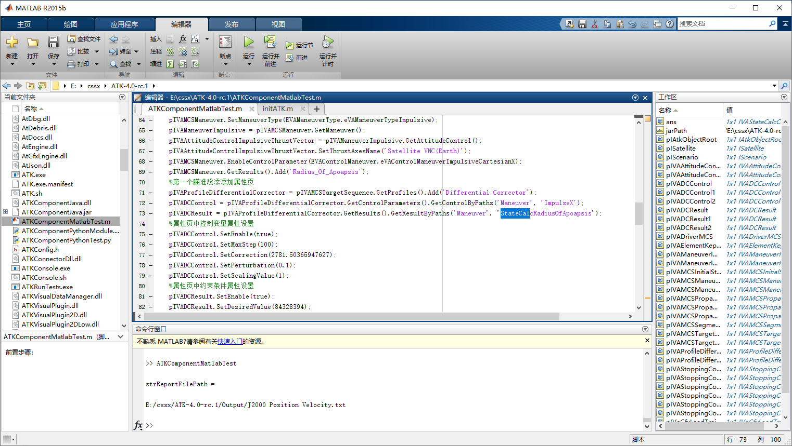

# Matlab案例实现

## Matlab案例流程图



## Matlab案例源码

```matlab
%	前置步骤：
%	1，复制ATK.exe所在路径，设置为Matlab当前路径

%垃圾回收
java.lang.System.gc();

%添加java系统路径和java包jar
jarPath = [pwd,'\\ATKComponentJava.jar'];
if ~any(strcmp(jarPath,javaclasspath()))
    javaaddpath(jarPath)
end

%加载依赖库dll
ATKLibraryLoader.loadLibrary()

%导入java接口封装类
import com.atk.component.*;

%设置编码类型，用于区分字符
ATKComponentJavaModule.SetCallCodeType('matlab');
%设置默认输出路径
ATKComponentJavaModule.SetSaveFileBasePath(pwd);
	
%新建根结点
pIAtkObjectRoot = IAtkObjectRoot();
%场景新建与属性设置
pIScenario = pIAtkObjectRoot.GetChildren().New(EATKObjectType.eScenario,'FastTransfer');
pIScenario.SetTimePeriod('5 Nov 2022 00:00:00.000', '6 Nov 2022 00:00:00.000');
%卫星新建与轨道预报设置为机动规划
pISatellite = pIScenario.GetChildren().New(EATKObjectType.eSatellite,'Satellite1');
%设置二维属性轨迹显示时长
pIVeGfxLeadTrailData = pISatellite.GetGraphics().GetPassData().GetGroundTrack();
pIVeGfxLeadTrailData.SetTrailDataType(ELeadTrailData.eDataTime);
pIVeLeadTrailDataTime = pIVeGfxLeadTrailData.GetTrailData();
pIVeLeadTrailDataTime.SetTime(24*60*60);
pISatellite.SetPropagatorType(EVePropagatorType.ePropagatorAstromaster);
pIVADriverMCS = pISatellite.GetPropagator();
pIVAMCSSegmentCollection = pIVADriverMCS.GetMainSequence();
%机动规划添加段，新添加卫星会有默认初始段
pIVAMCSInitialState = pIVAMCSSegmentCollection.Item(0);
pIVAMCSPropagate = pIVAMCSSegmentCollection.Insert(EVASegmentType.eVASegmentTypePropagate, 'Propagate', '-');
pIVAMCSTargetSequence = pIVAMCSSegmentCollection.Insert(EVASegmentType.eVASegmentTypeTargetSequence, 'TargetSequence', '-');
pIVAMCSManeuver = pIVAMCSTargetSequence.GetSegments().Insert(EVASegmentType.eVASegmentTypeManeuver, 'Maneuver', '-');
pIVAMCSPropagate1 = pIVAMCSSegmentCollection.Insert(EVASegmentType.eVASegmentTypePropagate, 'Propagate', '-');
pIVAMCSTargetSequence1	= pIVAMCSSegmentCollection.Insert(EVASegmentType.eVASegmentTypeTargetSequence, 'TargetSequence1', '-');
pIVAMCSManeuver1 = pIVAMCSTargetSequence1.GetSegments().Insert(EVASegmentType.eVASegmentTypeManeuver, 'Maneuver', '-');
pIVAMCSPropagate2 = pIVAMCSSegmentCollection.Insert(EVASegmentType.eVASegmentTypePropagate, 'Propagate', '-');
%初始段属性设置
pIVAMCSInitialState.SetOrbitEpoch('5 Nov 2022 00:00:00.000');
pIVAMCSInitialState.SetElementType(EVAElementType.eVAElementTypeKeplerian);
pIVAElementKeplerian = pIVAMCSInitialState.GetElement();
pIVAElementKeplerian.SetSemiMajorAxis(6700000);
pIVAElementKeplerian.SetEccentricity(0);
pIVAElementKeplerian.SetInclination(0);
pIVAElementKeplerian.SetRAAN(0);
pIVAElementKeplerian.SetArgOfPeriapsis(0);
pIVAElementKeplerian.SetTrueAnomaly(0);
%第一个预报段属性设置
pIVAStoppingConditionElement = pIVAMCSPropagate.GetStoppingConditions().Add('Duration');
pIVAStoppingCondition = pIVAStoppingConditionElement.GetProperties();
pIVAStoppingCondition.SetTrip(7200);
pIVAStoppingCondition.SetTolerance(0.0001);
%第一个瞄准段中机动段属性设置
pIVAMCSManeuver.SetManeuverType(EVAManeuverType.eVAManeuverTypeImpulsive);
pIVAManeuverImpulsive = pIVAMCSManeuver.GetManeuver();
pIVAAttitudeControlImpulsiveThrustVector = pIVAManeuverImpulsive.GetAttitudeControl();
pIVAAttitudeControlImpulsiveThrustVector.SetThrustAxesName('Satellite VNC(Earth)');
pIVAMCSManeuver.EnableControlParameter(EVAControlManeuver.eVAControlManeuverImpulsiveCartesianX);
pIVAMCSManeuver.GetResults().Add('Radius_Of_Apoapsis');
%第一个瞄准段添添加属性页
pIVAProfileDifferentialCorrector = pIVAMCSTargetSequence.GetProfiles().Add('Differential Corrector');
pIVADCControl = pIVAProfileDifferentialCorrector.GetControlParameters().GetControlByPaths('Maneuver', 'ImpulseX');
pIVADCResult = pIVAProfileDifferentialCorrector.GetResults().GetResultByPaths('Maneuver', "StateCalc"+'RadiusOfApoapsis');
%属性页中控制变量属性设置
pIVADCControl.SetEnable(true);
pIVADCControl.SetMaxStep(100);
pIVADCControl.SetCorrection(2781.50365947627);
pIVADCControl.SetPerturbation(0.1);
pIVADCControl.SetScalingValue(1);
%属性页中约束条件属性设置
pIVADCResult.SetEnable(true);
pIVADCResult.SetDesiredValue(84328394);
pIVADCResult.SetScalingValue(1);
pIVADCResult.SetTolerance(0.1);
pIVADCResult.SetWeight(1);
%第二个预报段属性设置
pIVAStoppingConditionElement1 = pIVAMCSPropagate1.GetStoppingConditions().Add('RMagnitude');
pIVAStoppingCondition1 = pIVAStoppingConditionElement1.GetProperties();
pIVAStoppingCondition1.SetTrip(42164197);
pIVAStoppingCondition1.SetTolerance(1e-6);
pIVAStoppingCondition1.SetRepeatCount(1);
pIVAStoppingCondition1.SetCriterion(EVACriterion.eVACriterionCrossEither);
%第二个瞄准段中机动段属性设置
pIVAMCSManeuver1.SetManeuverType(EVAManeuverType.eVAManeuverTypeImpulsive);
pIVAManeuverImpulsive1 = pIVAMCSManeuver1.GetManeuver();
pIVAAttitudeControlImpulsiveThrustVector1 = pIVAManeuverImpulsive1.GetAttitudeControl();
pIVAAttitudeControlImpulsiveThrustVector1.SetThrustAxesName('Satellite VNC(Earth)');
pIVAMCSManeuver1.EnableControlParameter(EVAControlManeuver.eVAControlManeuverImpulsiveCartesianX);
pIVAMCSManeuver1.EnableControlParameter(EVAControlManeuver.eVAControlManeuverImpulsiveCartesianZ);
pIVAMCSManeuver1.GetResults().Add('Eccentricity');
pIVAMCSManeuver1.GetResults().Add('Cosine_of_Vertical_FPA');
%第二个瞄准段添加属性页
pIVAProfileDifferentialCorrector1 = pIVAMCSTargetSequence1.GetProfiles().Add('Differential Corrector');
%属性页中控制变量属性设置
pIVADCControl1 = pIVAProfileDifferentialCorrector1.GetControlParameters().Item(0);
pIVADCControl1.SetEnable(true);
pIVADCControl1.SetMaxStep(300);
pIVADCControl1.SetCorrection(-1581.97670664023);
pIVADCControl1.SetPerturbation(0.1);
pIVADCControl1.SetScalingValue(1);
pIVADCControl2 = pIVAProfileDifferentialCorrector1.GetControlParameters().Item(1);
pIVADCControl2.SetEnable(true);
pIVADCControl2.SetMaxStep(300);
pIVADCControl2.SetCorrection(-2771.82057041661);
pIVADCControl2.SetPerturbation(0.1);
pIVADCControl2.SetScalingValue(1);
%属性页中约束条件属性设置
pIVADCResult1 = pIVAProfileDifferentialCorrector1.GetResults().Item(0);
pIVADCResult1.SetEnable(true);
pIVADCResult1.SetDesiredValue(0);
pIVADCResult1.SetScalingValue(1);
pIVADCResult1.SetTolerance(0.1);
pIVADCResult1.SetWeight(1);
pIVADCResult2 = pIVAProfileDifferentialCorrector1.GetResults().Item(1);
pIVADCResult2.SetEnable(true);
pIVADCResult2.SetDesiredValue(0);
pIVADCResult2.SetScalingValue(1);
pIVADCResult2.SetTolerance(0.1);
pIVADCResult2.SetWeight(1);
%第三个预报段属性设置
pIVAStoppingConditionElement2 = pIVAMCSPropagate2.GetStoppingConditions().Add('Duration');
pIVAStoppingCondition2 = pIVAStoppingConditionElement2.GetProperties();
pIVAStoppingCondition2.SetTrip(86400);
pIVAStoppingCondition2.SetTolerance(0.0001);
%机动规划运行
pIVADriverMCS.RunMCS();
pIVADriverMCS.ApplyAllProfileChanges();
%生成数据到文仿
strReportFilePath = pIAtkObjectRoot.OutputDataReport(pISatellite, 'J2000 Position Velocity', '5 Nov 2022 00:00:00.000', '6 Nov 2022 00:00:00.000');
%仿真运行
pIAtkObjectRoot.GetAnimation().PlayForward();
%保存场景
pIAtkObjectRoot.SaveScenario();
%关闭场景
pIAtkObjectRoot.CloseScenario();
%输出数据报告目录
strReportFilePath
```

## Matlab案例执行命令
打开Matlab软件，设置依赖路径并初始化依赖环境，调用运行Matlab案例脚本，具体步骤如下：

	1. 复制ATK安装包根目录路径，设置为Matlab当前路径；

	2. 双击打开Matlab案例脚本ATKComponentMatlabTest.m；

	3. 点击运行Matlab案例脚本，如图所示。


