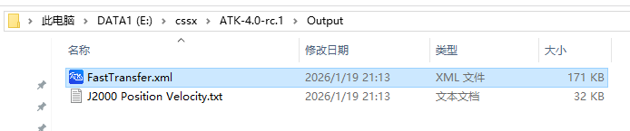
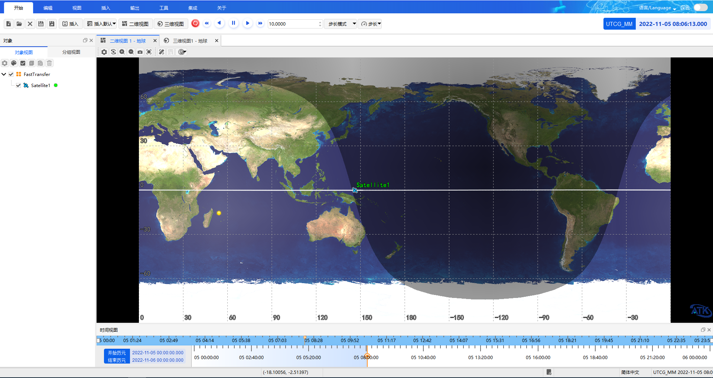

# 案例结果

成功运行Matlab案例脚本ATKComponentMatlabTest.m，会生成卫星数据报告“J2000 Position Velocity.txt”以及轨道快速转移想定文件“FastTransfer.xml”。以上文件均存放在输出目录Output，如图所示。

打开ATK检查生成的想定文件，选择轨道快速转移想定文件“FastTransfer.xml”，点击“开始”按钮运行动画，拉动下方时间轴查看二维视图下的轨迹效果，如图所示。

点击ATK“三维视图”按钮切换至三维视图，查看三维效果，如图所示。

