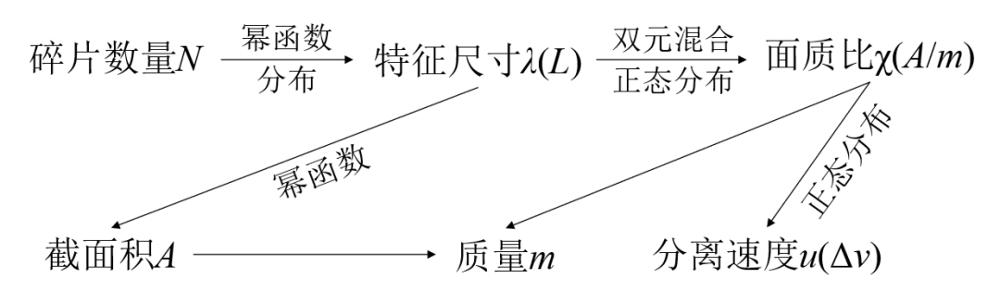
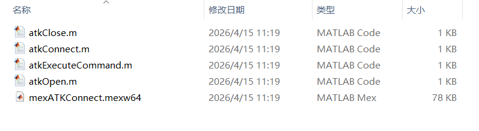
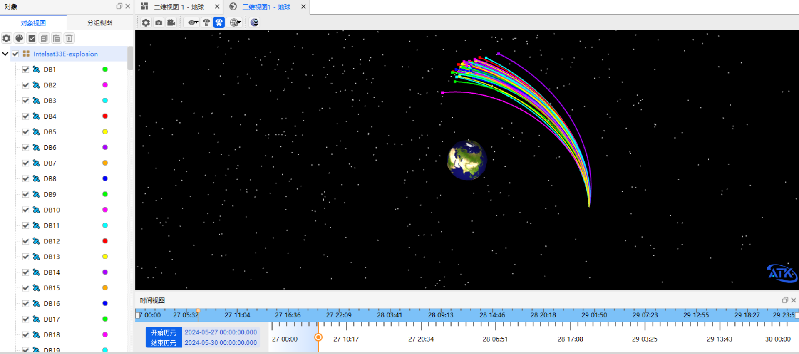
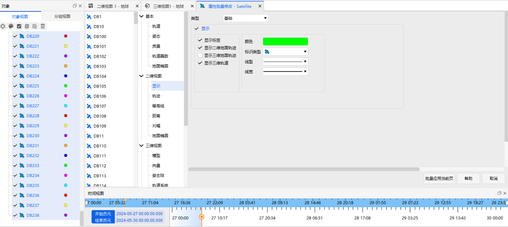
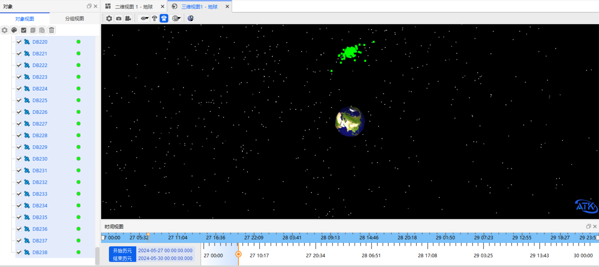

# Intelsat 33E Satellite Breakup Debris Simulation

## Introduction

Around 04:30 (UTC) on October 19, 2024, Intelsat reported an [anomalous power loss](https://www.aiaa.org/news/news/2024/10/22/intelsat-s-is-33e-satellite-a-total-loss-after-breaking-up-in-orbit) suffered in orbit by the Intelsat 33E (IS-33e) geostationary satellite built by Boeing for the company. Shortly afterwards, the U.S. Space Force confirmed through observation that the incident was a breakup event. Four days later, the Russian state space corporation reported that more than 80 debris objects associated with the event had been tracked, and further characterized the breakup as an explosion. As of October 28, the U.S. commercial space situational awareness company ExoAnalytic Solutions had identified about 500 debris objects associated with the incident. The accident affected communication services covering Europe, Africa, Asia, and Australia, and posed a continuous collision threat to other satellites in the GEO belt.


Against the background of the Intelsat 33E breakup event, this document uses the standard spacecraft breakup model and the Connect mode of ATK secondary development to analyze the evolution of the debris generated by the incident. First, C++ is used to implement the breakup model, generating a large number of debris objects through discrete sampling and obtaining the velocity vectors of the individual debris objects. Then the ATK.connect dynamic library is used to insert the debris objects into the ATK scenario with user-defined positions and velocities, and the built-in propagator is used to perform a 7-day evolution analysis on the debris population, obtaining the distribution characteristics of the debris and intuitively revealing the continuous distribution and evolution of the breakup debris in the GEO region.

## Debris Generation

The NASA standard breakup model<sup>[1]</sup> is used to generate the velocity vectors of the debris. The parameter dependencies of this model are shown in the figure below.



A debris population with characteristic sizes larger than 1 mm is generated by discrete sampling, and the separation velocity is superimposed on the orbital velocity of the Intelsat 33E parent satellite to obtain the velocity vector of each debris object; the results are stored in the `is33e_result.csv` file.

## Scenario Creation and Debris Object Insertion

1. **Create a scenario**: Install and run ATK.exe, and once the ATK interface appears, do not perform any operation!

2. **Insert debris objects**

   First, copy the ATK Connect dynamic library file from the installation directory (`IntegratingWithATK/connect/Matlab/Win_2015b`) to the MATLAB working directory, and use the `atkOpen` command to establish a connection between MATLAB and ATK.

   

   Then read the position and velocity parameters of the breakup debris, create each debris object one by one with the `New` command, and set its position and velocity information with the `SetState` command. After all the debris objects have been inserted, use the `Save` command to save the ATK scenario file, and use the `atkClose` command to close the connection between ATK and MATLAB. The MATLAB code for the whole flow is as follows:

   ```matlab
    % 链接ATK接口
    conID = atkOpen();

    %新建场景同时设置仿真时间
    atkConnect(conID, 'New', '/ Scenario Intelsat33E-explosion');
    atkConnect(conID, 'SetAnalysisTimePeriod', '* "2024-10-19 04:30:00.000" "2024-10-26 04:30:00.000"');
    atkConnect(conID, 'Animate', '* Reset');

    % 读取数据文件
    filename = 'is33e_result_10cm.csv';
    data = importdata(filename);
    data = data.textdata;
    vdata = data(2:end,9); rdata = data(2:end,10);
    % vdata = data(2:300,9); rdata = data(2:300,10);

    for ic = 1:1:size(vdata,1)
        r  = char(rdata(ic,:)); r = r(2:end-1);
        v  = char(vdata(ic,:)); v = v(2:end-1);
        rv = [r,' ',v];
        name = ['DB',num2str(ic)];

        % 新建卫星对象
        atkConnect(conID, 'New', ['/ Satellite ',name]);
        % 设置位置速度信息
        cmd = ['*/Satellite/',name,' Cartesian TwoBody NoProp 60.0 J2000 "27 May 2024 00:00:00.00" ',rv]; % 
        atkConnect(conID, 'SetState',cmd(1:end-1));
    end

    % 重置场景信息，加载卫星数据！！！
    atkConnect(conID, 'Animate', '* Reset');

    % ATK保存退出
    atkConnect(conID,'Save','/ *');
    atkClose(conID);
   ```

After the debris objects have been inserted, the ATK interface is shown in the figure below. To make the debris display clearer, box-select all the debris objects, right-click and choose <kbd>Batch Property Edit</kbd>, and in【2D Graphics - Display】uncheck【Display 3D Tracks】, then click <kbd>Batch Apply to Current Page</kbd> to apply the settings.







## Simulation Results and Analysis

The two-body propagator is used to perform a 7-day propagation analysis on all the breakup debris. The results show that most of the debris will still operate near the original orbit of Intelsat 33E. However, due to differences in separation velocity, the debris will spread in phase along the original orbit and, over time, gradually extend across the entire orbit range.

Because the objects in the GEO belt are densely distributed and lack natural removal mechanisms, the breakup debris will pose a persistent collision threat to other spacecraft in the GEO belt and cause great damage to the space environment. Therefore, promptly performing orbit propagation and tracking observation of the breakup debris and taking proactive measures to reduce the impact risk are crucial to the safety of the GEO orbit.

## References

[1] JOHNSON N L, KRISKO P H, LIOU J C, et al. NASA's new breakup model of evolve 4.0[J]. Advances in Space Research, 2001, 28(9): 1377-1384.
