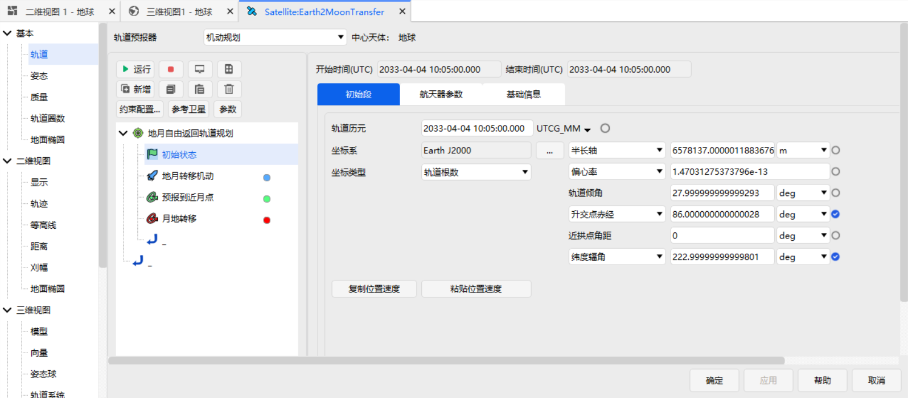
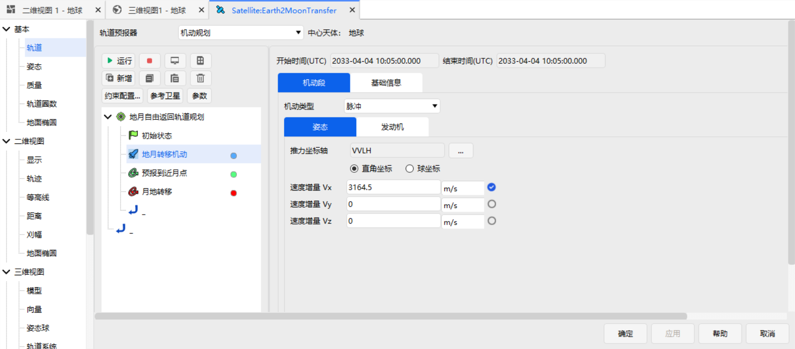
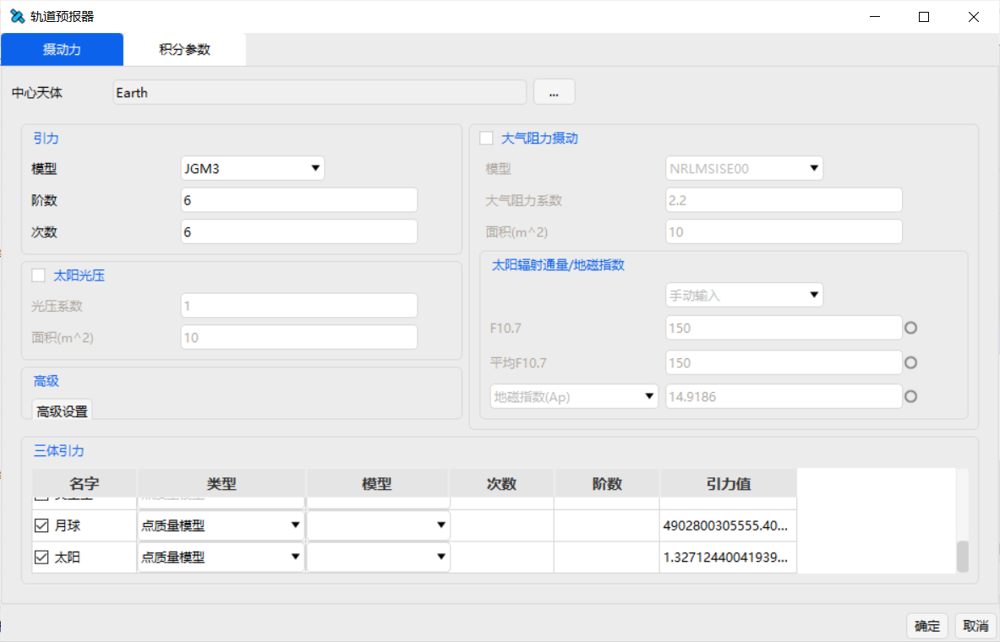
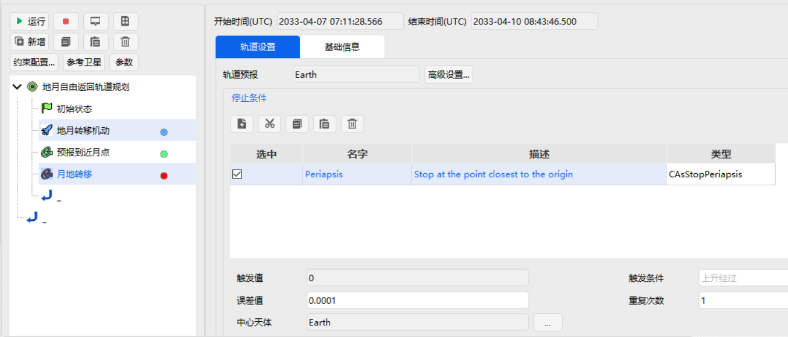
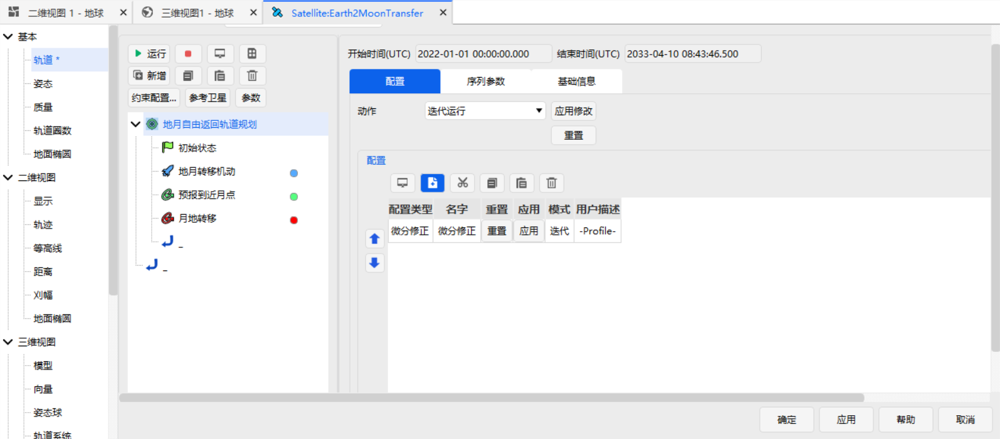
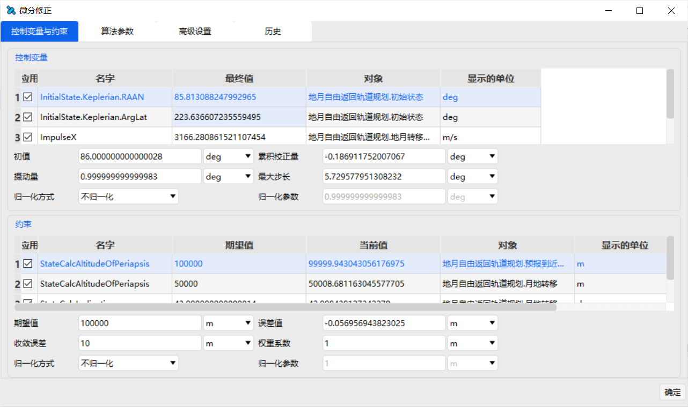
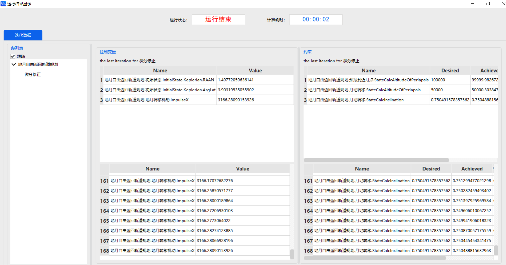
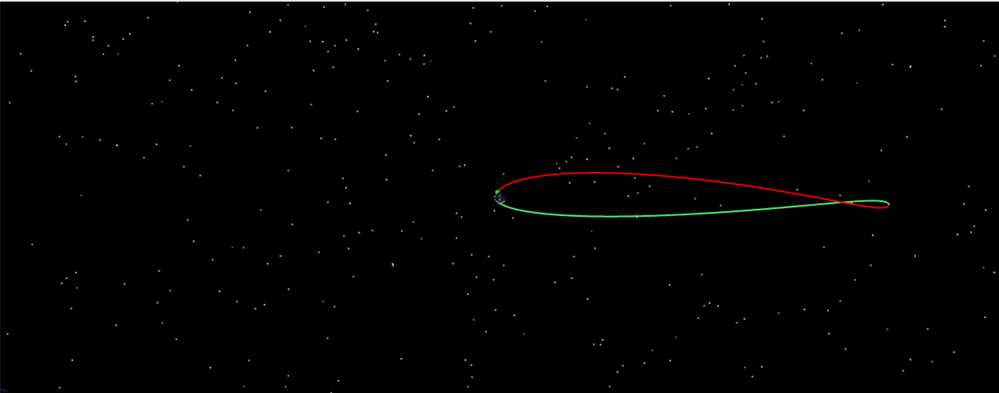

# Earth-Moon Free-Return Trajectory Design

## Introduction

A free-return trajectory is a trajectory that departs from the Earth and returns safely to the Earth around the Moon without applying any maneuver, as shown in the figure below. Such trajectories play an important role in safeguarding the lives of astronauts and are therefore widely used in crewed lunar exploration missions, such as Apollo 8, 10, and 11 of the United States.

In essence, the design of an Earth-Moon free-return trajectory is a boundary-value problem of a set of nonlinear equations. By solving this boundary-value problem, a free-return trajectory that satisfies the constraints at a given time is obtained. The boundary conditions of this problem are the epoch of the near-Earth departure orbit, the orbital altitude at the near-Earth departure point, the orbital eccentricity at the near-Earth departure point (equal to 0), the orbital inclination at the near-Earth departure point, the perilune altitude, and the perigee altitude and perigee orbital inclination of the return leg after flying around the Moon. The parameters to be solved are the right ascension of the ascending node of the near-Earth departure orbit, the argument of latitude at the near-Earth departure point, and the magnitude of the near-Earth departure velocity increment (a tangential velocity increment is usually applied).

In this case, the boundary condition parameters are set as follows: the epoch of the near-Earth departure orbit is 2033-04-04 10:05:00.000 (it can be chosen arbitrarily), the orbital altitude at the near-Earth departure point is 170 km, the orbital eccentricity at the near-Earth departure point is 0, the orbital inclination at the near-Earth departure point is 28°, the perilune altitude is 100 km, the perigee altitude of the return leg after flying around the Moon is 50 km, and the perigee orbital inclination of the return leg after flying around the Moon is 43°. The initial values of the parameters to be solved are set as follows: the right ascension of the ascending node of the near-Earth departure orbit is 86°, the argument of latitude at the near-Earth departure point is 223°, and the magnitude of the departure velocity increment is 3.1645 km/s.

## Creating the Earth-Moon Free-Return Trajectory Task Scenario and Objects

[Install](https://www.osredm.com/atknudt/atk) and run ATK.exe, and create a new scenario "Earth2MoonTransfer". Set the start epoch to 2033-04-04 10:00:00.000000 and the stop epoch to 2033-04-11 20:00:00.000000; insert a satellite object and name it "Earth2MoonTransfer". Select Astrogator as the propagator type.

## Designing the Free-Return Trajectory

1. **Define the target sequence**

    Add a target sequence, name it "Earth-Moon Free-Return Trajectory Planning", and then embed an Initial State segment in it, named "Initial State". Set the orbital epoch (UTCG) to 2033-04-04 10:05:00.000. Select the Earth J2000 coordinate system and the orbital elements coordinate type, as shown in the figure below.

    

    After the Initial State segment, insert a Maneuver segment and name it "Trans-Lunar Injection Maneuver". Set the maneuver type to impulsive maneuver and the thrust coordinate axes to the VVLH coordinate system. The velocity increments along the X, Y, and Z axes are 3.1645 km/s, 0 km/s, and 0 km/s, respectively; only the X-axis velocity increment is checked.

    

    After the Maneuver segment, insert a Propagate segment, name it "Propagate to Perilune", select Earth as the central body and JGM3 as the gravity model, set both the degree and order of the gravity field to 6, ignore the atmospheric drag and solar radiation pressure perturbations, consider the third-body perturbations of the Sun and the Moon with the "Point Mass" model selected, and choose "CAsStopPeriapsis" (stop when propagating to periapsis) as the stopping condition with "Moon" as the central body.

    

    After the "Propagate to Perilune" segment, insert another Propagate segment and name it "Moon-to-Earth Transfer". The perturbation settings are the same as in the previous step. Choose "CAsStopPeriapsis" (stop when propagating to periapsis) as the stopping condition with "Earth" as the central body.

    

2. **Select the variables**

    In the Initial State segment, select the argument of latitude and the right ascension of the ascending node as the design variables; in the trans-lunar injection Maneuver segment, select the X-axis velocity increment as the design variable. For the "Propagate to Perilune" segment, select CStateCalcAltitudeOfPeriapsis as the constraint with the Moon as the central body; for the Moon-to-Earth transfer segment, select CStateCalcAltitudeOfPeriapsis and CStateCalcInclination as the constraints with the Earth as the central body.

3. **Set the targeter**

    Select <kbd>Differential Corrector</kbd> as the configuration type of the Earth-Moon Free-Return Trajectory Planning target sequence.

    

    Double-click <kbd>Differential Corrector</kbd> to enter the【Targeter Settings】interface. Click the boxes under the "Use" column in "Control Variables" and "Constraints" respectively to check the control variables and constraints to be used. The specific control variables and constraints and their values are shown in the figure below. The desired perilune altitude is 100 km, the desired perigee altitude is 50 km, and the desired perigee orbital inclination is 43°. The convergence tolerance of the perilune altitude and perigee altitude is 0.01 km, and the convergence tolerance of the orbital inclination is 0.001°. Note that "Do Not Normalize" should be selected as the【Normalization】mode for all parameters; the remaining parameters can use their default values.

    

## Running the Earth-Moon Free-Return Trajectory and Analyzing It

After the control sequence of the whole task has been built, click the target sequence and select <kbd>Run Iterations</kbd>, then click <kbd>Run</kbd>. You can view the running results in the 3D view or 2D view.

In ATK, four different initial values are set for the three control variables (the argument of latitude at the near-Earth departure point, the right ascension of the ascending node of the near-Earth departure orbit, and the magnitude of the near-Earth departure velocity increment), and the free-return trajectories satisfying the constraints are computed separately for each case. The computation shows that, for all four cases, the software can obtain a solution satisfying the constraints, and the specific values are listed in the table below. Therefore, within a certain range of initial values, free-return trajectories satisfying the constraints can be designed using ATK.

|        | Initial argument of latitude | Initial RAAN | Initial velocity increment | Computed argument of latitude | Computed RAAN | Computed velocity increment |
|--------|------------------------------|--------------|----------------------------|-------------------------------|---------------|-----------------------------|
| Case 1 | 223                          | 86           | 3164.5                     | 223.6366                      | 85.8131       | 3166.2809                   |
| Case 2 | 225                          | 88           | 3169.0                     | 224.0731                      | 84.9426       | 3168.9546                   |
| Case 3 | 226                          | 88           | 3168.5                     | 223.6366                      | 85.8131       | 3166.2809                   |
| Case 4 | 224                          | 88           | 3167.0                     | 219.9391                      | 90.5907       | 3173.2000                   |

One of the free-return trajectory results is selected for display, as shown below.

