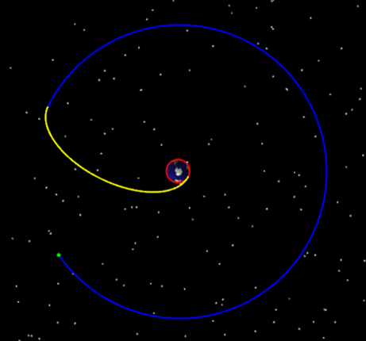
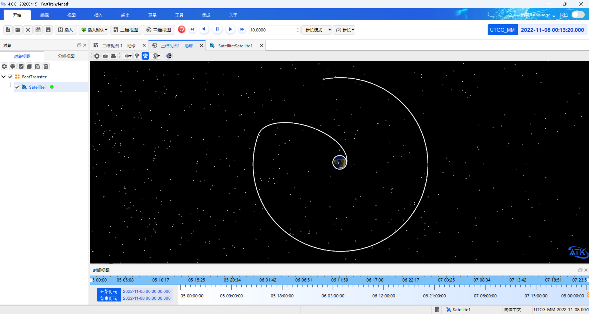
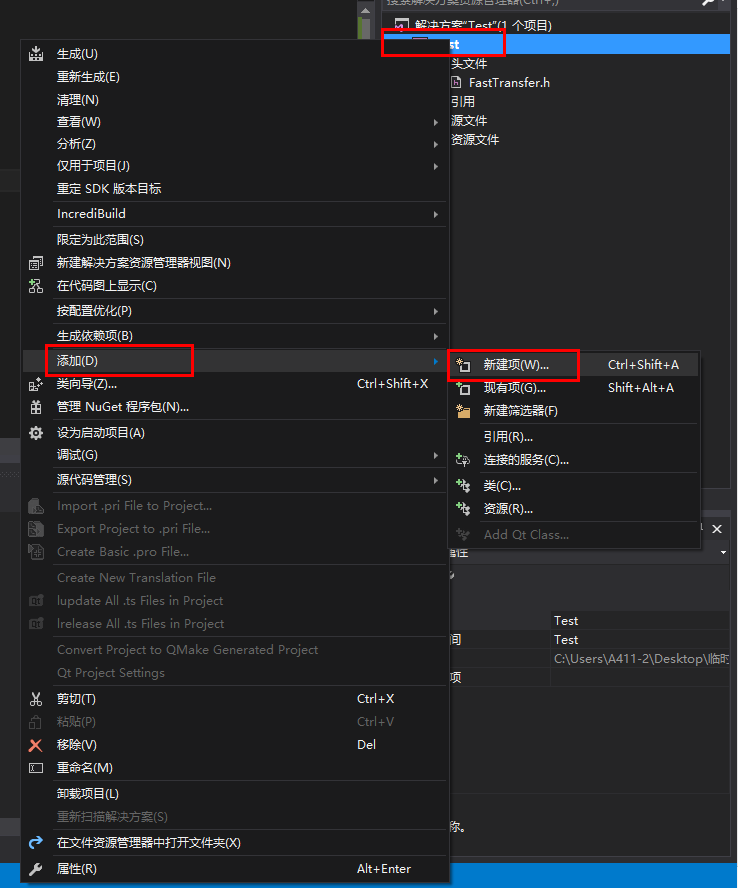
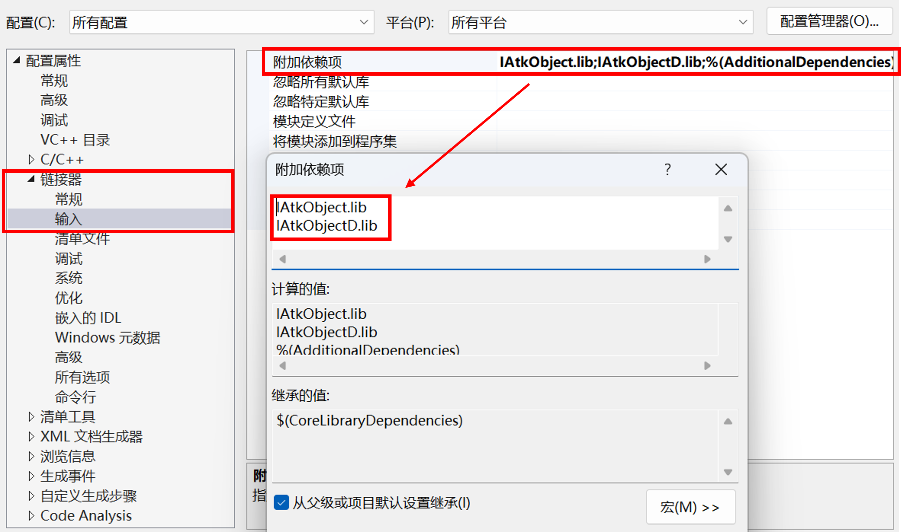

# Fast Orbit Transfer Implementation in C++ Based on the ATK.Component Mode

## Introduction

This case implements the orbital maneuver planning design for a fast transfer from a near-Earth parking orbit (LEO orbit) with a radius of 6700 km to a geosynchronous orbit (GEO orbit) with a radius of 42164.197 km. The case is encoded and implemented in C++ based on the ATK.Component dynamic library in the Component mode.

This case uses a Visual Studio project: the code is compiled in C++ using the provided header files and library files, the case is implemented, and the scenario file is saved. The provided files are listed below:

<PathViewer
  :relative-paths="files"
/>

This case generates the scenario file "FastTransfer.atk" and the report file "J2000位置速度.txt". Both generated files are located in the Output folder of the project output directory, as shown in the figure below:


Open the scenario file with the ATK software, and the fast transfer track is shown in the figure below.



## Case Implementation

This case is developed with Visual Studio 2015 (the ATK.Component dynamic library supports higher versions of Visual Studio). The case implementation flow is as follows.

1. Start Visual Studio 2015, click <kbd>New</kbd> in the <kbd>File</kbd> menu bar, and then click <kbd>Project</kbd>. The【New Project】dialog box opens.

2. In the project type templates, select the Visual C++ project, then select Empty Project, enter "Test" as the project name, and click <kbd>OK</kbd> to finish creating the project.

3. Copy the required files to the project directory (for the specific operations, refer to the appendix at the end of this file).

4. Create a new "FastTransfer.cpp" file, include the header file "IAtkObjectH.h", add the main() function, and write the case code (the code can be copied directly, compiled, and run).

```cpp title="FastTransfer.cpp"
// 代码结构功能流程说明
//（1）包含所需头文件，并添加执行函数
//（2）添加根节点
//（3）想定新建与属性设置
//（4）卫星新建与轨道预报设置为机动规划
//（5）机动规划添加段，新添加卫星会有默认初始段
//（6）初始段属性设置
//（7）第一个预报段属性设置
//（8）第一个瞄准段中机动段属性设置
//（9）第一个瞄准段添加属性页，并设置属性页中控制变量与约束条件的属性
//（10）第二个预报段属性设置
//（11）第二个瞄准段中机动段属性设置
//（12）第二个瞄准段添加属性页，并设置属性页中控制变量与约束条件的属性
//（13）第三个预报段属性设置
//（14）机动规划运行
//（15）生成数据到文件
//（16）想定保存及关闭

#pragma once
#include <iostream>
#include <stdlib.h>
#include "IAtkObjectH.h"    // 包含头文件

using namespace std;

int main()
{
    IAtkObjectRoot* pRoot = new IAtkObjectRoot();

    // 想定新建与属性设置
    IScenario* pIScen = (IScenario*)pRoot->GetChildren()->New(eScenario, "FastTransfer");
    if (nullptr == pIScen) return false;
    pIScen->SetTimePeriod("5 Nov 2022 00:00:00.000", "8 Nov 2022 00:00:00.000");

    // 卫星新建与轨道预报设置为机动规划
    ISatellite* pISatellite = (ISatellite*)pIScen->GetChildren()->New(eSatellite, "Satellite1");
    pISatellite->SetPropagatorType(ePropagatorAstromaster);
    IVADriverMCS* pIVADriverMCS = (IVADriverMCS*)pISatellite->GetPropagator();
    IVAMCSSegmentCollection* pIVAMCSSegmentCollection = pIVADriverMCS->GetMainSequence();

    // 机动规划添加段，新添加卫星会有默认初始段（直接获取第一段，无需检查类型）
    IVAMCSInitialState* pIVAMCSInitialState = (IVAMCSInitialState*)pIVAMCSSegmentCollection->Item(0);

    IVAMCSPropagate* pIVAMCSPropagate = (IVAMCSPropagate*)pIVAMCSSegmentCollection->Insert(
        eVASegmentTypePropagate, "Propagate", "-");
    IVAMCSTargetSequence* pIVAMCSTargetSequence = (IVAMCSTargetSequence*)pIVAMCSSegmentCollection->Insert(
        eVASegmentTypeTargetSequence, "TargetSequence", "-");
    IVAMCSManeuver* pIVAMCSManeuver = (IVAMCSManeuver*)pIVAMCSTargetSequence->GetSegments()->Insert(
        eVASegmentTypeManeuver, "Maneuver", "-");
    IVAMCSPropagate* pIVAMCSPropagate1 = (IVAMCSPropagate*)pIVAMCSSegmentCollection->Insert(
        eVASegmentTypePropagate, "Propagate", "-");
    IVAMCSTargetSequence* pIVAMCSTargetSequence1 = (IVAMCSTargetSequence*)pIVAMCSSegmentCollection->Insert(
        eVASegmentTypeTargetSequence, "TargetSequence1", "-");
    IVAMCSManeuver* pIVAMCSManeuver1 = (IVAMCSManeuver*)pIVAMCSTargetSequence1->GetSegments()->Insert(
        eVASegmentTypeManeuver, "Maneuver", "-");
    IVAMCSPropagate* pIVAMCSPropagate2 = (IVAMCSPropagate*)pIVAMCSSegmentCollection->Insert(
        eVASegmentTypePropagate, "Propagate", "-");

    // 初始段属性设置
    pIVAMCSInitialState->SetOrbitEpoch("5 Nov 2022 00:00:00.000");
    pIVAMCSInitialState->SetElementType(eVAElementTypeKeplerian);
    IVAElementKeplerian* pIVAElementKeplerian = (IVAElementKeplerian*)pIVAMCSInitialState->GetElement();
    pIVAElementKeplerian->SetSemiMajorAxis(6700000.0);
    pIVAElementKeplerian->SetEccentricity(0);
    pIVAElementKeplerian->SetInclination(0);
    pIVAElementKeplerian->SetRAAN(0);
    pIVAElementKeplerian->SetArgOfPeriapsis(0);
    pIVAElementKeplerian->SetTrueAnomaly(0);

    // 第一个预报段属性设置
    IVAStoppingConditionElement* pIVAStoppingConditionElement =
        pIVAMCSPropagate->GetStoppingConditions()->Add("Duration");
    IVAStoppingCondition* pIVAStoppingCondition =
        (IVAStoppingCondition*)pIVAStoppingConditionElement->GetProperties();
    pIVAStoppingCondition->SetTrip(7200);
    pIVAStoppingCondition->SetTolerance(0.0001);

    // 第一个瞄准段中机动段属性设置
    pIVAMCSManeuver->SetManeuverType(eVAManeuverTypeImpulsive);
    IVAManeuverImpulsive* pIVAManeuverImpulsive = (IVAManeuverImpulsive*)pIVAMCSManeuver->GetManeuver();
    IVAAttitudeControlImpulsiveThrustVector* pIVAAttitudeControlImpulsiveThrustVector =
        (IVAAttitudeControlImpulsiveThrustVector*)pIVAManeuverImpulsive->GetAttitudeControl();
    pIVAAttitudeControlImpulsiveThrustVector->SetThrustAxesName("Satellite VNC(Earth)");
    pIVAMCSManeuver->EnableControlParameter(eVAControlManeuverImpulsiveCartesianX);
    pIVAMCSManeuver->GetResults()->Add("Radius_Of_Apoapsis");

    // 第一个瞄准段添加属性页
    IVAProfileDifferentialCorrector* pIVAProfileDifferentialCorrector =
        (IVAProfileDifferentialCorrector*)pIVAMCSTargetSequence->GetProfiles()->Add(
            "Differential Corrector");
    IVADCControl* pIVADCControl = pIVAProfileDifferentialCorrector->GetControlParameters()->GetControlByPaths(
        "Maneuver", "ImpulseX");
    IVADCResult* pIVADCResult = pIVAProfileDifferentialCorrector->GetResults()->GetResultByPaths(
        "Maneuver", "StateCalcRadiusOfApoapsis");

    // 属性页中控制变量属性设置
    pIVADCControl->SetEnable(true);
    pIVADCControl->SetMaxStep(100);
    pIVADCControl->SetCorrection(2781.50365947627);
    pIVADCControl->SetPerturbation(0.1);
    pIVADCControl->SetScalingValue(1);

    // 属性页中约束条件属性设置
    pIVADCResult->SetEnable(true);
    pIVADCResult->SetDesiredValue(84328394);
    pIVADCResult->SetScalingValue(1);
    pIVADCResult->SetTolerance(0.1);
    pIVADCResult->SetWeight(1);

    // 第二个预报段属性设置
    IVAStoppingConditionElement* pIVAStoppingConditionElement1 =
        pIVAMCSPropagate1->GetStoppingConditions()->Add("Apoapsis");
    IVAStoppingCondition* pIVAStoppingCondition1 =
        (IVAStoppingCondition*)pIVAStoppingConditionElement1->GetProperties();
    pIVAStoppingCondition1->SetTolerance(1e-4);
    pIVAStoppingCondition1->SetRepeatCount(1);

    // 第二个瞄准段中机动段属性设置
    pIVAMCSManeuver1->SetManeuverType(eVAManeuverTypeImpulsive);
    IVAManeuverImpulsive* pIVAManeuverImpulsive1 = (IVAManeuverImpulsive*)pIVAMCSManeuver1->GetManeuver();
    IVAAttitudeControlImpulsiveThrustVector* pIVAAttitudeControlImpulsiveThrustVector1 =
        (IVAAttitudeControlImpulsiveThrustVector*)pIVAManeuverImpulsive1->GetAttitudeControl();
    pIVAAttitudeControlImpulsiveThrustVector1->SetThrustAxesName("Satellite VNC(Earth)");
    pIVAMCSManeuver1->EnableControlParameter(eVAControlManeuverImpulsiveCartesianX);
    pIVAMCSManeuver1->EnableControlParameter(eVAControlManeuverImpulsiveCartesianZ);
    pIVAMCSManeuver1->GetResults()->Add("Eccentricity");
    pIVAMCSManeuver1->GetResults()->Add("Cosine_of_Vertical_FPA");

    // 第二个瞄准段添加属性页
    IVAProfileDifferentialCorrector* pIVAProfileDifferentialCorrector1 =
        (IVAProfileDifferentialCorrector*)pIVAMCSTargetSequence1->GetProfiles()->Add(
            "Differential Corrector");

    // 属性页中控制变量属性设置
    IVADCControl* pIVADCControl1 = pIVAProfileDifferentialCorrector1->GetControlParameters()->Item(0);
    pIVADCControl1->SetEnable(true);
    pIVADCControl1->SetMaxStep(300);
    pIVADCControl1->SetCorrection(1581.97670664023);
    pIVADCControl1->SetPerturbation(0.1);
    pIVADCControl1->SetScalingValue(1);

    IVADCControl* pIVADCControl2 = pIVAProfileDifferentialCorrector1->GetControlParameters()->Item(1);
    pIVADCControl2->SetEnable(true);
    pIVADCControl2->SetMaxStep(300);
    pIVADCControl2->SetCorrection(30.0);
    pIVADCControl2->SetPerturbation(0.1);
    pIVADCControl2->SetScalingValue(1);

    // 属性页中约束条件属性设置
    IVADCResult* pIVADCResult1 = pIVAProfileDifferentialCorrector1->GetResults()->Item(0);
    pIVADCResult1->SetEnable(true);
    pIVADCResult1->SetDesiredValue(0);
    pIVADCResult1->SetScalingValue(1);
    pIVADCResult1->SetTolerance(0.1);
    pIVADCResult1->SetWeight(1);

    IVADCResult* pIVADCResult2 = pIVAProfileDifferentialCorrector1->GetResults()->Item(1);
    pIVADCResult2->SetEnable(true);
    pIVADCResult2->SetDesiredValue(0);
    pIVADCResult2->SetScalingValue(1);
    pIVADCResult2->SetTolerance(0.1);
    pIVADCResult2->SetWeight(1);

    // 第三个预报段属性设置
    IVAStoppingConditionElement* pIVAStoppingConditionElement2 =
        pIVAMCSPropagate2->GetStoppingConditions()->Add("Duration");
    IVAStoppingCondition* pIVAStoppingCondition2 =
        (IVAStoppingCondition*)pIVAStoppingConditionElement2->GetProperties();
    pIVAStoppingCondition2->SetTrip(259200);
    pIVAStoppingCondition2->SetTolerance(0.0001);

    // 机动规划运行
    pIVADriverMCS->RunMCS();
    pIVADriverMCS->ApplyAllProfileChanges();

    // 生成数据到文件
    std::string strReportFilePath = pRoot->OutputDataReport(pISatellite,
        "J2000位置速度", "5 Nov 2022 00:00:00.000", "8 Nov 2022 00:00:00.000");
    cout << "报告文件位置：" << strReportFilePath << endl;

    // 想定保存及关闭
    pRoot->SaveScenario();
    pRoot->CloseScenario();
    delete pRoot;
    pRoot = nullptr;
    system("Pause");
}
```

::: note Note

Before copying the above code into a VS project, make sure that the encoding format of the cpp file is set to `Simplified Chinese (GB2312) - Code page 936`; otherwise errors and warnings will occur during compilation and generation of the executable file: `This file contains characters that cannot be represented in the current code page (936). Please save the file in Unicode format to prevent data loss`.

:::

5. Click <kbd>Local Windows Debugger</kbd> to run the program. Using the save-scenario interface, a scenario file is generated, and the generated file can be viewed in the Output folder of the project directory.

## Case Results

Result display: the generated files are all located in the Output folder of the project directory, as shown in the figure below:


Calling the output-data-report interface generates a report file (the return value of the interface is the location of the data report file), as shown in the figure below:


The position and velocity variation process of the satellite can be output, as shown in the figure below:


After saving the scenario, this case generates the FastTransfer.atk scenario file. Start the ATK software and open the generated scenario file FastTransfer.atk. The fast transfer track of the satellite is displayed in 3D as shown in the figure below:



::: info Note

If the fast transfer track is found to be incompletely displayed, in the ATK graphical interface right-click the "Satellite1" satellite object, select <kbd>Properties</kbd>, enter the satellite object property settings interface, then select the【2D Graphics -> Track】settings and change the track type from【Time】to【All】.

:::

## Appendix: Project Configuration

Take Visual Studio 2015 as an example (the library files support higher versions of VS) to carry out the project configuration. Assume that the user has created a project "Test" and a cpp file "FastTransfer.cpp".

1. **File configuration**

   The files required for secondary development and their paths are shown in the following table.

|       File category        |                      File path                       |                        Description                       |
|:--------------------------:|:----------------------------------------------------:|:--------------------------------------------------------:|
|  Header files (`.h`)       | `(ATK root)\IntegratingWithATK\component\include`    | Contains ATK Component interface header files such as `IAtkObjectH.h` |
|  Dynamic library files (`.dll`) | `(ATK root)\IntegratingWithATK\component\bin`        | Dynamic link library files required by ATK Component at runtime |
|  Static library files (`.lib`)  | `(ATK root)\IntegratingWithATK\component\lib`        | Static library files required by ATK Component at compile time |
|  Auxiliary data files      | `(ATK root)\AstroData`                               | Gravity models, ephemerides, and other auxiliary data files required for running ATK |

Copy all the above files to the root directory of the "Test" project. After the copying is complete, the expected directory structure of the project is shown in the figure below:


2. **Add files to the project**

Right-click the "Test" project -> <kbd>Add</kbd> -> <kbd>New Item</kbd>.



Set the file name and location, click <kbd>Add</kbd>, and after it finishes click <kbd>Build</kbd>.


3. **Modify the project output directory**

Right-click the "Test" project -> <kbd>Properties</kbd>. Set the configuration platform to `All Configurations, All Platforms`, click <kbd>General</kbd> -> <kbd>Output Directory</kbd>, and change the output directory to the root directory of the "Test" project.


4. **Additional include directories settings**

Click <kbd>C/C++</kbd> -> <kbd>General</kbd> -> <kbd>Additional Include Directories</kbd>, and add the header file directory (the `include` folder) to the additional include directories. Click the <kbd>Apply</kbd> button to apply the environment configuration to the project, and click the <kbd>OK</kbd> button.


5. **Additional library directories and additional dependencies settings**

Click <kbd>Linker</kbd> -> <kbd>General</kbd> -> <kbd>Additional Library Directories</kbd>, and add the library file directory (the `lib` folder) to the additional library directories. Then click <kbd>Linker</kbd> -> <kbd>Input</kbd> -> <kbd>Additional Dependencies</kbd>, and add `IAtkObject.lib` and `IAtkObjectD.lib` in the library file directory to the additional dependencies. Click the <kbd>Apply</kbd> button to apply the environment configuration to the project, and click the <kbd>OK</kbd> button.




6. **Configure the dynamic library files and auxiliary data files**

It is recommended to set the configuration of the "Test" project to `Release` mode. Right-click the "Test" project -> <kbd>Build</kbd>. At this time, the terminal will output a successful build message:


Right-click the "Test" project -> <kbd>Open Folder in File Explorer</kbd> to enter the root directory of the "Test" project. At this time, the directory structure of the project root is shown in the figure below:


It can be seen that the `Test.exe` executable file has been generated. However, if you try to run it, you will find that the output results do not match expectations. This is because the dynamic library files (the `bin` folder) and the auxiliary data files (the `AstroData` folder) have not been configured. You need to move **all the `dll` files in the `bin` folder** and the **`AstroData` folder** to the `"Test" project root directory (in the same directory as the executable file)`. After this, the directory structure of the "Test" project root is shown in the figure below:


<script setup>
import PathViewer from "@components/PathViewer/PathViewer.vue";

const files = [
  { path: 'IntegratingWithATK\\component\\include', name: 'Header files (.h)', description: 'Contains ATK Component interface header files such as IAtkObjectH.h' },
  { path: 'IntegratingWithATK\\component\\bin', name: 'Dynamic library files (.dll)', description: 'Dynamic link library files required by ATK Component at runtime' },
  { path: 'IntegratingWithATK\\component\\lib', name: 'Static library files (.lib)', description: 'Static library files required by ATK Component at compile time' },
  { path: 'AstroData', name: 'Auxiliary data files', description: 'Gravity models, ephemerides, and other auxiliary data files required for running ATK' },
];
</script>
