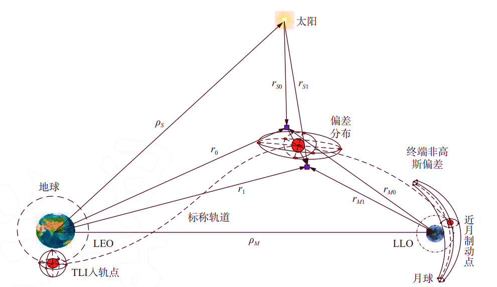
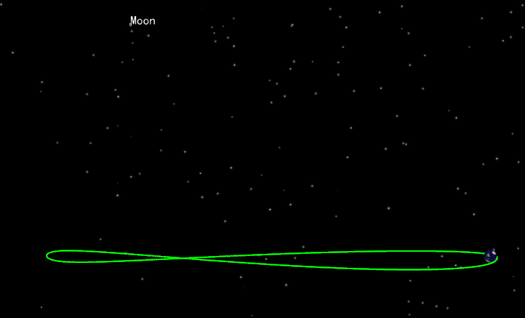
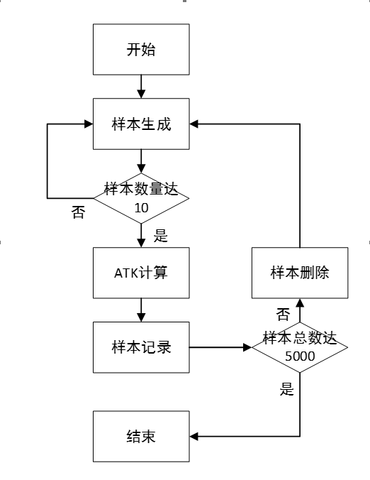
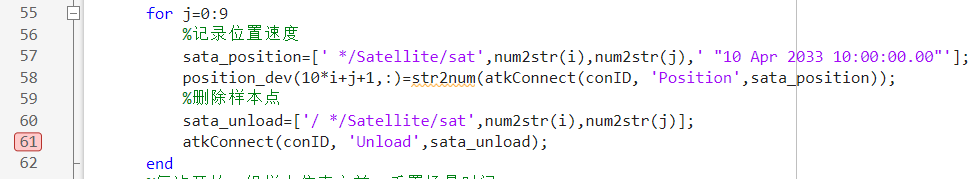
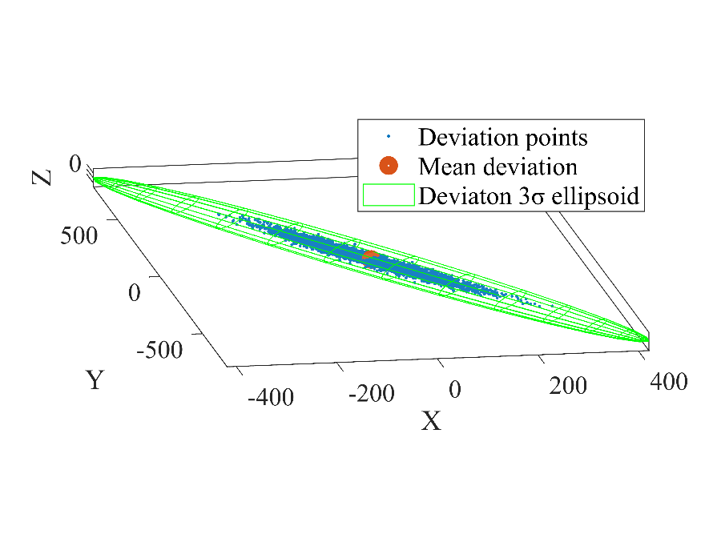
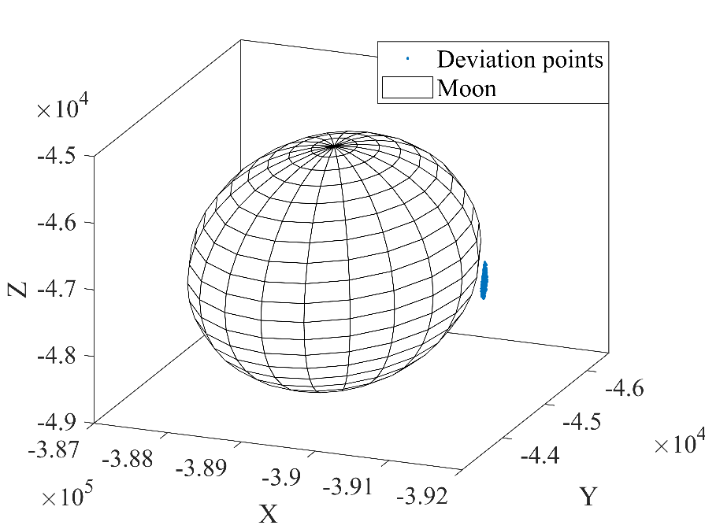
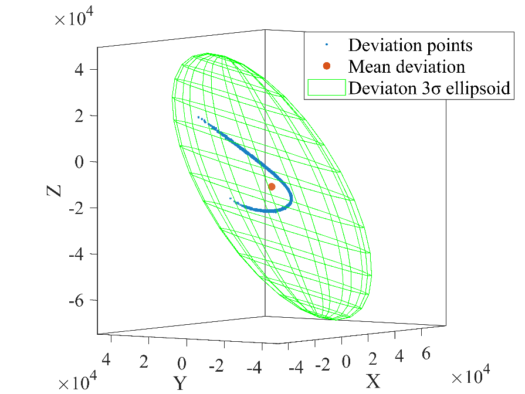
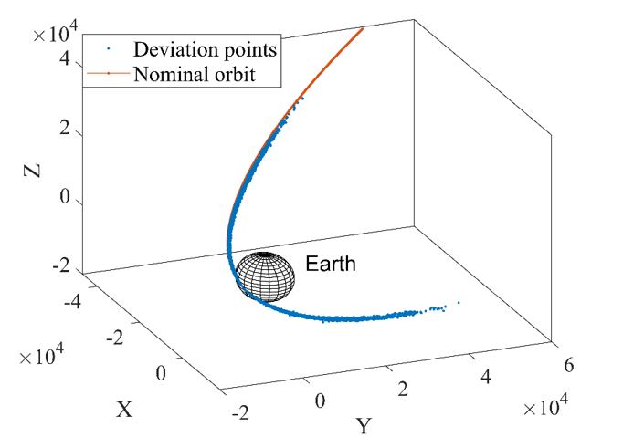

# Orbit Deviation Evolution Analysis Based on Secondary Development

## Introduction

Affected by various errors, the injection parameters of a spacecraft often deviate to some extent from the nominal values, and after a period of evolution, an orbit deviation will appear. To ensure the robustness of an orbit design scheme, the state deviation of the spacecraft needs to be accurately predicted, and therefore the orbit deviation evolution analysis of a spacecraft is of great significance. The figure below is a schematic of the evolution of orbit deviation in cislunar space. In engineering, in order to obtain more accurately the distribution of the deviation after nonlinear propagation, the Monte Carlo method is generally adopted to carry out a large number of random samplings and simulations.



The aerospace mission toolbox ATK (Aerospace Tool Kit) software itself does not provide an accurate deviation evolution analysis function, but the accurate deviation evolution based on the Monte Carlo method can be implemented through the secondary development module. The secondary development module provides interface functions in multiple languages such as C++, Matlab, and Python, through which the ATK software can be operated quickly by programming. This document uses Matlab for secondary development, and takes an Earth-Moon free-return trajectory as the research object to analyze the evolution of orbit deviation under a high-precision orbit propagation model when there are initial position and velocity deviations. The initial position and velocity come from the modeling results of a preceding ATK specific-problem case (see ATK Specific-Problem Modeling - Earth-Moon Free-Return Trajectory Design), and the initial deviation adopts a Gaussian random distribution. The case in this document consists of 3 m files, namely the nominal trajectory simulation, the Monte Carlo shooting simulation, and the data analysis. The complete code is given in the appendix at the end of the document. Next, combined with the code and the annotations, we will guide you through the implementation of this simulation case.

## Nominal Trajectory Simulation

### Interaction Configuration Check and File Directory Setup

::: warning Interaction configuration check

Confirm that the interaction configuration between the ATK software and MATLAB is correct. Please refer to:
- [ATK Installation and Configuration](../01-安装/README.md)
- [ATK Secondary Development Configuration](../二次开发教程/2-二次开发CONNECT模式/1-开发方式/4-语言SDK/2-Matlab/README.md)

:::

Open the ATK software and close the【Welcome to ATK】window that pops up, keeping the ATK interface in a no-scenario state. Then create a new m file, name it `A1_LunarFreeReturn.m`, and decide on its save location by yourself.

### Code Implementation for Generating the Nominal Trajectory

The code for generating the nominal trajectory of the Earth-Moon free-return trajectory is as follows. It is divided into 2 parts: part 1 establishes the connection with ATK and initializes the scenario, and part 2 sets the nominal trajectory parameters and performs the simulation.

```matlab
%% 初始化
clear
clc
% 与ATK建立连接，添加路径要与个人电脑上的ATK安装路径一致
addpath('E:\ATK\ATK-4.0.1-rc.1\IntegratingWithATK\connect\Matlab\Win_2015b');
conID = atkOpen();
% 新建场景
atkConnect(conID, 'New', '/ Scenario LunarFreeReturn');
% 设置场景历元时刻
atkConnect(conID, 'SetAnalysisTimePeriod', '* "4 Apr 2033 10:05:23.00" "10 Apr 2033 08:01:38.04"');
% 重置场景开始时间
atkConnect(conID, 'Animate', '* Reset');

% 新建卫星
atkConnect(conID, 'New', '/ Satellite sat0');
atkConnect(conID, 'SetState', ['*/Satellite/sat0 Cartesian HPOP ' ...
    '"4 Apr 2033 10:05:00.00" ' ...
    '"10 Apr 2033 08:01:38.04" ' ...
    '60 J2000 ' ...
    '"4 Apr 2033 10:05:00.00" ' ...
    '3496183.80951811 -5158739.1800055 -2106180.2471557 ' ...
    '7588.16412302495 6884.317409025 -3872.7905851142']);
% 不考虑大气阻力摄动
atkConnect(conID, 'HPOP', '*/Satellite/sat0 Drag Off');
% 考虑太阳光压摄动，Cr = 1，面积质量比 = 20.0
atkConnect(conID, 'HPOP', ...
    '*/Satellite/sat0 Force SRP On Model Spherical 1 20.0');
% 考虑非球形引力摄动：JGM3，6阶6次。非球形摄动相关文件的路径要与个人电脑上ATK安装路径一致
atkConnect(conID, 'HPOP', ['*/Satellite/sat0 Force Gravity ' ...
    '"E:\ATK\ATK-4.0.1-rc.1\AstroData\Earth\JGM3.grv" 6 6']);
% 考虑太阳三体引力，点质量模型
atkConnect(conID, 'HPOP', ...
    '*/Satellite/sat0 Force ThirdBodyGravity Sun on PointMass 0 0 1.3271244004193938e20');
% 考虑月球三体引力，点质量模型
atkConnect(conID, 'HPOP', ...
    '*/Satellite/sat0 Force ThirdBodyGravity Moon on PointMass 0 0 4.9048695e12');
% 积分器设置：固定步长输出
atkConnect(conID, 'HPOP', ...
    '*/Satellite/sat0 Integrator ReportOnFixedStep On');
% 积分精度
atkConnect(conID, 'HPOP', ...
    '*/Satellite/sat0 Integrator OrbitEps 1e-13');
% 重置动画
atkConnect(conID, 'Animate', '* Reset');
% 开始仿真
atkConnect(conID, 'Animate', '* Start');
% 记录标称轨道终端时刻位置速度，放置在数组position0中
position0= str2num(atkConnect(conID, 'Position',' */Satellite/sat0 "10 Apr 2033 08:01:38.04"'));
save('Standard.mat', 'position0');
```

The implementation functions of the parts will be introduced block by block below.

### Detailed Explanation of the Scenario Initialization Code (Nominal Trajectory)

```matlab
% 与ATK建立连接，添加路径要与个人电脑上的ATK安装路径一致
addpath('F:\ATK-v2.3.0.0-20240730\IntegratingWithATK\connect\win\Matlab\Win_2015b');
conID = atkOpen();
% 新建场景
atkConnect(conID, 'New', '/ Scenario LunarFreeReturn');
% 设置场景历元时刻
atkConnect(conID, 'SetAnalysisTimePeriod', '* "4 Apr 2033 10:05:23.00" "10 Apr 2033 08:01:38.04"');
% 重置场景开始时间
atkConnect(conID, 'Animate', '* Reset');
```

The above code implements the following functions: establishing the connection with ATK; creating a new scenario and naming it **LunarFreeReturn**; setting the scenario epoch start time to **4 Apr 2033 10:05:00.00** and the stop time to **10 Apr 2033 08:01:38.04**. The terminal time is close to the perigee time of the lunar return trajectory.

### Detailed Explanation of the Nominal Trajectory Satellite Parameter Settings Code

```matlab
% 新建卫星
atkConnect(conID,'New','/ Satellite sat0');
% 设置轨道坐标系、坐标类型、预报器类型为HPOP、计算步长、历元时刻、初始位置速度
atkConnect(conID, 'SetState', ['*/Satellite/sat0 Cartesian HPOP ' ...
    '"4 Apr 2033 10:05:00.00" ' ...
    '"10 Apr 2033 08:01:38.04" ' ...
    '60 J2000 ' ...
    '"4 Apr 2033 10:05:00.00" ' ...
    '3496183.80951811 -5158739.1800055 -2106180.2471557 ' ...
    '7588.16412302495 6884.317409025 -3872.7905851142']);
```

The above code implements the following functions: adding a satellite to the scenario created above and naming it **sat0**; setting the reference coordinate system to the **Earth-Centered J2000 coordinate system ("J2000")**; setting the coordinate type to **Cartesian ("Cartesian")**; setting the propagator type to the **high-precision orbit propagator ("HPOP")**; setting the simulation step to **60 s**; and, according to the preceding trajectory design results, setting the initial epoch of the Earth-Moon transfer trajectory to **2033-04-04 10:05:00**, and setting the initial position and initial velocity respectively:

$$
\left[\begin{matrix}
X \\
Y \\
Z
\end{matrix}\right]^T
=
\left[\begin{matrix}
3496183.809518110 \\
-5158739.180005480 \\
-2106180.247155680
\end{matrix}\right]^T
\quad (\text{m})
$$

$$
\left[\begin{matrix}
D_x \\
D_y \\
D_z
\end{matrix}\right]^T
=
\left[\begin{matrix}
7588.164123024952 \\
6884.317409024999 \\
-3872.790585114183
\end{matrix}\right]^T
\quad (\text{m/s})
$$

```matlab
% 不考虑大气阻力摄动
atkConnect(conID, 'HPOP', '*/Satellite/sat0 Drag Off');

% 考虑太阳光压摄动，Cr = 1，面积质量比 = 20.0
atkConnect(conID, 'HPOP', ...
    '*/Satellite/sat0 Force SRP On Model Spherical 1 20.0');

% 考虑非球形引力摄动：JGM3，6阶6次。非球形摄动相关文件的路径要与个人电脑上ATK安装路径一致
atkConnect(conID, 'HPOP', ['*/Satellite/sat0 Force Gravity ' ...
    '"E:\ATK\ATK-4.0.1-rc.1\AstroData\Earth\JGM3.grv" 6 6']);

% 考虑太阳三体引力，点质量模型
atkConnect(conID, 'HPOP', ...
    '*/Satellite/sat0 Force ThirdBodyGravity Sun on PointMass 0 0 1.3271244004193938e20');

% 考虑月球三体引力，点质量模型
atkConnect(conID, 'HPOP', ...
    '*/Satellite/sat0 Force ThirdBodyGravity Moon on PointMass 0 0 4.9048695e12');

% 积分器设置：固定步长输出
atkConnect(conID, 'HPOP', ...
    '*/Satellite/sat0 Integrator ReportOnFixedStep On');

% 积分精度
atkConnect(conID, 'HPOP', ...
    '*/Satellite/sat0 Integrator OrbitEps 1e-13');

% 重置动画
atkConnect(conID, 'Animate', '* Reset');
```

The above code implements the perturbation term settings of the high-precision orbit. The solar radiation pressure perturbation, the Earth nonspherical gravity perturbation, the third-body gravity perturbation, and the numerical algorithm of the high-precision orbit propagator are set respectively. Among them, the Earth nonspherical gravity perturbation model is "JGM3" with both degree and order 6; the third-body gravity perturbations of the Sun and the Moon are selected, with the Moon gravity field model type set to the point-mass model, and both degree and order 0; the atmospheric drag perturbation and the solar radiation pressure perturbation are not considered; the integration algorithm selects fixed-step output with an accuracy of 1e-13.

```matlab
% 开始仿真
atkConnect(conID, 'Animate', '* Start');
% 记录标称轨道终端时刻位置速度，放置在数组position0中
position0=str2num(atkConnect(conID, 'Position',' */Satellite/sat0 "10 Apr 2033 08:01:38.04"'));
save('Standard.mat', 'position0');
```

The above code implements the following functions: starting the simulation, recording the position and velocity of the satellite at the terminal time, and saving them in a mat file named `Standard.mat`.

### Viewing the Nominal Trajectory Simulation Results

After completing the settings of the satellite parameters according to the above operation steps, click the <kbd>Run</kbd> button in MATLAB. It can be seen that the corresponding scenario appears in the ATK interface (the scenario contains the satellite). Double-click the satellite, and the various parameters can be viewed and found to be consistent with the settings in the above code. You can view the flight trajectory of the above nominal trajectory in the Earth-centered J2000 coordinate system in the 3D view of ATK. The trajectory is shown in the figure below.



## Monte Carlo Simulation Process

### Preliminary Preparation for the Monte Carlo Simulation

Before starting the Monte Carlo simulation, first confirm the interface of ATK. It should still be the scenario of the nominal trajectory. We need to close this scenario: click the <kbd>×</kbd> in the <kbd>Start</kbd> bar of the ATK interface, and when the【Save Current Scenario?】window pops up, click <kbd>Yes</kbd>, as shown in the figure. The xml file will be saved in the same folder as `ATK.exe`. The xml file can be run directly, which makes it convenient to view the simulation results of the nominal trajectory at any time.


After the operation, ATK returns to the no-scenario state. Only then can the code principle analysis and writing in the next step be carried out. In the folder where the `A1_LunarFreeReturn.m` file is located, create a new m file, name it `A2_MonteCarlo_LunarFreeReturn.m`, and save it.

### Monte Carlo Method Flow for Deviation Evolution

After obtaining the nominal data of the Earth-Moon free-return trajectory, a Monte Carlo simulation is carried out next for the evolution of the initial deviation of the trajectory. This document considers only the navigation error of the spacecraft, and both the mean and the standard deviation of the error are described in the Earth-centered J2000 coordinate system. The number of Monte Carlo simulation samples is 5000. The code implementation idea is introduced first below: first, generate samples with random deviations, take 10 samples as a group, perform high-precision orbit propagation in ATK, and record the position and velocity data of the satellites at the terminal time; then, in order to make full use of the ATK computing power and release memory in a timely manner, delete these 10 sample points, regenerate 10 samples, and perform high-precision orbit propagation, until the total number of samples reaches 5000 and the simulation ends. The flow chart of this idea is shown in the figure. The complete code is also attached below.



```matlab
%% 初始化
clear; clc;
% 与 ATK 建立连接，添加路径要与个人电脑上的 ATK 安装路径一致
addpath('E:\ATK\ATK-4.0.1-rc.1\IntegratingWithATK\connect\Matlab\Win_2015b');
% 连接 ATK
conID = atkOpen();
% 新建场景
atkConnect(conID, 'New', '/ Scenario LunarFreeReturn');
% 设置场景分析时间段
atkConnect(conID, 'SetAnalysisTimePeriod', ...
    '* "4 Apr 2033 10:05:00.00" "10 Apr 2033 08:01:38.04"');
% 重置场景到开始时间
atkConnect(conID, 'Animate', '* Reset');
% 给定标称轨道的初始位置速度
Cartesian=[3496183.80951811,-5158739.1800055,-2106180.2471557,7588.16412302495,6884.317409025,-3872.7905851142];

%% 偏差轨道
% 用来记录终端时刻偏差的位置速度，共5000个样本，每个样本3个位置数据、3个速度数据
position_dev=zeros(5000,6);
% 时间设置
startTime = '4 Apr 2033 10:05:00.00';
stopTime  = '10 Apr 2033 08:01:38.04';
epochTime = '4 Apr 2033 10:05:00.00';

% 用来记录终端时刻偏差的位置速度，共5000个样本，每个样本3个位置数据、3个速度数据
% 10个样本为1组
for i=0:1:499
    % 10个样本为1组
    for j=0:1:9
        % 卫星名称，例如 sat00, sat01, ..., sat4999
        satName = sprintf('sat%d%d', i, j);
        % 新建卫星
        satellite = sprintf('/ Satellite %s', satName);
        atkConnect(conID, 'New', satellite);
        % 位置随机偏差的标准差为1000 m
        location = randn(1,3) * 1000 + Cartesian(1:3);
        % 速度随机偏差的标准差为0.2 m/s
        velocity = randn(1,3) * 0.2 + Cartesian(4:6);
        % 卫星初始位置速度发生偏差，创建样本点
        state = sprintf(['*/Satellite/%s Cartesian HPOP ' ...
            '"%s" "%s" 60 J2000 "%s" ' ...
            '%.15f %.15f %.15f %.15f %.15f %.15f'], ...
            satName, startTime, stopTime, epochTime, ...
            location(1), location(2), location(3), ...
            velocity(1), velocity(2), velocity(3));
        % 设置偏差卫星初始轨道
        atkConnect(conID, 'SetState', state);

        % 不考虑大气阻力摄动
        sate_Drag = sprintf('*/Satellite/%s Drag Off', satName);
        atkConnect(conID, 'HPOP', sate_Drag);

        % 设置太阳光压摄动
        sate_SRP = sprintf('*/Satellite/%s Force SRP On Model Spherical 1 20.0', satName);
        atkConnect(conID, 'HPOP', sate_SRP);

        % 设置地球非球形引力摄动：JGM3，6阶6次
        gravFile = 'E:\ATK\ATK-4.0.1-rc.1\AstroData\Earth\JGM3.grv';
        sata_Grav = ['*/Satellite/' satName ' Force Gravity "' gravFile '" 6 6'];
        atkConnect(conID, 'HPOP', sata_Grav);

        % 设置太阳三体引力摄动：点质量模型
        sata_ThirdBody_Sun = sprintf(['*/Satellite/%s Force ThirdBodyGravity ' ...
            'Sun On PointMass 0 0 1.3271244004193938e20'], satName);
        atkConnect(conID, 'HPOP', sata_ThirdBody_Sun);

        % 设置月球三体引力摄动：点质量模型
        sata_ThirdBody_Moon = sprintf(['*/Satellite/%s Force ThirdBodyGravity ' ...
            'Moon On PointMass 0 0 4.9048695e12'], satName);
        atkConnect(conID, 'HPOP', sata_ThirdBody_Moon);

        % 设置积分器：固定步长报告输出
        sata_Inte1 = sprintf('*/Satellite/%s Integrator ReportOnFixedStep On', satName);
        atkConnect(conID, 'HPOP', sata_Inte1);

        % 设置积分精度
        sata_Inte2 = sprintf('*/Satellite/%s Integrator OrbitEps 1e-13', satName);
        atkConnect(conID, 'HPOP', sata_Inte2);

    end
    % 10个样本为一组开始仿真
    atkConnect(conID, 'Animate', '* Start');
    % 依次记录10个样本的数据，记录完成后为释放内存立即删除该样本点
    for j=0:9
        % 记录位置速度
        sata_position=[' */Satellite/sat',num2str(i),num2str(j),' "10 Apr 2033 08:01:38.04"'];
        position_dev(10*i+j+1,:)=str2num(atkConnect(conID, 'Position',sata_position));
        % 删除样本点
        sata_unload=['/ */Satellite/sat',num2str(i),num2str(j)];
        atkConnect(conID, 'Unload',sata_unload);
    end
    % 每次开始一组样本仿真之前，重置场景时间
    atkConnect(conID, 'Animate', '* Reset');
end
save('Error.mat', 'position_dev');
```

The functions of the code are introduced block by block below.

### Detailed Explanation of the Scenario Initialization Code (Monte Carlo Simulation)

```matlab
%% 初始化
clear; clc;
% 与 ATK 建立连接，添加路径要与个人电脑上的 ATK 安装路径一致
addpath('E:\ATK\ATK-4.0.1-rc.1\IntegratingWithATK\connect\Matlab\Win_2015b');
% 连接 ATK
conID = atkOpen();
% 新建场景
atkConnect(conID, 'New', '/ Scenario LunarFreeReturn');
% 设置场景分析时间段
atkConnect(conID, 'SetAnalysisTimePeriod', ...
    '* "4 Apr 2033 10:05:00.00" "10 Apr 2033 08:01:38.04"');
% 重置场景到开始时间
atkConnect(conID, 'Animate', '* Reset');
% 给定标称轨道的初始位置速度
Cartesian=[3496183.80951811,-5158739.1800055,-2106180.2471557,7588.16412302495,6884.317409025,-3872.7905851142];
```

The above code implements the initialization of the simulation scenario. It sequentially establishes the connection with ATK, creates a new scenario and names it **LunarFreeReturn-error**, sets the scenario epoch, resets the scenario to the start time, and sets the initial position and velocity of the nominal trajectory. The scenario epoch and the nominal trajectory position and velocity are both given by the preceding trajectory design.

### Detailed Explanation of the Sample Generation and Batched Simulation Code

```matlab
% 用来记录终端时刻偏差的位置速度，共5000个样本，每个样本3个位置数据、3个速度数据
% 10个样本为1组
for i=0:1:499
    % 10个样本为1组
    for j=0:1:9
        % 卫星名称，例如 sat00, sat01, ..., sat4999
        satName = sprintf('sat%d%d', i, j);
        % 新建卫星
        satellite = sprintf('/ Satellite %s', satName);
        atkConnect(conID, 'New', satellite);
        % 位置随机偏差的标准差为1000 m
        location = randn(1,3) * 1000 + Cartesian(1:3);
        % 速度随机偏差的标准差为0.2 m/s
        velocity = randn(1,3) * 0.2 + Cartesian(4:6);
        % 卫星初始位置速度发生偏差，创建样本点
        state = sprintf(['*/Satellite/%s Cartesian HPOP ' ...
            '"%s" "%s" 60 J2000 "%s" ' ...
            '%.15f %.15f %.15f %.15f %.15f %.15f'], ...
            satName, startTime, stopTime, epochTime, ...
            location(1), location(2), location(3), ...
            velocity(1), velocity(2), velocity(3));
        % 设置偏差卫星初始轨道
        atkConnect(conID, 'SetState', state);
        ...
```

The above code implements the following functions: creating new satellites; setting the orbit parameters of the satellites after adding the initial errors, where the navigation error is assumed to be a zero-mean Gaussian distribution, with position standard deviation $\sigma_{\delta r} = [100, 100, 100]$ (m) and velocity standard deviation $\sigma_{\delta v} = [0.01, 0.01, 0.01]$ (m/s). In order to make full use of the ATK computing power and release memory in a timely manner, 10 sample points are taken as a group to carry out high-precision orbit propagation simultaneously. In addition, the reader can also try grouping into 20, 30, etc. samples.

```matlab
    % 10个样本为一组开始仿真
    atkConnect(conID, 'Animate', '* Start');
    % 依次记录10个样本的数据，记录完成后为释放内存立即删除该样本点
    for j=0:9
        % 记录位置速度
        sata_position=[' */Satellite/sat',num2str(i),num2str(j),' "10 Apr 2033 08:01:38.04"'];
        position_dev(10*i+j+1,:)=str2num(atkConnect(conID, 'Position',sata_position));
        % 删除样本点
        sata_unload=['/ */Satellite/sat',num2str(i),num2str(j)];
        atkConnect(conID, 'Unload',sata_unload);
    end
    % 每次开始一组样本仿真之前，重置场景时间
    atkConnect(conID, 'Animate', '* Reset');
```

The above code implements the following functions: recording the terminal deviation data of the samples in turn, including the position and velocity deviations, and saving them in the array "position_dev"; deleting the sample points; and resetting the scenario time.

### Viewing the Data During the Simulation Process

After completing the writing according to the above code example, click the <kbd>Run</kbd> button of MATLAB to start generating samples in batches for the Monte Carlo simulation. The reader can also set a breakpoint at the "delete the sample point" position in the MATLAB code, so as to observe the running trajectories of the satellites of each group of sample points, as shown in the figure.



After running to the breakpoint, the Monte Carlo simulation process corresponding to this group of sample points can be viewed in the 3D view of ATK. Under different initial navigation errors, the flight trajectories of the satellites show obvious differences. The flight trajectories of the first group of sample points in the Earth-centered J2000 coordinate system are shown in the 3D view of ATK below.


## Deviation Result Analysis

To facilitate the analysis of the evolution of the deviation, the free-return trajectory is divided into three phases: from the departure perigee time to two days after departure; from two days after departure to the perilune time; and from the perilune time to the return perigee time. The orbit deviation data at the end of each phase are saved as the input of the next phase. By segmenting the orbit propagation, repeated runs can be reduced and efficiency improved. Modify the scenario time to two days after departure and the perilune time respectively, and repeat steps two and three to obtain the deviation result data of the three phases, as shown in the figure. The data of each phase of the nominal trajectory can be obtained in the same way.


Next, the deviation result analysis is carried out. Create a new m file, `DataAnalysis.m`, whose path is the same as that of the above two code files.

```matlab
load('Standard.mat');
load('Error.mat');
dev1=zeros(5000,6);
dev2=zeros(5000,6);
dev3=zeros(5000,6);
pos_dev1=zeros(5000,6);
pos_dev2=zeros(5000,6);
pos_dev3=zeros(5000,6);
for i=1:5000
    dev1(i,:)=(position_dev(i,:)-position1)*1e-3;  %% 偏差轨道与标称轨道相对位置速度偏差
    dev2(i,:)=(position_dev2(i,:)-position2)*1e-3;
    dev3(i,:)=(position_dev3(i,:)-position3)*1e-3;
    pos_dev1(i,:)=position_dev(i,:)*1e-3;  %% 偏差轨道绝对位置速度偏差
    pos_dev2(i,:)=position_dev2(i,:)*1e-3;
    pos_dev3(i,:)=position_dev3(i,:)*1e-3;
end
dev_p=mean(dev3(:,1:3));
dev_v=mean(dev3(:,4:6));
std=std(dev3);

figure;
% 绘制两天后误差三维散点图
scatter3(dev1(:,1), dev1(:,2), dev1(:,3), '.');
hold on;
scatter3(mean(dev1(:,1)), mean(dev1(:,2)), mean(dev1(:,3)),'filled');
plot3sigma3D([mean(dev1(:,1));mean(dev1(:,2));mean(dev1(:,3))],cov(dev1(:,1:3)),15);
lgd=legend('偏差分布','偏差均值','3\sigma(标准差椭圆)');
lgd.Location='northwest';
title(lgd,' 偏差结果');
title('终端位置偏差分布（单位：千米）');
xlabel('X轴');ylabel('Y轴');zlabel('Z轴');

figure;
% 绘制两天后绝对位置三维散点图
scatter3(pos_dev1(:,1), pos_dev1(:,2), pos_dev1(:,3), '.');
title('终端位置分布（单位：千米）');
xlabel('X轴');ylabel('Y轴');zlabel('Z轴');

figure;
% 绘制近月点误差三维散点图
scatter3(dev2(:,1), dev2(:,2), dev2(:,3), '.');
hold on;
scatter3(mean(dev2(:,1)), mean(dev2(:,2)), mean(dev2(:,3)),'filled');
plot3sigma3D([mean(dev2(:,1));mean(dev2(:,2));mean(dev2(:,3))],cov(dev2(:,1:3)),15);
lgd=legend('偏差分布','偏差均值','3\sigma(标准差椭圆)');
lgd.Location='northwest';
title(lgd,' 偏差结果');
title('终端位置偏差分布（单位：千米）');
xlabel('X轴');ylabel('Y轴');zlabel('Z轴');

figure;
% 绘制近月点绝对位置三维散点图
scatter3(pos_dev2(:,1), pos_dev2(:,2), pos_dev2(:,3), '.');
hold on
r_M=1737.10;
[x,y,z] = sphere;
X = -161709.6466355966+x*r_M;
Y = 343085.1082100035+y*r_M;
Z = 109073.0619716160+z*r_M;
mesh(X,Y,Z);
lgd=legend('终端轨迹分布','月球');
title('终端位置分布（单位：千米）');
xlabel('X轴');ylabel('Y轴');zlabel('Z轴');

figure;
% 绘制返回近地点误差三维散点图
scatter3(dev3(:,1), dev3(:,2), dev3(:,3), '.');
hold on;
scatter3(mean(dev3(:,1)), mean(dev3(:,2)), mean(dev3(:,3)),'filled');
plot3sigma3D([mean(dev3(:,1));mean(dev3(:,2));mean(dev3(:,3))],cov(dev3(:,1:3)),15);
lgd=legend('偏差分布','偏差均值','3\sigma(标准差椭圆)');
lgd.Location='northwest';
title(lgd,' 偏差结果');
title('终端位置偏差分布（单位：千米）');
xlabel('X轴');ylabel('Y轴');zlabel('Z轴');

figure;
% 绘制返回近地点绝对位置三维散点图
scatter3(pos_dev3(:,1), pos_dev3(:,2), pos_dev3(:,3), '.');
hold on
r_E=6378.137;
[x,y,z] = sphere;
X = x*r_E;
Y = y*r_E;
Z = z*r_E;
mesh(X,Y,Z);
text(6378.137,6378.137,6378.137,'地球');
lgd=legend('终端轨迹分布','地球');
title('终端位置分布（单位：千米）');
xlabel('X轴');ylabel('Y轴');zlabel('Z轴');

function [xx,yy,zz] = plot3sigma3D(M0,P0,Nh)
% 主轴坐标系
[VectP,ValueP] = eig(P0);
A = 3*sqrt(ValueP(1,1)); B = 3*sqrt(ValueP(2,2)); C = 3*sqrt(ValueP(3,3));
% 产生主轴坐标系的3D图点
[X,Y,Z] = ellipsoid(0,0,0,A,B,C,Nh);
% 将3D图点转换到原坐标系
for ii=1:Nh+1
    for jj=1:Nh+1
        VV = [X(ii,jj);Y(ii,jj);Z(ii,jj)];
        VV = VectP*VV;
        xx(ii,jj) = M0(1) + VV(1);
        yy(ii,jj) = M0(2) + VV(2);
        zz(ii,jj) = M0(3) + VV(3);
    end
end
mesh(xx, yy, zz,'FaceAlpha',0.1,'EdgeColor','green')
axis equal
```

The above code implements the following functions: computing the mean value and the covariance matrix of the terminal position and velocity errors; and plotting the 3D distribution of the terminal errors.

Two days after departure, the evolution of the deviation is observed as follows.


It can be seen that, in the case of a 2-day propagation, the deviation evolution still basically maintains the Gaussian distribution characteristics, and the $3\sigma$ error ellipsoid can describe the error distribution very well.

At the perilune time, i.e., "7 Apr 2033 05:48:14.88", the evolution of the deviation is observed as follows.





It can be seen that, in the case of propagation to the perilune, the deviation evolution has already begun to show non-Gaussian distribution characteristics and has been deformed. Although the $3\sigma$ error ellipsoid can still contain most of the sample points, it can no longer fully characterize its distribution characteristics.

Further propagating to the return perigee time, the distribution of the terminal deviation in 3D space and the distribution of the terminal position are as follows.





It can be seen that the deviation trajectory curves along the arc of the spacecraft nominal trajectory, the initial Gaussian distribution deviation has evolved into a non-Gaussian distribution, and the Gaussian $3\sigma$ error ellipsoid can no longer describe its distribution.

The sample mean of the terminal position deviation is:

$$
D_p = \left[\begin{matrix} 15443 & -655 & -12521 \end{matrix}\right] \ (\text{km})
$$

The sample mean of the terminal velocity deviation is:

$$
D_v = \left[\begin{matrix} 0.5563 & 5.1048 & -0.9030 \end{matrix}\right] \ (\text{km/s})
$$

## Appendix

### A1_LunarFreeReturn.m

```matlab
%% 初始化
clear
clc
% 与ATK建立连接，添加路径要与个人电脑上的ATK安装路径一致
addpath('E:\ATK\ATK-4.0.1-rc.1\IntegratingWithATK\connect\Matlab\Win_2015b');
conID = atkOpen();
% 新建场景
atkConnect(conID, 'New', '/ Scenario LunarFreeReturn');
% 设置场景历元时刻
atkConnect(conID, 'SetAnalysisTimePeriod', '* "4 Apr 2033 10:05:23.00" "10 Apr 2033 08:01:38.04"');
% 重置场景开始时间
atkConnect(conID, 'Animate', '* Reset');

% 新建卫星
atkConnect(conID, 'New', '/ Satellite sat0');
atkConnect(conID, 'SetState', ['*/Satellite/sat0 Cartesian HPOP ' ...
    '"4 Apr 2033 10:05:00.00" ' ...
    '"10 Apr 2033 08:01:38.04" ' ...
    '60 J2000 ' ...
    '"4 Apr 2033 10:05:00.00" ' ...
    '3496183.80951811 -5158739.1800055 -2106180.2471557 ' ...
    '7588.16412302495 6884.317409025 -3872.7905851142']);
% 不考虑大气阻力摄动
atkConnect(conID, 'HPOP', '*/Satellite/sat0 Drag Off');
% 考虑太阳光压摄动，Cr = 1，面积质量比 = 20.0
atkConnect(conID, 'HPOP', ...
    '*/Satellite/sat0 Force SRP On Model Spherical 1 20.0');
% 考虑非球形引力摄动：JGM3，6阶6次。非球形摄动相关文件的路径要与个人电脑上ATK安装路径一致
atkConnect(conID, 'HPOP', ['*/Satellite/sat0 Force Gravity ' ...
    '"E:\ATK\ATK-4.0.1-rc.1\AstroData\Earth\JGM3.grv" 6 6']);
% 考虑太阳三体引力，点质量模型
atkConnect(conID, 'HPOP', ...
    '*/Satellite/sat0 Force ThirdBodyGravity Sun on PointMass 0 0 1.3271244004193938e20');
% 考虑月球三体引力，点质量模型
atkConnect(conID, 'HPOP', ...
    '*/Satellite/sat0 Force ThirdBodyGravity Moon on PointMass 0 0 4.9048695e12');
% 积分器设置：固定步长输出
atkConnect(conID, 'HPOP', ...
    '*/Satellite/sat0 Integrator ReportOnFixedStep On');
% 积分精度
atkConnect(conID, 'HPOP', ...
    '*/Satellite/sat0 Integrator OrbitEps 1e-13');
% 重置动画
atkConnect(conID, 'Animate', '* Reset');
% 开始仿真
atkConnect(conID, 'Animate', '* Start');
% 记录标称轨道终端时刻位置速度，放置在数组position0中
position0= str2num(atkConnect(conID, 'Position',' */Satellite/sat0 "10 Apr 2033 08:01:38.04"'));
save('Standard.mat', 'position0');
```

### A2_MonteCarlo_LunarFreeReturn.m

```matlab
%% 初始化
clear; clc;
% 与 ATK 建立连接，添加路径要与个人电脑上的 ATK 安装路径一致
addpath('E:\ATK\ATK-4.0.1-rc.1\IntegratingWithATK\connect\Matlab\Win_2015b');
% 连接 ATK
conID = atkOpen();
% 新建场景
atkConnect(conID, 'New', '/ Scenario LunarFreeReturn');
% 设置场景分析时间段
atkConnect(conID, 'SetAnalysisTimePeriod', ...
    '* "4 Apr 2033 10:05:00.00" "10 Apr 2033 08:01:38.04"');
% 重置场景到开始时间
atkConnect(conID, 'Animate', '* Reset');
% 给定标称轨道的初始位置速度
Cartesian=[3496183.80951811,-5158739.1800055,-2106180.2471557,7588.16412302495,6884.317409025,-3872.7905851142];

%% 偏差轨道
% 用来记录终端时刻偏差的位置速度，共5000个样本，每个样本3个位置数据、3个速度数据
position_dev=zeros(5000,6);
% 时间设置
startTime = '4 Apr 2033 10:05:00.00';
stopTime  = '10 Apr 2033 08:01:38.04';
epochTime = '4 Apr 2033 10:05:00.00';

% 用来记录终端时刻偏差的位置速度，共5000个样本，每个样本3个位置数据、3个速度数据
% 10个样本为1组
for i=0:1:499
    % 10个样本为1组
    for j=0:1:9
        % 卫星名称，例如 sat00, sat01, ..., sat4999
        satName = sprintf('sat%d%d', i, j);
        % 新建卫星
        satellite = sprintf('/ Satellite %s', satName);
        atkConnect(conID, 'New', satellite);
        % 位置随机偏差的标准差为1000 m
        location = randn(1,3) * 1000 + Cartesian(1:3);
        % 速度随机偏差的标准差为0.2 m/s
        velocity = randn(1,3) * 0.2 + Cartesian(4:6);
        % 卫星初始位置速度发生偏差，创建样本点
        state = sprintf(['*/Satellite/%s Cartesian HPOP ' ...
            '"%s" "%s" 60 J2000 "%s" ' ...
            '%.15f %.15f %.15f %.15f %.15f %.15f'], ...
            satName, startTime, stopTime, epochTime, ...
            location(1), location(2), location(3), ...
            velocity(1), velocity(2), velocity(3));
        % 设置偏差卫星初始轨道
        atkConnect(conID, 'SetState', state);

        % 不考虑大气阻力摄动
        sate_Drag = sprintf('*/Satellite/%s Drag Off', satName);
        atkConnect(conID, 'HPOP', sate_Drag);
        % 设置太阳光压摄动
        sate_SRP = sprintf('*/Satellite/%s Force SRP On Model Spherical 1 20.0', satName);
        atkConnect(conID, 'HPOP', sate_SRP);
        % 设置地球非球形引力摄动：JGM3，6阶6次
        gravFile = 'E:\ATK\ATK-4.0.1-rc.1\AstroData\Earth\JGM3.grv';
        sata_Grav = ['*/Satellite/' satName ' Force Gravity "' gravFile '" 6 6'];
        atkConnect(conID, 'HPOP', sata_Grav);
        % 设置太阳三体引力摄动：点质量模型
        sata_ThirdBody_Sun = sprintf(['*/Satellite/%s Force ThirdBodyGravity ' ...
            'Sun On PointMass 0 0 1.3271244004193938e20'], satName);
        atkConnect(conID, 'HPOP', sata_ThirdBody_Sun);
        % 设置月球三体引力摄动：点质量模型
        sata_ThirdBody_Moon = sprintf(['*/Satellite/%s Force ThirdBodyGravity ' ...
            'Moon On PointMass 0 0 4.9048695e12'], satName);
        atkConnect(conID, 'HPOP', sata_ThirdBody_Moon);
        % 设置积分器：固定步长报告输出
        sata_Inte1 = sprintf('*/Satellite/%s Integrator ReportOnFixedStep On', satName);
        atkConnect(conID, 'HPOP', sata_Inte1);
        % 设置积分精度
        sata_Inte2 = sprintf('*/Satellite/%s Integrator OrbitEps 1e-13', satName);
        atkConnect(conID, 'HPOP', sata_Inte2);

    end
    % 10个样本为一组开始仿真
    atkConnect(conID, 'Animate', '* Start');
    % 依次记录10个样本的数据，记录完成后为释放内存立即删除该样本点
    for j=0:9
        % 记录位置速度
        sata_position=[' */Satellite/sat',num2str(i),num2str(j),' "10 Apr 2033 08:01:38.04"'];
        position_dev(10*i+j+1,:)=str2num(atkConnect(conID, 'Position',sata_position));
        % 删除样本点
        sata_unload=['/ */Satellite/sat',num2str(i),num2str(j)];
        atkConnect(conID, 'Unload',sata_unload);
    end
    % 每次开始一组样本仿真之前，重置场景时间
    atkConnect(conID, 'Animate', '* Reset');
end
save('Error.mat', 'position_dev');
```

### DataAnalysis.m

```matlab
load('Standard.mat');
load('Error.mat');
dev1=zeros(5000,6);
dev2=zeros(5000,6);
dev3=zeros(5000,6);
pos_dev1=zeros(5000,6);
pos_dev2=zeros(5000,6);
pos_dev3=zeros(5000,6);
for i=1:5000
    dev1(i,:)=(position_dev(i,:)-position1)*1e-3;  %% 偏差轨道与标称轨道相对位置速度偏差
    dev2(i,:)=(position_dev2(i,:)-position2)*1e-3;
    dev3(i,:)=(position_dev3(i,:)-position3)*1e-3;
    pos_dev1(i,:)=position_dev(i,:)*1e-3;
    pos_dev2(i,:)=position_dev2(i,:)*1e-3;
    pos_dev3(i,:)=position_dev3(i,:)*1e-3;
end
dev_p=mean(dev3(:,1:3));
dev_v=mean(dev3(:,4:6));
std=std(dev3);

figure;
scatter3(dev1(:,1), dev1(:,2), dev1(:,3), '.');
hold on;
scatter3(mean(dev1(:,1)), mean(dev1(:,2)), mean(dev1(:,3)),'filled');
plot3sigma3D([mean(dev1(:,1));mean(dev1(:,2));mean(dev1(:,3))],cov(dev1(:,1:3)),15);
lgd=legend('偏差分布','偏差均值','3\sigma(标准差椭圆)');
lgd.Location='northwest';
title(lgd,' 偏差结果');
title('终端位置偏差分布（单位：千米）');
xlabel('X轴');ylabel('Y轴');zlabel('Z轴');

figure;
scatter3(pos_dev1(:,1), pos_dev1(:,2), pos_dev1(:,3), '.');
title('终端位置分布（单位：千米）');
xlabel('X轴');ylabel('Y轴');zlabel('Z轴');

figure;
scatter3(dev2(:,1), dev2(:,2), dev2(:,3), '.');
hold on;
scatter3(mean(dev2(:,1)), mean(dev2(:,2)), mean(dev2(:,3)),'filled');
plot3sigma3D([mean(dev2(:,1));mean(dev2(:,2));mean(dev2(:,3))],cov(dev2(:,1:3)),15);
lgd=legend('偏差分布','偏差均值','3\sigma(标准差椭圆)');
lgd.Location='northwest';
title(lgd,' 偏差结果');
title('终端位置偏差分布（单位：千米）');
xlabel('X轴');ylabel('Y轴');zlabel('Z轴');

figure;
scatter3(pos_dev2(:,1), pos_dev2(:,2), pos_dev2(:,3), '.');
hold on
r_M=1737.10;
[x,y,z] = sphere;
X = -161709.6466355966+x*r_M;
Y = 343085.1082100035+y*r_M;
Z = 109073.0619716160+z*r_M;
mesh(X,Y,Z);
lgd=legend('终端轨迹分布','月球');
title('终端位置分布（单位：千米）');
xlabel('X轴');ylabel('Y轴');zlabel('Z轴');

figure;
scatter3(dev3(:,1), dev3(:,2), dev3(:,3), '.');
hold on;
scatter3(mean(dev3(:,1)), mean(dev3(:,2)), mean(dev3(:,3)),'filled');
plot3sigma3D([mean(dev3(:,1));mean(dev3(:,2));mean(dev3(:,3))],cov(dev3(:,1:3)),15);
lgd=legend('偏差分布','偏差均值','3\sigma(标准差椭圆)');
lgd.Location='northwest';
title(lgd,' 偏差结果');
title('终端位置偏差分布（单位：千米）');
xlabel('X轴');ylabel('Y轴');zlabel('Z轴');

figure;
scatter3(pos_dev3(:,1), pos_dev3(:,2), pos_dev3(:,3), '.');
hold on
r_E=6378.137;
[x,y,z] = sphere;
X = x*r_E;
Y = y*r_E;
Z = z*r_E;
mesh(X,Y,Z);
text(6378.137,6378.137,6378.137,'地球');
lgd=legend('终端轨迹分布','地球');
title('终端位置分布（单位：千米）');
xlabel('X轴');ylabel('Y轴');zlabel('Z轴');

function [xx,yy,zz] = plot3sigma3D(M0,P0,Nh)
[VectP,ValueP] = eig(P0);
A = 3*sqrt(ValueP(1,1)); B = 3*sqrt(ValueP(2,2)); C = 3*sqrt(ValueP(3,3));
[X,Y,Z] = ellipsoid(0,0,0,A,B,C,Nh);
for ii=1:Nh+1
    for jj=1:Nh+1
        VV = [X(ii,jj);Y(ii,jj);Z(ii,jj)];
        VV = VectP*VV;
        xx(ii,jj) = M0(1) + VV(1);
        yy(ii,jj) = M0(2) + VV(2);
        zz(ii,jj) = M0(3) + VV(3);
    end
end
mesh(xx, yy, zz,'FaceAlpha',0.1,'EdgeColor','green')
axis equal
```
