# 水滴型相对绕飞轨道设计

## 内容简介

随着空间技术水平的不断发展，多国开展了针对航天器在轨服务技术的尝试和研究，如美国开展的 Restore-L 在轨补加试验项目，NASA 与加拿大航天局实施机器人燃料加注任务（RRM）等。在这些任务执行过程中，经常会用到"绕飞"技术，即一个航天器（伴随航天器）在一定距离范围内围绕另一目标航天器（参考航天器）的周期性相对运动[1]。

要形成水滴形状的封闭绕飞构型，需要在漂移轨迹自相交点施加径向（-R-bar 方向）控制。如下图所示，给出了伴随航天器在参考航天器正后方（以 +V-bar 方向为正）进行单水滴转移绕飞的轨迹示意图，其中，蓝色曲线为伴随航天器受控多脉冲转移的相对转移轨道，红色曲线为伴随航天器绕参考航天器的水滴状相对轨道。

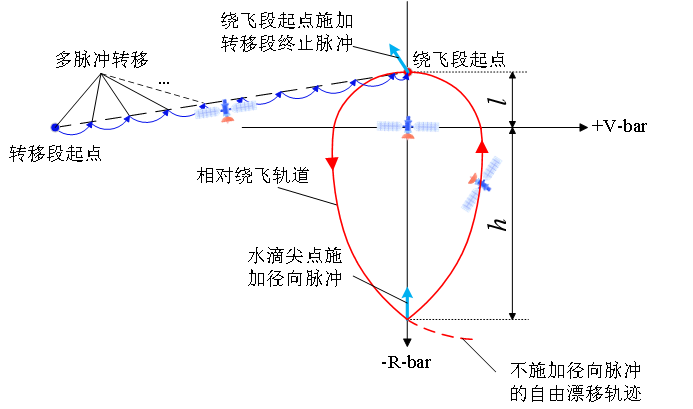

相对绕飞轨道可以分为转移段和绕飞段，其轨道设计可以转化为一个非线性方程组问题进行求解，进而得到整个过程施加的脉冲机动量和机动时刻。针对水滴型相对绕飞轨道，给定任务初始时刻伴随航天器与参考航天器的相对位置和相对速度，多脉冲转移段约束条件为机动转移时间、最大转移飞行角[2]，水滴绕飞段约束条件为水滴绕飞圈数、水滴绕飞构型（由上图中的 $l$ 和 $h$ 决定）。

在本案例中，首先根据需求设置仿真场景的历元，以及参考航天器的轨道根数，给定任务初始时刻伴随航天器的相对位置为 $(-100, 0, 0)$ km，相对速度为 $(0, 0, 0)$ m/s。约束取值设置为：机动转移时间为 86400 s，最大转移飞行角为 5°，水滴绕飞圈数为 1，水滴绕飞构型为 $l = 2$ km，$h = 10$ km。

## 创建水滴型相对绕飞轨道任务场景和对象

[安装](https://smsat.space/)并运行 ATK.exe，新建一个想定"RPOTeardropFlyaround"。设置开始历元为 2007-03-08 00:00:00.000，结束历元为 2007-03-10 00:00:00.000；利用卫星轨道生成向导插入地球静止轨道卫星，将其作为参考航天器，命名为"ReferenceSpacecraft"；再插入一颗卫星，将其作为伴随航天器，命名为"CompanionSpacecraft"。

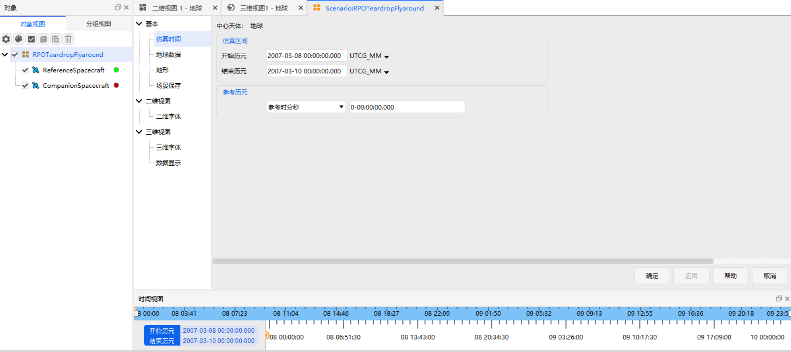

## 设计水滴型相对绕飞轨道

1. **参考航天器参数配置**

    选择 "ReferenceSpacecraft"，在轨道预报器下拉菜单中选择 <kbd>J2摄动</kbd>。
    再将参考航天器的轨道历元设置为与场景开始历元相同，并应用。

    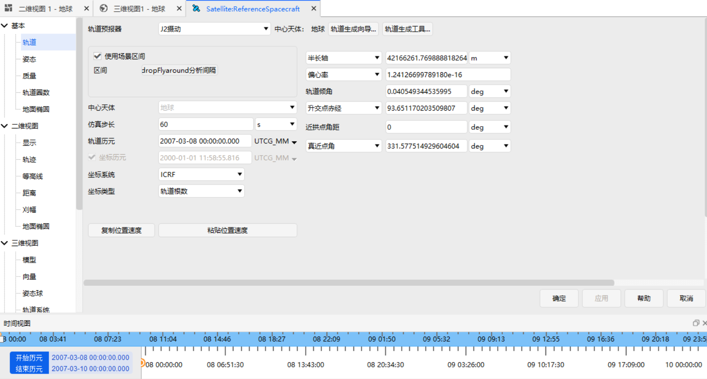

2. **伴随航天器初始参数配置**

    选择 "CompanionSpacecraft"，在轨道预报器下拉菜单中选择 <kbd>机动规划</kbd>。
    将初始段 "InitialState" 命名为 "初始状态"，点击<kbd>参考航天器</kbd>，选择"参考航天器"为 "ReferenceSpacecraft"。

    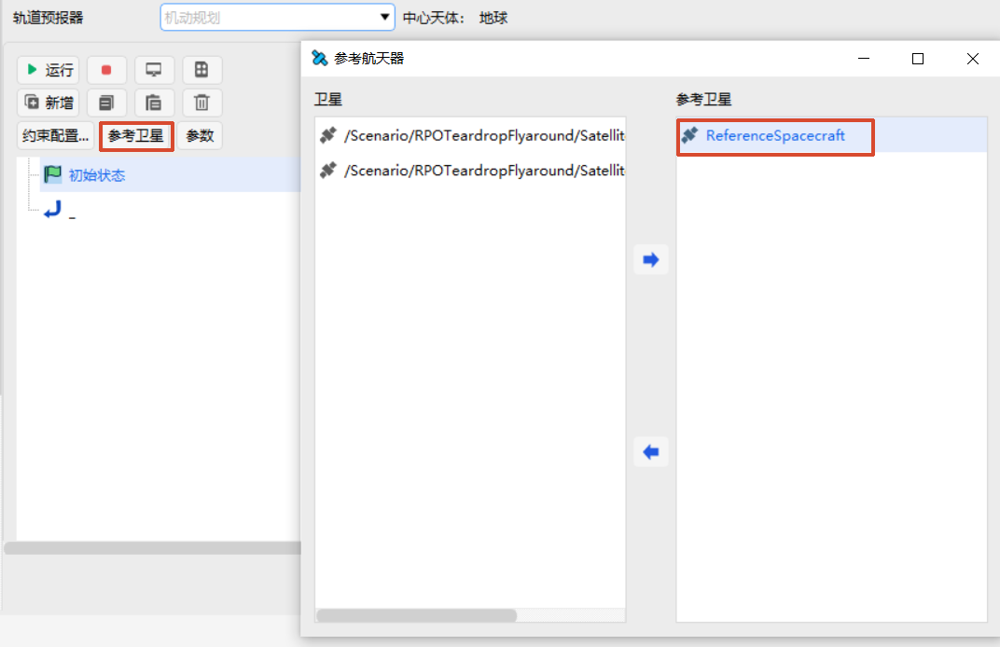

    在右侧【初始段】界面，设置【坐标系】为 "ReferenceSpacecraft" 的 "VVLH" 坐标系。

    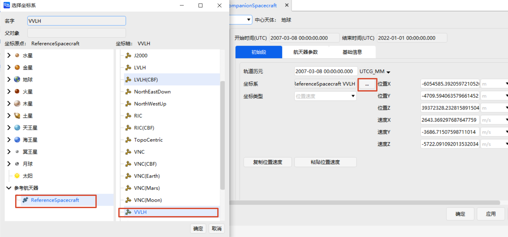

    上述步骤表明建立了伴随航天器相对于参考航天器的坐标系。其中，X 轴指向参考航天器速度的正方向，Y 轴指向参考航天器轨道平面的负法线方向，Z 轴正方向指向地心。设置伴随航天器的初始相对位置：

    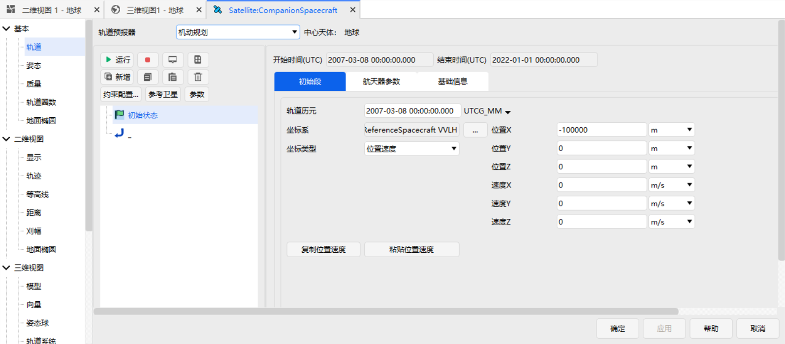

3. **伴随航天器水滴绕飞轨道参数设置**

    在机动规划界面选择 <kbd>新增-插入RPO段-伴飞-水滴绕飞段</kbd>，并重命名为 "轨道机动和水滴绕飞"。
    随后设置"参考航天器"为 "ReferenceSpacecraft"，水滴绕飞的参数设置如下：

    | 参数        | 数值        |
    | --------------- | ----------- |
    | 圈数       | 1 |
    | 起始点距离      | 2000         |
    | 机动点距离   | -10000        |
    | 等待时间 | 86400           |
    | 真近点角变化量最大值 | 5           |
    | 求解算法   | 序列二次规划           |

    上述参数即对应场景设计中的约束变量。

## 水滴型相对绕飞轨道仿真运行与结果显示

1. **仿真计算和显示设置**

    伴随航天器的参数配置完毕后，点击【机动规划】窗口的 <kbd>运行</kbd>，等待计算结束：

    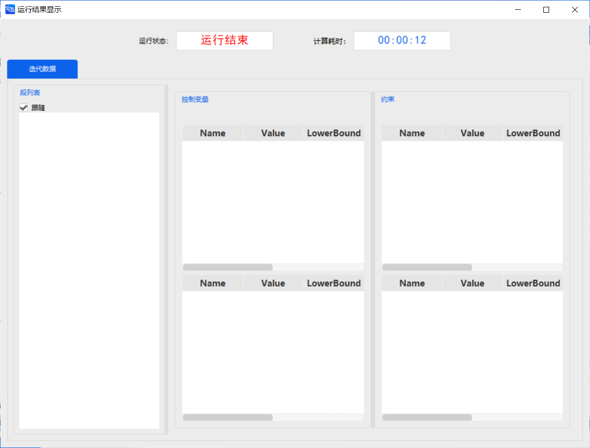

    计算结束后点击【水滴绕飞段】的 <kbd>结果数据</kbd> 即可查看轨道转移和绕飞过程施加的脉冲矢量及时间。分析数据可以得到，在轨道转移初始点、转移段和绕飞段的衔接点、水滴尖点施加的脉冲较大（1 m/s ~ 2 m/s），整个转移段施加脉冲 64 次，但单次脉冲量不大（0.3 m/s 左右）。具体结果如下图所示。

    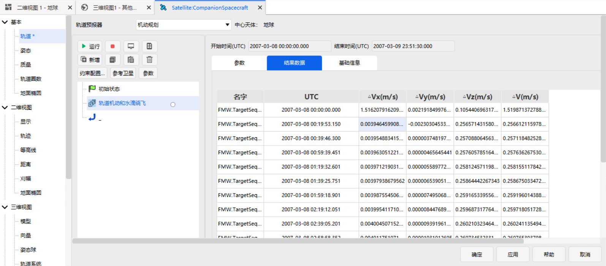

    接下来在伴随航天器的【属性设置】窗口，选择【三维视图】下的"向量"设置，添加一个【坐标系】：

    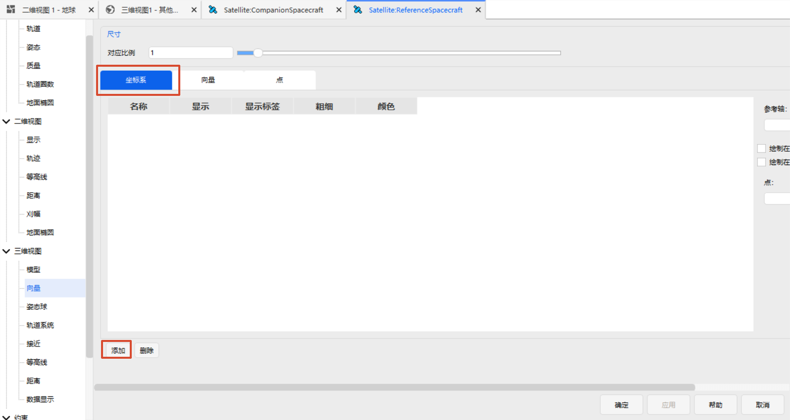

    选择“ReferenceSpacecraft”的“VVLH”坐标系：

    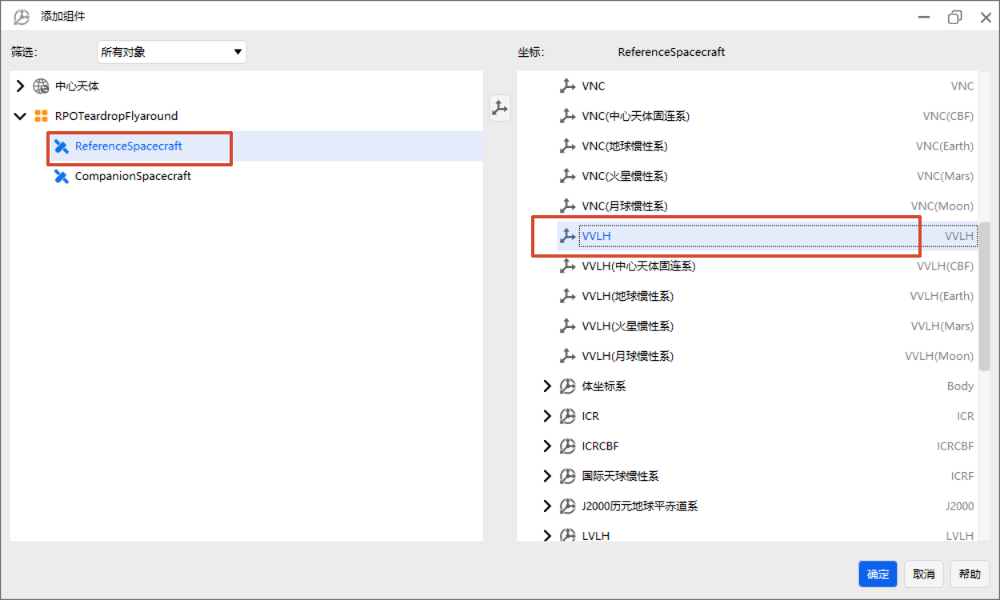

    勾选 <kbd>显示</kbd> 及<kbd>显示标签</kbd>可以根据需要设置相对轨迹颜色、线条粗细等参数。

    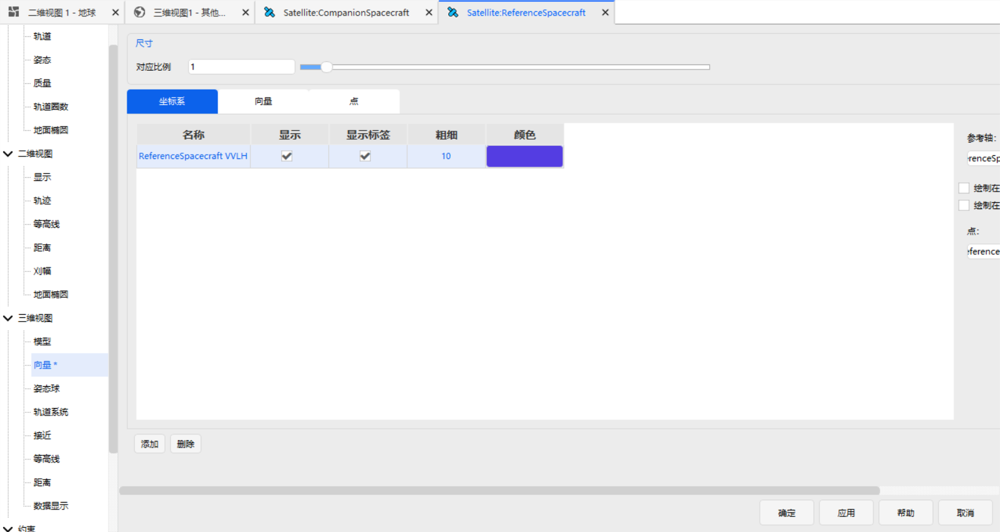

    回到【三维视图】界面，选择左上角的 <kbd>局部视点</kbd>，然后依次选择 <kbd>卫星-ReferenceSpacecraft</kbd>，即可将视角固定在 "ReferenceSpacecraft" 上。

    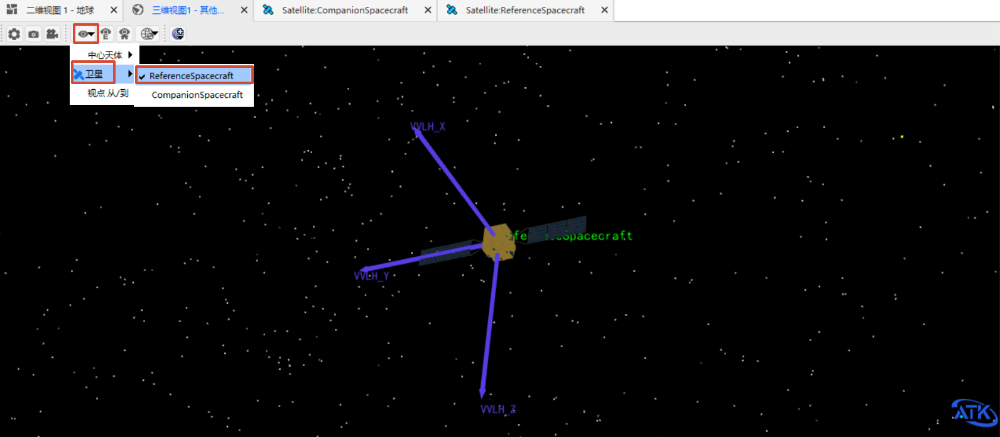

    继续选择左上角的 <kbd>三维视图窗口中心天体</kbd>，在 <kbd>其他...</kbd> 中，选择“ReferenceSpacecraft”的“VVLH”坐标系及“参考点”，设置窗口显示轨迹为此航天器“ReferenceSpacecraft”下的“VVLH”坐标系。

    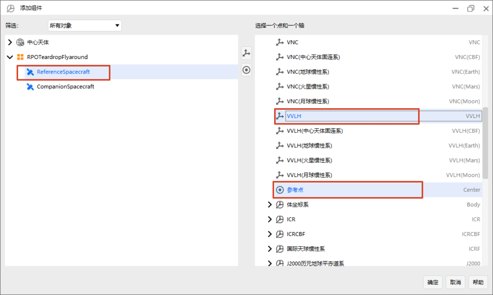

2. **仿真场景显示**

    点击 <kbd>开始</kbd> 按钮，即可观察参考航天器和伴随航天器的相对运动轨迹。RPO 水滴绕飞轨迹展示如下。

    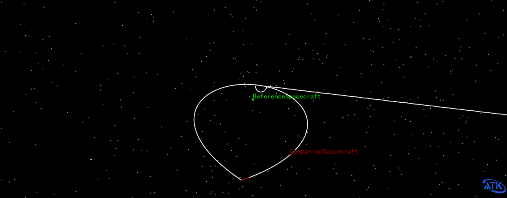

## 参考文献

[1] 张冉, 殷建丰, 韩潮. 航天器受迫绕飞构型设计与控制[J]. 北京航空航天大学学报, 2017, 43(10): 2030-2039.

[2] 张赛, 杨震, 王华, 等. 航天器受控绕飞任务规划与自主通用软件实现[J]. 载人航天, 2024, 30(1): 94-103.
