# 灾害监测星座对地覆盖性能分析

## 内容简介

灾害监测星座（Disaster Monitoring Constellation，DMC）由多颗对地观测卫星组成，采用卫星对目标接力观测、共同观测等方式实现对地面目标的长时间、高精度的监测。其监测对象包括已受灾地区或灾害频发区域，作用是通过快速获取相关地区的图像信息，为灾害预警、应急响应和灾后评估提供数据支持。分析评估灾害监测星座的覆盖性能，对星座任务调度、星座效能评估和星座布局优化等具有重要意义。

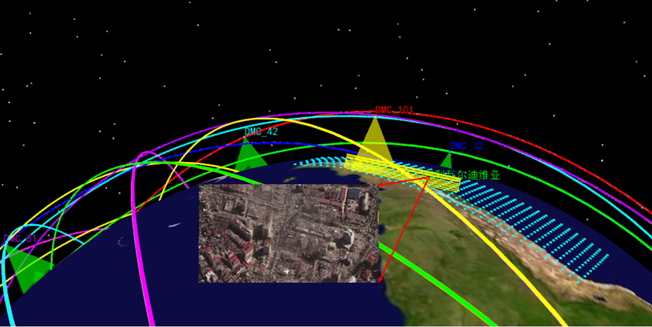

Walker 星座指由具有相同轨道高度和轨道倾角的多颗圆轨卫星组成的以地球为球心的均匀分布的卫星星座，即所有轨道面的升交点赤经在 $[0, 2\pi]$ 内均匀分布，每个轨道面内有相同数量的卫星，且卫星在轨道面内也是均匀分布的。由于该星座围绕地球均匀分布的性质，是全球覆盖最有效的星座，常用于对地观测、导航和互联网通信等[1]。鉴于 Walker 星座良好的对地覆盖性，本文参考国际 DMC 星座和我国"36 天罡星群"的设计，基于 ATK 仿真平台的星座设计模块，设计由 36 颗卫星组成的 Walker 星座作为本次案例的对地观测星座（命名为 DMC 星座），并通过覆盖分析模块，计算对地覆盖重数、覆盖时间等品质因子生成相应图表，分析该星座对全球灾害频发地区以及我国周边区域的覆盖性能。

## 星座设计及对地覆盖分析方法

### Walker 星座模型

Walker 星座参数定义如下图所示，常用的描述方式为 $(N/P/F, h, i)$。其中 $N$ 为星座中的卫星总数；$P$ 为星座的轨道面数；$F$ 为相位因子，可取 $0 \sim (P-1)$ 之间的一个整数，代表 Walker 星座中相邻两个轨道面对应卫星之间的相位关系；相邻两个轨道面升交点赤经差为 $\Delta\Omega = 2\pi/P$，同一轨道面内相邻卫星相位差为 $\Delta\Phi = 2\pi/(N/P)$，相邻轨道异轨卫星相位差为 $\Delta f = 2\pi F/N$；$h$ 为星座中卫星的轨道高度；$i$ 为星座中的卫星轨道倾角。

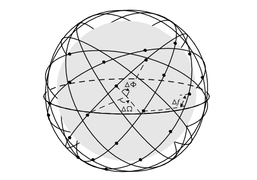

标识符为 $N/P/F$ 的 Walker 星座中第 $m$ 个轨道面上的第 $n$ 颗卫星的升交点赤经 $\Omega_{mn}$ 和纬度幅角 $u_{mn}$ 分别为[2]：

$$
\left\{
\begin{aligned}
\Omega_{mn} &= \frac{360}{P} \left( P_m - 1 \right) \quad && (P_m = 1,2,\dots,P) \\
u_{mn} &= \frac{360}{N_S} \left( S_n - 1 \right) + \frac{360}{N} F \left( P_m - 1 \right) \quad && (S_n = 1,2,\dots,N_S)
\end{aligned}
\right.
$$

其中，$N_s$ 为每个轨道平面上的卫星数，$N_s = N/P$。

### 卫星对地覆盖模型

卫星的运动和地球自转使得卫星的星下点在地球表面移动，形成星下点轨迹。卫星对地面目标的观测只能在卫星运动到目标的上空时进行，如下图所示，当目标处于卫星的覆盖范围内时，卫星的成像载荷能够观测到地面目标，实现对地面目标的覆盖。

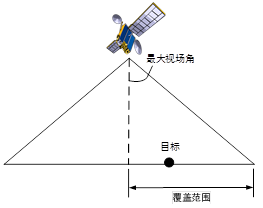

根据覆盖的定义可以获得下图所示的星地空间关系图，只要目标在卫星的视场内，即可认为目标被卫星覆盖，相应观测方程如下式所示。式中 $\lambda$ 为目标角度，$\rho$ 为观测范围角度，$\varepsilon$ 为视场角，$R_s$ 为卫星轨道半径，$R_e$ 为地球半径。

$$
\left\{
\begin{aligned}
\theta_T &< \theta_{FOV} \\
\theta_{FOV} &= \arcsin\left(\frac{\sin(\alpha_{FOV}) R_S}{R_E}\right) - \alpha_{FOV} \\
\theta_T &= \arccos\left(\frac{\boldsymbol{r}_{SE} \cdot \boldsymbol{r}_{TE}}{\|\boldsymbol{r}_{SE}\| \|\boldsymbol{r}_{TE}\|}\right)
\end{aligned}
\right.
$$

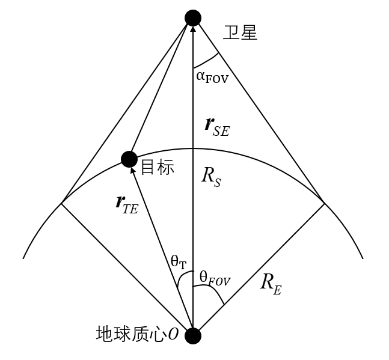

## 场景创建与星座生成

1. **新建想定**

    安装并运行 ATK.exe，新建一个想定"灾害监测星座覆盖性分析"。设置开始历元为 2024-04-13 00:00:00.000000，结束历元为 2024-04-14 00:00:00.000000。

2. **导入 DMC 星座和传感器**

    点击【工具】选项卡的 <kbd>星座设计</kbd> 模块，星座类型选择为 Walker-Delta 星座；设置基准卫星参数，半长轴为 7064861 m，偏心率为 0，倾角为 98.1287°，升交点赤经、近地点幅角、真近点角均为 0；设置星座参数，总卫星数为 36 颗，轨道面个数为 12，相邻平面相位因子为 3。点击 <kbd>计算</kbd>，在右侧窗口中显示每颗卫星的轨道根数如下：

    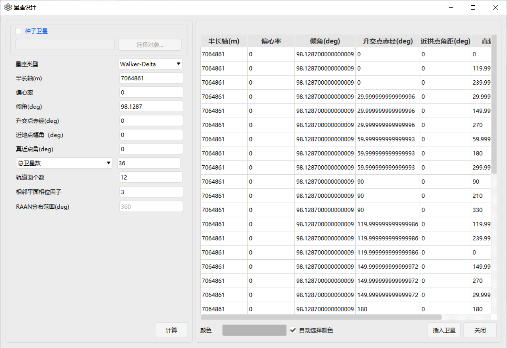

    点击 <kbd>插入卫星</kbd>，在对象视图中全选所有卫星，右键选择 <kbd>批量插入</kbd>，选择 <kbd>传感器</kbd>，点击 <kbd>插入</kbd>。在右侧”分组视图”中右键点击”灾害监测星座覆盖性分析” 场景，选择 <kbd>新建分组</kbd>，命名为”DMC”，将所有卫星及其传感器移入此分组。

    在对象视图中全选所有传感器，右键选择 <kbd>批量设置属性</kbd>，选择【传感器类型】为【矩阵】，定义参数：【垂直半角】为 26.7°，【水平半角】为 15°[2]。可以看到星座的二维、三维视图如下：

    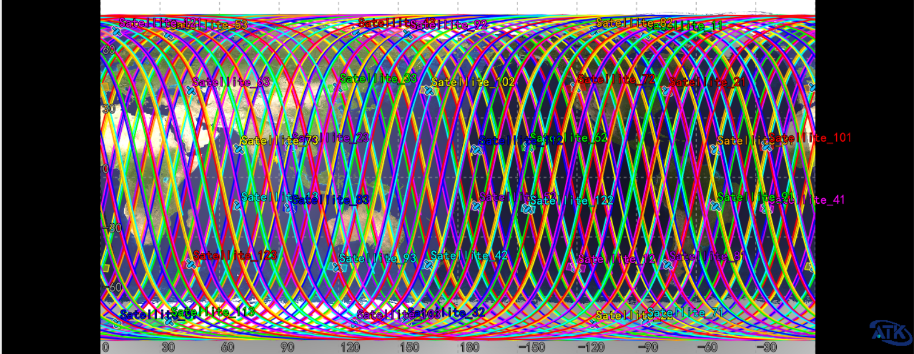

    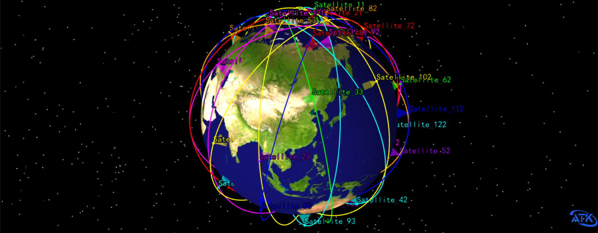

## 观测目标与区域导入

1. **重点监测地区（点目标）**

    创建新的分组，并命名为"重点监测地区"，然后选择 <kbd>插入对象</kbd> —— <kbd>地面站</kbd>，将收集到的灾害频发地点的经纬度输入，并插入到该分组中。

    ::: note 注意

    地面站可在网络中搜索相关地点经纬度或选择从【城市数据库】插入地面站，本案例选择后者，在【城市数据库-国家】中，搜索”CHILE”、”MEXICO”、”INDONESIA”，【类型】选择首都，插入三个城市的地面站并依次改名为”智利”、”墨西哥”、”印度尼西亚”。

    :::

    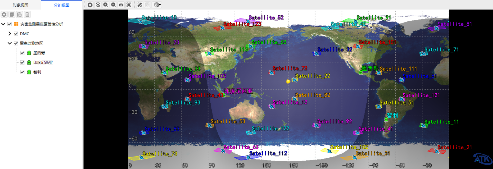

2. **灾害频发地区（大区域）**

    此处选择墨西哥、印度尼西亚、智利及周边海域作为重点观测区域。选择 <kbd>插入对象</kbd> —— <kbd>覆盖定义</kbd>，修改覆盖定义属性，"网格区域配置参数" 类型为"经纬度区域"，"网格定义"经纬度间隔为 1°。墨西哥、印度尼西亚、智利的经纬度区域参数如下：

    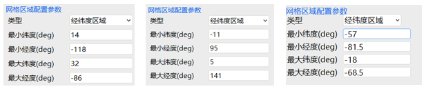

    可以在二维视图中看到区域网格点显示如下：

    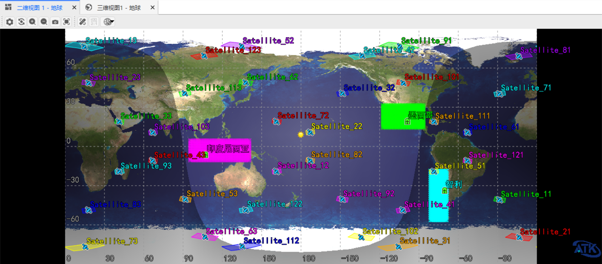

## 星座覆盖性能分析

### 点目标覆盖分析

选择任意一个地点演示星座覆盖性分析操作，本文以智利为例展开覆盖性分析。右键该地点选择 <kbd>覆盖性</kbd>，如图所示：

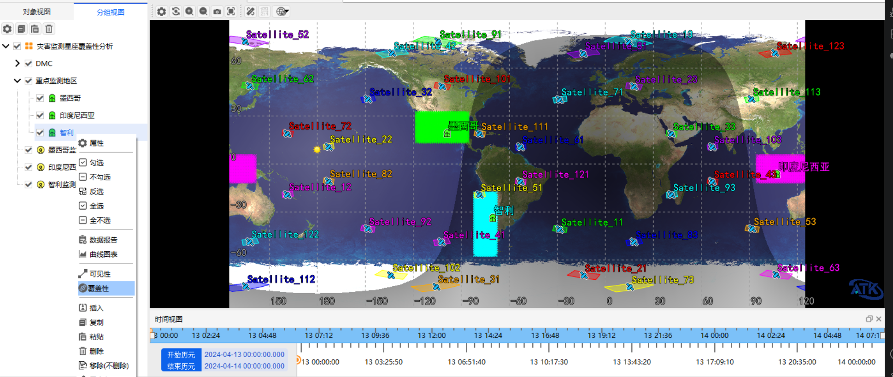

然后选择 DMC 星座的所有 36 颗卫星的传感器 Sensor，点击 <kbd>计算</kbd>，如下图所示。

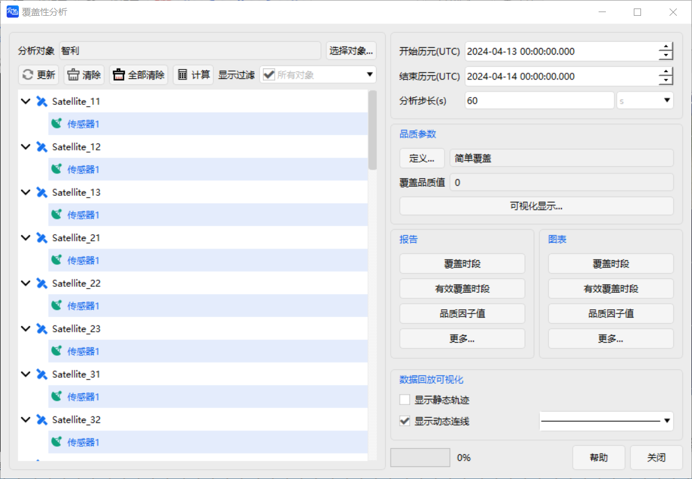

在【品质参数】处，点击 <kbd>定义...</kbd>，可求解不同的品质因子如图所示：

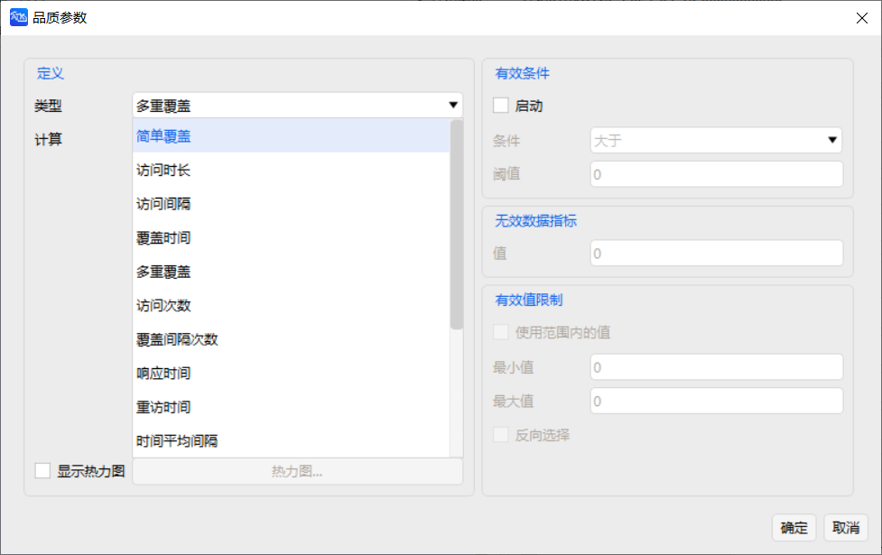

选择品质因子为 <kbd>多重覆盖</kbd>，点击 <kbd>覆盖时段曲线</kbd> 或其他曲线进行展示，操作如图所示：

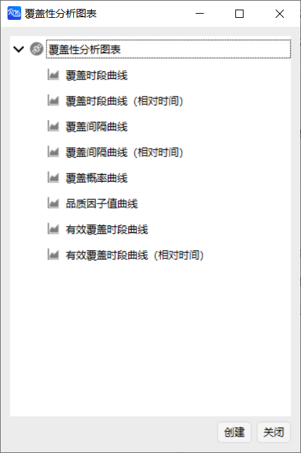

可以得到以下的甘特图，发现对智利地区的覆盖时间持续较短，也没有多重覆盖的情况，但是该星座对该地区的覆盖在时间的分布上较为均匀，当该地区发生灾害时，能够较短时间内发现。

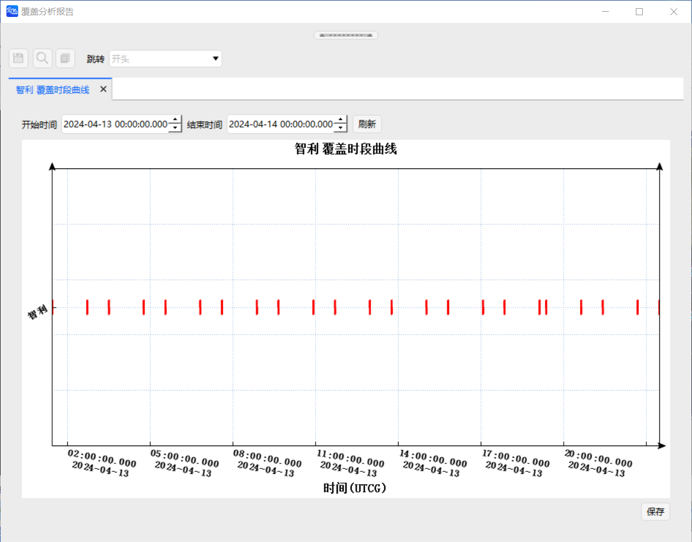

### 区域目标覆盖分析

以墨西哥区域覆盖分析为例。在对象视图中右击对象“墨西哥监视区域”，选择 <kbd>区域覆盖</kbd> 功能，全选所有传感器，仿真时间为 24 h，轨道步长为 60 s，点击 <kbd>计算</kbd>。仿真计算过程约 10 秒。

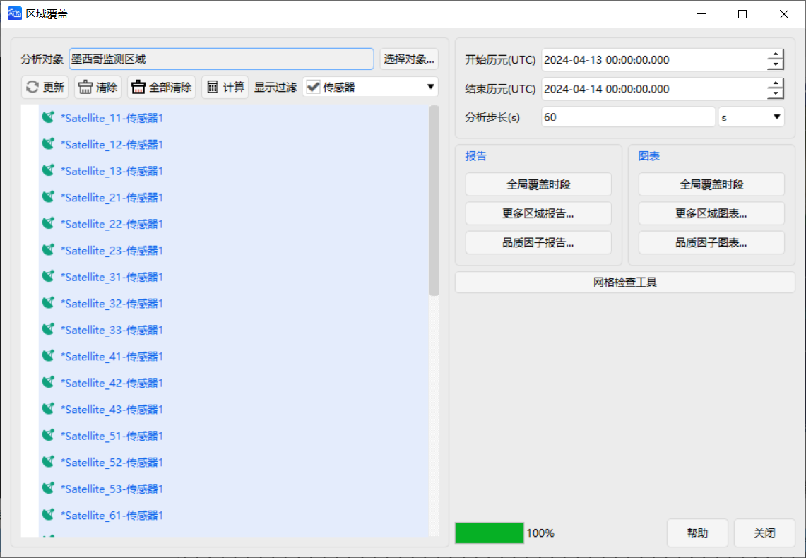

仿真计算结束后，可以查看相关报告和图表，如区域覆盖率报告及图表如下：

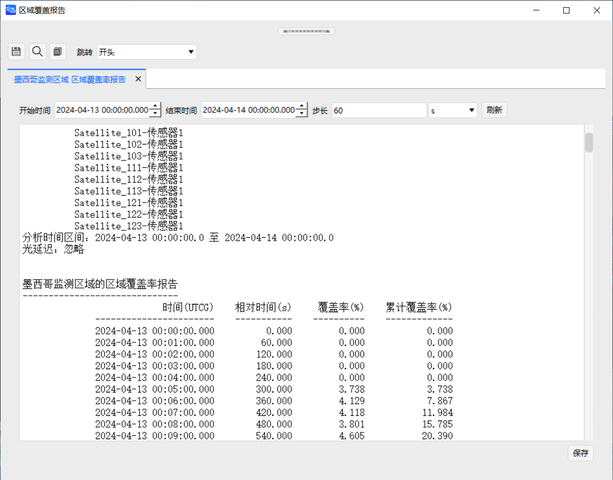

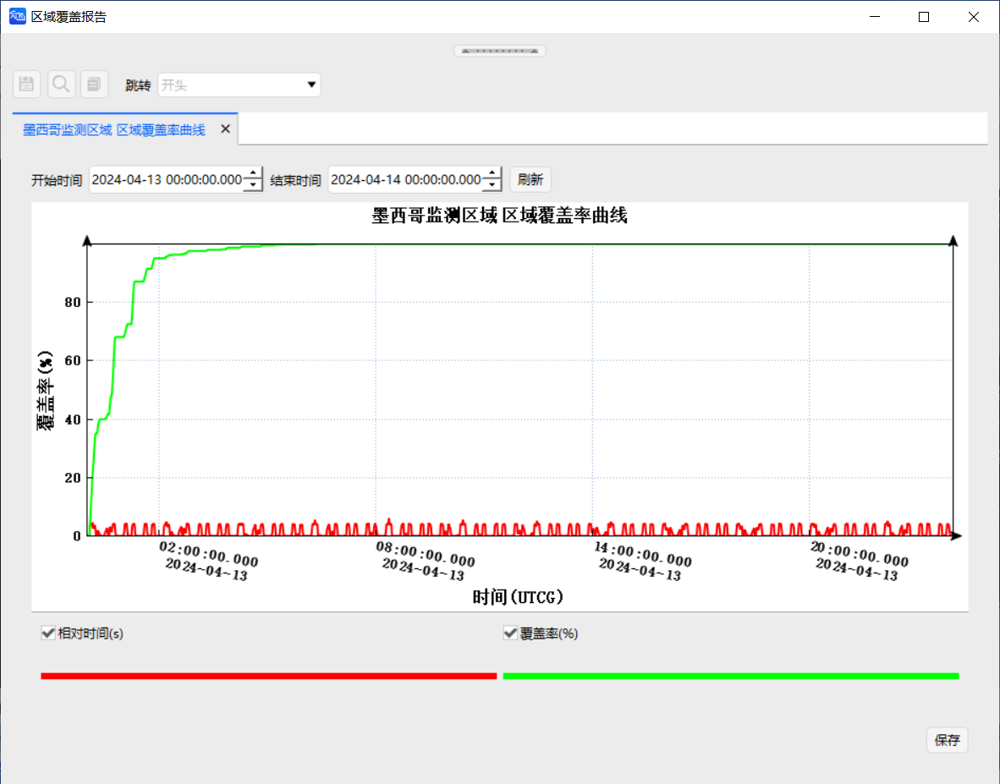

由区域覆盖率报告及图表可以得到每个仿真时刻的实时覆盖率和累计覆盖率，可以看出在约 7 h 后该星座对墨西哥区域实现了 100% 覆盖。另外，还可以查看“部分覆盖时段报告”、“单个对象资源覆盖率统计报告”等。

## 参考文献

[1] 贺波勇, 李恒年, 周庆瑞, 等. Walker 星座性能修复构型重构的弹性力学解法[J]. 西北工业大学学报, 2021, 39(2): 278-284.

[2] 李胜西, 李海阳, 何湘粤. 面向全球快速重访的限制性 Walker 星座设计方法[J]. 系统工程与电子技术.

[3] 李骁. 灾害监测小卫星星座设计与仿真[D]. 中南大学, 2009.
