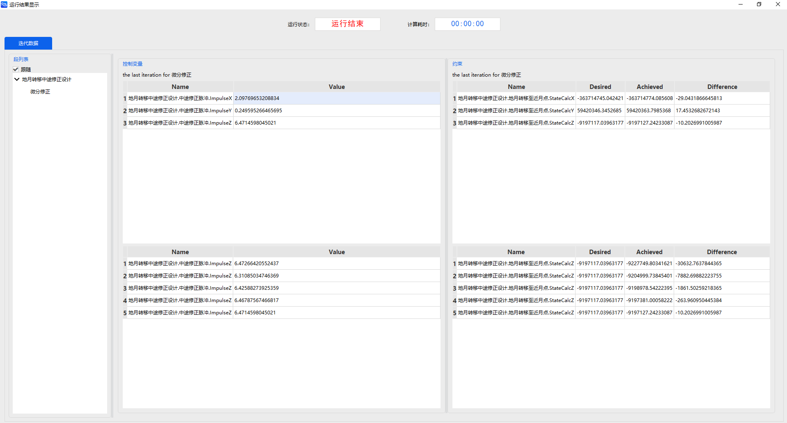
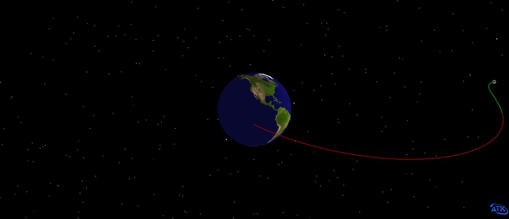
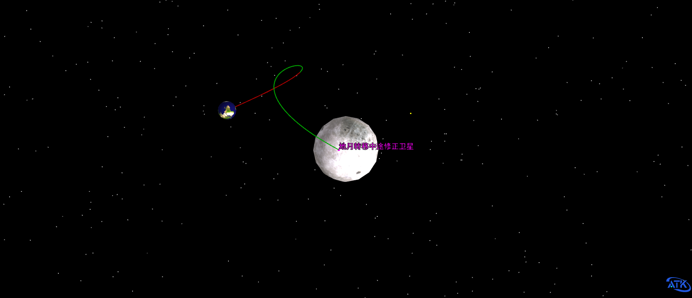

# 考虑入轨偏差的地月转移中途修正轨道设计与分析

## 内容简介

航天器进行地月转移时，通常会通过优化设计获得一条满足任务飞行约束的轨迹，一般称为标称轨迹或参考轨迹。然而，由于状态估计误差、导航误差以及控制误差等不确定因素的存在，航天器的实际飞行轨迹通常会偏离标称轨迹。为保证航天器顺利进入目标轨道，工程上通常采用中途修正对偏差进行调控，以减小任务失败的概率，提高任务鲁棒性。下图为地月转移中途修正轨道示意图。

轨道中途修正设计的本质，是在给定标称轨道与初始偏差的前提下，通过求解修正时刻所需的脉冲控制矢量，使终端时刻实际轨道的位置与标称轨道位置的偏差满足预设要求。

本案例基于航天任务工具箱ATK（Aerospace Tool Kit）的机动规划模块，实现固定修正时刻的1次中途修正轨道设计与分析。初始标称轨道为一条飞行时间为3天左右的地月转移轨道，从地球出发到达近月点。修正时刻设置为出发时刻后1天，入轨位置各方向偏差设置为500 m，速度各方向偏差设置为0.1 m/s。设计变量选择为VVLH坐标系下的脉冲矢量，初值均设置为0 m/s。瞄准量为终端位置矢量，终端位置收敛误差设置为50 m。

## 任务控制序列说明

为了设计一个考虑入轨偏差的地月转移中途修正轨道，我们需要构建以下任务控制序列：

一个 **瞄准序列段**：其中包含一个初始段、一个机动段和两个预报段。

## 创建任务场景

1. 运行 ATK.exe，点击 <kbd>新建一个想定文件</kbd> 新建一个想定 “地月转移中途修正场景”。

2. 设置仿真时间：在【ATK：新建想定向导】对话框中设置“历元”如下

    | 开始历元 | 结束历元 |
    | ----------------------- | ----------------------- |
    | 2029-08-09 13:00:00.000 | 2029-08-13 10:00:00.000 |

3. 点击 <kbd>确定</kbd> 完成场景建立。

## 创建对象

1. **创建及编辑卫星对象**

   - 点击工具栏【开始】中的 <kbd>插入</kbd> 创建卫星对象。

   - 选择【想定对象】—【卫星】，【选择插入方式】—【插入默认类型】，点击 <kbd>插入…</kbd>，点击 <kbd>关闭</kbd>。

   - 在左侧【对象】页面上，右键单击卫星 “卫星1”，选择 <kbd>重命名</kbd>，将其命名为 “地月转移中途修正卫星”。

   - 在左侧【对象】页面上，右键单击卫星 “地月转移中途修正卫星”，选择 <kbd>属性</kbd>，出现【卫星参数设置】界面，选择【轨道预报器】—【机动规划】。

## 设计中途修正轨道

1. **定义瞄准序列段**

   - 删除默认初始段。

   - 点击 <kbd>新增</kbd> 添加一个 “瞄准序列段”，命名为 “地月转移中途修正设计”。

2. **定义初始段**

   在“地月转移中途修正设计” 段内嵌入一个 “初始段”，命名为 “初始状态”。设置【轨道历元（UTCG）】—“ 9 Aug 2029 17:38:34.459”。选择【坐标系】—【Earth J2000】，【坐标类型】—【位置速度】，位置速度设置如下表：

    | 参数 | 数值 |
    | ---- | ---- |
    | 位置X | 6149445.506638841703534 m |
    | 位置Y | 2990903.982296200003475 m |
    | 位置Z | -1313542.527568900026381 m |
    | 速度X | -2560.51127332499982 m/s |
    | 速度Y | 9579.817819986599716 m/s |
    | 速度Z | -3821.891658736356021 m/s |

3. **定义转移至修正时刻预报段**

   - 点击 <kbd>新增</kbd> 在 “初始状态” 段后插入一个 “预报段”，命名为 “转移至修正时刻”。

   - 点击【轨道预报】—<kbd>高级设置…</kbd>，选择【中心天体】—【Earth】；【引力】中选择【引力场模型】—【WGS84】，【次数】—“20”，【阶数】—“20”；不勾选【大气阻力摄动】；勾选【太阳光压摄动】；勾选【三体摄动】—【太阳】、【月球】，太阳选择【点质量】模型，月球选择选择【引力场】模型-【GLGM2】，【次数】—“0”，【阶数】—“0”；点击 <kbd>确定</kbd>。

   - 在【停止条件】中，点击 <kbd>新建</kbd>，选择【预报时长】【CAsStopDuration】作为停止条件，【触发值】设置为 “86400”。

4. **定义机动段**

   - 点击 <kbd>新增</kbd> 在 “转移至修正时刻” 段后插入一个 “机动段”，命名为 “中途修正脉冲”。

   - 选择【机动类型】—【脉冲】，【推力坐标轴】—【VVLH】，坐标类型选择【直角坐标】。

   - 设置【速度增量 Vx】—“0m/s”，【速度增量 Vy】—“0m/s”，【速度增量 Vz】—“0m/s”。

5. **定义地月转移至近月点预报段**

   - 点击 <kbd>新增</kbd> 在 “中途修正脉冲” 段后插入一个 “预报段”，命名为 “地月转移至近月点”。

   - 点击【轨道预报】—<kbd>高级设置…</kbd>，此处设置与第一个预报段相同。

   - 在【停止条件】中，点击 <kbd>新建</kbd>，选择【历元时刻】【CAsStopEpoch】作为停止条件，【触发值】设置为 “2029-08-12 12:02:04.000011”。

6. **选择变量**

   - 在 “中途修正脉冲” 段中，点击【速度增量 Vx】、【速度增量 Vy】、【速度增量 Vz】文字段后方 ，将其勾选为 **设计变量** 。

   - 右键点击 “地月转移至近月点” 段，选择 <kbd>约束配置…</kbd>，双击选择【笛卡尔坐标】—【位置X】、【位置Y】和【位置Z】作为目标变量，【坐标系】均设置为 “地球 J2000历元地球平赤道系”，点击 <kbd>确定</kbd>。

7. **设置瞄准器**

   - 选中 “地月转移中途修正设计”段，在【配置】中，点击 <kbd>新建</kbd>，选择【微分修正】；若默认已有【微分修正】，则无需新建。

   - 双击【微分修正】图框，进入【瞄准器设置】界面。分别点击【控制变量】和【约束】中【使用】栏下的方框勾选使用的控制变量和约束。

        | 控制变量 | 约束 |
        | ---- | ---- |
        | ImpulseX | StateCalcX |
        | ImpulseY | StateCalcY |
        | ImpulseZ | StateCalcZ |

   - 【控制变量】保持默认选项。

   - 【约束】—【StateCalcX】—【期望值】一栏中填写为 -363714745.042420983314514m，收敛误差为 50m。

   - 【约束】—【StateCalcY】的近地点高度的期望值为 59420346.345268502831459m，收敛误差为 50m。

   - 【约束】—【StateCalcZ】的轨道倾角的期望值为 -9197117.039631770923734m，收敛误差为 50m。

   - 设置完毕后点击 <kbd>确定</kbd>，然后再进入【瞄准器设置】界面即可看到用户设置后的结果。

## 运行任务控制序列并分析

当整个任务控制序列构建完毕后，可以单击左侧段节点区的白色方框  选择 “预报段” 和 “机动段” 的颜色，设置完毕后左侧的段节点操作区呈现为如下形状：

1. **运行结果显示**

   - 点击 <kbd>运行</kbd>，任务控制序列开始计算。可以点击 <kbd>显示</kbd>，查看运行结果。

   

   - 点击左侧【段列表】的 “地月转移中途修正设计” 段，可查看任务控制序列中瞄准序列段的运行结果，参考结果如下表所示：

        | 地月自由返回轨道规划 | 当前值 |
        | ---- | ---- |
        | ImpulseX  | 2.097696532088344 |
        | ImpulseY  | 0.249595266465695 |
        | ImpulseZ  | 6.471459804502096 |
        | StateCalcX  | -363714774.085607647895813 |
        | StateCalcY  | 59420363.798536770045757 |
        | StateCalcZ  | -9197127.242330871522427 |

2. **三维视图显示**

   点击【视图】下的 <kbd>三维视图</kbd>，操作【时间视图】中的时间轴，可查看地心、月心视角下的轨道形状。

   

   