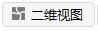
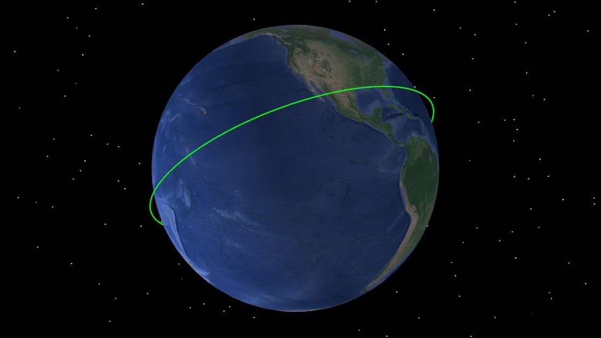
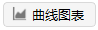
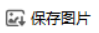

<PathViewer
  :relative-paths="files"
/>

# 入门案例

本案例介绍如何创建任务场景和对象、生成报告并加以保存。

## 创建任务场景

1. 运行 ATK.exe，点击 <kbd>新建一个想定文件</kbd>；

2. 在【新建想定向导】对话框中设置场景 **名称** 为 SimpleExample；

3. 设置场景时段（可自由选择时间段，不必与教程相同）

| 开始历元(UTCG)          | 结束历元(UTCG)          |
| ----------------------- | ----------------------- |
| 2026-03-06 00:00:00.000 | 2026-03-07 00:00:00.000 |

4. 点击 <kbd>确定</kbd> 完成场景建立。

## 创建卫星对象

1. 点击工具栏 <kbd>开始</kbd> 中的 ，创建对象；

2. 选择 **想定对象** — **卫星**，**选择插入方式** — **插入默认类型**；

3. 点击 <kbd>插入...</kbd>，插入一颗卫星；

4. 点击 <kbd>关闭</kbd>，关闭【插入对象】对话框。

## 修改卫星对象属性

1. 选中 **卫星1**，右键单击选择 <kbd>属性</kbd> 或左键双击直接打开【属性设置】页面；

2. **基本 - 轨道 - 坐标系统** 选择 ICRF 或者 J2000，**坐标类型** 选择 **轨道根数**，修改轨道根数为：

| 轨道根数        | 数值        |
| --------------- | ----------- |
| 半长轴(m)       | 6878137.000 |
| 偏心率          | 0.0         |
| 轨道倾角(deg)   | 45.0        |
| 升交点赤经(deg) | 0           |
| 近拱点角距(deg) | 0           |
| 真近点角(deg)   | 0           |

3. 点击 <kbd>应用</kbd>，保存修改结果；

4. 点击 <kbd>轨道生成向导</kbd>，选择 **轨道类型** 为 **圆轨道**；

5. 选中 **卫星1**，点击其右侧颜色按钮  可快捷修改标签颜色。

## 查看二维场景和三维场景

1. 打开二维与三维视图窗口：

点击 <kbd>视图</kbd>，选择  可显示二维视图；

点击 <kbd>视图</kbd>，选择  可显示三维视图；

2. 点击 <kbd>开始</kbd> ，在二维和三维视图中随时间历元显示轨道；

3. 拖动 **时间视图** 黄色滑块，查看特定时间的轨道场景。

## 查看输出报告

1. 点击 <kbd>输出</kbd>，选择 ，左上方 **对象类型** 选择 **卫星**，右上方 **报告类型** 下拉列表选择 **数据报告**，在下方 **预定义** 参数中选择 **经纬高**，点击 <kbd>生成</kbd> 生成报告；

2. 点击 <kbd>输出</kbd>，选择 ，左上方 **对象类型** 选择 **卫星**，右上方 **报告类型** 下拉列表选择 **曲线图表**，在下方 **预定义** 参数中选择 **升交点赤经**，点击 <kbd>生成</kbd> 生成报告；

3. 在【数据报告】或【曲线图表】的【变量选择】页面，可点击 **样式** — <kbd>新建</kbd>，根据需要自定义报告内容或图表类型；

4. 数据报告左上角点击 <kbd>另存为文本</kbd> ，保存输出报告；右键点击曲线图表，点击 <kbd>保存图片</kbd> ，保存曲线图表；

5. 点击 <kbd>关闭</kbd>。

## 保存场景

点击 <kbd>开始</kbd> — <kbd>保存</kbd> ，保存已有场景；如需要再次加载当前场景可点击 <kbd>打开</kbd> ，打开已保存的场景。

