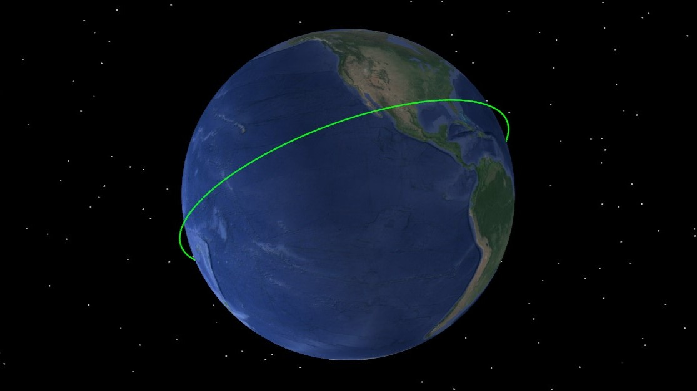

# 入门案例

通过二次开发 Connect 模式，创建入门案例场景，必须保持 ATK 为打开状态，具体命令分类包括：

1. 与 ATK 进行连接。
2. 新建场景并进行属性设置。
3. 新建卫星并进行属性设置。
4. 查看二维和三维场景
5. 查看输出报告。
6. 保存场景后与 ATK 断开连接。

## 脚本展示

### 与 ATK 进行连接

<mix-code lang="python">
conID = atkOpen()
</mix-code>

### 新建场景并进行属性设置

<mix-code lang="python">
# 2, 创建任务场景并进行属性设置
atkConnect(conID, 'New', '/ Scenario SimpleExample')
atkConnect(conID, 'SetAnalysisTimePeriod', '* "2026-03-06 00:00:00.000" "2026-03-09 00:00:00.000"')
atkConnect(conID, 'Animate', '* Reset')
</mix-code>

### 新建卫星并进行属性设置

<mix-code lang="python">
# 3, 插入卫星并进行属性设置
atkConnect(conID, 'New', '/ Satellite Satellite1')
atkConnect(conID, 'SetState', '*/Satellite/Satellite1 Classical HPOP "2026-03-06 00:00:00.000" "2026-03-09 00:00:00.000" 60 ICRF "2026-03-06 00:00:00.000" 6878137.000 0 0 0 0 0')
</mix-code>

### 新建二维场景和三维场景

<mix-code lang="python">
# 4, 新建二维场景和三维场景
atkConnect(conID, 'Window2D','/ Create')
atkConnect(conID, 'Window3D','/ CreateWindow Normal')
atkConnect(conID, 'Animate', '* Reset')
</mix-code>

### 查看输出报告

<mix-code lang="python">
# 5, 查看输出报告
atkConnect(conID,'Report_RM', '*/Satellite/Satellite1 Style "J2000 Position Velocity"  TimePeriod "2026-03-06 00:00:00.000" "2026-03-09 00:00:00.000"')
</mix-code>

### 保存场景后与 ATK 断开连接

<mix-code lang="python">
# 6，保存场景后与 ATK 断开连接
atkConnect(conID, 'Save', '/ *')
atkClose(conID)
</mix-code>

## 完整脚本

<mix-code lang="python">
conID = atkOpen()
# 2, 创建任务场景并进行属性设置
atkConnect(conID, 'New', '/ Scenario SimpleExample')
atkConnect(conID, 'SetAnalysisTimePeriod', '* "2026-03-06 00:00:00.000" "2026-03-09 00:00:00.000"')
atkConnect(conID, 'Animate', '* Reset')
# 3, 插入卫星并进行属性设置
atkConnect(conID, 'New', '/ Satellite Satellite1')
atkConnect(conID, 'SetState', '*/Satellite/Satellite1 Classical HPOP "2026-03-06 00:00:00.000" "2026-03-09 00:00:00.000" 60 ICRF "2026-03-06 00:00:00.000" 6878137.000 0 0 0 0 0')
# 4, 新建二维场景和三维场景
atkConnect(conID, 'Window2D','/ Create')
atkConnect(conID, 'Window3D','/ CreateWindow Normal')
atkConnect(conID, 'Animate', '* Reset')
# 5, 查看输出报告
atkConnect(conID,'Report_RM', '*/Satellite/Satellite1 Style "J2000 Position Velocity"  TimePeriod "2026-03-06 00:00:00.000" "2026-03-09 00:00:00.000"')
# 6，保存场景后与 ATK 断开连接
atkConnect(conID, 'Save', '/ *')
atkClose(conID)
</mix-code>
