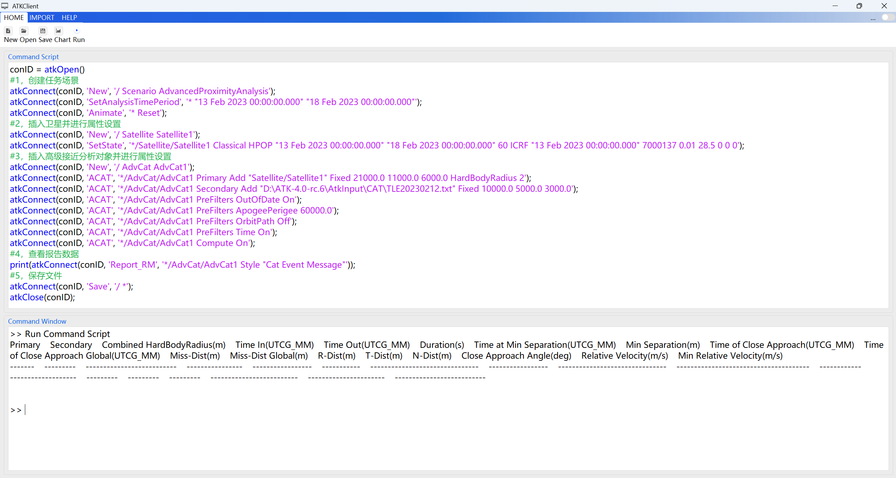

# 高级接近分析案例

通过二次开发 Connect 模式，创建高级接近分析场景，必须保持 ATK 为打开状态，具体命令分类包括：

1. 与 ATK 进行连接。
2. 新建场景并进行属性设置。
3. 新建卫星并进行属性设置。
4. 新建高级接近分析对象并进行属性设置。
5. 查看报告数据
6. 保存场景后与 ATK 断开连接。

## 脚本展示

### 与 ATK 进行连接

<mix-code lang="python">
# 1, 与 ATK 进行连接
conID = atkOpen()
</mix-code>

### 新建场景并进行属性设置

<mix-code lang="python">
# 2, 创建任务场景
atkConnect(conID, 'New', '/ Scenario AdvancedProximityAnalysis')
atkConnect(conID, 'SetAnalysisTimePeriod', '* "13 Feb 2023 00:00:00.000" "18 Feb 2023 00:00:00.000"')
atkConnect(conID, 'Animate', '* Reset')
</mix-code>

### 新建卫星并进行属性设置

<mix-code lang="python">
# 3, 插入卫星并进行属性设置
atkConnect(conID, 'New', '/ Satellite Satellite1')
atkConnect(conID, 'SetState', '*/Satellite/Satellite1 Classical HPOP "13 Feb 2023 00:00:00.000" "18 Feb 2023 00:00:00.000" 60 ICRF "13 Feb 2023 00:00:00.000" 7000137 0.01 28.5 0 0 0')
atkConnect(conID, 'Animate', '* Reset')
</mix-code>

### 新建高级接近分析对象并进行属性设置

<mix-code lang="python">
# 4, 插入高级接近分析对象并进行属性设置
atkConnect(conID, 'New', '/ AdvCat AdvCat1')
# 将 Satellite1 对象设置为主目标
atkConnect(conID, 'ACAT', '*/AdvCat/AdvCat1 Primary Add "Satellite/Satellite1" Fixed 21000.0 11000.0 6000.0 HardBodyRadius 2')
# 将 TLE 文件设置为次目标
atkConnect(conID, 'ACAT', '*/AdvCat/AdvCat1 Secondary Add "(ATK根目录)\Help\Examples\08-二次开发案例\TLE20230212.txt" Fixed 10000.0 5000.0 3000.0')
# 设置筛选器参数
atkConnect(conID, 'ACAT', '*/AdvCat/AdvCat1 PreFilters OutOfDate On')
atkConnect(conID, 'ACAT', '*/AdvCat/AdvCat1 PreFilters ApogeePerigee 60000.0')
atkConnect(conID, 'ACAT', '*/AdvCat/AdvCat1 PreFilters OrbitPath Off')
atkConnect(conID, 'ACAT', '*/AdvCat/AdvCat1 PreFilters Time On')
# 开始计算
atkConnect(conID, 'ACAT', '*/AdvCat/AdvCat1 Compute On')
</mix-code>

::: warning 路径替换说明
(ATK根目录) 需要替换为用户实际的 ATK 安装路径。
:::

### 查看报告数据

<mix-code lang="python">
# 5, 查看报告数据
atkConnect(conID, 'Animate', '* Reset')
atkConnect(conID, 'Report_RM', '*/AdvCat/AdvCat1 Style "Cat Event Message"')
</mix-code>

### 保存场景后与 ATK 断开连接

<mix-code lang="python">
# 6, 保存文件并断开连接
atkConnect(conID, 'Save', '/ *')
atkClose(conID)
</mix-code>

## 报告数据结果

本案例运行结果为：无接近事件发生。具体如下图所示：

## 完整脚本

<mix-code lang="python">
# 1, 与 ATK 进行连接
conID = atkOpen()

# 2, 创建任务场景
atkConnect(conID, 'New', '/ Scenario AdvancedProximityAnalysis')
atkConnect(conID, 'SetAnalysisTimePeriod', '* "13 Feb 2023 00:00:00.000" "18 Feb 2023 00:00:00.000"')
atkConnect(conID, 'Animate', '* Reset')

# 3, 插入卫星并进行属性设置
atkConnect(conID, 'New', '/ Satellite Satellite1')
atkConnect(conID, 'SetState', '*/Satellite/Satellite1 Classical HPOP "13 Feb 2023 00:00:00.000" "18 Feb 2023 00:00:00.000" 60 ICRF "13 Feb 2023 00:00:00.000" 7000137 0.01 28.5 0 0 0')
atkConnect(conID, 'Animate', '* Reset')

# 4, 插入高级接近分析对象并进行属性设置
atkConnect(conID, 'New', '/ AdvCat AdvCat1')
# 将 Satellite1 对象设置为主目标
atkConnect(conID, 'ACAT', '*/AdvCat/AdvCat1 Primary Add "Satellite/Satellite1" Fixed 21000.0 11000.0 6000.0 HardBodyRadius 2')
# 将 TLE 文件设置为次目标
atkConnect(conID, 'ACAT', '*/AdvCat/AdvCat1 Secondary Add "(ATK根目录)\Help\Examples\08-二次开发案例\TLE20230212.txt" Fixed 10000.0 5000.0 3000.0')
# 设置筛选器参数
atkConnect(conID, 'ACAT', '*/AdvCat/AdvCat1 PreFilters OutOfDate On')
atkConnect(conID, 'ACAT', '*/AdvCat/AdvCat1 PreFilters ApogeePerigee 60000.0')
atkConnect(conID, 'ACAT', '*/AdvCat/AdvCat1 PreFilters OrbitPath Off')
atkConnect(conID, 'ACAT', '*/AdvCat/AdvCat1 PreFilters Time On')
# 开始计算
atkConnect(conID, 'ACAT', '*/AdvCat/AdvCat1 Compute On')

# 5, 查看报告数据
atkConnect(conID, 'Animate', '* Reset')
atkConnect(conID, 'Report_RM', '*/AdvCat/AdvCat1 Style "Cat Event Message"')

# 6, 保存文件并断开连接
atkConnect(conID, 'Save', '/ *')
atkClose(conID)
</mix-code>