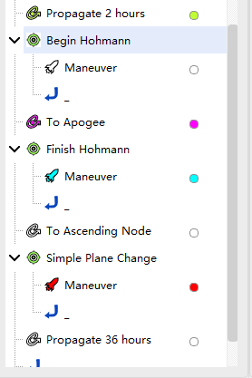
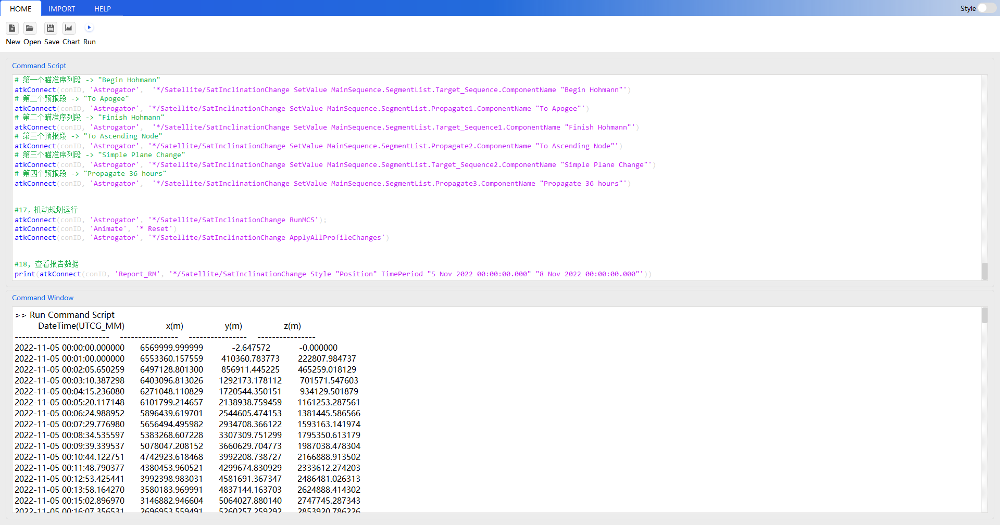

# 倾角改变案例

通过二次开发 Connect 模式，创建倾角改变场景，具体细节与“案例三-9-巨型星座设计案例”相同。期间必须保持 ATK 为打开状态，具体命令分类包括：

1. 与 ATK 进行连接。
2. 新建场景并进行属性设置。
3. 新建卫星并进行属性设置。
4. 新建机动规划任务序列并进行属性设置。
5. 运行机动规划。
6. 查看报告数据。
7. 保存场景后与 ATK 断开连接。

## 脚本展示

### 与 ATK 进行连接

<mix-code lang="python">
# 1, 与 ATK 进行连接
conID = atkOpen()
</mix-code>

### 新建场景并进行属性设置

<mix-code lang="python">
# 2, 建任务场景
atkConnect(conID, 'New', '/ Scenario InclinationChange')
# 设置仿真时间段
atkConnect(conID, 'SetAnalysisTimePeriod', '* "2022-11-05 00:00:00.000000" "2022-11-08 00:00:00.000000"')
# 初始化仿真
atkConnect(conID, 'Animate', '* Reset')
</mix-code>

### 新建卫星并设置卫星类型为机动规划

<mix-code lang="python">
# 3，创建卫星对象
atkConnect(conID, 'New', '/ Satellite SatInclinationChange')
# 设置卫星的轨道预报器为机动规划
atkConnect(conID, 'Astrogator', '*/Satellite/SatInclinationChange SetProp')
</mix-code>

### 设置卫星轨道属性

<mix-code lang="python">
# 4，机动规划添加段，新添加卫星会有默认初始段
atkConnect(conID, 'Astrogator', '*/Satellite/SatInclinationChange InsertSegment MainSequence.SegmentList.- Propagate')
atkConnect(conID, 'Astrogator', '*/Satellite/SatInclinationChange InsertSegment MainSequence.SegmentList.- Target_Sequence')
atkConnect(conID, 'Astrogator', '*/Satellite/SatInclinationChange InsertSegment MainSequence.SegmentList.Target_Sequence.SegmentList.- Maneuver')
atkConnect(conID, 'Astrogator', '*/Satellite/SatInclinationChange InsertSegment MainSequence.SegmentList.- Propagate')
atkConnect(conID, 'Astrogator', '*/Satellite/SatInclinationChange InsertSegment MainSequence.SegmentList.- Target_Sequence')
atkConnect(conID, 'Astrogator', '*/Satellite/SatInclinationChange InsertSegment MainSequence.SegmentList.Target_Sequence1.SegmentList.- Maneuver')
atkConnect(conID, 'Astrogator', '*/Satellite/SatInclinationChange InsertSegment MainSequence.SegmentList.- Propagate')
atkConnect(conID, 'Astrogator', '*/Satellite/SatInclinationChange InsertSegment MainSequence.SegmentList.- Target_Sequence')
atkConnect(conID, 'Astrogator', '*/Satellite/SatInclinationChange InsertSegment MainSequence.SegmentList.Target_Sequence2.SegmentList.- Maneuver')
atkConnect(conID, 'Astrogator', '*/Satellite/SatInclinationChange InsertSegment MainSequence.SegmentList.- Propagate')

# 5，设置初始段属性
# 设置坐标系为 Earth J2000
atkConnect(conID, 'Astrogator', '*/Satellite/SatInclinationChange SetValue MainSequence.SegmentList.Initial_State.CoordinateSystem "CentralBody/Earth J2000"')
# 设置坐标类型为 Keplerian
atkConnect(conID, 'Astrogator', '*/Satellite/SatInclinationChange SetValue MainSequence.SegmentList.Initial_State.CoordinateType "Keplerian"')
# 设置轨道根数（半长轴、偏心率、轨道倾角等）
atkConnect(conID, 'Astrogator', '*/Satellite/SatInclinationChange SetValue MainSequence.SegmentList.Initial_State.InitialState.Keplerian.sma 6570 km')
atkConnect(conID, 'Astrogator', '*/Satellite/SatInclinationChange SetValue MainSequence.SegmentList.Initial_State.InitialState.Keplerian.ecc 0')
atkConnect(conID, 'Astrogator', '*/Satellite/SatInclinationChange SetValue MainSequence.SegmentList.Initial_State.InitialState.Keplerian.inc 28 deg')
atkConnect(conID, 'Astrogator', '*/Satellite/SatInclinationChange SetValue MainSequence.SegmentList.Initial_State.InitialState.Keplerian.RAAN 0 deg')
atkConnect(conID, 'Astrogator', '*/Satellite/SatInclinationChange SetValue MainSequence.SegmentList.Initial_State.InitialState.Keplerian.w 0 deg')
atkConnect(conID, 'Astrogator', '*/Satellite/SatInclinationChange SetValue MainSequence.SegmentList.Initial_State.InitialState.Keplerian.TA 0 deg')
# 设置轨道历元
atkConnect(conID, 'Astrogator', '*/Satellite/SatInclinationChange SetValue MainSequence.SegmentList.Initial_State.InitialState.Epoch "2022-11-05 00:00:00.000" UTCG')

# 6，设置第一个预报段属性设置
# 设置预报段的颜色
atkConnect(conID, 'Astrogator', '*/Satellite/SatInclinationChange SetValue MainSequence.SegmentList.Propagate.SegmentColor 255000000')
# 设置中心天体
atkConnect(conID, 'Astrogator', '*/Satellite/SatInclinationChange SetValue MainSequence.SegmentList.Propagate.CentralBodyCode 2')
# 设置轨道预报段的引力模型及摄动
atkConnect(conID, 'Astrogator', '*/Satellite/SatInclinationChange SetValue MainSequence.SegmentList.Propagate.ForceModel.Gravity.GravModel JGM3')
atkConnect(conID, 'Astrogator', '*/Satellite/SatInclinationChange SetValue MainSequence.SegmentList.Propagate.ForceModel.Gravity.MaxDegree 20')
atkConnect(conID, 'Astrogator', '*/Satellite/SatInclinationChange SetValue MainSequence.SegmentList.Propagate.ForceModel.Gravity.MaxOrder 20')
# 设置大气阻力摄动模型
atkConnect(conID, 'Astrogator', '*/Satellite/SatInclinationChange SetValue MainSequence.SegmentList.Propagate.ForceModel.Drag.UseDrag true')
atkConnect(conID, 'Astrogator', '*/Satellite/SatInclinationChange SetValue MainSequence.SegmentList.Propagate.ForceModel.Drag.AtmModel NRLMSISE00')
# 启用太阳光压摄动
atkConnect(conID, 'Astrogator', '*/Satellite/SatInclinationChange SetValue MainSequence.SegmentList.Propagate.ForceModel.SRP.UseSRP true')
# 设置三体引力模型（太阳和月球）
atkConnect(conID, 'Astrogator', '*/Satellite/SatInclinationChange SetValue MainSequence.SegmentList.Propagate.ForceModel.ThirdBodies.Sun.UseGravity true')
atkConnect(conID, 'Astrogator', '*/Satellite/SatInclinationChange SetValue MainSequence.SegmentList.Propagate.ForceModel.ThirdBodies.Moon.GravModel PointMass')
# 设置停止条件
atkConnect(conID, 'Astrogator', '*/Satellite/SatInclinationChange SetValue MainSequence.SegmentList.Propagate.StoppingConditions Duration')
# 设置停止条件的触发值为7200秒（即2小时）
atkConnect(conID, 'Astrogator', '*/Satellite/SatInclinationChange SetValue MainSequence.SegmentList.Propagate.StoppingConditions.Duration.TripValue 7200 sec')
# 设置停止条件的容忍度（例如0.0001秒）
atkConnect(conID, 'Astrogator', '*/Satellite/SatInclinationChange SetValue MainSequence.SegmentList.Propagate.StoppingConditions.Duration.Tolerance 0.0001 sec')

# 7, 设置第一个机动段属性
# 设置脉冲机动
atkConnect(conID, 'Astrogator', '*/Satellite/SatInclinationChange SetValue MainSequence.SegmentList.Target_Sequence.SegmentList.Maneuver.MnvrType Impulsive')
# 设置推力坐标轴卫星 VNC(Earth)
atkConnect(conID, 'Astrogator', '*/Satellite/SatInclinationChange SetValue MainSequence.SegmentList.Target_Sequence.SegmentList.Maneuver.ImpulsiveMnvr.ThrustAxes "Satellite/SatInclinationChange VNC(Earth)"')
# 设置坐标类型 Cartesian
atkConnect(conID, 'Astrogator', '*/Satellite/SatInclinationChange SetValue MainSequence.SegmentList.Target_Sequence.SegmentList.Maneuver.ImpulsiveMnvr.CoordType Cartesian')
# 把 VX 对应的 X 分量设成设计变量
atkConnect(conID, 'Astrogator', '*/Satellite/SatInclinationChange AddMCSSegmentControl MainSequence.SegmentList.Target_Sequence.SegmentList.Maneuver ImpulsiveMnvr.Cartesian.X')

# 8, 设置第一个瞄准序列段属性
# 给机动段添加结果约束：远拱点半径
atkConnect(conID, 'Astrogator', '*/Satellite/SatInclinationChange SetValue MainSequence.SegmentList.Target_Sequence.SegmentList.Maneuver.Results "Radius Of Apoapsis"')
# 瞄准器：新建微分修正配置
atkConnect(conID, 'Astrogator', '*/Satellite/SatInclinationChange SetValue MainSequence.SegmentList.Target_Sequence.Profiles Differential_Corrector')
# 启用控制变量 X
atkConnect(conID, 'Astrogator', '*/Satellite/SatInclinationChange SetMCSControlValue MainSequence.SegmentList.Target_Sequence.Profiles.Differential_Corrector Maneuver ImpulsiveMnvr.Cartesian.X Active true')
# 常用数值设置
atkConnect(conID, 'Astrogator', '*/Satellite/SatInclinationChange SetMCSControlValue MainSequence.SegmentList.Target_Sequence.Profiles.Differential_Corrector Maneuver ImpulsiveMnvr.Cartesian.X MaxStep 100 m/s')
atkConnect(conID, 'Astrogator', '*/Satellite/SatInclinationChange SetMCSControlValue MainSequence.SegmentList.Target_Sequence.Profiles.Differential_Corrector Maneuver ImpulsiveMnvr.Cartesian.X Pert 0.1 m/s')
atkConnect(conID, 'Astrogator', '*/Satellite/SatInclinationChange SetMCSControlValue MainSequence.SegmentList.Target_Sequence.Profiles.Differential_Corrector Maneuver ImpulsiveMnvr.Cartesian.X Scale 1 m/s')
# 启用约束，并设置目标值 = 42160000 m
atkConnect(conID, 'Astrogator', '*/Satellite/SatInclinationChange SetMCSConstraintValue MainSequence.SegmentList.Target_Sequence.Profiles.Differential_Corrector Maneuver "StateCalcRadiusOfApoapsis" Active true')
atkConnect(conID, 'Astrogator', '*/Satellite/SatInclinationChange SetMCSConstraintValue MainSequence.SegmentList.Target_Sequence.Profiles.Differential_Corrector Maneuver "StateCalcRadiusOfApoapsis" Desired 42160000 m')
atkConnect(conID, 'Astrogator', '*/Satellite/SatInclinationChange SetMCSConstraintValue MainSequence.SegmentList.Target_Sequence.Profiles.Differential_Corrector Maneuver "StateCalcRadiusOfApoapsis" Tolerance 0.1 m')
atkConnect(conID, 'Astrogator', '*/Satellite/SatInclinationChange SetMCSConstraintValue MainSequence.SegmentList.Target_Sequence.Profiles.Differential_Corrector Maneuver "StateCalcRadiusOfApoapsis" Scale 1 m')
atkConnect(conID, 'Astrogator', '*/Satellite/SatInclinationChange SetMCSConstraintValue MainSequence.SegmentList.Target_Sequence.Profiles.Differential_Corrector Maneuver "StateCalcRadiusOfApoapsis" Weight 1')

# 9, 设置第二个轨道预报段属性
atkConnect(conID, 'Astrogator', '*/Satellite/SatInclinationChange SetValue MainSequence.SegmentList.Propagate1.SegmentColor 4294902015')
# 设置轨道预报段的引力模型及摄动
atkConnect(conID, 'Astrogator', '*/Satellite/SatInclinationChange SetValue MainSequence.SegmentList.Propagate1.ForceModel.Gravity.GravModel JGM3')
atkConnect(conID, 'Astrogator', '*/Satellite/SatInclinationChange SetValue MainSequence.SegmentList.Propagate1.ForceModel.Gravity.MaxDegree 20')
atkConnect(conID, 'Astrogator', '*/Satellite/SatInclinationChange SetValue MainSequence.SegmentList.Propagate1.ForceModel.Gravity.MaxOrder 20')
# 设置大气阻力摄动模型
atkConnect(conID, 'Astrogator', '*/Satellite/SatInclinationChange SetValue MainSequence.SegmentList.Propagate1.ForceModel.Drag.UseDrag true')
atkConnect(conID, 'Astrogator', '*/Satellite/SatInclinationChange SetValue MainSequence.SegmentList.Propagate1.ForceModel.Drag.AtmModel NRLMSISE00')
# 启用太阳光压摄动
atkConnect(conID, 'Astrogator', '*/Satellite/SatInclinationChange SetValue MainSequence.SegmentList.Propagate1.ForceModel.SRP.UseSRP true')
# 设置三体引力模型（太阳和月球）
atkConnect(conID, 'Astrogator', '*/Satellite/SatInclinationChange SetValue MainSequence.SegmentList.Propagate1.ForceModel.ThirdBodies.Sun.UseGravity true')
atkConnect(conID, 'Astrogator', '*/Satellite/SatInclinationChange SetValue MainSequence.SegmentList.Propagate1.ForceModel.ThirdBodies.Moon.GravModel PointMass')
# 设置停止条件
atkConnect(conID, 'Astrogator', '*/Satellite/SatInclinationChange SetValue MainSequence.SegmentList.Propagate1.SegmentColor 4294902015')
atkConnect(conID, 'Astrogator', '*/Satellite/SatInclinationChange SetValue MainSequence.SegmentList.Propagate1.StoppingConditions Apoapsis')
atkConnect(conID, 'Astrogator', '*/Satellite/SatInclinationChange SetValue MainSequence.SegmentList.Propagate1.StoppingConditions.Apoapsis.RepeatCount 1')
atkConnect(conID, 'Astrogator', '*/Satellite/SatInclinationChange SetValue MainSequence.SegmentList.Propagate1.StoppingConditions.Apoapsis.Tolerance 0.0001')

# 10, 设置第二个机动段属性设置
atkConnect(conID, 'Astrogator', '*/Satellite/SatInclinationChange SetValue MainSequence.SegmentList.Target_Sequence1.SegmentList.Maneuver.SegmentColor -256')
# 设置脉冲机动
atkConnect(conID, 'Astrogator', '*/Satellite/SatInclinationChange SetValue MainSequence.SegmentList.Target_Sequence1.SegmentList.Maneuver.MnvrType Impulsive')
# 设置推力坐标轴卫星 VNC(Earth)
atkConnect(conID, 'Astrogator', '*/Satellite/SatInclinationChange SetValue MainSequence.SegmentList.Target_Sequence1.SegmentList.Maneuver.ImpulsiveMnvr.ThrustAxes "Satellite/SatInclinationChange VNC(Earth)"')
# 设置坐标类型 Cartesian
atkConnect(conID, 'Astrogator', '*/Satellite/SatInclinationChange SetValue MainSequence.SegmentList.Target_Sequence1.SegmentList.Maneuver.ImpulsiveMnvr.CoordType Cartesian')
# 把 VX 对应的 X 分量设成设计变量
atkConnect(conID, 'Astrogator', '*/Satellite/SatInclinationChange AddMCSSegmentControl MainSequence.SegmentList.Target_Sequence1.SegmentList.Maneuver ImpulsiveMnvr.Cartesian.X')

# 11，设置第二个瞄准预报段属性
# 给机动段添加结果约束：偏心率
atkConnect(conID, 'Astrogator','*/Satellite/SatInclinationChange SetValue MainSequence.SegmentList.Target_Sequence1.SegmentList.Maneuver.Results "Eccentricity"')
# 瞄准器：新建微分修正配置
atkConnect(conID, 'Astrogator','*/Satellite/SatInclinationChange SetValue MainSequence.SegmentList.Target_Sequence1.Profiles Differential_Corrector')
# 启用控制变量 X
atkConnect(conID, 'Astrogator','*/Satellite/SatInclinationChange SetMCSControlValue MainSequence.SegmentList.Target_Sequence1.Profiles.Differential_Corrector Maneuver ImpulsiveMnvr.Cartesian.X Active true')
# 常用数值设置
atkConnect(conID, 'Astrogator','*/Satellite/SatInclinationChange SetMCSControlValue MainSequence.SegmentList.Target_Sequence1.Profiles.Differential_Corrector Maneuver ImpulsiveMnvr.Cartesian.X MaxStep 100 m/s')
atkConnect(conID, 'Astrogator','*/Satellite/SatInclinationChange SetMCSControlValue MainSequence.SegmentList.Target_Sequence1.Profiles.Differential_Corrector Maneuver ImpulsiveMnvr.Cartesian.X Pert 0.1 m/s')
atkConnect(conID, 'Astrogator','*/Satellite/SatInclinationChange SetMCSControlValue MainSequence.SegmentList.Target_Sequence1.Profiles.Differential_Corrector Maneuver ImpulsiveMnvr.Cartesian.X Scale 1 m/s')
# 启用约束
atkConnect(conID, 'Astrogator','*/Satellite/SatInclinationChange SetMCSConstraintValue MainSequence.SegmentList.Target_Sequence1.Profiles.Differential_Corrector Maneuver "StateCalcEccentricity" Active true')
atkConnect(conID, 'Astrogator','*/Satellite/SatInclinationChange SetMCSConstraintValue MainSequence.SegmentList.Target_Sequence1.Profiles.Differential_Corrector Maneuver "StateCalcEccentricity" Tolerance 0.001')
atkConnect(conID, 'Astrogator','*/Satellite/SatInclinationChange SetMCSConstraintValue MainSequence.SegmentList.Target_Sequence1.Profiles.Differential_Corrector Maneuver "StateCalcEccentricity" Scale 1')
atkConnect(conID, 'Astrogator','*/Satellite/SatInclinationChange SetMCSConstraintValue MainSequence.SegmentList.Target_Sequence1.Profiles.Differential_Corrector Maneuver "StateCalcEccentricity" Weight 1')
atkConnect(conID, 'Astrogator','*/Satellite/SatInclinationChange SetMCSConstraintValue MainSequence.SegmentList.Target_Sequence1.Profiles.Differential_Corrector Maneuver "StateCalcEccentricity" Desired 0')

# 12，设置第三个轨道预报段属性
atkConnect(conID, 'Astrogator', '*/Satellite/SatInclinationChange SetValue MainSequence.SegmentList.Target_Sequence2.SegmentList.Maneuver.SegmentColor 4278190335')
# 设置轨道预报段的引力模型及摄动
atkConnect(conID, 'Astrogator', '*/Satellite/SatInclinationChange SetValue MainSequence.SegmentList.Propagate2.ForceModel.Gravity.GravModel JGM3')
atkConnect(conID, 'Astrogator', '*/Satellite/SatInclinationChange SetValue MainSequence.SegmentList.Propagate2.ForceModel.Gravity.MaxDegree 20')
atkConnect(conID, 'Astrogator', '*/Satellite/SatInclinationChange SetValue MainSequence.SegmentList.Propagate2.ForceModel.Gravity.MaxOrder 20')
# 设置大气阻力摄动模型
atkConnect(conID, 'Astrogator', '*/Satellite/SatInclinationChange SetValue MainSequence.SegmentList.Propagate2.ForceModel.Drag.UseDrag true')
atkConnect(conID, 'Astrogator', '*/Satellite/SatInclinationChange SetValue MainSequence.SegmentList.Propagate2.ForceModel.Drag.AtmModel NRLMSISE00')
# 启用太阳光压摄动
atkConnect(conID, 'Astrogator', '*/Satellite/SatInclinationChange SetValue MainSequence.SegmentList.Propagate2.ForceModel.SRP.UseSRP true')
# 设置三体引力模型（太阳和月球）
atkConnect(conID, 'Astrogator', '*/Satellite/SatInclinationChange SetValue MainSequence.SegmentList.Propagate2.ForceModel.ThirdBodies.Sun.UseGravity true')
atkConnect(conID, 'Astrogator', '*/Satellite/SatInclinationChange SetValue MainSequence.SegmentList.Propagate2.ForceModel.ThirdBodies.Moon.GravModel PointMass')
# 设置停止条件
atkConnect(conID, 'Astrogator','*/Satellite/SatInclinationChange SetValue MainSequence.SegmentList.Propagate2.StoppingConditions AscendingNode')
atkConnect(conID, 'Astrogator','*/Satellite/SatInclinationChange SetValue MainSequence.SegmentList.Propagate2.StoppingConditions.AscendingNode.RepeatCount 2')
atkConnect(conID, 'Astrogator','*/Satellite/SatInclinationChange SetValue MainSequence.SegmentList.Propagate2.StoppingConditions.AscendingNode.Tolerance 0.0001')

# 13，设置第三个机动段属性
# 设置脉冲机动
atkConnect(conID, 'Astrogator','*/Satellite/SatInclinationChange SetValue MainSequence.SegmentList.Target_Sequence2.SegmentList.Maneuver.MnvrType Impulsive')
# 设置推力坐标轴卫星 VNC(Earth)
atkConnect(conID, 'Astrogator','*/Satellite/SatInclinationChange SetValue MainSequence.SegmentList.Target_Sequence2.SegmentList.Maneuver.ImpulsiveMnvr.ThrustAxes "Satellite/SatInclinationChange VNC(Earth)"')
# 设置坐标类型 Cartesian
atkConnect(conID, 'Astrogator','*/Satellite/SatInclinationChange SetValue MainSequence.SegmentList.Target_Sequence2.SegmentList.Maneuver.ImpulsiveMnvr.CoordType Cartesian')
# 把 VX VY对应的分量设成设计变量
atkConnect(conID, 'Astrogator','*/Satellite/SatInclinationChange AddMCSSegmentControl MainSequence.SegmentList.Target_Sequence2.SegmentList.Maneuver ImpulsiveMnvr.Cartesian.X')
atkConnect(conID, 'Astrogator','*/Satellite/SatInclinationChange AddMCSSegmentControl MainSequence.SegmentList.Target_Sequence2.SegmentList.Maneuver ImpulsiveMnvr.Cartesian.Y')

# 14, 设置第三个瞄准序列段属性
# 给机动段添加结果约束：偏心率 与 倾角
atkConnect(conID, 'Astrogator', '*/Satellite/SatInclinationChange SetValue MainSequence.SegmentList.Target_Sequence2.SegmentList.Maneuver.Results "Inclination" "Eccentricity"')
# 瞄准器：新建微分修正配置
atkConnect(conID, 'Astrogator', '*/Satellite/SatInclinationChange SetValue MainSequence.SegmentList.Target_Sequence2.Profiles Differential_Corrector')
# 启用控制变量 X
atkConnect(conID, 'Astrogator','*/Satellite/SatInclinationChange SetMCSControlValue MainSequence.SegmentList.Target_Sequence2.Profiles.Differential_Corrector Maneuver ImpulsiveMnvr.Cartesian.X Active true')
atkConnect(conID, 'Astrogator','*/Satellite/SatInclinationChange SetMCSControlValue MainSequence.SegmentList.Target_Sequence2.Profiles.Differential_Corrector Maneuver ImpulsiveMnvr.Cartesian.X MaxStep 100 m/s')
atkConnect(conID, 'Astrogator', '*/Satellite/SatInclinationChange SetMCSControlValue MainSequence.SegmentList.Target_Sequence2.Profiles.Differential_Corrector Maneuver ImpulsiveMnvr.Cartesian.X Pert 0.1 m/s')
atkConnect(conID, 'Astrogator', '*/Satellite/SatInclinationChange SetMCSControlValue MainSequence.SegmentList.Target_Sequence2.Profiles.Differential_Corrector Maneuver ImpulsiveMnvr.Cartesian.X Scale 1 m/s')
# 启用控制变量 Y
atkConnect(conID, 'Astrogator', '*/Satellite/SatInclinationChange SetMCSControlValue MainSequence.SegmentList.Target_Sequence2.Profiles.Differential_Corrector Maneuver ImpulsiveMnvr.Cartesian.Y Active true')
atkConnect(conID, 'Astrogator', '*/Satellite/SatInclinationChange SetMCSControlValue MainSequence.SegmentList.Target_Sequence2.Profiles.Differential_Corrector Maneuver ImpulsiveMnvr.Cartesian.Y MaxStep 100 m/s')
atkConnect(conID, 'Astrogator', '*/Satellite/SatInclinationChange SetMCSControlValue MainSequence.SegmentList.Target_Sequence2.Profiles.Differential_Corrector Maneuver ImpulsiveMnvr.Cartesian.Y Pert 0.1 m/s')
atkConnect(conID, 'Astrogator', '*/Satellite/SatInclinationChange SetMCSControlValue MainSequence.SegmentList.Target_Sequence2.Profiles.Differential_Corrector Maneuver ImpulsiveMnvr.Cartesian.Y Scale 1 m/s')
# 启用约束 Inclination
atkConnect(conID, 'Astrogator','*/Satellite/SatInclinationChange SetMCSConstraintValue MainSequence.SegmentList.Target_Sequence2.Profiles.Differential_Corrector Maneuver "StateCalcInclination" Active true')
atkConnect(conID, 'Astrogator', '*/Satellite/SatInclinationChange SetMCSConstraintValue MainSequence.SegmentList.Target_Sequence2.Profiles.Differential_Corrector Maneuver "StateCalcInclination" Tolerance 0 deg')
atkConnect(conID, 'Astrogator', '*/Satellite/SatInclinationChange SetMCSConstraintValue MainSequence.SegmentList.Target_Sequence2.Profiles.Differential_Corrector Maneuver "StateCalcInclination" Scale 1 deg')
atkConnect(conID, 'Astrogator', '*/Satellite/SatInclinationChange SetMCSConstraintValue MainSequence.SegmentList.Target_Sequence2.Profiles.Differential_Corrector Maneuver "StateCalcInclination" Weight 1')
atkConnect(conID, 'Astrogator', '*/Satellite/SatInclinationChange SetMCSConstraintValue MainSequence.SegmentList.Target_Sequence2.Profiles.Differential_Corrector Maneuver "StateCalcInclination" Desired 0 deg')
# 启用约束 Eccentricity
atkConnect(conID, 'Astrogator', '*/Satellite/SatInclinationChange SetMCSConstraintValue MainSequence.SegmentList.Target_Sequence2.Profiles.Differential_Corrector Maneuver "StateCalcEccentricity" Active true')
atkConnect(conID, 'Astrogator', '*/Satellite/SatInclinationChange SetMCSConstraintValue MainSequence.SegmentList.Target_Sequence2.Profiles.Differential_Corrector Maneuver "StateCalcEccentricity" Tolerance 0.001')
atkConnect(conID, 'Astrogator', '*/Satellite/SatInclinationChange SetMCSConstraintValue MainSequence.SegmentList.Target_Sequence2.Profiles.Differential_Corrector Maneuver "StateCalcEccentricity" Scale 1')
atkConnect(conID, 'Astrogator', '*/Satellite/SatInclinationChange SetMCSConstraintValue MainSequence.SegmentList.Target_Sequence2.Profiles.Differential_Corrector Maneuver "StateCalcEccentricity" Weight 1')
atkConnect(conID, 'Astrogator', '*/Satellite/SatInclinationChange SetMCSConstraintValue MainSequence.SegmentList.Target_Sequence2.Profiles.Differential_Corrector Maneuver "StateCalcEccentricity" Desired 0')

# 15, 设置第四个轨道预报段属性
# 设置轨道预报段的引力模型及摄动
atkConnect(conID, 'Astrogator', '*/Satellite/SatInclinationChange SetValue MainSequence.SegmentList.Propagate3.ForceModel.Gravity.GravModel JGM3')
atkConnect(conID, 'Astrogator', '*/Satellite/SatInclinationChange SetValue MainSequence.SegmentList.Propagate3.ForceModel.Gravity.MaxDegree 20')
atkConnect(conID, 'Astrogator', '*/Satellite/SatInclinationChange SetValue MainSequence.SegmentList.Propagate3.ForceModel.Gravity.MaxOrder 20')
# 设置大气阻力摄动模型
atkConnect(conID, 'Astrogator', '*/Satellite/SatInclinationChange SetValue MainSequence.SegmentList.Propagate3.ForceModel.Drag.UseDrag true')
atkConnect(conID, 'Astrogator', '*/Satellite/SatInclinationChange SetValue MainSequence.SegmentList.Propagate3.ForceModel.Drag.AtmModel NRLMSISE00')
# 启用太阳光压摄动
atkConnect(conID, 'Astrogator', '*/Satellite/SatInclinationChange SetValue MainSequence.SegmentList.Propagate3.ForceModel.SRP.UseSRP true')
# 设置三体引力模型（太阳和月球）
atkConnect(conID, 'Astrogator', '*/Satellite/SatInclinationChange SetValue MainSequence.SegmentList.Propagate3.ForceModel.ThirdBodies.Sun.UseGravity true')
atkConnect(conID, 'Astrogator', '*/Satellite/SatInclinationChange SetValue MainSequence.SegmentList.Propagate3.ForceModel.ThirdBodies.Moon.GravModel PointMass')
# 设置停止条件
atkConnect(conID, 'Astrogator', '*/Satellite/SatInclinationChange SetValue MainSequence.SegmentList.Propagate3.StoppingConditions Duration')
# 设置停止条件的触发值为129600s
atkConnect(conID, 'Astrogator', '*/Satellite/SatInclinationChange SetValue MainSequence.SegmentList.Propagate3.StoppingConditions.Duration.TripValue 129600 sec')
# 设置停止条件的容忍度（例如0.0001秒）
atkConnect(conID, 'Astrogator', '*/Satellite/SatInclinationChange SetValue MainSequence.SegmentList.Propagate3.StoppingConditions.Duration.Tolerance 0.0001 sec')

# 16, 重命名
# 初始段 -> "28 deg Inclined Orbit"
atkConnect(conID, 'Astrogator', '*/Satellite/SatInclinationChange SetValue MainSequence.SegmentList.Initial_State.ComponentName "28 deg Inclined Orbit"')
# 第一个预报段 -> "Propagate 2 hours"
atkConnect(conID, 'Astrogator', '*/Satellite/SatInclinationChange SetValue MainSequence.SegmentList.Propagate.ComponentName "Propagate 2 hours"')
# 第一个瞄准序列段 -> "Begin Hohmann"
atkConnect(conID, 'Astrogator',  '*/Satellite/SatInclinationChange SetValue MainSequence.SegmentList.Target_Sequence.ComponentName "Begin Hohmann"')
# 第二个预报段 -> "To Apogee"
atkConnect(conID, 'Astrogator', '*/Satellite/SatInclinationChange SetValue MainSequence.SegmentList.Propagate1.ComponentName "To Apogee"')
# 第二个瞄准序列段 -> "Finish Hohmann"
atkConnect(conID, 'Astrogator',  '*/Satellite/SatInclinationChange SetValue MainSequence.SegmentList.Target_Sequence1.ComponentName "Finish Hohmann"')
# 第三个预报段 -> "To Ascending Node"
atkConnect(conID, 'Astrogator', '*/Satellite/SatInclinationChange SetValue MainSequence.SegmentList.Propagate2.ComponentName "To Ascending Node"')
# 第三个瞄准序列段 -> "Simple Plane Change"
atkConnect(conID, 'Astrogator', '*/Satellite/SatInclinationChange SetValue MainSequence.SegmentList.Target_Sequence2.ComponentName "Simple Plane Change"')
# 第四个预报段 -> "Propagate 36 hours"
atkConnect(conID, 'Astrogator',  '*/Satellite/SatInclinationChange SetValue MainSequence.SegmentList.Propagate3.ComponentName "Propagate 36 hours"')
</mix-code>

### 运行机动规划

<mix-code lang="python">
# 17，机动规划运行
atkConnect(conID, 'Astrogator', '*/Satellite/SatInclinationChange RunMCS')
atkConnect(conID, 'Animate', '* Reset')
atkConnect(conID, 'Astrogator', '*/Satellite/SatInclinationChange ApplyAllProfileChanges')
</mix-code>

### 查看报告数据

<mix-code lang="python">
# 18, 查看报告数据
atkConnect(conID, 'Report_RM', '*/Satellite/SatInclinationChange Style "Position" TimePeriod "5 Nov 2022 00:00:00.000" "8 Nov 2022 00:00:00.000"')
</mix-code>

### 保存场景后与 ATK 断开连接

<mix-code lang="python">
# 19，想定保存
atkConnect(conID, 'Save', '/ *')
# 与ATK断开连接
atkClose(conID)
</mix-code>

## 报告数据结果

脚本创建的完整任务序列如下图所示：

报告数据结果如下图所示：

## 完整脚本

<mix-code lang="python">
# 1, 与 ATK 进行连接
conID = atkOpen()

# 2, 建任务场景
atkConnect(conID, 'New', '/ Scenario InclinationChange')
# 设置仿真时间段
atkConnect(conID, 'SetAnalysisTimePeriod', '* "2022-11-05 00:00:00.000000" "2022-11-08 00:00:00.000000"')
# 初始化仿真
atkConnect(conID, 'Animate', '* Reset')

# 3，创建卫星对象
atkConnect(conID, 'New', '/ Satellite SatInclinationChange')
# 设置卫星的轨道预报器为机动规划
atkConnect(conID, 'Astrogator', '*/Satellite/SatInclinationChange SetProp')

# 4，机动规划添加段，新添加卫星会有默认初始段
atkConnect(conID, 'Astrogator', '*/Satellite/SatInclinationChange InsertSegment MainSequence.SegmentList.- Propagate')
atkConnect(conID, 'Astrogator', '*/Satellite/SatInclinationChange InsertSegment MainSequence.SegmentList.- Target_Sequence')
atkConnect(conID, 'Astrogator', '*/Satellite/SatInclinationChange InsertSegment MainSequence.SegmentList.Target_Sequence.SegmentList.- Maneuver')
atkConnect(conID, 'Astrogator', '*/Satellite/SatInclinationChange InsertSegment MainSequence.SegmentList.- Propagate')
atkConnect(conID, 'Astrogator', '*/Satellite/SatInclinationChange InsertSegment MainSequence.SegmentList.- Target_Sequence')
atkConnect(conID, 'Astrogator', '*/Satellite/SatInclinationChange InsertSegment MainSequence.SegmentList.Target_Sequence1.SegmentList.- Maneuver')
atkConnect(conID, 'Astrogator', '*/Satellite/SatInclinationChange InsertSegment MainSequence.SegmentList.- Propagate')
atkConnect(conID, 'Astrogator', '*/Satellite/SatInclinationChange InsertSegment MainSequence.SegmentList.- Target_Sequence')
atkConnect(conID, 'Astrogator', '*/Satellite/SatInclinationChange InsertSegment MainSequence.SegmentList.Target_Sequence2.SegmentList.- Maneuver')
atkConnect(conID, 'Astrogator', '*/Satellite/SatInclinationChange InsertSegment MainSequence.SegmentList.- Propagate')

# 5，设置初始段属性
# 设置坐标系为 Earth J2000
atkConnect(conID, 'Astrogator', '*/Satellite/SatInclinationChange SetValue MainSequence.SegmentList.Initial_State.CoordinateSystem "CentralBody/Earth J2000"')
# 设置坐标类型为 Keplerian
atkConnect(conID, 'Astrogator', '*/Satellite/SatInclinationChange SetValue MainSequence.SegmentList.Initial_State.CoordinateType "Keplerian"')
# 设置轨道根数（半长轴、偏心率、轨道倾角等）
atkConnect(conID, 'Astrogator', '*/Satellite/SatInclinationChange SetValue MainSequence.SegmentList.Initial_State.InitialState.Keplerian.sma 6570 km')
atkConnect(conID, 'Astrogator', '*/Satellite/SatInclinationChange SetValue MainSequence.SegmentList.Initial_State.InitialState.Keplerian.ecc 0')
atkConnect(conID, 'Astrogator', '*/Satellite/SatInclinationChange SetValue MainSequence.SegmentList.Initial_State.InitialState.Keplerian.inc 28 deg')
atkConnect(conID, 'Astrogator', '*/Satellite/SatInclinationChange SetValue MainSequence.SegmentList.Initial_State.InitialState.Keplerian.RAAN 0 deg')
atkConnect(conID, 'Astrogator', '*/Satellite/SatInclinationChange SetValue MainSequence.SegmentList.Initial_State.InitialState.Keplerian.w 0 deg')
atkConnect(conID, 'Astrogator', '*/Satellite/SatInclinationChange SetValue MainSequence.SegmentList.Initial_State.InitialState.Keplerian.TA 0 deg')
# 设置轨道历元
atkConnect(conID, 'Astrogator', '*/Satellite/SatInclinationChange SetValue MainSequence.SegmentList.Initial_State.InitialState.Epoch "2022-11-05 00:00:00.000" UTCG')

# 6，设置第一个预报段属性设置
# 设置预报段的颜色
atkConnect(conID, 'Astrogator', '*/Satellite/SatInclinationChange SetValue MainSequence.SegmentList.Propagate.SegmentColor 255000000')
# 设置中心天体
atkConnect(conID, 'Astrogator', '*/Satellite/SatInclinationChange SetValue MainSequence.SegmentList.Propagate.CentralBodyCode 2')
# 设置轨道预报段的引力模型及摄动
atkConnect(conID, 'Astrogator', '*/Satellite/SatInclinationChange SetValue MainSequence.SegmentList.Propagate.ForceModel.Gravity.GravModel JGM3')
atkConnect(conID, 'Astrogator', '*/Satellite/SatInclinationChange SetValue MainSequence.SegmentList.Propagate.ForceModel.Gravity.MaxDegree 20')
atkConnect(conID, 'Astrogator', '*/Satellite/SatInclinationChange SetValue MainSequence.SegmentList.Propagate.ForceModel.Gravity.MaxOrder 20')
# 设置大气阻力摄动模型
atkConnect(conID, 'Astrogator', '*/Satellite/SatInclinationChange SetValue MainSequence.SegmentList.Propagate.ForceModel.Drag.UseDrag true')
atkConnect(conID, 'Astrogator', '*/Satellite/SatInclinationChange SetValue MainSequence.SegmentList.Propagate.ForceModel.Drag.AtmModel NRLMSISE00')
# 启用太阳光压摄动
atkConnect(conID, 'Astrogator', '*/Satellite/SatInclinationChange SetValue MainSequence.SegmentList.Propagate.ForceModel.SRP.UseSRP true')
# 设置三体引力模型（太阳和月球）
atkConnect(conID, 'Astrogator', '*/Satellite/SatInclinationChange SetValue MainSequence.SegmentList.Propagate.ForceModel.ThirdBodies.Sun.UseGravity true')
atkConnect(conID, 'Astrogator', '*/Satellite/SatInclinationChange SetValue MainSequence.SegmentList.Propagate.ForceModel.ThirdBodies.Moon.GravModel PointMass')
# 设置停止条件
atkConnect(conID, 'Astrogator', '*/Satellite/SatInclinationChange SetValue MainSequence.SegmentList.Propagate.StoppingConditions Duration')
# 设置停止条件的触发值为7200秒（即2小时）
atkConnect(conID, 'Astrogator', '*/Satellite/SatInclinationChange SetValue MainSequence.SegmentList.Propagate.StoppingConditions.Duration.TripValue 7200 sec')
# 设置停止条件的容忍度（例如0.0001秒）
atkConnect(conID, 'Astrogator', '*/Satellite/SatInclinationChange SetValue MainSequence.SegmentList.Propagate.StoppingConditions.Duration.Tolerance 0.0001 sec')

# 7, 设置第一个机动段属性
# 设置脉冲机动
atkConnect(conID, 'Astrogator', '*/Satellite/SatInclinationChange SetValue MainSequence.SegmentList.Target_Sequence.SegmentList.Maneuver.MnvrType Impulsive')
# 设置推力坐标轴卫星 VNC(Earth)
atkConnect(conID, 'Astrogator', '*/Satellite/SatInclinationChange SetValue MainSequence.SegmentList.Target_Sequence.SegmentList.Maneuver.ImpulsiveMnvr.ThrustAxes "Satellite/SatInclinationChange VNC(Earth)"')
# 设置坐标类型 Cartesian
atkConnect(conID, 'Astrogator', '*/Satellite/SatInclinationChange SetValue MainSequence.SegmentList.Target_Sequence.SegmentList.Maneuver.ImpulsiveMnvr.CoordType Cartesian')
# 把 VX 对应的 X 分量设成设计变量
atkConnect(conID, 'Astrogator', '*/Satellite/SatInclinationChange AddMCSSegmentControl MainSequence.SegmentList.Target_Sequence.SegmentList.Maneuver ImpulsiveMnvr.Cartesian.X')

# 8, 设置第一个瞄准序列段属性
# 给机动段添加结果约束：远拱点半径
atkConnect(conID, 'Astrogator', '*/Satellite/SatInclinationChange SetValue MainSequence.SegmentList.Target_Sequence.SegmentList.Maneuver.Results "Radius Of Apoapsis"')
# 瞄准器：新建微分修正配置
atkConnect(conID, 'Astrogator', '*/Satellite/SatInclinationChange SetValue MainSequence.SegmentList.Target_Sequence.Profiles Differential_Corrector')
# 启用控制变量 X
atkConnect(conID, 'Astrogator', '*/Satellite/SatInclinationChange SetMCSControlValue MainSequence.SegmentList.Target_Sequence.Profiles.Differential_Corrector Maneuver ImpulsiveMnvr.Cartesian.X Active true')
# 常用数值设置
atkConnect(conID, 'Astrogator', '*/Satellite/SatInclinationChange SetMCSControlValue MainSequence.SegmentList.Target_Sequence.Profiles.Differential_Corrector Maneuver ImpulsiveMnvr.Cartesian.X MaxStep 100 m/s')
atkConnect(conID, 'Astrogator', '*/Satellite/SatInclinationChange SetMCSControlValue MainSequence.SegmentList.Target_Sequence.Profiles.Differential_Corrector Maneuver ImpulsiveMnvr.Cartesian.X Pert 0.1 m/s')
atkConnect(conID, 'Astrogator', '*/Satellite/SatInclinationChange SetMCSControlValue MainSequence.SegmentList.Target_Sequence.Profiles.Differential_Corrector Maneuver ImpulsiveMnvr.Cartesian.X Scale 1 m/s')
# 启用约束，并设置目标值 = 42160000 m
atkConnect(conID, 'Astrogator', '*/Satellite/SatInclinationChange SetMCSConstraintValue MainSequence.SegmentList.Target_Sequence.Profiles.Differential_Corrector Maneuver "StateCalcRadiusOfApoapsis" Active true')
atkConnect(conID, 'Astrogator', '*/Satellite/SatInclinationChange SetMCSConstraintValue MainSequence.SegmentList.Target_Sequence.Profiles.Differential_Corrector Maneuver "StateCalcRadiusOfApoapsis" Desired 42160000 m')
atkConnect(conID, 'Astrogator', '*/Satellite/SatInclinationChange SetMCSConstraintValue MainSequence.SegmentList.Target_Sequence.Profiles.Differential_Corrector Maneuver "StateCalcRadiusOfApoapsis" Tolerance 0.1 m')
atkConnect(conID, 'Astrogator', '*/Satellite/SatInclinationChange SetMCSConstraintValue MainSequence.SegmentList.Target_Sequence.Profiles.Differential_Corrector Maneuver "StateCalcRadiusOfApoapsis" Scale 1 m')
atkConnect(conID, 'Astrogator', '*/Satellite/SatInclinationChange SetMCSConstraintValue MainSequence.SegmentList.Target_Sequence.Profiles.Differential_Corrector Maneuver "StateCalcRadiusOfApoapsis" Weight 1')

# 9, 设置第二个轨道预报段属性
atkConnect(conID, 'Astrogator', '*/Satellite/SatInclinationChange SetValue MainSequence.SegmentList.Propagate1.SegmentColor 4294902015')
# 设置轨道预报段的引力模型及摄动
atkConnect(conID, 'Astrogator', '*/Satellite/SatInclinationChange SetValue MainSequence.SegmentList.Propagate1.ForceModel.Gravity.GravModel JGM3')
atkConnect(conID, 'Astrogator', '*/Satellite/SatInclinationChange SetValue MainSequence.SegmentList.Propagate1.ForceModel.Gravity.MaxDegree 20')
atkConnect(conID, 'Astrogator', '*/Satellite/SatInclinationChange SetValue MainSequence.SegmentList.Propagate1.ForceModel.Gravity.MaxOrder 20')
# 设置大气阻力摄动模型
atkConnect(conID, 'Astrogator', '*/Satellite/SatInclinationChange SetValue MainSequence.SegmentList.Propagate1.ForceModel.Drag.UseDrag true')
atkConnect(conID, 'Astrogator', '*/Satellite/SatInclinationChange SetValue MainSequence.SegmentList.Propagate1.ForceModel.Drag.AtmModel NRLMSISE00')
# 启用太阳光压摄动
atkConnect(conID, 'Astrogator', '*/Satellite/SatInclinationChange SetValue MainSequence.SegmentList.Propagate1.ForceModel.SRP.UseSRP true')
# 设置三体引力模型（太阳和月球）
atkConnect(conID, 'Astrogator', '*/Satellite/SatInclinationChange SetValue MainSequence.SegmentList.Propagate1.ForceModel.ThirdBodies.Sun.UseGravity true')
atkConnect(conID, 'Astrogator', '*/Satellite/SatInclinationChange SetValue MainSequence.SegmentList.Propagate1.ForceModel.ThirdBodies.Moon.GravModel PointMass')
# 设置停止条件
atkConnect(conID, 'Astrogator', '*/Satellite/SatInclinationChange SetValue MainSequence.SegmentList.Propagate1.SegmentColor 4294902015')
atkConnect(conID, 'Astrogator', '*/Satellite/SatInclinationChange SetValue MainSequence.SegmentList.Propagate1.StoppingConditions Apoapsis')
atkConnect(conID, 'Astrogator', '*/Satellite/SatInclinationChange SetValue MainSequence.SegmentList.Propagate1.StoppingConditions.Apoapsis.RepeatCount 1')
atkConnect(conID, 'Astrogator', '*/Satellite/SatInclinationChange SetValue MainSequence.SegmentList.Propagate1.StoppingConditions.Apoapsis.Tolerance 0.0001')

# 10, 设置第二个机动段属性设置
atkConnect(conID, 'Astrogator', '*/Satellite/SatInclinationChange SetValue MainSequence.SegmentList.Target_Sequence1.SegmentList.Maneuver.SegmentColor -256')
# 设置脉冲机动
atkConnect(conID, 'Astrogator', '*/Satellite/SatInclinationChange SetValue MainSequence.SegmentList.Target_Sequence1.SegmentList.Maneuver.MnvrType Impulsive')
# 设置推力坐标轴卫星 VNC(Earth)
atkConnect(conID, 'Astrogator', '*/Satellite/SatInclinationChange SetValue MainSequence.SegmentList.Target_Sequence1.SegmentList.Maneuver.ImpulsiveMnvr.ThrustAxes "Satellite/SatInclinationChange VNC(Earth)"')
# 设置坐标类型 Cartesian
atkConnect(conID, 'Astrogator', '*/Satellite/SatInclinationChange SetValue MainSequence.SegmentList.Target_Sequence1.SegmentList.Maneuver.ImpulsiveMnvr.CoordType Cartesian')
# 把 VX 对应的 X 分量设成设计变量
atkConnect(conID, 'Astrogator', '*/Satellite/SatInclinationChange AddMCSSegmentControl MainSequence.SegmentList.Target_Sequence1.SegmentList.Maneuver ImpulsiveMnvr.Cartesian.X')

# 11，设置第二个瞄准预报段属性
# 给机动段添加结果约束：偏心率
atkConnect(conID, 'Astrogator','*/Satellite/SatInclinationChange SetValue MainSequence.SegmentList.Target_Sequence1.SegmentList.Maneuver.Results "Eccentricity"')
# 瞄准器：新建微分修正配置
atkConnect(conID, 'Astrogator','*/Satellite/SatInclinationChange SetValue MainSequence.SegmentList.Target_Sequence1.Profiles Differential_Corrector')
# 启用控制变量 X
atkConnect(conID, 'Astrogator','*/Satellite/SatInclinationChange SetMCSControlValue MainSequence.SegmentList.Target_Sequence1.Profiles.Differential_Corrector Maneuver ImpulsiveMnvr.Cartesian.X Active true')
# 常用数值设置
atkConnect(conID, 'Astrogator','*/Satellite/SatInclinationChange SetMCSControlValue MainSequence.SegmentList.Target_Sequence1.Profiles.Differential_Corrector Maneuver ImpulsiveMnvr.Cartesian.X MaxStep 100 m/s')
atkConnect(conID, 'Astrogator','*/Satellite/SatInclinationChange SetMCSControlValue MainSequence.SegmentList.Target_Sequence1.Profiles.Differential_Corrector Maneuver ImpulsiveMnvr.Cartesian.X Pert 0.1 m/s')
atkConnect(conID, 'Astrogator','*/Satellite/SatInclinationChange SetMCSControlValue MainSequence.SegmentList.Target_Sequence1.Profiles.Differential_Corrector Maneuver ImpulsiveMnvr.Cartesian.X Scale 1 m/s')
# 启用约束
atkConnect(conID, 'Astrogator','*/Satellite/SatInclinationChange SetMCSConstraintValue MainSequence.SegmentList.Target_Sequence1.Profiles.Differential_Corrector Maneuver "StateCalcEccentricity" Active true')
atkConnect(conID, 'Astrogator','*/Satellite/SatInclinationChange SetMCSConstraintValue MainSequence.SegmentList.Target_Sequence1.Profiles.Differential_Corrector Maneuver "StateCalcEccentricity" Tolerance 0.001')
atkConnect(conID, 'Astrogator','*/Satellite/SatInclinationChange SetMCSConstraintValue MainSequence.SegmentList.Target_Sequence1.Profiles.Differential_Corrector Maneuver "StateCalcEccentricity" Scale 1')
atkConnect(conID, 'Astrogator','*/Satellite/SatInclinationChange SetMCSConstraintValue MainSequence.SegmentList.Target_Sequence1.Profiles.Differential_Corrector Maneuver "StateCalcEccentricity" Weight 1')
atkConnect(conID, 'Astrogator','*/Satellite/SatInclinationChange SetMCSConstraintValue MainSequence.SegmentList.Target_Sequence1.Profiles.Differential_Corrector Maneuver "StateCalcEccentricity" Desired 0')

# 12，设置第三个轨道预报段属性
atkConnect(conID, 'Astrogator', '*/Satellite/SatInclinationChange SetValue MainSequence.SegmentList.Target_Sequence2.SegmentList.Maneuver.SegmentColor 4278190335')
# 设置轨道预报段的引力模型及摄动
atkConnect(conID, 'Astrogator', '*/Satellite/SatInclinationChange SetValue MainSequence.SegmentList.Propagate2.ForceModel.Gravity.GravModel JGM3')
atkConnect(conID, 'Astrogator', '*/Satellite/SatInclinationChange SetValue MainSequence.SegmentList.Propagate2.ForceModel.Gravity.MaxDegree 20')
atkConnect(conID, 'Astrogator', '*/Satellite/SatInclinationChange SetValue MainSequence.SegmentList.Propagate2.ForceModel.Gravity.MaxOrder 20')
# 设置大气阻力摄动模型
atkConnect(conID, 'Astrogator', '*/Satellite/SatInclinationChange SetValue MainSequence.SegmentList.Propagate2.ForceModel.Drag.UseDrag true')
atkConnect(conID, 'Astrogator', '*/Satellite/SatInclinationChange SetValue MainSequence.SegmentList.Propagate2.ForceModel.Drag.AtmModel NRLMSISE00')
# 启用太阳光压摄动
atkConnect(conID, 'Astrogator', '*/Satellite/SatInclinationChange SetValue MainSequence.SegmentList.Propagate2.ForceModel.SRP.UseSRP true')
# 设置三体引力模型（太阳和月球）
atkConnect(conID, 'Astrogator', '*/Satellite/SatInclinationChange SetValue MainSequence.SegmentList.Propagate2.ForceModel.ThirdBodies.Sun.UseGravity true')
atkConnect(conID, 'Astrogator', '*/Satellite/SatInclinationChange SetValue MainSequence.SegmentList.Propagate2.ForceModel.ThirdBodies.Moon.GravModel PointMass')
# 设置停止条件
atkConnect(conID, 'Astrogator','*/Satellite/SatInclinationChange SetValue MainSequence.SegmentList.Propagate2.StoppingConditions AscendingNode')
atkConnect(conID, 'Astrogator','*/Satellite/SatInclinationChange SetValue MainSequence.SegmentList.Propagate2.StoppingConditions.AscendingNode.RepeatCount 2')
atkConnect(conID, 'Astrogator','*/Satellite/SatInclinationChange SetValue MainSequence.SegmentList.Propagate2.StoppingConditions.AscendingNode.Tolerance 0.0001')

# 13，设置第三个机动段属性
# 设置脉冲机动
atkConnect(conID, 'Astrogator','*/Satellite/SatInclinationChange SetValue MainSequence.SegmentList.Target_Sequence2.SegmentList.Maneuver.MnvrType Impulsive')
# 设置推力坐标轴卫星 VNC(Earth)
atkConnect(conID, 'Astrogator','*/Satellite/SatInclinationChange SetValue MainSequence.SegmentList.Target_Sequence2.SegmentList.Maneuver.ImpulsiveMnvr.ThrustAxes "Satellite/SatInclinationChange VNC(Earth)"')
# 设置坐标类型 Cartesian
atkConnect(conID, 'Astrogator','*/Satellite/SatInclinationChange SetValue MainSequence.SegmentList.Target_Sequence2.SegmentList.Maneuver.ImpulsiveMnvr.CoordType Cartesian')
# 把 VX VY对应的分量设成设计变量
atkConnect(conID, 'Astrogator','*/Satellite/SatInclinationChange AddMCSSegmentControl MainSequence.SegmentList.Target_Sequence2.SegmentList.Maneuver ImpulsiveMnvr.Cartesian.X')
atkConnect(conID, 'Astrogator','*/Satellite/SatInclinationChange AddMCSSegmentControl MainSequence.SegmentList.Target_Sequence2.SegmentList.Maneuver ImpulsiveMnvr.Cartesian.Y')

# 14, 设置第三个瞄准序列段属性
# 给机动段添加结果约束：偏心率 与 倾角
atkConnect(conID, 'Astrogator', '*/Satellite/SatInclinationChange SetValue MainSequence.SegmentList.Target_Sequence2.SegmentList.Maneuver.Results "Inclination" "Eccentricity"')
# 瞄准器：新建微分修正配置
atkConnect(conID, 'Astrogator', '*/Satellite/SatInclinationChange SetValue MainSequence.SegmentList.Target_Sequence2.Profiles Differential_Corrector')
# 启用控制变量 X
atkConnect(conID, 'Astrogator','*/Satellite/SatInclinationChange SetMCSControlValue MainSequence.SegmentList.Target_Sequence2.Profiles.Differential_Corrector Maneuver ImpulsiveMnvr.Cartesian.X Active true')
atkConnect(conID, 'Astrogator','*/Satellite/SatInclinationChange SetMCSControlValue MainSequence.SegmentList.Target_Sequence2.Profiles.Differential_Corrector Maneuver ImpulsiveMnvr.Cartesian.X MaxStep 100 m/s')
atkConnect(conID, 'Astrogator', '*/Satellite/SatInclinationChange SetMCSControlValue MainSequence.SegmentList.Target_Sequence2.Profiles.Differential_Corrector Maneuver ImpulsiveMnvr.Cartesian.X Pert 0.1 m/s')
atkConnect(conID, 'Astrogator', '*/Satellite/SatInclinationChange SetMCSControlValue MainSequence.SegmentList.Target_Sequence2.Profiles.Differential_Corrector Maneuver ImpulsiveMnvr.Cartesian.X Scale 1 m/s')
# 启用控制变量 Y
atkConnect(conID, 'Astrogator', '*/Satellite/SatInclinationChange SetMCSControlValue MainSequence.SegmentList.Target_Sequence2.Profiles.Differential_Corrector Maneuver ImpulsiveMnvr.Cartesian.Y Active true')
atkConnect(conID, 'Astrogator', '*/Satellite/SatInclinationChange SetMCSControlValue MainSequence.SegmentList.Target_Sequence2.Profiles.Differential_Corrector Maneuver ImpulsiveMnvr.Cartesian.Y MaxStep 100 m/s')
atkConnect(conID, 'Astrogator', '*/Satellite/SatInclinationChange SetMCSControlValue MainSequence.SegmentList.Target_Sequence2.Profiles.Differential_Corrector Maneuver ImpulsiveMnvr.Cartesian.Y Pert 0.1 m/s')
atkConnect(conID, 'Astrogator', '*/Satellite/SatInclinationChange SetMCSControlValue MainSequence.SegmentList.Target_Sequence2.Profiles.Differential_Corrector Maneuver ImpulsiveMnvr.Cartesian.Y Scale 1 m/s')
# 启用约束 Inclination
atkConnect(conID, 'Astrogator','*/Satellite/SatInclinationChange SetMCSConstraintValue MainSequence.SegmentList.Target_Sequence2.Profiles.Differential_Corrector Maneuver "StateCalcInclination" Active true')
atkConnect(conID, 'Astrogator', '*/Satellite/SatInclinationChange SetMCSConstraintValue MainSequence.SegmentList.Target_Sequence2.Profiles.Differential_Corrector Maneuver "StateCalcInclination" Tolerance 0 deg')
atkConnect(conID, 'Astrogator', '*/Satellite/SatInclinationChange SetMCSConstraintValue MainSequence.SegmentList.Target_Sequence2.Profiles.Differential_Corrector Maneuver "StateCalcInclination" Scale 1 deg')
atkConnect(conID, 'Astrogator', '*/Satellite/SatInclinationChange SetMCSConstraintValue MainSequence.SegmentList.Target_Sequence2.Profiles.Differential_Corrector Maneuver "StateCalcInclination" Weight 1')
atkConnect(conID, 'Astrogator', '*/Satellite/SatInclinationChange SetMCSConstraintValue MainSequence.SegmentList.Target_Sequence2.Profiles.Differential_Corrector Maneuver "StateCalcInclination" Desired 0 deg')
# 启用约束 Eccentricity
atkConnect(conID, 'Astrogator', '*/Satellite/SatInclinationChange SetMCSConstraintValue MainSequence.SegmentList.Target_Sequence2.Profiles.Differential_Corrector Maneuver "StateCalcEccentricity" Active true')
atkConnect(conID, 'Astrogator', '*/Satellite/SatInclinationChange SetMCSConstraintValue MainSequence.SegmentList.Target_Sequence2.Profiles.Differential_Corrector Maneuver "StateCalcEccentricity" Tolerance 0.001')
atkConnect(conID, 'Astrogator', '*/Satellite/SatInclinationChange SetMCSConstraintValue MainSequence.SegmentList.Target_Sequence2.Profiles.Differential_Corrector Maneuver "StateCalcEccentricity" Scale 1')
atkConnect(conID, 'Astrogator', '*/Satellite/SatInclinationChange SetMCSConstraintValue MainSequence.SegmentList.Target_Sequence2.Profiles.Differential_Corrector Maneuver "StateCalcEccentricity" Weight 1')
atkConnect(conID, 'Astrogator', '*/Satellite/SatInclinationChange SetMCSConstraintValue MainSequence.SegmentList.Target_Sequence2.Profiles.Differential_Corrector Maneuver "StateCalcEccentricity" Desired 0')

# 15, 设置第四个轨道预报段属性
# 设置轨道预报段的引力模型及摄动
atkConnect(conID, 'Astrogator', '*/Satellite/SatInclinationChange SetValue MainSequence.SegmentList.Propagate3.ForceModel.Gravity.GravModel JGM3')
atkConnect(conID, 'Astrogator', '*/Satellite/SatInclinationChange SetValue MainSequence.SegmentList.Propagate3.ForceModel.Gravity.MaxDegree 20')
atkConnect(conID, 'Astrogator', '*/Satellite/SatInclinationChange SetValue MainSequence.SegmentList.Propagate3.ForceModel.Gravity.MaxOrder 20')
# 设置大气阻力摄动模型
atkConnect(conID, 'Astrogator', '*/Satellite/SatInclinationChange SetValue MainSequence.SegmentList.Propagate3.ForceModel.Drag.UseDrag true')
atkConnect(conID, 'Astrogator', '*/Satellite/SatInclinationChange SetValue MainSequence.SegmentList.Propagate3.ForceModel.Drag.AtmModel NRLMSISE00')
# 启用太阳光压摄动
atkConnect(conID, 'Astrogator', '*/Satellite/SatInclinationChange SetValue MainSequence.SegmentList.Propagate3.ForceModel.SRP.UseSRP true')
# 设置三体引力模型（太阳和月球）
atkConnect(conID, 'Astrogator', '*/Satellite/SatInclinationChange SetValue MainSequence.SegmentList.Propagate3.ForceModel.ThirdBodies.Sun.UseGravity true')
atkConnect(conID, 'Astrogator', '*/Satellite/SatInclinationChange SetValue MainSequence.SegmentList.Propagate3.ForceModel.ThirdBodies.Moon.GravModel PointMass')
# 设置停止条件
atkConnect(conID, 'Astrogator', '*/Satellite/SatInclinationChange SetValue MainSequence.SegmentList.Propagate3.StoppingConditions Duration')
# 设置停止条件的触发值为129600s
atkConnect(conID, 'Astrogator', '*/Satellite/SatInclinationChange SetValue MainSequence.SegmentList.Propagate3.StoppingConditions.Duration.TripValue 129600 sec')
# 设置停止条件的容忍度（例如0.0001秒）
atkConnect(conID, 'Astrogator', '*/Satellite/SatInclinationChange SetValue MainSequence.SegmentList.Propagate3.StoppingConditions.Duration.Tolerance 0.0001 sec')

# 16, 重命名
# 初始段 -> "28 deg Inclined Orbit"
atkConnect(conID, 'Astrogator', '*/Satellite/SatInclinationChange SetValue MainSequence.SegmentList.Initial_State.ComponentName "28 deg Inclined Orbit"')
# 第一个预报段 -> "Propagate 2 hours"
atkConnect(conID, 'Astrogator', '*/Satellite/SatInclinationChange SetValue MainSequence.SegmentList.Propagate.ComponentName "Propagate 2 hours"')
# 第一个瞄准序列段 -> "Begin Hohmann"
atkConnect(conID, 'Astrogator',  '*/Satellite/SatInclinationChange SetValue MainSequence.SegmentList.Target_Sequence.ComponentName "Begin Hohmann"')
# 第二个预报段 -> "To Apogee"
atkConnect(conID, 'Astrogator', '*/Satellite/SatInclinationChange SetValue MainSequence.SegmentList.Propagate1.ComponentName "To Apogee"')
# 第二个瞄准序列段 -> "Finish Hohmann"
atkConnect(conID, 'Astrogator',  '*/Satellite/SatInclinationChange SetValue MainSequence.SegmentList.Target_Sequence1.ComponentName "Finish Hohmann"')
# 第三个预报段 -> "To Ascending Node"
atkConnect(conID, 'Astrogator', '*/Satellite/SatInclinationChange SetValue MainSequence.SegmentList.Propagate2.ComponentName "To Ascending Node"')
# 第三个瞄准序列段 -> "Simple Plane Change"
atkConnect(conID, 'Astrogator', '*/Satellite/SatInclinationChange SetValue MainSequence.SegmentList.Target_Sequence2.ComponentName "Simple Plane Change"')
# 第四个预报段 -> "Propagate 36 hours"
atkConnect(conID, 'Astrogator',  '*/Satellite/SatInclinationChange SetValue MainSequence.SegmentList.Propagate3.ComponentName "Propagate 36 hours"')

# 17，机动规划运行
atkConnect(conID, 'Astrogator', '*/Satellite/SatInclinationChange RunMCS')
atkConnect(conID, 'Animate', '* Reset')
atkConnect(conID, 'Astrogator', '*/Satellite/SatInclinationChange ApplyAllProfileChanges')

# 18, 查看报告数据
atkConnect(conID, 'Report_RM', '*/Satellite/SatInclinationChange Style "Position" TimePeriod "5 Nov 2022 00:00:00.000" "8 Nov 2022 00:00:00.000"')

# 19，想定保存
atkConnect(conID, 'Save', '/ *')
# 与ATK断开连接
atkClose(conID)
</mix-code>