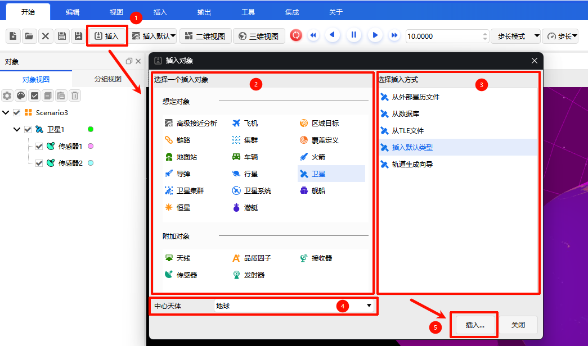
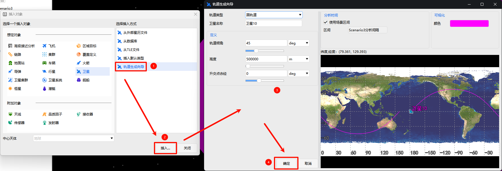
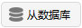
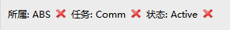
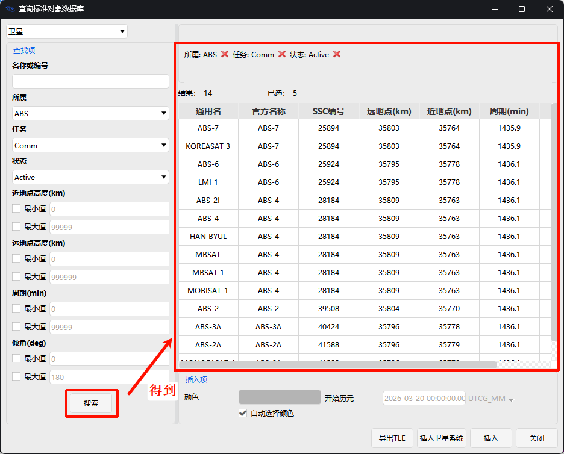
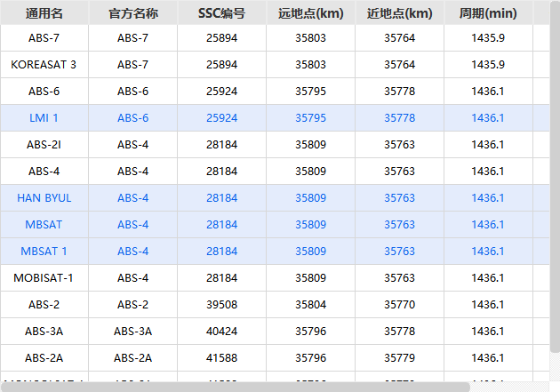
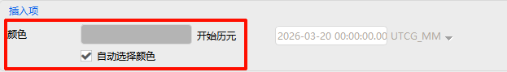

# 插入

**【插入】** 菜单选项包括四个子菜单：[插入](#插入-1)、[插入默认](#插入默认)、[从数据库](#从数据库-1)、[星座](#星座)。

## 插入

### 通用操作说明

单击  图标，弹出 **【插入对象】** 对话框。您可以在当前场景中插入以下两类对象：

- **场景对象**：高级接近分析、飞机、区域目标、链路、集群、覆盖定义、地面站、车辆、火箭、导弹、行星、卫星、卫星集群、卫星系统、舰船、恒星、潜艇等
- **附加对象**：天线、品质因子、接收器、传感器、发射器等

**操作步骤**：

1. **选择对象类型**：从列表中选择需要插入的对象
2. **选择中心天体**：确定该对象所属的天体（如地球、月球等）
3. **选择插入方式**：根据对象类型选择合适的添加方式（详见[插入方式说明](#插入方式说明)和[插入方式操作详解](#插入方式操作详解)）
4. **完成插入**：单击 <kbd>插入...</kbd> 按钮

### 插入方式说明

系统为不同对象提供了多种插入方式，方便您快速添加对象：

| 插入方式           | 说明                                   |
| ------------------ | -------------------------------------- |
| **插入默认**       | 使用系统默认设置快速添加对象           |
| **从数据库**       | 从标准对象数据库中搜索并加载对象       |
| **从TLE文件**      | 通过TLE星历文件导入卫星对象            |
| **从外部星历文件** | 通过`.e`格式星历文件导入卫星对象       |
| **轨道生成向导**   | 通过向导辅助添加卫星，支持多种轨道类型 |
| **选择国家和地区** | 通过选择国家或地区添加区域目标         |
| **从城市数据库**   | 从城市数据库中搜索并添加地面站对象     |

### 对象支持的插入方式

不同类型对象支持的插入方式有所不同，具体如下：

| 所属         | 对象类型     | 插入默认 | 从数据库 | 其他方式                                |
| ------------ | ------------ | :------: | :------: | --------------------------------------- |
| **场景对象** | 高级接近分析 |    ✓     |          |                                         |
|              | 飞机         |    ✓     |          |                                         |
|              | 区域目标     |    ✓     |          | 选择国家和地区                          |
|              | 链路         |    ✓     |          |                                         |
|              | 集群         |    ✓     |          |                                         |
|              | 覆盖定义     |    ✓     |          |                                         |
|              | 地面站       |    ✓     |    ✓     | 从城市数据库                            |
|              | 车辆         |    ✓     |          |                                         |
|              | 火箭         |    ✓     |          |                                         |
|              | 导弹         |    ✓     |          |                                         |
|              | 行星         |    ✓     |          |                                         |
|              | 卫星         |    ✓     |    ✓     | 从外部星历文件、从TLE文件、轨道生成向导、从STK文件导入 |
|              | 卫星集群     |    ✓     |          |                                         |
|              | 卫星系统     |    ✓     |          |                                         |
|              | 舰船         |    ✓     |          |                                         |
|              | 恒星         |    ✓     |    ✓     |                                         |
|              | 潜艇         |    ✓     |          |                                         |
| **附加对象** | 天线         |    ✓     |          | 需选择父对象                            |
|              | 品质因子     |    ✓     |          | 需选择覆盖定义对象                      |
|              | 接收器       |    ✓     |          | 需选择父对象                            |
|              | 传感器       |    ✓     |          | 需选择父对象                            |
|              | 发射器       |    ✓     |          | 需选择父对象                            |

> [!NOTE]
> - **品质因子** 只能插入到 **覆盖定义** 对象下
> - 其他附加对象只能插入到 **飞机、地面站、车辆、火箭、导弹、卫星、舰船、潜艇** 等对象下

### 插入方式操作详解

#### 插入默认类型
选择`插入默认类型`方式，直接点击 <kbd>插入...</kbd> 按钮即可完成添加。

#### 从数据库
选择`从数据库`方式，点击 <kbd>插入...</kbd> 按钮，在弹出的窗口中设置搜索参数，点击 <kbd>搜索</kbd>。在结果中选择所需对象，设置颜色后点击 <kbd>插入</kbd>。

> 详细操作请参考 [从数据库](#从数据库) 。

#### 从城市数据库
选择`从城市数据库`方式，点击 <kbd>插入...</kbd> 按钮，按需搜索并选择城市数据，设置颜色后点击 <kbd>插入</kbd>。详细操作请参考 [从数据库](#从数据库-1) 章节。

#### 从TLE文件
选择`从TLE文件`方式，在弹出的对话框中选择数据源，可设置颜色和开始历元。

#### 从外部星历文件
选择`从外部星历文件`方式，在弹出的对话框中选择`*.e`格式的星历文件。

#### 轨道生成向导
选择`轨道生成向导`方式，在弹出的向导界面中选择轨道类型并设置相应参数。

#### 选择国家和地区
选择`选择国家和地区`方式，在界面左侧选择国家或地区，右侧设置插入选项、插入区域及可视化颜色。

## 插入默认

单击  图标，弹出提示框，您可以选择默认插入的对象类型（如高级接近分析、卫星、地面站、舰船等）。

设置完成后，下次单击  图标即可直接插入所选默认对象，实现常用对象的快捷插入。

## 从数据库

单击  图标，弹出 **【查询标准对象数据库】** 窗口。

### 设置筛选条件
在窗口中设置查询信息，结果上方会显示当前筛选条件。每个条件右侧的  图标，单击后可**删除**该条筛选条件。

### 执行搜索
条件设置完成后，单击 <kbd>搜索</kbd> 按钮，系统将执行查询。查询结果显示在右侧区域，包含搜索结果条数和当前选中条数，具体对象以表格形式展示。

### 选择对象

- **单选**：单击表格中的某一项，可选中单个对象
- **多选**：
  - 按住 <kbd>Ctrl</kbd> 键并单击，可同时选中多个不连续的对象
  - 按住 <kbd>Shift</kbd> 键并单击，可连续选中多个相邻的对象

选中后的效果如下，标蓝显示：

### 配置颜色
选择对象后，可在插入项中进行颜色配置：
- 勾选 **自动选择颜色**，系统将自动为对象分配颜色
- 取消勾选后，单击色块可手动选择颜色

### 完成操作
完成上述设置后，可执行以下操作：
- **导出TLE**：将选中的对象导出为TLE格式文件
- **插入卫星系统**：将选中的对象作为卫星系统插入
- **插入**：将选中的对象直接插入
- **关闭**：关闭当前窗口

## 星座

单击  图标，弹出 **【插入星座】** 界面。单击下拉列表可选择以下预定义星座：北斗、天链、伽利略、格洛纳斯、GPS、DSP。

选中想要插入的星座后，单击 <kbd>插入</kbd> 即可完成添加。

