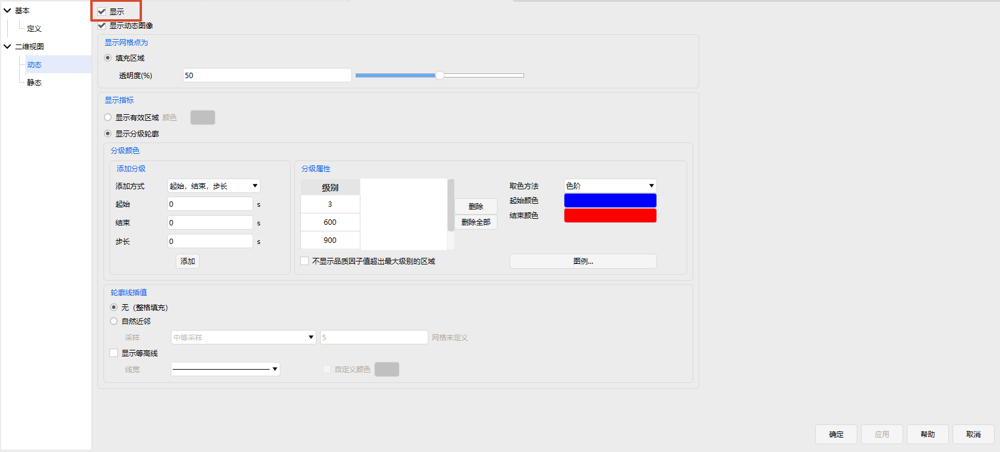

# 品质因子

品质因子（FOM, Figure of Merit）是覆盖分析的核心机制，用于对覆盖、访问、导航、通信等任务效果进行量化评估。ATK 支持 16 种品质因子，涵盖**覆盖时间**、**系统响应**、**导航定位**和**访问约束**等多个方面，通过统一的属性配置界面进行设置。

品质因子适用于**覆盖性工具**和**区域覆盖工具**。

## 基本属性

品质因子的基本属性配置包含四个部分：

|    配置项    |                     说明                     |
|:------------:|:--------------------------------------------:|
|     定义     | 选择品质因子类型、统计参数类型及类型特有参数 |
|   有效条件   |    在可见性约束之上进一步筛选有效覆盖窗口    |
| 无效数据指标 |      当特定条件不满足时赋予指定的无效值      |
|  有效值限制  |        对计算结果施加额外的上下限约束        |

### 定义

定义选项卡用于选择品质因子类型并指定计算参数，主要配置项包括：

- **类型**：从 16 种品质因子中选择
- **统计参数类型**：选择需要计算的统计值，不同品质因子类型对应不同的统计值选项
- **类型特有参数**：部分类型需要额外设置，例如：
  - 重访时间：设置最少重数
  - 精度衰减因子：选择子方法和计算类型

### 有效条件

有效条件用于在可见性约束之上进一步筛选覆盖窗口。

例如，若需要分析"被至少 2 个资源同时覆盖"的时段，可将"类型"设为"多重覆盖"，启用有效条件，并设定为"大于"有效值"2"。

### 无效数据指标

某些品质因子需要特定条件才能进行计算。当条件不满足时，系统会赋予一个指定的无效值，以区分"无效"和"零覆盖"。

例如，"几何精度定位因子"的计算需要实现至少 3 重的覆盖，对于小于 3 重覆盖的时间段，其品质因子始终显示为设定的无效值。

### 有效值限制

有效值限制提供了计算模型限制以外的约束。当覆盖情况满足品质因子的计算模型要求，但不在"有效值限制"所定义的范围内时，该值会被认为是一个无效值。

::: tip 品质因子结果输出方式
分析完成后，品质因子结果可通过**数据报告**和**图表报告**输出，部分类型还支持在二维/三维视图中以**热力图**或**动态数据**形式展示。
:::

## 可视化参数配置

在对象列表中，右键点击【品质因子】，进入属性设置页面，可在【二维视图】类别中进行**动态**、**静态**图像设置。

**动态**图像设置的最上方为品质因子显示总控，勾选【显示】可在二/三维视图中显示覆盖区域。

**动态**、**静态**图像区别为动态图显示实时覆盖区域，静态图显示全时段覆盖区域，两者设置页面完全相同，但需独立设置各自参数。

### 热力图属性设置

1. 网格点透明度设置
0为不透明，100为完全透明，文本框和滑块联动。

    

2. 显示指标设置
有效区域显示支持**统一颜色**与**分级颜色**。前者只需指定有效区域颜色；后者需要设置分级方式、分级属性、取色方法及图例布局等参数。

- 添加分级：指定级别；指定“起始、结束、步长”。注意：步长不能为0，级别总数不能超过100个！
- 取色方法：色阶；指定。前者自动生成渐变色，按级别均匀变化；后者独立设置级别颜色
- 分级属性：展示已添加的级别，总数不能超过100个。当取色方法为指定时，展示级别颜色一列。网格填充为其FOM值大于等于的最大级别的颜色。
在【分级属性】，【不显示品质因子值超出最大级别的区域】复选框，可设置FOM值超出最大级别的网格是否显示填充，默认显示。注意：默认FOM值小于最小级别的网格不显示填充。
- 图例：点击<kbd>图例...</kbd>可打开【品质因子图例布局】界面。可设置二三维视图中显示位置、背景颜色等参数。
显示位置：通过图例位置像素值设置显示位置，以视图左上角为起点，向下为y轴，向右为x轴。
背景：设置图例框背景色及图例框透明度，0为不透明，100为完全透明。
文字选项：支持自定义标题，默认值根据对象名称自动设置；可设置小数位数与浮点数格式，支持小数或科学计数法显示；文本颜色同时为图例外框颜色。
颜色范围选项：可设置色阶顺序、行列数及色块宽度/高度。

  

3. 轮廓线插值

- 热力图插值：可对热力图轮廓线进行自然近邻插值计算，目前支持四种计算方式：粗糙采样 - 长边插值为128格；中等采样 - 长边插值为512格；平滑采样 - 长边插值为1024格；自定义 - 包围覆盖区域边界的最小经纬度区域，每个网格间隔插值n*n格。
- 等高线：可显示不同等级间的分界线，可设置线宽与颜色。默认不勾选，显示为较高级别的网格颜色。勾选后全部显示为指定颜色。
