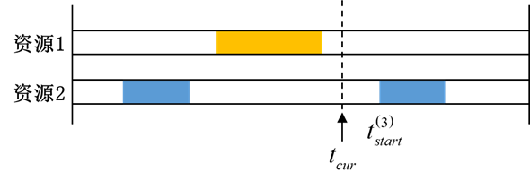

# 响应时间

## 定义

响应时间表示当前时刻距离下一次覆盖开始时间的间隔。如下图所示，响应时间表示为：

$$
V_{rsp} = t_{start}^{(3)} - t_{cur}
$$

## 特有参数

- **最少重数**：设置最少重数
- **结尾间隔段**：设置结尾间隔段为忽略或者包括。

## 统计值

|        名称        |                                   含义                                  |
|:------------------:|:-----------------------------------------------------------------------:|
|       平均值       |                      在整个分析时段内的平均响应时间。                     |
|       最大值       |  在整个分析时段内的最大响应时间，该值与整个时段内的最大覆盖间隙长度相等。 |
|       最小值       |   在整个分析时段内的最小响应时间，当分析对象存在被覆盖时刻时，该值为0。   |
|     百分比低于     |        假设所设比例为X，该统计值为V，表示响应时间有X%的时间低于V。        |
| 间隔时间百分比低于 | 假设所设比例为X，该统计值为V，表示在覆盖间隙内，响应时间有X%的时间低于V。 |

::: tip 注意
最少重数对覆盖时间进行了进一步的约束，当最少重数被设定为大于1时，响应时间表示当前时刻距离下一次满足N重覆盖的时段开始时刻的间隔。
:::