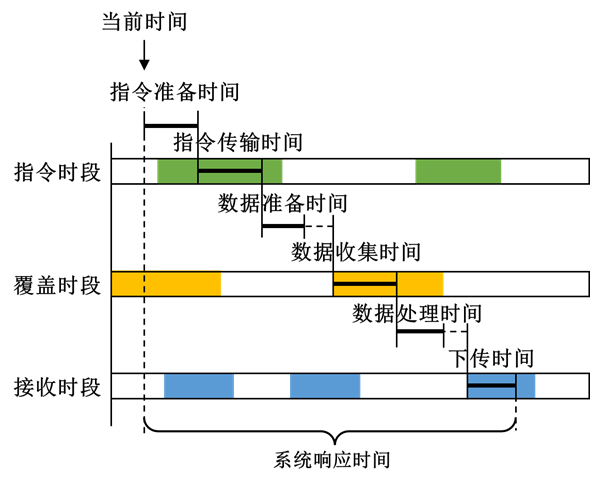

# 系统响应时间

## 定义

系统响应时间表示从请求覆盖某个点（分析对象）到获取覆盖资源数据之间的时间。

系统响应时间包括将采集请求发送到覆盖资源时的延迟、将采集数据传输到接收对象时的延迟，以及两者之间的一些固定持续时间的延迟。对于某个特定时刻，当前时间被认为是系统受到数据采集需求的时间，从当前时间到接收对象最快获得采集数据的时间间隔即为系统响应时间。

## 特有参数

- **系统分析对象**：指令对象、接收对象、是否允许交叉传输
- **各阶段时长参数**：指令准备时间、指令传输时间、数据准备时间、数据收集时间、数据处理时间、下传时间，时间步长

## 统计值

|  名称  |                                                                                    含义                                                                                    |
|:------:|:--------------------------------------------------------------------------------------------------------------------------------------------------------------------------:|
| 平均值 | 在整个分析时段内的平均系统响应时间。该值通过计算特定步长下的采样点统计得到，采样点步长与分析步长保持一致。如果当前剩余时间无法满足信息下传的时间要求时，将不再进一步采样。 |
| 最大值 |                                                                    在整个分析时段内的最大系统响应时间。                                                                    |
| 最小值 |                                  在整个分析时段内的最小系统响应时间。当所有的延迟时间都设为0，且存在各环节时段无缝衔接的情况时，该值为0。                                  |
